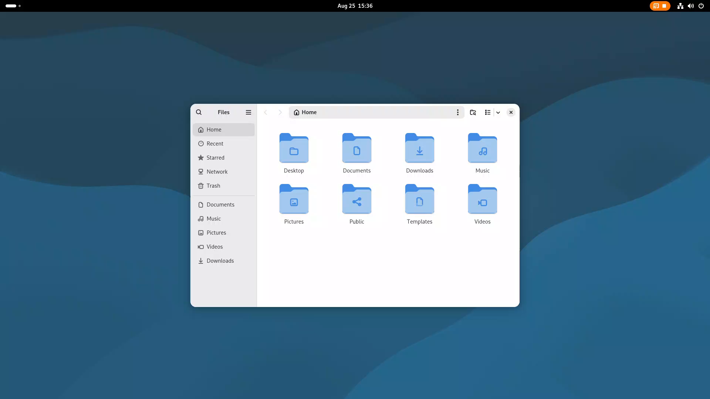
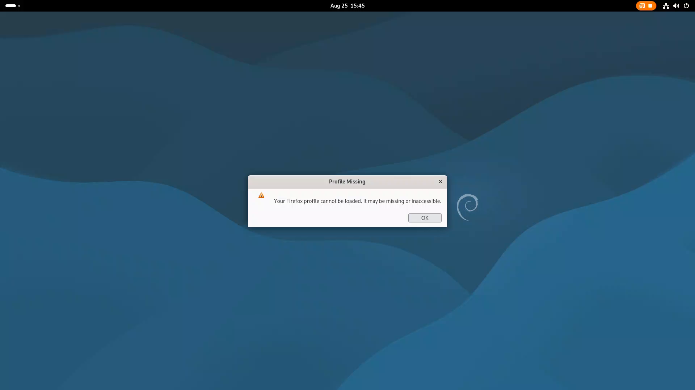
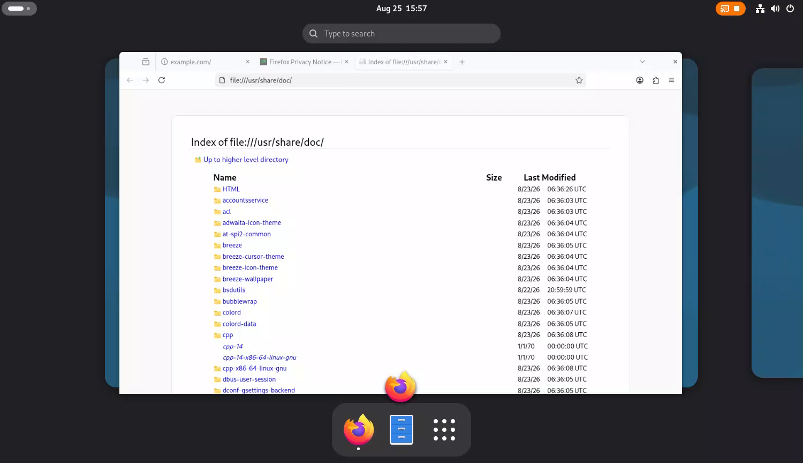
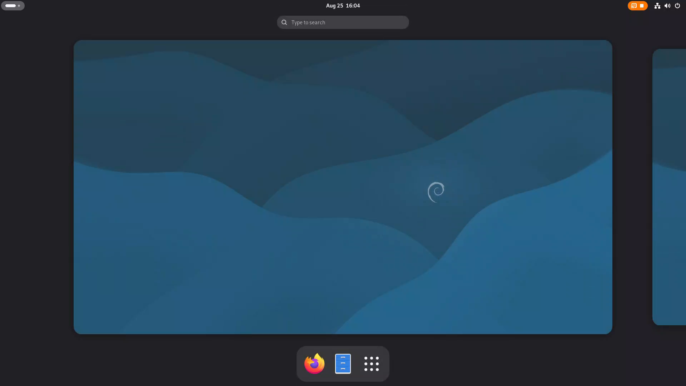
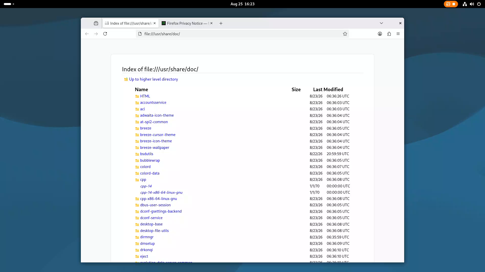

# Fase 10 — Multi-tenant e il budget
Aperta il **24 agosto 2026**, subito dopo la chiusura della fase 9.
## ✅⭐⭐⭐⭐⭐ **CHIUSA il 25 agosto 2026**, sul giudizio dell'utente

> *«Sono soddisfatto. Riprodotto audio e video su una connessione del 1990. **Non credo che si
> possa chiedere di più**.»*

⭐ Il giudizio per intero, con i numeri della scena su cui è stato dato, sta in **§10**.
⚠ E **due decisioni sono rimaste non prese**, dichiarate in **§10-bis**: valgono i predefiniti.

> ⛔ **Questo documento si riempie strada facendo** (`PIANO.md` §0.1). Le misure hanno l'ora accanto
> perché sono state scritte quando sono state prese, e le **previsioni di §2 sono state scritte
> PRIMA di misurare** — è l'unico modo perché una misura possa smentire qualcosa.

---

## Che cosa deve produrre

**Più utenti insieme, il budget del codificatore, il rifiuto motivato** (`PIANO.md` fase 10).

**Che cosa l'utente vede e giudica alla fine**: due sessioni vere in contemporanea; e quando la
macchina è piena, un messaggio che **dice perché**.

| # | cosa | dov'era la mattina del 24 agosto 2026 |
|---|---|---|
| 1 | **il numero vero del codificatore** — pixel/s su `renderD128` | ⛔ mai misurato: `vainfo` dice *quali* profili, non *quanti pixel al secondo* |
| 2 | **il budget** al posto del conteggio | ⛔ due `#define` a **16**: `src/rcp.c:886 MAX_ATTACCATE`, `src/figlio.c:91 MAX_FIGLI` — dove `SPECIFICHE.md` §5.5 promette **dieci configurabile** |
| 3 | **`BUDGET_PIENO 0x06`** col motivo nel corpo | ⛔ dichiarato in `src/rcp.h:46` e in `RCP.md` §8.2, **e nessuna riga del server lo manda mai** |
| 4 | **chi già lavora non peggiora** quando arriva l'undicesimo | ⛔ mai provato — è `DECISIONI.md` §4.6-bis e l'invariante **I1** |
| 5 | **il budget di RETE** accanto a quello di GPU | ⛔ mai nominato: `DECISIONI.md` §3.1-bis punto 2 lo lascia aperto con *«dieci sessioni × 30 Mbit/s sono 300 Mbit/s sul filo del server»* |

> ### ⭐ L'ordine l'ha posto il regista, il 24 agosto 2026
>
> *«Prima si misura, e poi simuli 10 utenti veri.»*
>
> ⛔ È il vincolo di metodo di tutta la fase, e non è una preferenza: **il numero del codificatore
> non si indovina**. `DECISIONI.md` §4.6 lo dice da sé — *«nessun numero cablato nel programma»* —
> e la tabella di `SPECIFICHE.md` §5.5 (*«una cinquantina al minimo, 8-10 a 1080p30, una sola a
> 4K60»*) è ancora `[?]`: ricavata dalla generazione del chip, non letta da un banco.
>
> ⇒ **Prima la misura, poi i dieci veri, e solo alla fine il codice del prodotto.**

> ### ⛔ Perché questa fase sta QUI e non altrove — le tre precedenze, tutte già decise
>
> | | |
> |---|---|
> | **dopo la fase 8** | la copia zero cambia **quanto costa una sessione** in memoria e banda di GPU, e un budget misurato prima della copia zero è un budget da rifare (`DECISIONI.md` §4.6-quater) |
> | **prima dei tre desktop nuovi** | ⛔ il budget è un budget di GPU, e **la GPU è UNA** — `renderD128`, la stessa iGPU che compone **ogni** desktop. È una proprietà **della macchina**, non del desktop: misurata dopo tre desktop nuovi, non si sa più quale numero appartenga a che cosa (§4.6-sexies, deciso dall'utente il 16 agosto) |
> | **il confine con la fase 5 è intatto** | *«un utente per volta»* resta della fase 5; *«la macchina piena»* è di questa (§4.6-quater) |

---

# ⭐⭐⭐ LA SINTESI — *il primo giro di misure, 24 agosto 2026*

> ⛔ **Questa è la testa del documento: risponde in fretta alle domande che si porranno domani.**
> Il dettaglio sta sotto: §1 il banco, §2 le previsioni e il loro verdetto, §3 il disegno, §4 la lente
> avversariale, §6 le misure.

## S.1 · ⭐⭐⭐⭐ IL FATTO CHE RIBALTA LA FASE: **il collo non è il codificatore**

`DECISIONI.md` §4.6 costruisce tutto il budget su una frase: *«il limite vero lo pone il
**codificatore**, e si misura in pixel al secondo»*. ⛔ **`[M]` Su questo ferro non è vero.**

| | dove sta il collo | misurato |
|---|---|---|
| **il codificatore nudo** (scena sintetica, nessun compositore) | i due VDBOX | **1,86 Gpixel/s** in H.264 (§6.2) · ⭐ **2,33 in HEVC**, che è quel che il prodotto negozia **per primo** (§6.10) |
| ⭐⭐⭐ **la COMPOSIZIONE** | ⛔ **`rcs0`, il motore di rendering** | ⭐ **0,97 Gpixel/s** (§6.11) — **la metà** del codificatore. Un desktop 1080p a 60 Hz vale **124,4 Mpixel/s** ⇒ `rcs0` passa il **99 % al settimo** |
| con **desktop GNOME veri** dietro | la stessa cosa, vista dall'altro capo | si cede a **sei** sessioni, e il motore **video non passa mai il 27 %** (§6.5) |

⭐⭐⭐ **E due banchi diversi, su due grandezze diverse, danno la stessa risposta**: §6.5 conta le
**sessioni** e trova **sei**; §6.11 conta i **pixel composti** e trova che il **settimo** satura
`rcs0`. ⇒ **Il numero non è un accidente del banco: è del ferro.**

⭐⭐ **E la nostra conversione di colore è ASSOLTA** (§6.11): `[M]` **zero** su `rcs0`, tutto sul
**VEBOX**, che non è mai il collo. ⚠ §6.6 l'aveva trovata sulle EU — ma quello era `ffmpeg` con
`hwupload` da 8 MB per fotogramma, mentre **il prodotto importa un dmabuf a copia zero**
(`LEZIONI.md` §1.28: due scene diverse, tutt'e due vere).
⇒ ⛔ **A saturare `rcs0` è il COMPOSITORE, e basta lui** — cioè una cosa che **non è nostra**, e che
il budget può solo **contare**, non ridurre.

⭐⭐ **E il costo ha DUE termini, non uno** (§6.11): `[M]` `rcs0 % ≈ 7,1 % fisso + 0,053 % per
Mpixel/s` ⇒ **metà del costo è un pedaggio per il solo essere un desktop vivo a 60 Hz**, e 6,5 volte
il cambiamento costa **1,68** volte. È il termine fisso a decidere quante sessioni tranquille ci
stanno.

## S.2 · ⭐⭐⭐⭐ **SEI sulla scena peggiore, UNDICI su quella vera — e undici non è il limite**

> *«Tenendo conto che siamo su una scheda Intel integrata non particolarmente performante, 6 RDP
> attivi contemporaneamente non mi sembra un cattivo risultato»* — l'utente, **24 agosto 2026**,
> `DECISIONI.md` **§4.6-septies**. ⇒ ⭐ **Il giudizio ne esce rafforzato, non smentito.**

| scena | quante ci stanno | che cosa succede alla prima |
|---|---|---|
| **satura** — tutto lo schermo cambia a ogni fotogramma | **6** | ⛔ dal settimo cede: −28 %, poi **1,5 fot/s** all'ottavo |
| ⭐⭐ **desktop vero** — finestre, trascinamenti, strappi | ⭐ **almeno 11**, e ⛔ **il soffitto non è stato trovato: sono finiti gli utenti, non la macchina** | ⭐ **−7,7 %**, sotto la tolleranza, e il **ritardo non si muove** (8,4 → 8,0 ms) |
| **ferma** | ⭐ **11 costano GPU ZERO** — RC6 100 %, GT 0 MHz | lì il vincolo è la **memoria**, non la scheda |

⭐⭐⭐ **Il «sei» era il numero di una scena che nessun utente produce.** `[M]` Sul desktop vero: **zero
violazioni dell'invariante I1** a undici sessioni, contro **37** sulla satura; e undici sessioni
stanno al **22-24 %** della GPU (§6.12).

⛔ **E il dirupo esiste solo sulla scena satura**: fra la sesta e l'ottava si passa da 38 a 1,5 fot/s
— **non è degradazione, è un precipizio**, e la scala della fase 9 non lo addolcisce.
⇒ ⭐ **Il prodotto deve fermarsi PRIMA del dirupo, non dentro** — ed è questo, non «dieci», il lavoro
della fase.

⛔ **E oggi non si ferma affatto**: l'undicesimo della scena satura **entra con `negati 0`**, e la
prima sessione passa da 39,60 a 0,96 fot/s (**−97,6 %**). **Il prodotto non ha un budget: accetta
tutti e affama tutti insieme.**

## S.3 · ⭐⭐⭐⭐ IL DIRUPO HA UN MECCANISMO, ed è **una soglia che il prodotto sa calcolare**

⭐⭐ **La prova sta in una riga**: stessa popolazione — otto sessioni, otto desktop, otto figli — e si
**spegne una sola scena**. `[M]` **Il ritmo torna da 1,6 a 33,4 fot/s.** Rimettendola, il dirupo si
riproduce. **Reversibile e ripetibile** (§6.15).

⇒ ⛔ **Il dirupo non cade sul numero di sessioni: cade su quanto si sta COMPONENDO.** `[M]` Il confine
sta fra **421 e 460 disegni/s** a 1080p, cioè **0,87-0,95 Gpixel/s** — ⭐⭐⭐ **e cade esattamente sul
soffitto della composizione misurato da un altro banco, 0,97** (§6.11).

⭐ **E la colonna che lo tradisce è quella che nessuno guardava**: quando i compositori prendono il
100 % del motore di disegno, `video-enhance` **crolla da 48,7 % a 0,4 %** ⇒ ⛔ **il codificatore non
ha più niente da fare. Non rallenta: si ferma.** Le consegne del palco passano da **39 a 2 fot/s**.
⇒ **Il collo non è nel padre e non è nel codificatore: è a monte, nella composizione** — cioè in una
cosa che **non è nostra**.

⛔ **Cinque piste su sei erano false**, e sono state refutate una per una: il ripiego in software,
un'attesa che diventa il ritardo di tutti, la soglia della coda, il regolatore del ritmo, il ciclo del
padre. ⭐⭐ **Compresa l'aritmetica dei buffer, che sembrava la migliore e l'ha refutata chi l'aveva
proposta**: `[M]` il produttore ne dà **otto**, non sei ⇒ non restiamo **mai** senza buffer.

⚠ **E il degrado non passa dalla colonna che la fase 9 aveva insegnato a guardare**: `[M]` **zero
fotogrammi chiave su 8 741**, anche dentro il crollo — a muoversi è il **ritardo**.
⇒ ⭐ La regola di `LEZIONI.md` §1.31 regge, **la colonna no**: quale sia il meccanismo **cambia col
fenomeno**, e va cercato ogni volta (§1.34).

## S.4 · ⛔ I quattro difetti di prodotto trovati, e **nessuno era il bersaglio**

| | |
|---|---|
| ⛔⛔ **l'undicesimo è AMMESSO e non vede un pixel** | i due `16` si liberano su **eventi diversi**: la tabella dei figli può essere piena mentre quella dei posti è vuota ⇒ pagina nera **senza niente sul filo**, e nessun tempo dopo il quale migliora (§4.1) |
| ⛔⛔⛔ **il figlio muore di SIGSEGV su una larghezza qualsiasi** | ⭐ **e non c'entra col multi-tenant: li riguarda tutti.** `[M]` Vista **1268** — quella che Firefox apre di suo — ⇒ passo del DMA-BUF **5072, non multiplo di 64** ⇒ il figlio dichiara *«rimonto il palco sulla MEMORIA»* e **2 ms dopo è morto**: **3 su 3**, contro **0 su 3** a 1280. L'utente perde il desktop **prima del primo fotogramma** (§6.8) |
| ⛔⛔⛔ **due cure della fase 9 formano un ANELLO CHIUSO che sfratta chi sta lavorando** | `[M]` A **cinque** sessioni, **cinque client sfrattati in 1,3 s**: `arretrato` resta incollato al tetto del regolatore, che blocca **ogni** fotogramma ⇒ `usciti_byte=0` ⇒ il client **non ha più niente da riscontrare**, tace ⇒ **la linea morta lo sfratta con `persi=0`**. ⛔ Qui la coda **morde**, cioè sono utenti che stavano lavorando (§6.15) |
| ⚠ **due cure della fase 9 si combattono — ma solo per il cliente di prova** | `linea-morta causa=silenzio … persi=0`, desktop fermo e perdita **zero**, sessione chiusa a **10 s** con `aioquic` (§6.3). ⭐ **Su Firefox vero sopravvive** a 120 s e a 300 s (§6.8) — ⛔ **ma perché sono i `PING` NOSTRI a tenerla viva**, non il browser: il margine è **due volte**, e non di più |
| ⛔ **il desktop si accende a chi non sarà mai ammesso** | `[M]` un utente **mai ammesso** a fine giro aveva **42 processi e un `gnome-shell`** (§6.4) |
| ~~la seconda strada di chiusura di §3.1 non parte~~ ⇒ ✅ **RITIRATO** | `[M]` §6.8: con **Firefox vero** la capsula arriva **10 su 10**, codice `0x0E`, mai `0`. *«0 capsule»* era vero **per `aioquic`**, che se ne va **498 ms prima** che la capsula parta. ⛔ **La lezione è di metodo**: era stata letta **dove la capsula parte** invece che **dove arriva** |

## S.5 · ⭐ Le tre stime dei documenti che erano sbagliate, e tutte **nel verso comodo**

| dove | diceva | `[M]` |
|---|---|---|
| `SPECIFICHE.md` §5.5 · `DECISIONI.md` §4.6 | 1080p30: «8-10, giusto al limite» | il codificatore ci sta al **33 %** — ⛔ ma la macchina si ferma a **sei**, per un'altra ragione |
| `DECISIONI.md` §4.6 | «dieci sessioni GNOME ferme sono ~12 GB dei 31» | **1,8-1,9 GB** — sbagliata di **sei volte** |
| `DECISIONI.md` §3.1-bis punto 2 | «dieci × 30 Mbit/s = 300 Mbit/s sul filo» | **22 Mbit/s**, lo **0,2 %** di una scheda da 10 Gbit/s |

## S.6 · ⭐⭐⭐ COME SI SCRIVE IL BUDGET — e ⏳ il prodotto **non è ancora stato toccato**

⭐ **Nessuna riga di `src/` è cambiata**: l'ordine del regista era *«prima si misura»*, e questi sono
**due giri di sole misure**. Il disegno di dove mettere le mani sta in **§3**; le decisioni che
aspettano, in **§8**.

⭐⭐ **E la forma del budget adesso è misurata, non ipotizzata:**

| | |
|---|---|
| **la grandezza** | ⛔ **non pixel di CODIFICA: pixel di COMPOSIZIONE.** `[M]` soffitto **0,97 Gpixel/s**, e a saturarlo è **il compositore**, non noi |
| **la moneta** | ⭐ **il pixel**: ai cedimenti i Mpixel/s coincidono entro lo **0,6 %** al variare della tela, i fotogrammi/s differiscono del **74,9 %** |
| **come si somma** | ⭐⭐ `[M]` **linearmente, anche fra ruoli diversi**: tre sature + tre desktop veri danno **75,3 % previsto contro 75,6 % misurato** |
| **il costo per ruolo** | satura **14,4 %** · desktop vero **10,7 %** · ⭐ **ferma 0,01 %** |
| **la guardia che serve prima dei pixel** | ⛔ **il RITARDO**: il conto sui pixel, dopo il dirupo, dice *«c'è posto»* mentre tutti stanno a 1,5 fot/s. `[M]` sano ≤ **13,1 ms**, rotto ≥ **39,9**, **nessuna sovrapposizione** |
| **quel che il budget NON può prevedere** | ⛔⛔ **il risveglio**: otto ferme ammesse a 0,01 % l'una si accendono in **19 ms** e chiedono il **130 %**. ⭐ La riserva al 50 % limita lo sforamento a **2×** |
| ⛔ **e quel che non si auto-tara** | la capacità: **prima che la macchina abbia ceduto una volta, è un limite inferiore, non un soffitto** |

---

## §0 · LO STATO ALL'APERTURA — *24 agosto 2026, 15:58 UTC*

### 0.1 ⭐ La macchina è stata sgombrata **prima** di misurare, e verificata

⛔ È la regola pagata due volte in un giorno (`LEZIONI.md` §1.26) e scritta in `PIANO.md`: *«quattro
server di prova degli agenti sono rimasti accesi… non danno fastidio a riposo, ma **falserebbero la
prossima misura**»*.

`[M]` Alla chiusura della fase 9 la macchina portava **otto** unità `remotix-*` vive dai banchi di
quella fase — porte 7900, 7910, 7920, 7940, 7950, 7960, 7971, 7973 — e **tre figli** ancora
attaccati (`provanr4`, `provanr8`, `provanr10`), il più vecchio da **1 giorno e 7 ore**.

Spente tutte. `[M]` **Verificato, non dichiarato a memoria**:

```
--- porte 7xxx rimaste ---        NESSUNA
--- processi remotix rimasti ---  NESSUNO
--- netem su lo ---               qdisc noqueue 0: root refcnt 2      (nessun guasto residuo)
--- netem su enp7s0 ---           qdisc mq 0: root                    (nessun guasto residuo)
```

`[M]` Memoria dopo lo sgombero: **12 GB usati su 31**, 18 disponibili. Carico medio **0,10**.

### 0.2 ⛔ Il ferro, e la scheda su cui NON si misura

| | indirizzo PCI | nodo | chi è |
|---|---|---|---|
| ✅ **si misura qui** | `0000:00:02.0` | `renderD128` | **Intel UHD 730** (`i915`), l'integrata |
| ❌ esclusa | `0000:03:00.0` | `renderD129` | Radeon **RX 6800** (`amdgpu`), gruppo `remotix-nogpu` |

`[M]` La regola udev di `DECISIONI.md` §4.6-ter è **ancora applicata**: `renderD129` appartiene al
gruppo `remotix-nogpu`, che non ha membri. ⭐ È il vincolo posto dall'utente il 15 agosto —
*«i test vanno fatti sulla GPU integrata, altrimenti "trucchiamo" il gioco»*.

### 0.3 ⛔ L'attrezzo che manca, e la strada che resta

`[M]` **`intel_gpu_top` non è installato**, né sulla macchina né dentro il contenitore. `vainfo`,
`ffmpeg` e `gnome-shell` ci sono.

⇒ L'occupazione dei motori della GPU va letta da `/proc/<pid>/fdinfo/<fd>` (`drm-engine-*` su
`i915`), che dà nanosecondi cumulativi per cliente. ⛔ **E va tarata prima di crederci**
(`LEZIONI.md` §1.33): è un numero, non ancora una misura.

---

## §1 · IL BANCO — *scritto PRIMA di sviluppare*

`PIANO.md` §0.1. Dieci banchi, dieci isolamenti separati, e ⛔ **un lucchetto nuovo** che è la
condizione di tutta la fase.

### 1.1 ⛔⛔ Il lucchetto della GPU — la condizione che governa i dieci banchi

**La GPU è una, e dieci banchi la vogliono.** Due carichi di GPU insieme non si dividono il lavoro:
si falsano **in silenzio**, ed è la ferita esatta di `LEZIONI.md` §1.26 — *un banco che misura mentre
un altro satura non dà rosso, dà un numero plausibile*.

⭐ Si riusa il meccanismo che la fase 9 aveva costruito per il `netem`, `banchi/09-lucchetto.py`,
puntato su un posto suo:

```
LUCCHETTO=/media/REMOTIX/tmp/.lucchetto-gpu.d
```

⛔ **E la regola d'uso è più stretta di «prendilo»**: *ogni giro da cui esce un numero che si
riferirà prende il lucchetto; per lo sviluppo e la messa a punto si lavora senza, **ma quei numeri
non valgono e non si riferiscono***. Un possesso senza scadenza bloccherebbe tutti fino a domani;
la scadenza sta dentro, e chi la trova passata **scassina dichiarandolo**.

### 1.2 Il catalogo dei banchi della fase

| banco | che cosa misura | isolamento |
|---|---|---|
| `10-b0-terreno` | ⛔ il controllo che guarda **sotto** gli altri nove: macchina scarica, lucchetto, GPU giusta, nessun `netem` residuo, binario più nuovo dei sorgenti, `ngtcp2` dal posto giusto, posto libero, ban non scattato | nessuna porta |
| `10-b87` | ⛔ **il metro della GPU**, e la sua **taratura** con carico noto (0, 1, 2, 4 flussi; e uno a metà ritmo) | nessuna porta |
| `10-b88` | **il saturatore**: rampa di N flussi col codificatore **del prodotto**, in **H.264**, a 480p25 · 1080p30 · 4K60, finché cede — e ⛔ **perché** cede | nessuna porta |
| `10-b89` | **quanto costa UNA sessione** dopo la copia zero: memoria (PSS), GPU, CPU, filo, e quel che l'utente vede | porta 8010 · `provadec1` |
| `10-b90` | **il budget di rete**: bit/s per sessione su tre scene, il metro **tarato**, e il tetto vero della macchina | porta 8020 · `provadec2` |
| `10-b91`/`10-b92` | ⭐ **i dieci veri**: dieci utenti, dieci desktop GNOME, la salita da 1 a 10 con **ogni** sessione misurata a **ogni** gradino | porta 8100 · `provamt1…10` |
| `10-b93` | **la tabella piena**: che motivo riceve chi arriva, che frase mostra la pagina, e ⛔ se chi era dentro peggiora | porta 8030 · `provadec4/5/6` |
| `10-b94` | **lo studio del ferro**: `vainfo` per intero, i VDBOX, i contesti VA-API concorrenti, e che cosa cambia sotto carico | nessuna porta |

E due incarichi di sola lettura, senza banco: **dove vive il budget** nel codice (il disegno, non il
codice) e ⛔ **la lente avversariale** — *prova che il multi-tenant NON è pronto*.

### 1.3 ⛔ Le sei regole che i dieci banchi hanno addosso

Vengono dalle cinque lezioni pagate in fase 9 (`LEZIONI.md` §1.29-§1.33), e non sono consigli:

1. ⛔ **Un banco non è finito finché non lo si è visto dare ROSSO.** Nove difetti di banco su nove,
   in fase 9, avevano la forma *«silenzio invece di rosso»*: nessuno faceva **fallire** un banco,
   tutti lo facevano **tacere**;
2. ⛔ **`None` non è zero.** «Non ho potuto misurare» ≠ «non è successo niente»;
3. ⛔ **Il metro si tara PRIMA**, iniettando un valore noto;
4. ⛔ **Si conta quanta sollecitazione è ARRIVATA** prima di dichiarare un risultato;
5. ⭐ **Il meccanismo va accanto al sintomo**: in fase 9 fra i due c'era un fattore **cinque**;
6. ⚠ **I giri corti sottostimano**: le sessioni dell'utente durano ore, i banchi venticinque secondi.

### 1.4 ⭐ IL CONTROLLO DEL TERRENO — `10-b0`, e **30 guasti su 30 lo fanno mordere**

`banchi/10-b0-terreno.sh` (+ `10-b0-certifica.sh`, `10-b0-innesta.sh`). Si chiama così:

```
CHI=10-a4 PORTA=8020 UTENTE=provadec2 ALBERO=/media/REMOTIX/src/10a4-src \
  bash banchi/10-b0-terreno.sh || exit 1
```

⛔ **Tre uscite, e la terza è quella che conta**: `0` regge · `1` non regge · **`2` non ho potuto
verificare**. **21 predicati** in otto gruppi: macchina scarica (carico, memoria, `remotix` altrui
**con nome e utente**, porte) · **lucchetto della GPU** (di chi è, quanto manca, e `LUCCHETTO_MIO=1`
se dal giro esce un numero) · GPU giusta (indirizzi PCI, recinto `remotix-nogpu`, gruppo senza
membri, **chi tiene aperta la discreta**) · `netem`/wondershaper su `lo` **e** su `enp7s0` · **codice
= quello che leggo** (R12.3, md5 locale↔remoto, binario più nuovo, binario unico) · `ldd` da `b2` ·
posto libero (palco, clienti) · ban di §4.4-bis.

`[M]` **30 guasti su 30 hanno fatto mordere il controllo**, in 50 giri, **tre volte di fila**: fra
questi il lucchetto finto di *«10-zz-intruso»* (rosso col nome) · il lucchetto **scaduto** (verde, ma
lo **dichiara** e non scassina) · il binario più vecchio di un `.c` · le due copie di `rcp.c`
divergenti · un processo che tiene aperta la **Radeon** · il ban a 12 ore · ⭐ e i tre casi che
smascherano i controlli scritti male — **ssh che non risponde**, **ssh con uscita 0 e zero righe**,
**ssh caduto a metà**: tutti e tre danno **uscita 2**, mai verde.

> #### ⛔ Le quattro cose che la certificazione ha insegnato — e la prima è un difetto trovato **nel controllo stesso**
>
> 1. ⛔ **Il difetto era nel controllo**: i due nodi DRM si cercavano con un `case` a due rami, e con
>    due indirizzi PCI uguali il primo ramo vinceva ⇒ il predicato più importante di quella sezione
>    diventava **IGNOTO invece di guardare la scheda che gli era stata nominata**. È la forma **E8**.
>    Curato: si cercano indipendentemente. ⭐ **È esattamente il motivo per cui un banco si certifica.**
> 2. ⭐⭐ **Il binario NON ha rpath.** `[M]` `ldd` nudo su un `remotix` costruito risolve
>    `libngtcp2.so.16` da `/lib/x86_64-linux-gnu`, cioè **dal sistema**: quel che lo porta a `b2` è il
>    `LD_LIBRARY_PATH` che i lanciatori esportano. ⇒ Leggere `ldd` **nudo** darebbe rosso su ogni
>    albero sano; leggerlo **solo con l'ambiente** nasconderebbe che la scelta dipende **da chi
>    accende**. Il controllo li legge tutt'e due e lo dichiara. ⛔ Resta il buco: **non vede la riga di
>    comando** con cui il server verrà acceso.
> 3. ⛔ **`bash -c "…; sleep N # segno"` perde il segno**: bash si sostituisce all'ultimo comando, la
>    riga diventa `sleep N`, `pgrep` non lo trova e `pkill` non lo ammazza. ⇒ Il guasto **restava
>    innestato per 40 s e chi l'aveva messo credeva di non averlo messo**. Ora il segno sta in
>    `argv[0]` con `exec -a`.
> 4. ⚠ **Un controllo del terreno non deve caricare la macchina che dichiara scarica**: contare gli fd
>    sulla discreta con un `readlink` per file sarebbe stato **~14 000 forcate**. Si fa con
>    `find -lname`, un processo solo, e si dichiara il denominatore (`[M]` 1133 processi setacciati).
>
> ⚠ **E due note di scena, che non sono nostre**: `pgrep -a -f 'remotix-figlio'` **acchiappa la
> propria riga di comando**, e il profilo della macchina di prova stampa `tput: No value for $TERM`
> su stderr a **ogni** `ssh` — con `2>&1` finisce **dentro i dati**, e ci era già finito.

**I buchi che il controllo dichiara** `[?]`: **l'occupazione vera della GPU** non la vede ⇒ un agente
che misura sulla GPU **senza prendere il lucchetto è invisibile a questo controllo** · del ban vede
**solo il file**, non la memoria del server acceso · ⛔ **è una fotografia**: che fra il controllo e
la misura non cambi niente non lo garantisce nessuno — il lucchetto è l'unica parte che dura.

---

## §2 · LE PREVISIONI — *scritte il 24 agosto 2026, PRIMA di qualunque misura*

> ⛔ **Stanno qui perché una previsione scritta dopo non è una previsione.** Ciascuna è falsificabile,
> e ⭐ **quelle che verranno smentite sono il risultato più utile della fase**: in fase 9 le
> previsioni smentite hanno insegnato più di quelle azzeccate.

| # | previsione | come si smentisce |
|---|---|---|
| **Q1** | Il soffitto misurato in **H.264** sarà **più basso** della tabella di `SPECIFICHE.md` §5.5, perché quella è ricavata dalla generazione del chip e non tiene conto di `EncSliceLP` né del i5-13500T da **35 W** | `10-b88` dà 8-10 sessioni a 1080p30 o più |
| **Q2** | ⛔ A cedere per prima **non sarà la GPU**: sarà la **memoria** (dieci sessioni GNOME) o la **CPU** (dieci volte cattura + QUIC), e il motore video resterà sotto il 100 % | `10-b88` e `10-b89` mostrano il motore video saturo prima delle altre tre grandezze |
| **Q3** | **Dieci sessioni ci stanno**, perché `MAX_ATTACCATE` è già 16 e l'architettura è *un processo per sessione* — ⚠ ma **non a 1080p30 tutte insieme in movimento** | `10-b92` si ferma sotto il decimo gradino |
| **Q4** | ⛔⛔ **Chi era dentro PEGGIORA quando arriva chi si aggiunge**, e in modo che i fotogrammi/s non mostrano subito: la **quota di chiavi** salirà prima del calo visibile, com'è successo in fase 9 (fattore cinque fra meccanismo e sintomo) | `10-b92` mostra la prima sessione ferma su tutte le colonne fino al decimo gradino |
| **Q5** | ⛔ Le **cure della fase 9 si voltano contro il multi-tenant**: dieci sessioni che si contendono lo stesso filo si vedono a vicenda **come una rete cattiva**, ognuna cala il ritmo, e la **linea morta** può arrivare a **staccare** qualcuno perché il vicino sta lavorando — dove *«mai staccare»* è l'unico obbligo che vale ovunque | `10-b90`/`10-b92` non mostrano nessuna discesa attribuibile al vicino |
| **Q6** | ⛔ Il **ban per indirizzo** di §4.4-bis è un difetto vero del multi-tenant: dieci inquilini dietro lo stesso NAT sono **un solo indirizzo**, e uno che sbaglia la parola tre volte butta fuori gli altri nove **per dodici ore** | la lettura del codice mostra che è chiavato anche sull'utente, o che il caso non si presenta |
| **Q7** | `MAX_FIGLI` **non segue davvero** `MAX_ATTACCATE`: sono due `#define` separati e il legame vive solo nel commento di `figlio.c:88` | `10-b93` mostra che cambiando l'uno cambia l'altro |
| **Q8** | ⛔ Il rifiuto a tabella piena arriva **dopo** che qualcosa è già stato acceso — *rifiutare dopo aver acceso un desktop non è rifiutare* | `10-b93` mostra che il no arriva prima della nascita del figlio |
| **Q9** | Il **budget di rete** morde **prima** di quello di GPU: se il caso duro in H.264 chiede **44,6 Mbit/s** (fase 9 §14.2), dieci non fanno 300 Mbit/s ma **quasi mezzo gigabit**, e il tetto vero non è il rame — è la **CPU che cifra** | `10-b90` misura un costo per sessione molto sotto i 30 Mbit/s sulle scene vere |
| **Q10** | ⚠ Le **righe di registro** non dicono di chi sono, e con dieci sessioni il registro — che è lo strumento con cui in questo progetto si diagnostica tutto — diventa illeggibile | il campionamento mostra che la maggioranza delle righe porta l'utente o l'identificatore di sessione |

### 2.1 ⭐⭐ IL VERDETTO SULLE DIECI — **quattro smentite**, e sono la parte che ha insegnato

| # | esito | in una riga |
|---|---|---|
| **Q1** | ⛔ **SMENTITA** | il soffitto è **più ALTO**, e su tutt'e tre le righe: 1080p30 sta al **33 %**, non «giusto al limite» (§6.2) |
| **Q2** | ⛔ **SMENTITA a metà, e la metà giusta è quella scomoda** | a cedere **È** la GPU (la CPU sta a 1,2 nuclei su 20) — ⛔ **ma non il codificatore: il motore di rendering** (§6.5, §6.6) |
| **Q3** | ⛔ **SMENTITA** | ne stanno **SEI**, non dieci (§6.5) |
| **Q4** | ⭐ **CONFERMATA**, e nel modo peggiore | −97,6 % alla prima sessione. ⚠ **Ma non per la strada prevista**: le chiavi **non si accendono mai**, il degrado passa dal **ritardo** (§6.5) |
| **Q5** | ⭐ **CONFERMATA nella sostanza, corretta nel meccanismo** | a staccare non è il regolatore ma la **linea morta**, e per la strada del **silenzio** (§6.3) |
| **Q6** | ⭐ **CONFERMATA** per lettura | *«IL NOME UTENTE NON CONTA»*, `rcp.c:1004` (§4.2) |
| **Q7** | ⭐ **CONFERMATA** | 2 contro 16, misurato sul binario (§6.4) |
| **Q8** | ⭐ **CONFERMATA, e peggio** | non «rifiutare dopo aver acceso un desktop»: **il desktop si accende anche a chi non sarà mai ammesso** (§6.4) |
| **Q9** | ⛔ **SMENTITA** | dieci sessioni sature fanno **22 Mbit/s** su una scheda da 10 Gbit/s: **lo 0,2 % del filo** (§6.3, §6.5) |
| **Q10** | ⭐ **CONFERMATA, e misurata** | `[M]` **4,2 %** delle righe **di diagnosi** è attribuibile, e la prova cieca dice **0 nomi su 4** (§6.7) |

---

## §3 · ⭐⭐ IL DISEGNO — dove vive il budget, letto nel codice *(24 agosto 2026)*

> ⛔ **Lettura, non codice**: il prodotto si tocca dopo i numeri. Ma quando i numeri arriveranno,
> questo dice **esattamente** dove metterli. Ogni riga porta `file:riga` **e** il nome della
> funzione, perché un numero di riga invecchia in silenzio.

### 3.1 ⛔⛔ Il confine dell'ammissione — e oggi il no arriva **dopo il login**

La catena, con quel che esiste già dopo ogni passo:

| passo | dove | dopo, esiste |
|---|---|---|
| `CIAO` | `rcp.c:1972 tratta_ciao()` | niente: l'utente non ha ancora un nome |
| `ECCOMI` | `rcp.c:1833 manda_eccomi()` | ⭐ codec, profondità e livello negoziati: **il tetto del decodificatore del client è già noto qui** |
| `CREDENZIALI` | `rcp.c:2284 tratta_credenziali()` | il nome utente (`s->utente`, riga 2333); PAM **chiesta**, non risposta |
| verdetto PAM | `main.c:332 consegna_verdetto()` | ⛔⛔ **`figli_assicura()` a `main.c:344` — il figlio NASCE QUI**, prima che `AMMESSO` esca sul filo |
| `AMMESSO` | `rcp.c:7483` | il figlio ha già `fork`+`exec`ato, è già sceso all'uid, ha già aperto la sessione logind e ha già preso il palco (`figlio.c:6158` → `figlio.c:5115`) |
| `ATTACCA` | `rcp.c:2702 tratta_attacca()` | **qui** si prende il posto: `posto_prendi()`, `rcp.c:2808` |
| `SESSIONE` | `rcp.c:2992` | tela decisa, canale video acceso |
| il codificatore | `webtransport.c:4117 video_regola()` → `main.c:466 figli_video()` → `MSG_VIDEO` → `figlio.c:4306 codificatore_di()` | ⭐ **il contesto VA-API si apre solo qui**, su `renderD128` (`figlio.c:4202`) |

⛔ **Da cui il fatto che decide il disegno.** `POSTO_NIENTE_PIU_POSTI` scatta a `rcp.c:2856`, cioè
quando l'utente è **già autenticato**, il figlio è **già nato**, `pam_open_session` è **già** passata
e mutter e PipeWire stanno **già** catturando. ⇒ **Rifiutare lì non è rifiutare: è fare login e poi
cacciare.** ⭐ **La previsione Q8 è confermata, e per lettura.**

⭐ Il posto giusto per il no di capacità è **prima di `figli_assicura()`** (`main.c:344`); il secondo
migliore è dentro `tratta_attacca()` **prima** di `posto_prendi()`, e costa un desktop montato per
niente. ⭐ E fra `AMMESSO` e `SESSIONE` c'è una finestra in cui **il desktop è acceso ma la GPU no**.

### 3.2 ⛔⛔⛔ Il fatto più grave della lettura: **il regolatore della fase 9 non abbassa il costo di GPU**

Il regolatore vive nel **padre** (`webtransport.c:4190+`, `WT_RITMO_POSTI` a `:3404`) e decide che un
fotogramma **non parte**. ⛔ Ma quel fotogramma **è già stato codificato dal figlio**.

⇒ **Una sessione su rete pessima costa alla GPU esattamente quanto una sessione su fibra.** E i
conti dei fotogrammi spediti esistono già (`wt_video_conti()`, `webtransport.c:5763`), quindi
agganciarci il budget è la cosa naturale da fare — ⛔ **e direbbe che c'è posto proprio quando non
ce n'è**. Il numero da contare sta **dall'altra parte del confine di processo**: `us_codifica` in
`tratti_conta()`, `figlio.c:4718`, e oggi finisce **solo nel registro**.

⛔ **E il fantasma continua a codificare.** La cattura si ferma solo quando muore l'ultima sessione
WebTransport di quell'utente (`webtransport.c:7208`, guardia `wt_video_qualcuno_guarda()` a `:5747`,
che guarda `video_acceso` e **non** lo stato RCP). Un client silenzioso da 30 s ha **lasciato il
posto** (`rcp.c:7529 posto_lascia()`) e **codifica ancora**. ⇒ **posti occupati ≠ carico di GPU**, e
un conto tenuto su `attaccate[]` **sottostima** — proprio nella scena in cui la macchina è in affanno.

### 3.3 ⛔ I due `#define` a 16 sono **quattro**, più un **8** che morde a **nove**

| # | dove | grandezza | morde a |
|---|---|---|---|
| 1 | `rcp.c:886 MAX_ATTACCATE 16` — `attaccate[]` a `:902` | posti RCP | 17 |
| 2 | `figlio.c:91 MAX_FIGLI 16` — `v[MAX_FIGLI]` a `:519` | processi/palchi | 17 |
| 3 | `aiutante.c:33 MAX_IN_VOLO 16` | ⚠ **autenticazioni in volo**, non sessioni | 17 **simultanee**, con 0 sessioni attive |
| 4 | `main.c:706 QUANTI_PRESENTI 16` — `presenti[]` a `:709` | orologio dell'abbandono | 17, ⛔ **in silenzio** (`main.c:730`: `return` senza riga) |
| ⛔ | `webtransport.c:5225 WT_PALCHI 8` — `palchi[]` | tela del palco per il ri-attacco | ⛔⛔ **9 — cioè prima del dieci promesso** |

⭐⭐ **La previsione Q7 è confermata, e peggio di com'era scritta.** Il commento di `figlio.c:88` —
*«quando quello diventerà un budget di pixel, questo lo seguirà dallo stesso posto»* — descrive un
legame **che nel codice non esiste**: `MAX_ATTACCATE` è `static` in `rcp.c` e non compare in
`rcp.h`; `MAX_FIGLI` è un letterale indipendente. Lo stesso vale per `aiutante.c:29-32` (*«è lo
stesso `MAX_ATTACCATE` di `rcp.c`»* — non lo è) e per `QUANTI_PRESENTI`.
⇒ **Quattro copie a mano dello stesso numero, tre delle quali dichiarano per iscritto un legame che
il compilatore non conosce.**

⭐ E smontarle costa poco: le cinque funzioni che percorrono `attaccate[]` (`posto_occupato` 904,
`posto_chi` 913, `posto_prendi` 947, `posti_occupati` 965, `posto_lascia` 974) fanno **solo scansioni
lineari con `strcmp`** — nessuna aritmetica di indice, nessun invariante sul 16. Un `calloc` e un
contatore di modulo. ⛔ **Il vincolo vero è un altro**: `figli_descrittori()` (`figlio.c:1392`)
riempie l'array del `poll` del padre, e quello è `MAX_POLL 64` (`main.c:121`) — vedi §3.6 voce 10.

### 3.4 `BUDGET_PIENO 0x06` — e ⛔ **la pagina oggi dice la frase di un conteggio**

`[M]` `grep RCP_BUDGET_PIENO src/*.c` → **nessun risultato**: dichiarato a `rcp.h:46` e in `RCP.md`
§8.2, **zero chiamanti**. Il modello per mandarlo esiste: `congeda()` (`rcp.c:1635`) scrive motivo +
dettaglio (righe 1658-1659), e `POSTO_NIENTE_PIU_POSTI` lo usa già a `rcp.c:2856-2867`.

⛔ **E `src/pagina.html:694` dice `0x06: "il server e' pieno"`** — non è falsa, è la frase di un
**conteggio**, dove §4.6-bis ha deciso *«questa macchina non ha più capacità di codifica»*.
⛔⛔ Peggio: `0x0E` a `pagina.html:709` è *«quella sessione non si può servire»*, ed è **quella** che
l'utente legge oggi a tabella piena — una frase che parla della **sua** sessione mentre il fatto
riguarda il **server**.
⭐ Il resto della pagina regge: sei punti consultano la tabella `MOTIVO`, c'è sempre un ripiego
*«congedato, motivo 0x…»*, e dal 16 agosto ogni congedo riporta al modulo d'accesso
(`pagina.html:5290-5300`) ⇒ **un `0x06` non produce martellamento**.

⛔ **E `0x0E` non diventa `0x06`**: sono due fatti diversi, ed è il rilievo **R9.3** (`rcp.c:920-938`).
*«La tabella dei posti è finita»* ≠ *«la macchina non ha più capacità di codifica»*.

### 3.5 Il tetto configurabile — **due opzioni, e non viola «una strada sola»**

| opzione | grandezza | predefinito |
|---|---|---|
| `--budget-mpixel-s N` | il **limite vero**: Mpixel/s di codifica che questa macchina dichiara | ⛔ `[?]` **il numero della misura** — non si scrive finché non c'è. `0` = spento, dichiarato nella riga d'avvio |
| `--tetto-sessioni N` | il **tetto amministrativo** di §4.6, e da lui si dimensionano `attaccate[]`, `v[]`, `palchi[]`, `presenti[]` | **10** (`SPECIFICHE.md` §5.5) |

⚠ Due e non una perché sono **due grandezze**, e `DECISIONI.md` §4.6 lo scrive a lettere: *«dieci non
è il limite: è il tetto amministrativo. Il limite vero lo pone il codificatore»*. ⛔ Quel che
violerebbe `CODER.md` §2-bis è **lasciare in piedi i quattro `#define`**: quelli sì sono la seconda
strada, e sono già quattro numeri che possono divergere.

⛔⭐ **E c'è un terzo tetto che oggi non esiste: quello di rete.** `--tetto-banda-mbit`
(`main.c:1183`) è un **pavimento per figlio**: `figli_fase9()` (`figlio.c:892`) lo ricopia identico
nell'`argv` di **ogni** figlio, e `codificatore.c:357 tetto_pavimento_mbit` è una statica **di
processo**. ⇒ Dieci figli × 20 Mbit/s = **200 Mbit/s sul filo del server, e nessuno lo sa.** Il
punto 5 della fase non ha oggi **nessuna riga di codice**.

### 3.6 ⛔ Che cosa si rompe, ordinato per **quando** morde

| # | che cosa | dove | morde a |
|---|---|---|---|
| 1 | ⛔⛔ **`WT_PALCHI 8`**: dal nono utente la tela del palco non si registra, e al ri-attacco `SESSIONE` concede quel che chiede il client invece di quel che il palco ha ⇒ §6.2 fa **buttare ogni fotogramma** finché non arriva `ADATTA_TELA` — *«riattacco e non vedo niente per un secondo»* | `webtransport.c:5225`, `palco_misura_segna()` `:5238` | ⛔ **9** |
| 2 | il **fantasma che codifica** (§3.2): il budget contato sui posti sottostima il carico vero | `webtransport.c:5747`, `:7208` | **subito** |
| 3 | il **regolatore non tocca la GPU** (§3.2) | `webtransport.c:4190+` vs `figlio.c:4718` | **subito** |
| 4 | `--tetto-banda-mbit` **replicato per figlio** (§3.5) | `figlio.c:892` → `:5998` → `codificatore.c:357` | **subito**, visibile a 3-4 |
| 5 | il **rifiuto dopo il login** (§3.1) | `main.c:344` vs `rcp.c:2856` | a ogni rifiuto |
| 6 | ⛔ la **cartella dei rilievi è condivisa** e i nomi dei file sono **fissi** (`cattura.bgrx`, `flusso-h264.264`, `scatto-*.bgrx`): due figli con `--rilievo` acceso **si sovrascrivono a vicenda**, e `SIGUSR1` è inoltrato a **tutti** ⇒ il rilievo attribuisce a un utente i pixel di un altro | `figlio.c:4055`, `:5595-5637`, `:1918-1929` | **2 utenti** (solo con `--rilievo`) |
| 7 | ⛔ le **righe di registro non dicono di chi sono**: l'intestazione è `HH:MM:SS.mmm %-7s`, cioè **solo l'area**, e padre e figli **appendono allo stesso file**. Dieci righe *«TRATTO cattura → byte fuori: mediana 3,2 ms»* al secondo, **indistinguibili** ⚠ e l'atomicità è garantita solo sotto `PIPE_BUF` (4096), a cui le righe lunghe di questo prodotto arrivano vicino | `registro.c:63`, riquadro `:37-58` | ⛔ **2**, illeggibile a 10 — ⭐ **Q10 confermata** |
| 8 | `presenti[]` **trabocca in silenzio**: il 17° utente non ha l'orologio dell'abbandono e **nessuna riga lo dice** | `main.c:706`, `presenza_segna()` `:713`, `return` muto a `:730` | 17 |
| 9 | `MAX_IN_VOLO` è **un'altra grandezza** sotto lo stesso numero | `aiutante.c:33` | 17 simultanee, 0 sessioni |
| 10 | ⛔ **`MAX_POLL 64` e il troncamento MUTO dei figli**: `figli_descrittori()` si ferma a `max` **senza scrivere niente**. Conto peggiore oggi 36 su 64, i 16 figli ci stanno — ⛔ ma oltre ~28 figli, o con la pagina affollata, **un figlio resta fuori dal `poll` e il suo utente non vede più un pixel, senza una riga** | `main.c:121`, `figlio.c:1392` | >28, e **in silenzio** |
| 11 | ⛔ **il ripiego in software non lo vede nessuno**: se l'apertura VA-API fallisce, il figlio ripiega su `libx265` (`[M]` ~22 ms contro ~3, `figlio.c:4185-4188`) ⇒ l'undicesima sessione può degradare **senza che il budget se ne accorga**, e **I1 è rotta per chi arriva** | `figlio.c:4306`, `:4470` | `[?]`, dipende dal driver |
| 12 | ⭐ il **file dei ban e il socket di comando NON si rompono** (un solo scrittore, un solo socket) ⚠ ma il ban è **per indirizzo**: dieci utenti dietro lo stesso NAT condividono i tre tentativi | `main.c:1103`, `comando.c:305` | 1 NAT |

### 3.7 Le `[?]` che la lettura non chiude

| `[?]` | quale misura la chiude |
|---|---|
| **quanti pixel/s regge davvero `renderD128`** — nessuna riga del codice lo sa | il saturatore `10-b88` |
| **la grandezza giusta: pixel/s oppure occupazione del motore** | due giri a **pari pixel/s** con codec diversi, e uno in hardware contro uno ripiegato: se il numero di sessioni ammissibili cambia, la grandezza giusta è l'**occupazione** |
| **quando il driver Intel smette di dare contesti VA-API** | aprirne N in N processi finché `codificatore_nuovo()` fallisce, e leggere la riga di ripiego di `figlio.c:4470` — è l'incarico di `10-b94` |
| **se `cattura_avvia()` costa GPU mentre nessuno guarda** | un figlio vivo senza sessioni, e `drm-engine-*` su `gnome-shell` |
| ⚠ **il commento invecchiato di `figlio.c:4319`** dice *«non ci si arriva nella pratica»* e **ci si arriva**: `prendi_il_palco(primo=true)` chiama `codifica_e_manda()` tre volte prima di ogni `MSG_VIDEO` | una riga di registro alla nascita di un figlio |

---

## §4 · ⛔⛔ LA LENTE AVVERSARIALE — *«prova che il multi-tenant NON è pronto»* (24 agosto 2026)

> ⭐ Mandato avversariale, di sola lettura: la tesi da smentire era quella di `DECISIONI.md`
> §4.6-sexies — *«l'architettura c'è già in buona parte: un processo per sessione. Non si sta
> scansando una riscrittura strutturale»*.

### 4.0 Il verdetto in una riga

⭐ **La tesi è vera per metà.** *Un processo per sessione* c'è davvero, e le tre cose che
sembravano condivise — **appunti, tela, input** — sono tutte instradate **per nome utente** e non si
mescolano (§4.3, piste 5 e 8). ⛔ **Ma il conto degli utenti è tenuto in quattro posti con quattro
vite diverse**, e il registro — l'unico strumento di diagnosi del progetto — **smette di dire di chi
parla appena gli utenti sono più di uno**. Non è una riscrittura strutturale: sono **cinque
cuciture**, e **due rompono il prodotto a dieci**.

### 4.1 ⛔⛔ R10-A1 · L'undicesimo è **AMMESSO** e non vede un pixel — e sul filo non esce niente

**Il fatto**: i due `16` **si liberano su eventi diversi.** Il posto di `attaccate[]` si libera al
distacco (`posto_lascia()`, sei strade); ⛔ **il figlio no** — è l'invariante **I4** (`figlio.h:69`):
muore solo per logout esplicito o per abbandono a **60 minuti** senza input (`main.c:601`).
⇒ **La tabella dei figli può essere piena mentre quella dei posti è vuota.**

**La scena**: mattina, dieci inquilini entrano, lavorano, chiudono il browser. I dieci palchi restano
vivi fino a un'ora. L'undicesimo supera PAM, riceve `AMMESSO`, riceve `SESSIONE`, il posto in
`attaccate[]` **è libero** — e `figli_assicura()` (`main.c:344`) torna `false`. Il codice non cambia
il verdetto (è dichiarato, ed è difendibile) e scrive una riga sola: *«è AMMESSO ma non ha un figlio:
entra e non vede un pixel»*. ⛔⛔ **Sul filo non esce niente**: né `0x0E`, né `0x06`. L'utente vede
una **pagina nera senza spiegazione**, e non c'è nessun tempo dopo il quale migliora.

⛔ È il punto 3 della fase, e la trappola che riguarda **come** la si chiude: *se si sostituisce col
budget solo il conteggio dei posti, il sintomo non sarà «budget pieno» — sarà uno schermo nero senza
motivo*, cioè esattamente il difetto per cui `posto_prendi()` era già stato curato (R9.3).
⭐ **Il modello a cui somigliare c'è già**: `posto_prendi()` distingue «pieno» da «occupato» e manda
`0x0E` col motivo giusto. È la cucitura fatta **bene**.

### 4.2 Gli altri rilievi, per gravità

| # | che cosa | dove | morde |
|---|---|---|---|
| ⛔⛔ **R10-A2** | **Il ban è per INDIRIZZO e dieci inquilini dietro un NAT sono un indirizzo solo.** `rcp.c:1004` lo dichiara: *«IL NOME UTENTE NON CONTA. Tre nomi diversi contano tre»*. Tre inquilini **diversi** che sbagliano una volta a testa in cinque minuti **bannano l'indirizzo**: gli altri sette restano fuori **12 ore** senza aver sbagliato niente, e l'unica uscita è il socket di comando, che è `0600` di **root** | `rcp.c:1052-1055`, `rcp_chiave_indirizzo()` `:1159`, controllo `:2364` | ⛔ **10 utenti in un ufficio**. ⭐ **Q6 confermata** |
| ⛔ **R10-A2-bis** | **Un accesso riuscito toglie il ban dalla memoria ma NON dal file: il riavvio lo resuscita.** `azzera_falliti()` fa `memset` di tutta la voce, `bannato_fino` compreso, e ⛔ **non chiama `salva_ban()`** — dove il gemello `rcp_sblocca()` lo chiama | `rcp.c:1328` vs `rcp.c:1375` | ⚠ non rompe subito, **mente dopo**: due verità sullo stesso fatto (**I7**) |
| ⛔⛔ **R10-A3** | **Dieci inquilini moltiplicano l'attesa di logind, e la LINEA MORTA li stacca tutti.** `wt_sorveglia_locali()` cicla su **tutte** le sessioni e per ognuna fa una chiamata **sincrona** a D-Bus, **dentro lo stesso `poll` che consegna i fotogrammi**; `ATTESA_MS` è 300. A un inquilino il peggio è 300 ms ogni 2 s; ⛔ **a dieci è 3 s ogni 2 s**. Mentre il ciclo è fermo, `lm_usciti` non sale per **nessuna** sessione e `lm_offerti` continua a salire ⇒ superati i 5 s **`linea_morta_scatta()` butta fuori tutti e dieci**, ognuno con la frase *«la linea è MORTA»* — che **accusa la rete dell'utente per un difetto della macchina** | `webtransport.c:5364`, `main.c:1029`, `sentinella.c:30`, `webtransport.c:4707` | ⛔ **10 utenti**, ⚠ **condizionato** a un logind lento — ma la condizione la fa scattare **il numero degli inquilini** |
| ⛔ **R10-A4** | **Il registro non dice di chi è.** `gancio_registra()` riceve il contesto della sessione e **lo butta** (`(void)ctx;`); il formato è `ora + area` e basta — niente pid, niente utente; i figli **non ridirigono `stderr`** e appendono tutti e dieci allo stesso file, con la **stessa area**. `[M]` censimento statico: **79 %** delle righe di `rcp.c`, **63 %** di `webtransport.c`, **64 %** di `figlio.c` e ⛔ **100 %** di `codificatore.c` **senza identificatore** | `webtransport.c:2116`, `registro.c:63`, `figlio.c:1004`, `figlio.h:105` | ⛔ **2 utenti**, illeggibile a 10. ⭐ **Q10 confermata, e con un numero** |
| ⛔ **R10-A5** | **Il tetto di banda è PER INQUILINO, e nessuno somma**: `--tetto-banda-mbit 30` con dieci inquilini non è un tetto di 30, è un tetto di **300**. In tutto `src/` **non esiste nessun contatore aggregato dei byte usciti** | `main.c:657` → `:1544` → `figlio.c:1215-1217` | ⚠ oggi non rompe; è il **punto 5 della fase**, confermato dal codice |
| ⚠ **R10-A6** | **`WT_PALCHI` è OTTO e la fase punta a dieci**: il nono e il decimo non entrano in tabella e al ri-attacco ricevono la tela **come la chiede il client** invece che come il palco ce l'ha. ⛔ E il ripiego si dichiara **una volta sola** (`palchi_pieni_detto`): il nono e il decimo lo perdono **in silenzio** | `webtransport.c:5225`, `palco_misura_segna()` `:5238` | ⚠ **9** — brutto, non stacca |
| ⚠ **R10-A7** | **`MAX_IN_VOLO` è 16 per copia, non per costruzione**, e il commento dichiara un legame che non esiste. Il giorno in cui il tetto sale, il diciassettesimo che si autentica **nello stesso momento** riceve `CREDENZIALI_ERRATE` — **indistinguibile da una parola sbagliata** | `aiutante.c:33` | ⚠ oggi no, ⛔ **il giorno del budget** |
| ⚠ **R10-A8** | **La cartella dei rilievi è una sola e i nomi dei file sono FISSI**, e i terreni dei banchi la creano `1777` (uno addirittura `777` **senza sticky**). ⇒ (a) l'inquilino B può **leggere `cattura.bgrx` di A** — un fotogramma grezzo del suo desktop; (b) il secondo figlio fallisce la scrittura e ⛔ **chi diagnostica guarda il desktop sbagliato credendo che sia il suo** | `figlio.c:4055`, `:5595`, `:5051`; `banchi/07-b64-terreno.sh:104` | ⚠ **difetto dei BANCHI**, non del prodotto — ⛔ ma la fase 10 fa girare dieci utenti proprio lì |
| ⚠ **R10-A9** | **Un inquilino ostile impedisce a un altro di aprire la sessione con un `touch`**: il registro della sessione è `/tmp/remotix-sessione-<uid>.log`, `/tmp` è scrivibile da tutti e l'uid si legge da `/etc/passwd`. Se il file esiste ed è di un altro, la ridirezione fallisce e la shell **esce prima di eseguire il compositore** — ⛔ e il fallimento è **muto**, perché `setsid --fork` esce `0` comunque | `sessione.c:881` | ⚠ richiede ostilità, ⛔ costo dell'attacco: **un comando**, effetto **permanente e senza sintomo** |
| ⚠ **R10-A10** | **Nessun tetto al numero di connessioni QUIC**: `t->quante++` esiste **solo per la riga di registro**. Migliaia di connessioni che non mandano mai `CREDENZIALI` vivono 60 s a testa, **il ban non scatta mai** (nessuna autenticazione fallisce), e il costo delle undici scorse della lista lo pagano **i fotogrammi di tutti gli altri** | `trasporto.c:738`, `webtransport.c:6946` | ⚠ robustezza |

### 4.3 ⭐ Le dieci piste **verificate e scartate** — valgono quanto i rilievi

⛔ In questo progetto una pista chiusa con la ragione scritta dice a chi viene dopo che lì è già
stato guardato. Riga alla mano:

1. ⛔⛔ **«Il secondo fisso mette dieci utenti in fila, l'ultimo aspetta dieci secondi» — È FALSO**, ed
   è la pista più importante da chiudere. `RITARDO_FISSO` (`rcp.c:209`) esiste ancora e vale ancora
   anche per gli ammessi, ⭐ **ma non è un'attesa**: è un **pavimento per sessione** controllato in
   `rcp_tempo()` (`rcp.c:7478`) con un confronto di orologio che **ritorna subito**. Il filo non si
   ferma mai. ⇒ Dieci utenti che entrano insieme aspettano **un secondo ciascuno, in parallelo**.
   ⚠ **La frase della fase 1 descrive un prodotto che non esiste più: va cancellata, non
   riverificata.**
2. **La chiave del ban con la porta** — ✅ curata **per costruzione**: `rcp_chiave_indirizzo()` è
   l'unica che fa la chiave, la usano tutti e tre i chiamanti, ed è idempotente.
3. **L'aiutante di PAM come collo di bottiglia a dieci** — ⛔ **falso**: è uno smistatore che **non
   chiama mai PAM**, forca un nipote per pratica, socket `SEQPACKET`. A 10 regge con sei posti
   d'avanzo.
4. ⭐⭐ **L'invariante I2 e la domanda del guardiano** — ⛔ **il codice pone la domanda GIUSTA**:
   `sentinella.c:190` scarta le sessioni **di altri utenti** prima di guardare qualunque cosa. Il
   timore di `DECISIONI.md` §4.6-quater — *«c'è una sessione grafica locale?»* invece di *«…di questo
   utente?»* — **non si è avverato**. ⚠ Il problema del guardiano non è la domanda: è il **costo
   moltiplicato** (R10-A3).
5. **Gli appunti fra inquilini** — ⛔ **non perdono**: confronto sul nome utente sessione per
   sessione. Idem tela, cursore, audio, input. Nessun deposito di processo: c'era, ed è stato tolto.
6. **`MAX_POLL 64` che lascia fuori i figli** — conto: 1 + 1 + 32 (pagina) + 1 (comando) + 1
   (aiutante) + 16 (figli, **uno solo per figlio**) = **52**, dodici di margine nel caso peggiore, e
   l'ordine è già quello giusto (i figli in coda). ⚠ **Due letture non concordi, e si dichiarano
   tutt'e due**: la lettura del disegno (§3.6 voce 10) contava 36 e segnalava che il troncamento di
   `figli_descrittori()` è **muto**. ⇒ Concordano sul fatto che **oggi non morde**; il rilievo che
   resta in piedi non è il numero, è che **se un giorno mordesse, nessuna riga lo direbbe**.
7. **Cicli annidati o quadratici sul numero di sessioni** — ⛔ **non ce ne sono**: tutte le scorse
   sono lineari su tabelle di 8-256 voci con corpo di uno `strcmp`. L'unico costo che cresce con N e
   si paga **per giro di `poll`** non è un ciclo: sono i giri D-Bus di R10-A3.
8. ⭐ **La copia zero della fase 8 con dieci inquilini** — ⛔ **niente di condiviso nel nostro
   codice**: nessun `shm_open`, nessun `memfd_create`, nessun nome fisso; i DMA-BUF arrivano da
   PipeWire **per sessione d'utente**, e nessun `setrlimit` in tutto `src/`. ⚠ Quel che resta
   condiviso **non è nostro**: il **motore di codifica della UHD 730 è uno**, e dieci contesti VA-API
   insieme sono `[?]` — è il punto 1 della fase.
9. **Le risorse del padre riempibili o leggibili da un inquilino** — ✅ chiuse: socket di comando con
   `umask` **prima** del `bind` e `0600` riletto da `stat`; certificati `0700` con la chiave `0600`;
   il figlio chiude tutto sopra il 3; il file dei ban scritto con `rename()` atomico.
   ⛔ **Le uniche due aperte sono i rilievi (R10-A8) e il file in `/tmp` (R10-A9).**
10. **`presenti[16]` e `attaccate[16]` sotto-dimensionati** — ⛔ **no a 10**, e degradano in modo
    **dichiarato**.

### 4.4 Le `[?]` della lente

| `[?]` | perché resta aperta |
|---|---|
| **il registro vero a dieci sessioni** | il censimento è **statico** (chiamate nel sorgente), non un campione girato con dieci utenti. La conclusione strutturale non dipende dal campione; ⚠ la **frazione esatta** sì |
| **il costo di dieci sessioni abbandonate** | `[M]` una costa **477 MB (PSS)** e ~0,017 % di un nucleo (`main.c:587`). Dieci sarebbero ~4,8 GB **se fosse lineare** — ⛔ e non va assunto lineare: dieci `gnome-shell` condividono pagine. È un numero che la fase deve prendere |
| **il motore di codifica condiviso** | nessuna riga di codice lo governa: non c'è niente da refutare leggendo |
| **la soglia vera di R10-A3** | quanto deve essere lento logind è aritmetica (`N × 300 ms` contro 5000); ⚠ il caso peggiore reale di `ListSessions` con dieci sessioni aperte **non è misurato** |

⛔ **E questa lente non ha lasciato nessun banco**: era di sola lettura, non ha innestato guasti, e
**non vanta nessun sano→guasto→risanato**. Per i quattro rilievi che si chiudono con una misura, la
misura è nominata riga per riga.

---

## §5 · Che cosa è stato sviluppato

> ⭐ **Il terzo giro, e il primo in cui `src/` si tocca** — *25 agosto 2026*, sull'ordine del regista:
> *«prima applica le patch, poi scrivi il prodotto e dopo rifai i test»*.
> ⛔ **Ogni cura è provata col ROSSO PRIMA e il VERDE DOPO**, stessa scena e stesso banco, più il
> **controllo negativo** che rimette il difetto e verifica che il banco **torni rosso**.

### 5.1 ⭐⭐⭐ IL FIGLIO CHE MORIVA SUL PASSO — **e non era il passo**

**Il difetto** (§6.8): con una larghezza di finestra che dà un passo del DMA-BUF non multiplo di 64,
il figlio dichiara *«rimonto il palco sulla MEMORIA»* e **2 ms dopo muore di SIGSEGV**.

#### ⭐⭐ La riga che cadeva — **letta dal core, non dedotta**

```
#0  ei_disconnect ()          da libei.so.1
#2  input_chiudi (…)          at input.c:1613
#3  smonta_il_palco (…)       at figlio.c:5897
#4  figlio_vive (…)           at figlio.c:7777
```

`[M]` E dallo stesso core: `puntatore = NULL`, `tastiera_dev = NULL`, `regione_nota = 0` — il canale
EIS era stato aperto **33 ms prima** e la stretta di mano di `libei` **non era ancora arrivata**.
⇒ ⛔⛔ **Non è il passo a uccidere: è CHIUDERE UN CANALE EIS APPENA NATO.**

⭐ **E la prova all'incontrario**: `[M]` la stessa tela storta chiesta a palco **maturo** (20 s) ⇒ la
guardia morde, il ripiego monta, **il figlio sopravvive**.

#### La cura — **si rimonta il solo flusso, non tutto il palco**

Solo `src/figlio.c` (+115 righe, −4): `rimonta_solo_la_cattura()` ferma e riapre la `Cattura` **sullo
stesso nodo PipeWire**, e rifà la sola cucitura che vive lì. `smonta_il_palco()` **resta come ripiego**
per il caso in cui il flusso non si riapra.

⭐⭐ **È la cura del difetto, non del sintomo**: la strada dei pixel è una proprietà **del flusso**, non
della sessione grafica — il canale di input, gli appunti e la sessione `RemoteDesktop` venivano
buttati **per cambiare una cosa che non li riguarda**.
⛔ **La tela NON è stata allineata**: quel che l'utente vede **non cambia** (niente **I6**).

`[M]` **E costa 500 volte meno**: il cambio di strada impiega **2 ms** (4 misure su 4) contro
**1 031 ms** dello smontaggio pieno — e il padre non riceve più *«il palco se n'è andato»*
⇒ **nessun congedo `0x10`**.

#### ⭐ Il rosso prima, il verde dopo

| | binario **pristino** | binario **curato** |
|---|---|---|
| vista **1268** (passo 5072 ⛔) | ⛔ **morto 3 su 3** | ⭐ **0 su 3**, e *«vivo, desktop acceso»* 3 su 3 |
| vista 1280 (passo 5120 ✅) | 0 su 3 | 0 su 3 |

**E la consegna, contata** (banco nuovo `10-c2-ripiego.py`, `--certifica` **27/27**):

| tela | passo | esito | fot. | byte/fot | strada |
|---|---|---|---|---|---|
| 1268×714 | 5072 ⛔ | ⭐ **consegnano 3/3** | 10 | 2 743 | MEMORIA |
| 1280×714 | 5120 ✅ | 3/3 | 11 | 2 780 | SCHEDA |
| ⭐⭐ **854×480** — *il minimo di `SPECIFICHE.md` §5.5* | 3416 ⛔ | ⭐ **consegnano 3/3** | 9 | 1 895 | MEMORIA |

⭐ **La guardia della copia zero ha morso 3 volte su 3**: la strada della memoria **è stata percorsa
davvero**, non aggirata.

**Il controllo negativo**: rimesso il file pristino ⇒ ⛔ **1268: 0/2 consegnano, 2 morti · 854×480:
0/2, 2 morti**. Rimesso il curato ⇒ verde. ⭐ **Sano → guasto → risanato, girato.**
⭐⭐ **E il rosso ha aggiunto un fatto che non era in nessun documento: moriva anche 854×480, il
minimo dichiarato — nessuno l'aveva mai portato fino alla morte.**

⇒ ⭐⭐ **Il difetto era UNO SOLO**: curato il ripiego, la guardia della copia zero **smette di essere un
vicolo cieco e diventa una scelta di prestazioni**, e `SPECIFICHE.md` §5.5 **smette di promettere una
tela che il prodotto non sapeva fare**.

#### ⛔ E quel che la cura NON cura — dichiarato, e fuori dal mandato

⛔⛔ **Il difetto vero di `libei` resta latente**: `input_chiudi()` chiama `ei_disconnect()` **anche su
un contesto che non ha mai completato la stretta di mano**, e lì `libei` cade. ⇒ Restano esposti gli
**altri due** `smonta_il_palco()` — *«il palco se n'è andato»* e quello d'uscita: **se il compositore
muore nelle prime decine di millisecondi di vita di un palco, lo stesso SIGSEGV torna.**
`[?]` Non provato (non si riesce a temporizzare a mano). ⭐ La cura sarebbe di **poche righe in
`input.c`**: non disconnettere finché nessun dispositivo è mai comparso.

⚠ Altre due: il rimontaggio **presume che il nodo PipeWire sopravviva** alla disconnessione del
consumatore — `[M]` su Mutter **13 volte su 13**, anche in ping-pong fra tre tele, ⛔ ma su un altro
compositore potrebbe non valere (per questo il ripiego pieno è rimasto) · e sul cambio di strada
**non si forza una chiave**: corretto, misurato, ⚠ **ma è un comportamento nuovo** rispetto a prima.

⚠ **E una dichiarazione di onestà sul terreno**: `[M]` i server di altri tre incarichi erano vivi
durante la campagna. ⭐ Le grandezze riferite sono **conteggi** (morti, fotogrammi, byte) e una latenza
di 2 ms, non ritmi di GPU; e il rosso ↔ verde si è ribaltato **col binario, non col carico** — il
controllo negativo è girato con **più** vicini del verde, non meno.

### 5.2 ⭐⭐⭐ IL REGISTRO ADESSO DICE DI CHI È — **dal 4,4 % al 100 %**

**Il difetto** (§4.2 R10-A4, §6.7): con più di un inquilino il registro — *lo strumento con cui ogni
difetto della fase 9 e della fase 10 è stato trovato* — **smette di dire di chi parla**.

#### ⭐⭐ Il rosso prima, il verde dopo, e il controllo negativo — **tre binari, stessa scena**

`[M]` Quattro sessioni GNOME vere di quattro utenti diversi, scene diverse, 1080p, sotto lucchetto.
Banco `10-b96-registro.py` **riusato, non riscritto**.

| | **ROSSO** | ⭐ **VERDE** | **NEGATIVO** (difetto rimesso) |
|---|---|---|---|
| attribuibili **in tutto** | 25,3 % | ⭐ **75,8 %** | 25,4 % |
| ⛔ attribuibili **DI DIAGNOSI** | **4,4 %** | ⭐⭐ **100,0 %** (20 277 su 20 277) | **4,4 %** |
| ⛔⛔ **prova cieca** — spengo una scena, chiedo chi si è fermato | si vede 2/4 · **nomi 0 su 4** | ⭐⭐ si vede 4/4 · **nomi 4 su 4, tutti GIUSTI** | si vede 3/4 · **nomi 0 su 4** |
| righe ambigue | 0 | 0 | 0 |

⭐ **Il rosso riproduce §6.7 quasi cifra per cifra** (là: 25,3 % · 4,2 % · 0 nomi su 4).

Le tre famiglie che §6.7 misurava a **0,0 %** — `fotogramma-spedito` (18 179 righe, **la più
voluminosa del prodotto**), `ciclo-cattura`, `audio-blocchi` — passano tutte a **100,0 %**.

```
07:29:41.112 rcp     fotogramma 214 SPEDITO: delta 1920x1080, codec 3, …
07:30:12.167 rcp     [provadec4] fotogramma 214 SPEDITO: delta 1920x1080, codec 3, …
07:30:12.398 figlio  [provadec6] ciclo: 1108 fotogrammi consegnati (0 chiavi), 12 attese a vuoto
```

**Il costo, misurato invece che previsto** (§6.7 prevedeva +7,8 %): `[M]` **+5,4 %** di byte per riga,
⭐ **righe al secondo invariate**. ⛔ **E l'atomicità regge**, che era il rischio: `[M]` **0 orfane e 0
innestate** su 234 123 righe; la più lunga che porta l'identità è **822 byte, il 20 % di `PIPE_BUF`**.
⭐ E il rivelatore **non è cieco**: innestandone, ne trova 4 su 4.

#### Che cosa è cambiato — **quattro file, e tre per pochissime righe**

`registro.h` (+56) e `registro.c` (+79) portano l'identità; ⚠ **`webtransport.c` solo alle righe
2116-2139** (il gancio che buttava `ctx`), ⚠ **`figlio.c` solo alle 5953-5971** (il figlio che posa il
proprio nome). ⛔ **`rcp.c` NON è stato toccato** — l'identità arriva dal gancio, e le copie gemelle
di R12.3 restano intatte.

⭐⭐ **E una deviazione dall'incarico, dichiarata e migliore**: invece del **pid** è stato posato il
**nome utente**. Costa uguale, cura le stesse 359 righe **più le 70 di `codificatore.c`**, e
⭐ **non ha bisogno del ponte** — che era l'argomento più forte del rilievo (*registro ruotato ⇒ riga
muta per sempre*). ⇒ Le tre avvertenze di §6.7 **si chiudono da sé**: che `REG_CODIFICA` sia la stessa
stringa di `REG_VIDEO` non conta più, che l'area `figlio` la scriva **anche il padre** non conta più,
e il ponte non serve più.

⭐ E tre scelte di dettaglio che valgono: la parentesi si compone **in un punto solo**, in testa al
**corpo** e non fra ora e area (⇒ **un lettore vecchio continua a leggere**); l'identità si
**ripulisce** (`]` e a-capo → `_`), perché **una riga spezzata è plausibile e falsa**; e ⛔ **chi non
sa TACE** — niente parentesi, niente byte.

#### ⚠ Che cosa la cura NON cura

⛔ **Le 100 righe di `webtransport.c`** — `[M]` la famiglia `wt stream uni … per un fotogramma`,
**18 211 righe**, resta a **0,0 %**. ⭐ Il meccanismo per curarla **c'è già**: 76 in funzioni che hanno
già il contesto, 24 nei ganci. ⚠ È stata lasciata perché quel file era **di un altro incarico dello
stesso giro** · le dieci `fprintf(stderr,…)` dirette restano mute (**nessuna è di diagnosi**) · le
righe **di terzi** non le tocca nessuno · ⚠ **cambia il formato**: chi legge spezzando in «ora · area ·
corpo» continua a funzionare, chi àncora sul corpo deve tollerare `[nome] ` in testa.

#### ⭐ Le cinque cose che non ci si aspettava

1. ⛔⛔ **Col difetto addosso il registro è PEGGIO di quanto §6.7 dicesse**: la prova cieca vede il
   guasto **solo 2 volte su 4** — non è soltanto muto, ⛔ **a volte non fa nemmeno VEDERE che qualcuno
   si è fermato**. Col verde: **4 su 4**.
2. ⭐ Il classificatore che **indovina** passa dal **96,5 %** di sbagliate al **3,3 %** — non perché
   indovini meglio, ⭐ **ma perché non ha quasi più righe mute su cui indovinare**.
3. ⛔⛔ **Il primo giro è caduto sul terreno, e aveva ragione lui**: il controllo ha visto che l'albero
   spedito **non era quello che il banco stava leggendo**. ⚠ **Senza quel predicato si sarebbe
   misurato il binario giusto leggendo il sorgente sbagliato.**
4. ⛔ Il primissimo tentativo è partito **nel secondo in cui il banco precedente mollava il lucchetto e
   stava ancora sgomberando** ⇒ *«il terreno non regge»* e *«non regge ANCORA»* **hanno la stessa
   faccia**. Curato con un respiro e un ritentativo.
5. ⭐ Una famiglia era **già** attribuibile al 100 % anche nel rosso, perché **si nomina da sé nel
   corpo** ⇒ ⚠ **il registro non era muto: era muto proprio dove serviva.**

⭐ **E il banco è stato migliorato dove era nato storto**: il predicato che *misurava* il difetto senza
**giudicarlo** adesso sa dare rosso sulla cura; la pulizia finale non usa più **due modelli globali**
(⛔ era la quinta trappola di §7.3, **scritta nel codice**: ammazzava i clienti di chiunque altro); e
`--certifica` passa da 26 a **31 casi**, coi cinque nuovi che coprono *nome sbagliato ⇒ ROSSO* e
*nome giusto ma diagnosi ancora al 4,2 % ⇒ ROSSO lo stesso*.

---

### 5.3 ⭐⭐⭐ IL GUARDIANO CURATO ALLA RADICE — e ⛔ **due sfratti su tre non si sono riprodotti**

`[M]` 25 agosto 2026, sotto lucchetto, terreno **21 su 21**. ⭐ **Due binari costruiti dagli STESSI
sorgenti meno la cura**, scambiati **senza ricompilare**, ognuno col suo `md5` dichiarato.

#### ⭐⭐ P4 · Il guardiano di logind — **da N chiamate a UNA**

La cella che §6.13 aveva isolato: **N=7, D=286 ms**, cioè *esattamente il bilancio che il codice si
concede*.

| braccio | **chiamate per ripasso** | fot/s a sessione | p95 |
|---|---|---|---|
| rosso, D=0 | 7,5 | 30,20 | 66-84 ms |
| ⛔ **rosso, D=286** | **7,2** | ⛔ **1,45** | ⛔ **2 010-2 040 ms** |
| verde, D=0 | ⭐ **1,07** | 26,99 | 74-104 ms |
| ⭐ **verde, D=286** | ⭐ **1,07** | ⭐ **25,48** (−5,6 %) | 74-136 ms |
| ⛔ **controllo negativo** | **7,24** | ⛔ **0,85** (−97 %) | **2 011-2 043 ms** |

⭐ §6.13 dava 1,3 fot/s con p95 di due secondi: **ritrovato** (1,45 e 0,85), e la cura lo riporta a
**25,5 fot/s con 7 sessioni su 7 attaccate**.
⭐⭐ **E la colonna che prova la cura ALLA RADICE è la prima**: una `ListSessions` risponde per **tutti**
gli inquilini ⇒ **da N a 1**. Era la cura che i numeri suggerivano (§6.13), e i numeri avevano ragione.

⚠ **E un predicato è stato TOLTO perché dava rosso su codice giusto**: il rilievo *«col guardiano lento
un inquilino nuovo non riesce a collegarsi»* **non si presenta a D=286** — `[M]` il nuovo entra in
**9 s** senza cura e in **2 s** con. §6.13 l'aveva visto **a D=5 000**, che è un'altra cella.

#### ⭐⭐ P2/P5 · *«il nostro silenzio contato come silenzio della rete»*

⭐⭐⭐ **E la riga stampava già la prova che la rete non c'entrava**: `persi=0` **e `cwnd_left=13200`** —
**la finestra di congestione era larga**. ⇒ **C'era posto per spedire; non abbiamo spedito perché non
stavamo girando.**

| braccio | esito |
|---|---|
| ⛔ **prima** | `linea-morta causa=stallo stallo_ms=12001 usciti_byte=0 persi=0 cwnd_left=13200` — su una sessione che **nella stessa cella faceva 40,36 fot/s**, ⛔ e **nessuna riga diceva perché** |
| ⭐ **dopo** | ⭐ **zero sfratti**; la guardia si arma **6 volte**, buco peggiore **10 902 ms** |
| ⭐ **e non morde chi non deve** | 90 s di macchina sana ⇒ **zero** righe |
| ⛔ **controllo negativo** | lo sfratto **torna**, firma identica |
| ⭐⭐ **e la linea morta funziona ANCORA** | `kill -9` sul client ⇒ **sfrattato lo stesso** in tutt'e due i binari |

**La cura**: `wt_giro_del_padre()` + un budget dichiarato — se fra due passate del ciclo passa più di
quello, **la linea morta non giudica quel giro e i conti ripartono**, con una riga che lo dice.
⛔⭐ **E il pezzo di disegno che vale**: *un buco conta come **progresso**, non come tempo da
sottrarre* — sottrarlo terrebbe l'orologio indietro per sempre, e **un client davvero morto non
verrebbe riconosciuto mai**.

⭐⭐ **E la riga dello sfratto porta adesso SETTE testimoni nuovi** (`fermo_ms=`, `giri_fermi=`,
`saltati=`, `ritmo_giu=`, `ritmo_arretrato=`, `ritmo_posti=`, `ritmo_scesi=`): §6.15 ha dovuto
**appaiare due righe a occhio** per dire *«il regolatore tratteneva»* — ⭐ **adesso lo dice la riga
dello sfratto.**

⭐ E `sentinella_conti()` **ha finalmente un chiamante**: `[M]` con due sessioni, `chiamate=29 → 59 →
89`, cioè **30 al minuto = una per ripasso**, `peggiore_ms=6`. E `LENTA_MS` scende da 20 a **10**,
perché `[M]` a 20 **non avrebbe parlato mai**.

#### ⛔⛔ E la parte onesta: **due difetti su tre non si sono riprodotti**

| | |
|---|---|
| ⛔ **l'anello di §6.15 NON si è riprodotto** | `[M]` cinque sessioni sature, 150 s, **tutt'e due i binari** → 37,6-38,1 fot/s a testa, ritardo 10-12 ms, **zero sfratti**. ⇒ Il banco dice *«non giudico»*: ⭐ **«non si è presentato» non è «è curato»**. **P2 resta aperto**, e quel che la cura lascia è l'**attribuzione**, perché la prossima riproduzione lo dica in **una riga sola** |
| ⛔ **P5 nella forma in cui era scritto non si riproduce** | `[M]` una sessione, **30 s di buco fra due scene** su ciclo sano ⇒ **nessuno sfratto**, `PING` ogni 5 s e risposta entro 1 s. ⇒ ⭐ **Il margine «due volte» di §6.8 regge finché il ciclo gira**: a romperlo è **il ciclo fermo, non il buco** |

⭐⭐ **E lo sfratto ingiusto si COMANDA**: `[M]` bloccare il ciclo del padre lo riproduce **3 volte su
3**, con firma identica — **senza bisogno della scena satura**. ⇒ È quella la scena giusta per
misurarlo, e adesso c'è.

#### ⚠ Il prezzo, dichiarato

⛔ **La cura di P4 toglie `N`, non `D`**: a N=7/D=286 resta un pedaggio del **5,6 %**. Toglierlo vuol
dire spostare la domanda **fuori** dal ciclo, su un aiutante come si è già fatto per PAM — **è
un'altra decisione** · ⚠ **la guardia costa un ritardo di riconoscimento**: un client che muore
*durante* un buco è riconosciuto fino a una soglia più tardi, ed è visibile in `giri_fermi=` e
`saltati=` (`[M]` **zero** su macchina sana).

`[?]` **Il verso positivo dell'invariante I2** (una sessione locale vera che vince sulla remota) non è
stato provato: sulla macchina **non c'è nessuna sessione con seat**, e crearne una vorrebbe dire
toccare il desktop dell'utente. ⭐ Mitigazione: le due forme condividono **un corpo solo**.

#### I guasti innestati — **44 su 44**, e ⭐ **14 casi su 44 finiscono in «non giudico»**

leva non presa · zero chiamate · sfratto con `persi=0` / senza sfratti / **con perdita vera** ·
registro non letto · guardia che si arma **sotto** soglia · guardia che morde **una macchina sana** ·
chiamate per ripasso **nei due versi** · ritmo che cala e che non cala.

⚠ **Cinque difetti di banco trovati facendoli girare**: il file del ritardo con due nomi diversi
(⭐ **la guardia «LA LEVA NON HA PRESO» ha salvato due celle**) · il metro dei fotogrammi non tarato ·
`ETXTBSY` copiando sopra un binario in esecuzione · `0x0F` invece della stretta di mano (posto non
ancora liberato) · ⛔ e **`scatti=None` che diventava `[]`** — *«non ho letto»* trasformato in
*«zero»*, ⭐ **proprio la confusione che tutti i predicati esistono per non fare**, trovata dal
`--certifica`.

⚠⚠ **E due dichiarazioni di onestà**: ⛔ `10-b97-guardiano.py` porta **ancora** un `pkill` con modello
**globale** — la quinta trappola di §7.3, **scritta nel codice**, quella che ha già combaciato con 24
clienti vivi di un altro banco · e ⛔ **una rottura d'isolamento propria, dichiarata**: 1-2 sessioni di
messa a punto aperte mentre il lucchetto era di un altro incarico. ⭐ Le scene erano spente quasi
sempre, **nessuno di quei numeri è riferito**, e da lì in poi si è misurato **solo col lucchetto in
mano**.

---

### 5.4 ⭐⭐⭐ L'UNDICESIMO ADESSO LO SA — e i quattro `16` sono diventati **uno**

`[M]` 25 agosto 2026, albero compilato col tetto a **2**, sotto lucchetto. ⭐ **E il banco verifica la
scena prima di giudicare**: *«palchi 2 su 2 (PIENI) e posti 1 su 2 (ce n'è uno LIBERO)»* — cioè
esattamente il difetto: **la tabella dei figli piena mentre quella dei posti ha posto**.

| | ⛔ **ROSSO** (il prodotto di ieri) | ⭐ **VERDE** |
|---|---|---|
| sul filo, **letto nel client** | ⛔⛔ **niente**: `AMMESSO` · `SESSIONE` · *«ancora attaccato dopo 60,0 s: niente è caduto»* | ⭐ `CONGEDO invece di AMMESSO: motivo 0x0E` |
| pixel | ⛔ **nessun fotogramma in 60 s** | l'`AMMESSO` non arriva mai: **non c'è pagina nera da avere** |
| quanto ci mette | ⛔ **61,6 s, e non migliora mai** | ⭐ **0,6 s** |
| il corpo | — | *«i palchi di questo server sono tutti impegnati (2 su 2): sono sessioni grafiche vive, che si liberano al logout o dopo l'abbandono»* |
| ⛔ **la frase che l'utente LEGGE** (Firefox vero) | ⛔⛔ **«Ammesso, sessione nuova, tela 1188×714, desktop sconosciuto»** | *«quella sessione non si può servire»*, ⭐ byte-identica alla voce `0x0E` del file servito |
| desktop acceso al respinto | 0 `gnome-shell`, 4 processi | 0 `gnome-shell`, 4 processi |
| **verdetto** | ⛔ **3 rossi su 8, 1 «non ho misurato»** | ⭐ **8 predicati, 0 rossi, 0 «non ho misurato»** |

> #### ⛔⛔ E la cosa peggiore l'ha detta **il browser vero**, e nessuno l'aveva prevista
>
> Il difetto **non è** *«una pagina nera senza spiegazione»*. È che la pagina scrive **«Ammesso,
> sessione nuova, tela 1188×714»** — cioè ⛔ **rassicura l'utente**, e poi non gli manda un pixel per
> sempre.
> ⭐ **Un nero muto lo fa dubitare; un «sei dentro» lo fa aspettare.**

#### I quattro `16` — e ⛔ **il quinto che resta separato, con la ragione scritta**

⭐ Un solo numero, `RCP_TETTO_SESSIONI` in `rcp.h`, col riquadro che elenca i quattro posti in cui era
scritto a mano **e i tre commenti che dichiaravano un legame inesistente**. Lo seguono ora
`MAX_ATTACCATE` (`rcp.c`), `MAX_FIGLI` (`figlio.c` — ⭐ *il commento che diceva «lo seguirà dallo stesso
posto» adesso è vero*), `QUANTI_PRESENTI` (`main.c`), e ⭐⭐ **`WT_PALCHI`, che da 8 sale con loro**:
mordeva a **nove**, cioè **prima del dieci promesso**.
⛔ **E `MAX_IN_VOLO` resta 16 e resta SEPARATO**, col riquadro che spiega perché: è **un'altra
grandezza** — le autenticazioni *in volo*, che si contano anche **con zero sessioni**.

⭐ E il `return` **muto** di `presenza_segna()` diventa un **ripiego dichiarato**, una riga sola e non
una per gesto (`CODER.md` §4.2).

⭐⭐ **E la prova dei `#define` si legge DOPO IL PREPROCESSORE**, non nei sorgenti: *guardare come sono
scritti è la domanda sbagliata*, ed è l'errore che quel commento faceva da mesi.

#### ⭐ Perché `0x0E` e non `0x06` — la ragione, accanto alla riga

`0x06 BUDGET_PIENO` dice *«questa macchina non ha più capacità di codifica»*: un limite **fisico**.
Qui il limite è **una tabella piena di palchi che nessuno sta guardando** — **amministrativo**, che è
quel che `0x0E` già dice. ⇒ **D5**: i due motivi **si aggiungono**, e `0x06` è del giro del budget.

⚠ **E la frase della pagina meriterebbe parole diverse, ma non queste**: `0x0E` copre ormai **cinque**
casi, e precisarla per uno la renderebbe **falsa** per gli altri quattro. ⭐ Il caso nuovo però è
**l'unico dei cinque che abbia un gesto e un tempo** — l'utente può chiedere a un collega di uscire, e
comunque migliora all'abbandono. ⛔ **È una decisione del regista.**

#### Il controllo negativo — **quattro guasti innestati e girati, più 38 fuori campo**

`congedo-muto` ⇒ ⛔ **3 rossi su 8** (è il rosso della tabella) · `figli-slegati` ⇒ ⛔ `v[16]` contro
`attaccate[2]`, **il rosso di §6.4 riprodotto** · `palchi-otto` ⇒ `palchi[8]` · `presenti-slegati` ⇒
`presenti[16]` · **risanato** ⇒ ⭐ tutti a 2, e `volo[16]`.
E fuori campo `--certifica`: **38 su 38**, di cui **5 tarature del metro che girano anche nel giro
vero**, e ⛔ *«il fiato vuoto non è uno zero»* · ⚠ *«RESPINTO ⇒ non ho misurato, mai respinto
correttamente»*.

#### ⛔⛔ E tre conseguenze che riguardano tutti

1. ⛔⛔ **La cura ROMPE il terreno di `10-b93`**, e **nel modo peggiore**: quel copione fa `sed` su un
   `#define` che **non esiste più**, il `sed` esce **0 senza sostituire**, il terreno **dichiara
   successo**, il tetto resta 16, e il banco finisce in *«non ho misurato»*. ⭐ **La cura è una riga**,
   e va fatta prima di rifare i test.
2. ⛔ **`POSTO_NIENTE_PIU_POSTI` non è più raggiungibile da un utente nuovo**: posti pieni ⇒ figli
   pieni, e il no arriva **prima**. ⇒ La cura di **R9.3**, vista scattare per la prima volta in §6.4,
   **diventa praticamente non osservabile** — il ramo resta come rete. ⭐ **Ed è D6 che si avvera**:
   `[M]` il respinto ha **0 `gnome-shell` e 4 processi**, contro i **42 processi e 1 `gnome-shell`**
   di §6.4.
3. ⛔⛔ **Gli utenti condivisi si rubano la parola d'ordine, e lo paga il ban di TUTTI**: `[M]` il
   primo giro è morto con un utente **respinto per credenziali** su una parola posata mezz'ora prima
   — `07-b64-terreno.sh utente` **la riscrive a ogni chiamata**, e l'ultimo che chiama vince.
   ⛔⛔ **E ogni respinto consuma uno dei tre tentativi del ban per INDIRIZZO, che dura dodici ore e
   mette fuori uso ogni altro agente.** ⇒ ⭐ **La cura vera è del coordinamento**, non del banco: quel
   copione non deve rifare la parola a un utente che esiste già.

⚠ **Che cosa la cura NON cura**: ⛔ **non è il budget** — il tetto resta un `#define`, e questo giro lo
rende **possibile** (un numero solo invece di quattro copie) · ⛔ **il prezzo dichiarato**: chi supera
PAM e non ha un palco riceve `0x0E`, chi sbaglia la parola `0x07` ⇒ **il motivo dice che la parola era
giusta**. È lo stesso prezzo che il codice paga già oggi, ⭐ **ed è il costo di non lasciare l'utente
davanti a un nero**.
`[?]` `WT_PALCHI` da 8 a 16 **non è stato provato a nove utenti**: qui è corretto **per costruzione**,
non misurato.

---

### 5.5 ⛔⛔ LA LENTE SULLA CUCITURA — **il prodotto regge, i BANCHI no**

*25 agosto 2026, mandato avversariale di sola lettura. La tesi da smentire era mia:* ⛔ *«le quattro
cure sono state cucite senza conflitti e l'albero compila ⇒ vanno bene insieme»*.

⭐ **La prima metà regge**: nel **prodotto** non c'è nessun incrocio che uccide — **tredici piste
verificate e scartate**, riga per riga (il `WT_PALCHI` raddoppiato contro i cicli che lo percorrono ·
il gancio del registro chiamato con la sessione già liberata · i puntatori tenuti attraverso i
congedi nel lotto · l'`#include` nuovo che tira dentro un simbolo · l'identità che sopravvive al
rimontaggio · l'invariante **I4** · `presenti[]` che trabocca · e i tipi dei sette campi nuovi).

⛔⛔ **La seconda metà è FALSA, e nel verso peggiore: le cure si sono rotte a vicenda NEI BANCHI.**
⇒ *«Compila» non era «funziona insieme», e nemmeno «si può ancora misurare».*

| # | il rilievo | quanto |
|---|---|---|
| **R1** | ⛔⛔⛔ **La cura del registro rompe il metro dei fotogrammi di CINQUE banchi**, e ⛔ **lo zero che ne esce ACCUSA il prodotto**: `resa()` con zero corrispondenze **non torna `None`, torna 0** — e il suo stesso commento dice che zero su scena viva *«è un GUASTO»*. ⇒ Il banco riferisce che il server **non ha spedito un pixel** mentre li spediva tutti. È la regola *«`None` non è zero»* **rotta dall'interno**, e tocca **il punto 1 della fase** | ⛔⛔⛔ |
| **R2** | ⛔ `10-b2-terreno.sh` ha **lo stesso `sed` morto** già curato in `10-b93` — ⛔ e la sua guardia è **cieca nel verso permissivo**: cerca la stringa vecchia, non la trova, **e quindi NON dà rosso**, andando a misurare *«tabella piena»* su una tabella da sedici | ⛔⛔ |
| **R3** | `i_due_numeri()` di `10-b93` è **muto per sempre** — *«una tabella da None»* — ⛔ **e `--certifica` resta VERDE**, perché inietta i dizionari a mano. **Strumento verde, misura spenta** | ⛔ |
| **R4** | ⛔ **Nessuna delle righe nuove della cura del ciclo porta il nome**: 93 chiamate mute contro **una sola** che nomina. ⇒ **Il «4,4 % → 100 %» è stato misurato su un albero che non conteneva l'altra cura**, e ⛔ **la riga dello sfratto — la più importante della fase 9 — è fra le mute** | ⛔ |
| **R5** | ⛔ `fermo_ms=` nella riga dello sfratto è il contatore **GLOBALE** mentre il commento accanto dice *«da quando questa sessione è nata»*. ⇒ Su un server acceso da un giorno, uno sfratto dopo dieci secondi direbbe `fermo_ms=40000`: chi legge **assolve la rete quando la rete c'entrava** — ⭐ **l'errore INVERSO di quello che la cura esiste per togliere** | ⛔ |
| **R6** | Un **secondo** ramo diventato irraggiungibile oltre a quello già dichiarato: *«N figli già vivi»* non uscirà mai più | ⚠ osservabilità |
| **R7** | Due commenti nuovi che **mentono**: uno dice che una riga la scrive `main.c` (⛔ non la scrive nessuno: se un giorno si collega il gancio sbagliato, **il ripasso si spegne senza una riga**), l'altro promette nella riga il **numero degli inquilini**, che ⛔ **non c'è** — ed è proprio il denominatore che serve per **rifiutare** la cura | ⚠ |
| **R8** | ⛔ **`WT_RIPASSO_INSIEME 32` è la QUINTA copia a mano**, nata **nel giro che ne ha unificate quattro**, e il suo commento si lega a *«i sedici posti»* — **un letterale, non il `#define`** | ⚠ oggi, ⛔ **il giorno del budget** |
| **R9** | La cura del buco del ciclo riazzera **anche** l'orologio dello **stallo** ⇒ su una macchina in cui il ciclo supera il budget più spesso di una volta ogni cinque secondi, ⛔ **né stallo né silenzio scattano mai**: la linea morta **smette di esistere**. ⭐ Non è silenzioso (`saltati=` cresce), ⛔ ma **nessun predicato guarda quel numero**, e il prezzo è stato misurato a 1, 2, 5 e 7 sessioni — **mai a dieci** | ⚠ |

#### ⭐ Che cosa è stato curato subito, e da chi

**R1** — i cinque modelli adesso leggono **tutt'e due le forme di riga** (il gruppo dell'identità è
**facoltativo**), e ⭐⭐ **al metro è stata aggiunta la guardia che l'avrebbe preso da sé**: si contano
le occorrenze **crude** della parola nel testo, e se ce ne sono ma il modello non ne prende
**nessuna**, il banco **si rifiuta di riferire zero** e dice che è il metro a essere rotto.
⇒ *Uno zero vero e uno zero da modello morto hanno la stessa faccia: l'unico modo di distinguerli è
guardare il testo con occhi più grossolani.*

**R2** e **R3** — curati in due posti (dal coordinamento e da chi stava misurando), col `sed` che
adesso **conta se ha morso** e il lettore che legge **il numero unico** tenendo la lettura dei due
nomi **come controllo**.

**R4**, **R5**, **R7**, **R8** restano **aperti e assegnati**: sono cure di prodotto, e questo giro
**prova, non cura**.

#### ⛔ E due difetti dei terreni condivisi, trovati mentre si misurava

1. ⛔⛔ **`accendi` usciva ZERO su un server MORTO**: `[M]` con un'opzione che il binario non conosce,
   il server stampa la propria guida ed esce, e il terreno diceva *«OK server 1265806 sulla porta
   8260»* **uscendo 0**, con l'unità già `inactive` e **nessun ascoltatore**. ⇒ Un banco che si
   fidasse direbbe «acceso», poi «la tabella non si riempie», e ⛔ **finirebbe per accusare il
   prodotto di un difetto che era un'opzione inesistente**. ⭐ Curato: *«acceso»* vuol dire adesso
   **che qualcuno ascolta**, e se non ascolta nessuno si stampano le righe che dicono perché.
2. ⚠ **`RIFAI_PAROLA` non attraversava l'`ssh`**: la cura del mattino — *non rifare la parola a un
   utente che esiste già* — era stata messa nella metà che gira **sul server**, ma la variabile non
   era nell'elenco che le si passa. ⇒ **Non faceva niente, in silenzio.** Curata.

#### ⭐ E una domanda chiusa **per lettura**, che vale la pena scrivere

⛔ **`POSTO_NIENTE_PIU_POSTI` non è più raggiungibile da nessuna strada.** L'utente nuovo è fermato
**prima** dell'`ATTACCA`; e la strada del figlio che muore non ci arriva, perché la morte passa da
`wt_congeda_utente` → `congeda` → `posto_lascia`, che **libera il posto di pari passo**.
⇒ ⭐ **La cura di R9.3, vista scattare per la PRIMA volta in §6.4, torna a essere non osservabile** —
⚠ **ma stavolta perché il no arriva prima e meglio**: i due rami restano come **rete**.

---

### 5.6 ⭐⭐⭐⭐ GLI UNDICI DESKTOP VERI SULL'ALBERO CUCITO — **le quattro cure non costano niente**

`[M]` 25 agosto 2026, albero con le **quattro cure cucite**, undici utenti veri, gradini da 45 s a
regime, ⭐ **terreno 21 su 21 prima di OGNI scena**.

#### ⭐⭐ L'àncora ritrova il SEI — quindi i numeri si confrontano

`[M]` `capienza = 6`, dirupo **all'ottavo** (29,63 → 1,85 fot/s), e il banco lo dichiara da sé.

| | **ferma** (11) | ⭐ **vero** (11) | **satura** (6) | **satura** (11) |
|---|---|---|---|---|
| fot/s a testa | 0,02 · *(0,02)* | **9,67** · *(9,79)* | 38,62 · *(38,54)* | 0,98 · *(0,97)* |
| ritardo mediano | 15,1 ms | ⭐ **8,0 ms** · *(8,0)* | 11,3 · *(11,2)* | 1 121,7 · *(1 134,7)* |
| GPU **render** | ⭐ **0,0 %** · *(0,0)* | 22,2 % · *(22,3)* | 88,2 % · *(88,8)* | 99,5 % · *(99,6)* |
| GPU **VEBOX** | 0,0 % | ⚠ **23,9 %** · *(24,1)* | 51,6 % · *(52,6)* | 0,9 % |
| PSS totale | 2 031,8 MiB · *(2 028)* | 3 374,9 · *(3 382)* | 1 262,4 · *(1 257)* | 2 208,5 · *(2 209)* |
| violazioni di **I1** | 0 | ⭐ **0** · *(0)* | 0 | ⛔ **38** · *(37)* |

*(fra parentesi i numeri di §6.12, **prima** delle cure)* ⇒ ⭐⭐ **ogni colonna combacia entro l'1-3 %.**

#### Le quattro domande, con la risposta

1. ⭐ **Il desktop vero regge undici senza un graffio: sì.** `[M]` la prima sessione va da 10,43 a
   **9,55** fot/s dall'una all'undicesima — **−8,4 %**, sotto la tolleranza (§6.12: −7,7 %) — con
   **zero violazioni di I1, zero non giudicati**, ritardo **piatto** (8,6 → 8,5 ms) e zero chiavi.
2. ⭐⭐ **Undici desktop FERMI costano ancora GPU zero**: `[M]` 0,0 % su tutti e quattro i motori a
   ogni gradino, **RC6 100 %, GT 0 MHz**. ⇒ ⭐ **Il disegno del budget non va rifatto.**
3. ⭐ **Il registro costa quel che dichiara, e meno di quanto si temeva**: `[M]` **445,6 righe/s ·
   58,7 kB/s · 131,7 byte/riga**, e ⭐⭐ **il costo per riga NON cresce col numero di inquilini**
   (115,8 → 119,6 byte/riga da 1 a 7 sessioni; le righe/s crescono **linearmente**). ⇒ Ritmo e ritardo
   **non ne risentono**.
   ⭐⭐ **E l'attribuzione REGGE a undici**: `[M]` righe di diagnosi **100,0 %**, **11 nomi distinti su
   11**, **0 righe ambigue**, e ⛔ **l'atomicità tiene: 0 orfane, 0 innestate, 0 troncate su 524 552
   righe**, la più lunga **823 byte** — identica agli 822 misurati a quattro sessioni.
4. ⚠ **Il dirupo non si è mosso**: `[M]` **870,65 Mpixel/s ridisegnati reggono, 991,44 crollano**, e la
   retta dà il soffitto a **846,3** contro i ~842 di §6.12 — ⭐ **0,5 % di scarto**, e dentro i
   873-953 di §6.15.

#### ⭐ Le cure viste lavorare, una per una

- **il guardiano** — `[M]` **30-31 chiamate al minuto, cioè UNA per ripasso, identiche da 1 a 11
  sessioni** e **anche dentro il crollo**. `giri_fermi=0`, `giro_peggiore_ms=0`. ⭐ Prima della cura
  sarebbe stato `N × D`.
- **l'anello** — ⭐ `[M]` **zero sfratti ingiusti in 27 minuti**, compresi **cinque minuti di crollo a
  1 fot/s con 1,1 s di ritardo**. Le 22 righe `linea-morta` del giro cadono **tutte** nei due istanti
  in cui il banco ammazza i clienti. ⇒ ⭐ **La linea morta non è incondizionata e sa ancora mordere.**
- **il tetto** — a undici: `posti occupati 11 · negati 0`, corretto. ⛔ **La cura non è stata
  sollecitata**: servirebbero diciassette utenti.
- **il ripiego del passo** — ⛔ **non sollecitato**: le tele sono 1920×1080, passo multiplo di 64.
  `[M]` **zero SIGSEGV**, e le 44 morti di figlio del giro sono **tutte segnale 15**, cioè lo sgombero.

#### ⛔ Le quattro cose che non ci si aspettava

1. ⛔⛔ **La colonna CPU di §6.12 non è quasi mai nostra.** `[M]` alla satura a undici la macchina legge
   **15,1 %**, ma il server del banco costa **0,01 nuclei** e i suoi clienti **0,01**. Al primo gradino
   «vero» la macchina è all'**1,7 %**, al primo «satura» al **9,3 %**, **con lo stesso carico proprio**.
   ⇒ ⛔ **Le CPU più basse di questo giro non sono un merito delle cure: sono gli altri inquilini della
   macchina di prova.** ⚠ *Chi confronta quella colonna fra due giri sta confrontando il traffico degli
   altri banchi.*
2. ⛔ **Il buco di `webtransport.c` dichiarato in §5.2 è il QUARTO di tutto il registro**: `[M]`
   **73 091 righe su 299 709**, allo **0,0 %** di attribuzione. ⇒ **Non è una coda: è la seconda
   famiglia per volume**, e a undici sessioni **resta muta**.
3. ⭐ **Il VEBOX passa avanti al render anche sull'albero cucito** (23,9 % contro 22,2 %) — ⛔ **e i
   VEBOX sono UNO**, i VDBOX due. Conferma §6.12 per la **seconda** volta.
4. ⚠⚠ **Il lucchetto è stato preso scassinando il precedente di UN SECONDO**: `[M]` la scadenza altrui
   cadeva alle 11:14:53, il corridore ha vinto alle **11:14:54** dopo 6 689 giri. ⭐ Prima di misurare
   si è verificato che **nessun `remotix` fosse vivo e nessuna porta in ascolto**. ⛔ **Ma è la sesta
   trappola di §7.3 vista dall'altro lato, ed è un pelo**: un turno sottostimato di due secondi
   avrebbe fatto misurare **sopra** a chi c'era.

#### Le `[?]`

⛔ **La prova cieca a undici sessioni** non è stata fatta: il banco porta un elenco **fisso di
quattro** sessioni, e estenderlo vorrebbe dire **toccare un banco certificato in un giro la cui regola
è «non si cura niente»**. ⭐ Quel che si può dire col numero è **il meccanismo su cui la prova cieca
poggia**: attribuzione **100,0 %** e **11 nomi su 11**, contro il 4,2 % e **0 nomi su 4** di §6.7 ·
⛔ **il soffitto del desktop vero**: a undici la GPU sta al 22-24 % — **sono finiti gli utenti, non la
macchina** · ⛔ **la rete vera**: i clienti girano sulla stessa macchina · ⚠ il **+5,4 %** di byte per
riga **non è stato rimisurato**: servirebbe un secondo albero senza la cura.

⚠ **E una rottura d'isolamento dichiarata, che è ancora nel codice**: `10-b92-dieci.py` porta nel suo
`finally` un `pkill` con **modello globale** — ⛔ **la quinta trappola di §7.3, scritta nel codice**.
Non ha combaciato con nessuno **solo perché si è sempre girato col lucchetto in mano**.

---

### 5.7 ⭐⭐⭐⭐⭐ IL BUDGET — **il prodotto smette di accettare tutti e affamare tutti insieme**

`[M]` 25 agosto 2026, scena **satura** 1920×1080 H.264, gradini da 30 s, undici utenti veri, sotto
lucchetto, ⭐ **terreno 21 su 21 a ogni braccio**.

| gradino | ⛔ **ROSSO** — budget spento | ⭐ **VERDE** — `--budget-mpixel-s 480 --riserva 0.5` |
|---|---|---|
| 6 | 472,5 Mpx/s · 37,98 fot/s · I1 rossi **0** | 478,7 Mpx/s · **38,47 fot/s** · I1 rossi **0** |
| 7 | 396,0 Mpx/s · **27,28** fot/s · ⛔ **I1 rossi 6** | ⛔⭐ **`CONGEDO 0x06 BUDGET_PIENO`** |
| 8 | 35,3 Mpx/s · ⛔ **2,12 fot/s** | ⭐ **non esiste** |
| `0x06` emessi | **0** | **1** |
| verdetto del banco | 8 gradini · ⛔ **28 rossi** | 7 gradini · ⭐ **1 rosso** (il no del budget) |

⭐ **E la riga che l'ha detto porta i numeri**:

> *««provamt7» ha superato PAM ma NON entra: le **6 sessioni già aperte ne chiedono 496 dei 480
> Mpixel/s dichiarati**, e la tua ne chiederebbe altri 82 (1920×1080 a 39,5 fot/s)»*

⇒ ⭐⭐ **Il figlio non nasce** (**D6**), e il no esce **sul filo**.

#### I quattro controlli, tutti girati

| | |
|---|---|
| ⛔ **il controllo negativo** | rispento il budget, stessa scena ⇒ **8 gradini · 26 rossi**, `2,14 fot/s` all'ottavo, `0x06 = 0`. ⭐ **Il rosso torna** |
| ⭐⭐ **la prova che vale doppio** | **dieci sessioni FERME col budget acceso ⇒ ZERO rifiutate**. *Un budget che rifiutasse dieci inquilini che non costano niente sbaglierebbe quanto uno che ammette l'ottavo* |
| ⭐ **il controllo positivo, e costa 30 s** | budget a **40** Mpx/s, **sotto il costo di una sola** 1080p ⇒ **la PRIMA è rifiutata**, `0x06` sul filo, **zero processi accesi** |
| ⭐ **il metro tarato PRIMA** | il modulo vero montato e confrontato col predittore certificato: ⭐ **8 scene su 8 combaciano**, e ritrova i numeri di §6.9 **per costruzione** — la sesta satura entra e la settima no · la decima ferma entra e l'undicesima no · a otto strozzate il conto sui pixel direbbe *«c'è posto»* (328 ≤ 484,8) e ⛔ **la porta del ritardo rifiuta** a 654 ms. Due controlli negativi mordono: la manopola nei due versi, e **spento non nega mai** |

#### ⭐⭐ La cosa che non ci si aspettava, ed è il motivo per cui funziona

`[M]` Al **sesto** gradino il budget conta **496** Mpixel/s mentre la macchina ne consegna **478,7**.
⛔ **Non è un errore**: è **la riserva che lavora**. La domanda contata è un **maggiorante** del
consegnato, ⇒ ⭐⭐ **ed è precisamente quel margine a far cadere il no sul SETTIMO invece che
sull'ottavo — cioè PRIMA del dirupo invece che dentro.**

#### Che cosa è cambiato

`src/budget.h` + `src/budget.c` (**nuovi**) · in `main.c` la domanda di capacità **davanti a**
`figli_assicura()` e l'accumulo **dentro** `deposita_fotogramma()` — ⭐ **senza guardie, quindi vede
anche i fantasmi** · le tre opzioni e le righe d'avvio · `rcp.h`/`rcp.c` gli accessori e
`attaccate[]` **allocata**, col predefinito che scende **da 16 a 10** · `figlio.c`, `webtransport.c` e
`main.c` con le altre tre tabelle **allocate** · `registro.h` l'area nuova · le gemelle R12.3
allineate.
⇒ ⭐ **I quattro `#define` unificati dalla cura precedente diventano un tetto CONFIGURABILE**, che era
il debito con la scadenza scritta.

**Il contratto del banco scritto prima è rispettato in tutti e cinque i punti**: i nomi delle opzioni
· la riga d'avvio nel registro **acceso e spento** · `0x06` col corpo **e le cifre** · `0x06 ≠ 0x0E` ·
i `negati` a ogni verdetto **anche a budget spento**.

#### ⛔ Il difetto che il budget ha smascherato nella frase, e la sua cura

**«Rimpicciolisci la finestra» era FALSA al cancello.** Il `0x06` si decide **prima che nasca il
palco**, e lì l'unico numero di tela in mano è `video.misura_massima`, che è il tetto del
**DECODIFICATORE del client** — non della finestra (`pagina.html:1021` lo scrive a lettere, e `:1608`
lo misura con `VideoDecoder.isConfigSupported`). ⇒ ⛔ **Chi rimpiccioliva e riprovava riceveva lo
stesso identico no.**
⭐ La moneta resta il **pixel** — mai le teste, che sono l'altro ramo — ⛔ **ma la leva è il
DISPOSITIVO, non la finestra**.
✅ **Curata**: la frase adesso dice l'unica cosa vera, cioè **quando la capacità torna**.

#### Le `[?]` e i difetti di banco

`[?]` **`--tetto-sessioni` è verificato solo nella riga d'avvio** (chiesto 7 → in vigore 7): le quattro
tabelle lo seguono **per costruzione**, non è stato portato al soffitto con sette utenti ·
`[?]` **la soglia del ritardo non ha mai morso da sola**: ha deciso sempre il conto sui pixel ·
`[?]` **la pista dei buffer non attraversa il confine di processo** — quel numero vive nel figlio, e
qui c'è la sola misura.

⛔ **Quattro difetti di banco, tre non suoi**: ⛔ un `exec` su un copione **non eseguibile** ha ucciso
la prima campagna **dopo** che aveva già preso e mollato il lucchetto (**un'ora persa**; `[M]` 146
copioni dei banchi erano senza `+x`, curati tutti) · una divisione per zero sul riassunto di una scena
**ferma** · tre terreni che fanno `sed` su un `#define` che adesso vale 10 — ⭐ **e la cura non è
aggiustare il `sed`, è TOGLIERLO**: `--tetto-sessioni N` fa **a runtime** quel che loro facevano
ricompilando · ⛔ **e uno è suo, dichiarato**: il riepilogo stampa «uscita 1» per tutti e cinque i
bracci, e i cinque `1` **vogliono dire cose diverse** — inservibile come giudizio, e i numeri veri
vanno letti dalle tabelle.

---

## §6 · Le misure

### 6.1 ⭐⭐ IL METRO DELLA GPU — tarato, e con una scoperta che cambia il budget

`banchi/10-b87-metro-gpu.py`, `[M]` 24 agosto 2026, i5-13500T / UHD 730 / `renderD128`, col lucchetto
preso.

**La strada che funziona**: `/proc/<pid>/fdinfo/<fd>` su `i915`. `[M]` Le chiavi che quel kernel
espone **davvero** — guardate nel file, non nella documentazione: `drm-driver`, `drm-client-id`,
`drm-pdev`, `drm-total-*`, `drm-engine-render`, `drm-engine-copy`, **`drm-engine-video`** (ns
cumulativi), `drm-engine-video-enhance`, **`drm-engine-capacity-video: 2`**.
⛔ `/sys/class/drm/card*/clients` su questo kernel **non esiste**.

⚠ **I VDBOX sono DUE**: il massimo di `drm-engine-video` è **200 %**, non 100. ⛔ Chi confonde
*«motori-equivalenti»* con *«frazione della capacità»* sbaglia il budget di **un fattore due**.

#### La taratura — la lettura segue l'esposizione

`[M]` `h264_vaapi` `EncSliceLP`, nv12 grezza in circolo, 12 s di misura dopo 4 s di riscaldo, **due
giri indipendenti**:

| carico noto | Mpx/s **arrivati** | video % letto | atteso | scarto |
|---|---|---|---|---|
| zero (due volte) | 0 | **0,00 / 0,00** | 0 | — |
| 1 × 1080p30 | 62,21 (100 % del chiesto) | **12,68 / 12,69** | rif. | — |
| 1 × 1080p**15** (metà ritmo) | 31,10 | **6,63 / 6,67** | 6,34 | +4,6 % / +5,1 % |
| 2 × 1080p30 | 124,42 | **24,59 / 24,51** | 25,36 | −3,1 % / −3,4 % |
| 4 × 1080p30 | 248,83 | **49,96 / 49,59** | 50,74 | −1,5 % / −2,2 % |
| 1 × 720p30 | 27,65 | **6,43 / 6,82** | 5,64 | +14 % / +21 % |

⭐ Raddoppiando e quadruplicando il carico il numero raddoppia e quadruplica; a metà ritmo dà ~metà.
Retta: `video_pct = 0,1968 · Mpx/s + 0,68`, errore quadratico medio **0,47 punti**. Ripetibilità
±0,6 %.

#### ⛔⛔⛔ E la scoperta, che è la più importante della fase

**`drm-engine-video` misura TEMPO OCCUPATO, non LAVORO FATTO** — e il tempo dipende dalla frequenza
della GT, che il governatore muove **col carico**.

`[M]` Stessa identica codifica, 1080p30, **30,00 fotogrammi/s consegnati in tutt'e due i casi**:

| GT bloccata a | video % |
|---|---|
| **300 MHz** | **26,41** |
| **1550 MHz** | **7,01** |

⇒ **lavoro uguale entro lo 0,0 %, occupazione diversa di un fattore 3,77.**

⛔⛔ **Conseguenza: la retta `k` NON si estrapola.** Il `k = 0,204 % per Mpx/s` misurato a carico
leggero darebbe *«un motore saturo a 490 Mpx/s, la capacità video a 981»* — ed è un **limite
inferiore sbagliato fino a un fattore ~4**, perché a carico leggero la GT sta bassa e ogni fotogramma
occupa più tempo. A 1550 MHz bloccati lo stesso conto darebbe ~890 per motore, ~1780 in tutto.

⭐⭐ **Da cui la regola per tutta la fase: il numero vero del codificatore si misura a SATURAZIONE,
non si tira su una retta.** Chi usa questo metro per stimare la capienza deve **o saturare, o
bloccare la GT e dichiararlo**.

⇒ Ogni lettura porta ora accanto il **contesto GT** (frequenza chiesta/min/max, con «⚠ BLOCCATA» se
min = max) e la **residenza RC6** — ⭐ una **seconda misura indipendente** dai `fdinfo`
(100 − RC6 = tetto superiore all'occupazione della scheda), che conferma il fenomeno: `[M]` **28,9 %
sveglia a 300 MHz contro 9,9 % a 1550 MHz**, stesso carico.

#### I guasti innestati

`--certifica`: **43 su 43** verdi, sul portatile e sulla macchina di prova da root. `fdinfo` negato
(innesto **vivo**, su 35 clienti veri) · chiave assente · pid morto fra le due letture · contatore
all'indietro · `drm-client-id` cambiato · salto impossibile (3000 %) · pid riciclato · `dt = 0`,
`dt < 0`, `dt = 50 ms` · il kernel che scrive *«abc ns»* · una delle due letture mancante · RC6
all'indietro. ⛔ **In ogni caso `None`, mai zero, mai un numero enorme, mai negativo.**

⭐ **E il rosso è stato visto davvero**, con due controlli negativi: guastando il metro (tolta la
guardia su `dt`, «non misurato» → 0) la certificazione scende a **25/36** con `ZeroDivisionError` e
un `video_pct = −100 %`; togliendo la guardia «trovati ma nessuno leggibile» scende a **34/36**.

⚠ **Per vedere tutta la macchina serve root**: da utente normale `gnome-shell` non si legge e il
totale esce marcato `[?] parziale — limite inferiore`, **non 0**.

#### Le `[?]` del metro

**il punto di saturazione** — 4 × 1080p30 sono solo il **25 %** della capacità video: il ginocchio
non è stato cercato, ed è del saturatore · **se `drm-engine-video` separi codifica da decodifica** —
è il VDBOX, fa tutt'e due · **il costo di render della cattura vera** — qui `drm-engine-render` è
restato a 0,00-0,05 % perché la sorgente passava dalla CPU.

⭐ **E una nota di isolamento che il metro dichiara invece di dedurre**: mentre A1 misurava erano
vivi i server di altri tre banchi. `[M]` Nelle due scene «zero» il totale macchina è **0,00 %**, e in
tutte le altre coincide **esattamente** con la somma dei suoi `ffmpeg`. ⇒ Nessun altro cliente DRM ha
occupato il motore video: il lucchetto ha tenuto.

*(da riempire strada facendo)*

### 6.2 ⭐⭐⭐ IL NUMERO DEL CODIFICATORE — **`renderD128` regge 1,86 Gpixel/s in H.264**

`banchi/10-b88-saturatore.py` (+ `10-b88-flusso.c`, `10-b88-costruisci.sh`, `10-b88-sonda.py`,
`10-b88-esiti.jsonl`), `[M]` 24 agosto 2026, **59 giri**.

**La scena di ogni riga**: i5-13500T (20 filiere) · Intel UHD 730 `renderD128` (`i915`, iHD 25.2.3),
la Radeon chiusa da udev · `h264_vaapi` · ⭐ **`EncSliceLP` verificato sul driver**, non solo chiesto ·
QP 26 · bframes 0 · copia zero (DMA-BUF da GBM) · terreno `10-b0` **21 su 21 verde** · ⚠ scena
`testsrc2`, ⛔ **non un desktop vero: il ritmo vale, i Mbit/s no**.
⚠⚠ **E la premessa del codec è stata corretta da §6.10**: questa rampa è in **H.264**, che il primo
giro credeva *«quel che il prodotto negozia davvero»* — ⛔ **il prodotto negozia HEVC per primo**
(`rcp.c:1829`, `pagina.html:831`), e in HEVC il soffitto è **2,33 Gpixel/s**, il **+25 %**.
⭐ E l'isolamento **misurato, non supposto**: mentre girava, sulla macchina erano vivi i server di
altri quattro banchi — `[M]` **gli estranei sul motore video sono stati `0,0 %` in tutti i 59 giri**.

#### Il mattone, misurato **due volte in modo indipendente**

| dove cede | Mpixel/s | motori video | GT | ritardo mediano |
|---|---|---|---|---|
| 1080p30, N=32 | **1855,9** | **99,5 %** (199,1 su 200) | 1350 MHz, RC6 0 % | 561 ms |
| 4K60, N=4 | **1865,8** | **99,7 %** (199,4 su 200) | 1350 MHz, RC6 0 % | 486 ms |

⭐⭐ **Il soffitto non dipende dalla tela: è il motore.** E i due VDBOX **si riempiono tutt'e due**
(199 su 200) — non c'è il difetto *«un motore pieno e l'altro fermo»*, che il banco sapeva
riconoscere.

#### ⛔ La tabella di `SPECIFICHE.md` §5.5 passa da `[?]` a `[M]` — **e tutt'e tre le righe erano sbagliate, per DIFETTO**

| 10 sessioni a… | il documento diceva | ⭐ **misurato** |
|---|---|---|
| **480p · 25** | ~100 Mpixel/s · «una cinquantina» | **103,9 Mpixel/s** al **5,5 %** dei motori. ⛔ «una cinquantina» è **sbagliato per difetto**: 32 flussi tengono (332,6 Mpixel/s, 17,8 %) e la scala si è fermata al **tetto del banco**, non a quello del ferro. Per pixel il soffitto sta a **~180 sessioni** |
| **1080p · 30** | ~620 Mpixel/s · «giusto al limite» | **623,1 Mpixel/s** ✅ il numero è giusto, ⛔ **ma non è il limite: è il 33,2 %.** Ne tengono **24** (1494,7 Mpixel/s, 79,7 %) |
| **4K · 60** | ~5 Gpixel/s · «una sola» | ⛔ **5 Gpixel/s non esistono**: il soffitto è **1,86**. Ne tengono **DUE** (995,5 Mpixel/s, 52,1 %), non una |

**Costo per fotogramma** (mediana, N=1): 480p **0,86 ms** · 1080p **3,00 ms** · 4K **9,18 ms** — cioè
2,10 / 1,45 / 1,11 ms per Mpixel: ⭐ **il fotogramma grande costa meno per pixel**.

#### ⛔⛔ Perché cede: **la GPU**, con la prova accanto

In tutti e tre i cedimenti la causa attribuita è la **GPU**, col numero: motori video ≥ 99,5 % della
capacità, GT a 1350 MHz, **RC6 0 %** (mai addormentata). ⛔ **La CPU non è mai stata il collo**:
**1,2 nuclei su 20** al punto di rottura sulla strada della scheda. Nessun ripiego in software,
nessuna ricodifica, nessun fotogramma trattenuto, memoria mai vicina al limite.

> #### ⇒ ⛔⛔ **Q1 e Q2 sono SMENTITE tutt'e due**
>
> **Q1** diceva che il soffitto misurato sarebbe stato **più basso** della tabella: è **più alto**, e
> su tutt'e tre le righe. Dieci sessioni a 1080p30 non sono *«giusto al limite»*: sono **un terzo**
> del ferro.
>
> **Q2** diceva che a cedere per prima **non** sarebbe stata la GPU, ma memoria o CPU: ⛔ **è la GPU**,
> in tutti e tre i casi, con la CPU a 1,2 nuclei su 20.
>
> ⭐ È il risultato che sposta la fase: **il vincolo di questa macchina è il motore di codifica, e a
> dieci sessioni non è nemmeno vicino.** ⚠ E resta da vedere che cosa succede quando dietro ogni
> flusso c'è **un desktop GNOME vero** invece di `testsrc2` — è il banco dei dieci.

#### ⭐ Le cinque cose che non ci si aspettava

1. ⛔⛔ **La tela minima di `SPECIFICHE.md` §5.5 NON può usare la copia zero.** `[M]` 854×480 → il
   buffer GBM esce con passo **3416**, che **non è multiplo di 64**: la guardia di `codificatore.h`
   rifiuta l'importazione. ⇒ **Il minimo del prodotto passa per forza dalla strada della memoria.**
   (I 480p sono stati misurati a **864**×480, passo 3456, dichiarandolo.)
2. **Anche la strada della memoria cede alla GPU, non alla CPU**: a 1080p30 tiene N=24 con **12,0
   nuclei su 20** e cede a N=32 coi motori al 99,5 %. ⚠ Il costo di CPU però è reale e va nel budget:
   **6,0 nuclei** per dieci sessioni 1080p contro **0,7** con la copia zero.
3. ⭐⭐ **Il giro lungo non cambia il ritmo, cambia il RITARDO.** 15 s e 60 s danno lo stesso
   Mpixel/s al decimo (1855,9 → 1856,0), ⛔ ma il ritardo mediano passa da **561 a 2317 ms**
   (peggiore 1061 → 4505): **oltre il soffitto l'arretrato cresce con l'esposizione.** È
   `LEZIONI.md` §1.32 applicato alla grandezza giusta.
4. **La conversione di colore è un SECONDO consumatore di GPU** che il budget deve contare: a
   saturazione `drm-engine-video-enhance` sta al **70 %** mentre il video è al 99,5 %.
5. ⚠ **Il nostro cammino paga ~20 % di ritmo per la latenza**: `[M]` `ffmpeg` libero, un flusso
   1080p = **406,2/s (842 Mpixel/s)**; il prodotto, che aspetta il pacchetto subito dopo il `send`,
   ne farebbe ~333. ⭐ **È una scelta, non un difetto — ma adesso ha un numero.**

#### I guasti innestati — **7 su 7 come attesi**

sano (2 flussi 1080p60) VERDE · **G1** flusso che non parte (`renderD127`) ⇒ ROSSO *«NON È PARTITO»*,
e ⛔ **non contato come 0 fps** · **G2** ripiego in software (`libx264`) ⇒ ROSSO *«RIPIEGO IN
SOFTWARE»* · **G3** conteggio letto **dal giro precedente** (nonce) ⇒ ROSSO *«è il conteggio di UN
ALTRO GIRO»* · **G4** ritmo non mantenuto ⇒ ROSSO *«chiesti 60/s, arrivati **41,4**/s»*, **col numero,
non arrotondato** · **G5** metro della GPU cieco ⇒ occupazione `[?] non letta`, **mai 0 %**, e la
causa GPU *«non si può né affermare né escludere»* · risanato VERDE, e ⭐ **sano ≠ risanato**
(14,9878 contro 14,9879 s: due giri veri, non lo stesso letto due volte).

#### Le `[?]` del saturatore

⛔ **HEVC non è stato girato**: misurato **solo H.264**, come da incarico — il banco lo fa
(`--codec hevc`), e le due colonne resterebbero **separate, non mediate** · ⛔ **il valore assoluto**:
la GT a saturazione sta a **1350 MHz su 1550 dichiarati**, quindi un po' di margine c'è e **non è
quantificato** (è il §CLOCK di §6.1) · ⚠ il metro dichiara ogni lettura **parziale** — 1 processo non
ispezionabile su ~1400 ⇒ le occupazioni sono un **limite inferiore** · ⛔ **scena sintetica** · il
tetto dei 480p non è stato raggiunto: la scala si è fermata a N=32 **per scelta**.

### 6.3 ⭐⭐ IL BUDGET DI RETE — e ⚠ **due cure della fase 9 che si combattono, ma solo per il cliente di prova**

`banchi/10-b90-filo.py` (+ `10-b90-getto.c`, `10-b90-sessione.sh`), `[M]` 24 agosto 2026, 2560×1080,
**H.264**, cure di fase 9 **accese**, sotto lucchetto GPU.

#### Il metro è esatto, non «vicino»

`[M]` Getto a **5 · 20 · 60 Mbit/s** (12× di escursione) → scarto sui byte **+0,0000 %** su tutti e
tre, pendenza **1,000000**, costante **0**. I conti si chiudono a saldo zero:
`interfaccia = mio + tara + ICMP + vicini`. ⚠ Conta la **lunghezza IP** (verificato: 1000 B di carico
= 1028 B) ⇒ comprende intestazioni QUIC, ACK, ritrasmissioni e audio; **non** la cornice ethernet —
i datagrammi sono da 1467-1472 B, quindi **sul rame +2,6 %**.

#### I numeri

| scena, 30 s | media sul filo | picco | **×10** | fotogrammi | byte/fot |
|---|---|---|---|---|---|
| **ferma** | **0,0029** Mbit/s | 0,010 | **0,03** | 1 | 316 |
| **desktop vero** | **0,531** | 0,756 | **5,3** | 673 | 2 099 |
| **duro** | **4,478** | 21,9 | **44,8** | 907 | 16 884 |

⭐ Il carico utile del desktop vero è 0,374 Mbit/s ⇒ **il filo costa il +42 % del video**: *il budget
si fa sul filo, non sul video*.

⛔ **E il tetto NON è il vincolo**: `enp7s0` negozia **10 000 Mbit/s** (letto da `/sys`; `ethtool` non
c'è), e UDP nudo su `lo` fa **11,9 Gbit/s con un filo solo**, 72,6 con otto. `[?]` Quanto QUIC
**cifrato** regga non è misurato.

> #### ⇒ ⛔ **La previsione Q9 è SMENTITA**
>
> Diceva che il budget di rete avrebbe morso **prima** di quello di GPU. `[M]` Dieci sessioni sul caso
> duro fanno **44,8 Mbit/s** su una scheda da 10 Gbit/s: **lo 0,45 % del filo**. ⭐ Il filo non è il
> vincolo di questa macchina.
>
> ✅ **LA DISCORDANZA È SCIOLTA IN §6.14, e in due tempi**: `[M]` il **44,6 di fase 9 era VERO** —
> rimisurato oggi dà 46,9, cioè il **6 %** di scarto — e le due «scene dure» **non erano la stessa
> cosa**: quella di fase 9 era **rumore puro**, che si comprime **cinque volte peggio**.
> ⚠ **E un fattore 2,2 è di questa misura**: `[M]` la stessa scena rimisurata dà **9,647 Mbit/s e
> 37 420 byte/fotogramma** contro i 4,478 e 16 884 di qui. ⇒ **Il numero da guardare con sospetto è
> quello di questa sezione**; ⭐ la conclusione — *«il filo non è il vincolo»* — **non cambia**.

#### ⭐⭐⭐ E la scena ferma costa **992 volte meno** — la cura dell'audio della fase 9

`[M]` Fase 9 §14.2 dava **2,427** Mbit/s a schermo fermo; qui fa **0,0024**. Spenta la cura
(`--niente-audio-silenzio`): **2,4275 Mbit/s**, cioè i 2,427 di fase 9 **ritrovati alla terza cifra**.
⇒ Dieci sessioni ferme: **0,024 Mbit/s oggi contro 24,3 prima**.

#### ⛔⛔⛔ E la riga che il prodotto scrive da sé: **le due cure si combattono**

```
linea-morta causa=silenzio silenzio_ms=10004 prove=16 persi=0 permille=0
```

`[M]` Su desktop **fermo**, su `lo`, con perdita **zero**, la sessione viene **chiusa dopo 10 s**.
Con la sola cura dell'audio spenta, la stessa sessione ferma **sopravvive i 30 s interi** (6060
pacchetti).

⇒ ⛔ **La cura dell'audio ha tolto il traffico che teneva il cliente a rispondere, e la linea morta —
tarata quando quel traffico c'era — sfratta chi non ha più niente da dire.** *«Mai staccare»* è
l'unico obbligo che vale ovunque, e qui a farlo scattare non è una rete cattiva: è **un'altra cura
dello stesso prodotto**.

> #### ✅⭐⭐ CHIUSA DAL BROWSER VERO — e il rilievo si RIDIMENSIONA, senza sparire
>
> `[M]` §6.8: su **Firefox 140 ESR vero**, desktop fermo, cure ai predefiniti, la sessione
> **sopravvive** a 120 s e a 300 s, e `causa=silenzio` **non scatta mai**. ⇒ ⛔ **Il difetto è del
> cliente di prova, non dell'utente.**
>
> ⚠ **Ma non è un'assoluzione, ed è la parte da non perdere**: a tenere viva la linea **non è il
> browser** — `[M]` **29 pacchetti su 29 del cliente sono RISPOSTE, zero spontanei** — sono **i
> `PING` del nostro trasporto**, mandati a **metà** della soglia del silenzio. ⇒ ⭐ **La cura regge
> perché il server chiede**, e il margine è **due volte**: se quell'intervallo salisse sopra la
> soglia, il difetto tornerebbe **anche sui browser**.

#### La contesa — chi paga, quando il filo è stretto

`[M]` 60 Mbit/s sulla sola porta 8020, scena dura, cure accese:

| sessioni che spedivano | totale | per sessione | soglia | abbandoni | chiavi | ritmo giù/su |
|---|---|---|---|---|---|---|
| 1 | 9,19 | 9,10 | 0 | 0 | 0 | 2/2 |
| 1 (2 chieste) | 24,09 | 23,88 | 0 | 0 | 0 | 5/5 |
| **2** (3 chieste) | **48,61** | **27,30 · 20,89** | **8** | **8** | **8** | **38/38** |

⭐ Con **una** sessione **nessuna cura scatta**. Con **due**, il totale arriva all'**81 % del filo** e
scattano **tutte** — ⛔ e **nessuna riga dice che il problema è il vicino**. E la spartizione non è
equa: **+31 % a chi è arrivato prima**.

⇒ ⭐ **Q5 è confermata nella sostanza e corretta nel meccanismo**: le sessioni *si vedono a vicenda
come una rete cattiva* — ma a staccare non è il regolatore (che si auto-frena, e va bene), è la
**linea morta**, e per la strada del **silenzio**, non dello stallo.

`[?]` Non è stato possibile tenere vive **tre** sessioni video insieme: la linea morta le sfratta
prima che il riproduttore dipinga.

#### I guasti innestati

sano → guasto → risanato: **7 → 12 → 6**, tutti **girati**. Contatore letto prima del flusso ·
`nft` azzerato · interfaccia che va indietro · due letture allo stesso istante · 2 fotogrammi in 10 s
con registro non letto · una sessione persa dall'insieme · regola `nft` persa · `mbit()` con `None`,
0 s, secondi negativi. ⭐ **E due rossi veri sul campo**: un braccio a zero byte rifiutato, e la
guardia che ha dichiarato *«2 su 3»* invece di chiamarlo n=3.

⚠ **I difetti di banco pagati e curati per strada** (tutti della forma *«silenzio invece di rosso»*,
`LEZIONI.md` §1.29): `wc -l < file` in coda a `sudo -S` → `None` silenzioso · `$1` di `awk` espanso
da `bash -c` → campo vuoto · graffe di `nft` prese da bash per un gruppo di comandi · `ss -uanp` che
**non vede** le porte di `aioquic` (socket non connesso) · l'ICMP *«porta irraggiungibile»* a 576 B
per datagramma, che senza contatore proprio finiva sotto **«vicini»**.

⛔ E una cura di isolamento che vale per tutta la fase: `banchi/10-b90-sessione.sh` chiude **solo le
proprie** sessioni — `09-b71` chiudeva con `pkill -f 01-b3-cliente.py`, che in fase 10
**ammazzerebbe i clienti dei vicini**.

### 6.4 ⭐⭐ LA TABELLA PIENA — la cura di **R9.3 vista scattare per la prima volta**

`banchi/10-b93-pieno.py` (+ `10-b93-terreno.sh`, `10-b93-lancia.sh`), `[M]` 24 agosto 2026,
1920×1080, H.264, linea pulita, sotto lucchetto.

⚠ **Il trucco è dichiarato**: albero compilato con **`MAX_ATTACCATE=2`** (il `sed` su **tutt'e due**
le copie gemelle, o il Makefile rifiuta — R12.3), ⛔ `src/` del repository **non toccato**, e il
numero **letto dal binario a runtime**: *«il registro delle sessioni di questo server e' PIENO (2 su
2)»*. ⇒ Si misura **il comportamento al riempimento**, non il numero.

| # | domanda | misura |
|---|---|---|
| 1 | **il motivo sul filo** | ⭐ **`CONGEDO 0x0E` in 10 su 10**, mai `0x0F`. **La cura di R9.3 è stata vista scattare per la prima volta** |
| 2 | **il dettaglio nel corpo** | presente 10 su 10: *«il registro delle sessioni di questo server e' pieno»* |
| 3 | **la frase della PAGINA** | Firefox 140 ESR **vero**: *«quella sessione non si può servire»*, byte-identica alla voce `0x0E` della pagina servita ⇒ costruita da quel motivo. Torna al modulo d'accesso. ⚠ **Generica, non falsa** |
| 4 | ⭐ **chi era dentro peggiora?** | **NO.** `provadec4` 37,82 → **39,23** → 37,38 fot/s; peggior secondo 33 → 35 → 32; p95 35 → 36 → 35 ms; ⛔ **chiavi 0/0/0**; buchi 0. `provadec5` 38,36 → **39,88** → 37,34. Ancore dei due orologi d'accordo entro **68 ms** e **54 ms** |
| 5 | **strascichi, su 10 rifiuti** | posti presi dal respinto **0** · figli **3 fissi** · gnome del respinto **1 fisso** · fd **14 fissi** · RSS **+6 kB per rifiuto** · processi del respinto 15 → 42 → **41 fissi** (il gradino è la prima sessione che finisce di accendersi, non una perdita) |
| 6 | ⛔⛔ **dove cade il confine** | **autenticato SÌ · figlio NATO SÌ · sessione grafica ACCESA SÌ** · palco che consegna un fotogramma no. ⛔ A fine giro `provadec6`, **mai ammesso**, aveva **42 processi e 1 `gnome-shell`** — come i due entrati |
| 7 | **il posto torna?** | chiusura **pulita: 1,48 s** · ⛔ morte **improvvisa** (`-9`): **10,111 s** perché il posto torni libero, **11,69 s** perché il respinto sia dentro |

> ⇒ ⭐ **Q8 è confermata, e peggio di com'era scritta**: non è *«rifiutare dopo aver acceso un
> desktop»* — è che **il desktop viene acceso anche a chi non sarà mai ammesso**.
> ⇒ ⭐ **Q7 confermata**: `MAX_FIGLI` **non segue** `MAX_ATTACCATE` — 2 contro 16, e con i due
> divergenti la tabella dei posti si riempie a 2 mentre quella dei figli ne accetta ancora **14**,
> che nascono **per utenti che verranno respinti**.
> ⇒ ⛔ **Q4 è smentita in questa scena**: chi era dentro **non peggiora**, e non peggiora nemmeno
> sulla colonna del meccanismo (chiavi 0/0/0). ⚠ **Ma la scena è due sessioni con la tabella
> riempita per finta**: la GPU non è sotto sforzo. La previsione resta aperta per la salita a dieci.

⚠ **E il punto 7 corregge la fase 9**: a liberare il posto **non sono i 30 s di `SILENZIO` §5.3** — è
la **linea morta** (`silenzio_ms=10111 soglia_silenzio_ms=10000`), accesa per predefinito dal 24
agosto. E lo sfratto §4.4 non c'entra: vale solo fra client dello **stesso** utente, e chi aspetta è
un altro.

#### ⛔⛔ Il rosso che nessuno cercava: **la seconda strada di §3.1 non parte**

`[M]` Su 10 rifiuti: **10 chiusure ARMATE, 0 capsule messe in coda.** Il client non ha **mai** visto
un codice di chiusura di sessione, e la connessione QUIC termina con **0** — che `RCP.md` §3.1 dice
*«NON DEVE essere usato»*.

⭐ **Il meccanismo ha un nome**: `chiudi_sessione()` **rimanda la capsula di 500 ms**
(`WT_ATTESA_CHIUSURA_NS`, ed è la cura di **B11**, messa perché un browser non buttasse via il
`CONGEDO`), e un client che si stacca appena letto il `CONGEDO` se ne va **~2 ms dopo**.
⇒ **Resta una strada sola**, ed è proprio quella che v1 aveva già perso per tre fasi.

> #### ✅⛔ RITIRATO DAL BROWSER VERO — *«0 capsule»* era vero **per `aioquic`**
>
> `[M]` §6.8: con **Firefox vero** come respinto, la capsula **arriva 10 volte su 10**, col codice
> **`0x0E`** e **mai `0`**, a **0,593 s** dal congedo — e il registro del server dice **armate 10,
> spedite 10**.
> ⇒ ⭐ **La seconda strada di §3.1 non è rotta: è invisibile ai client che si staccano subito.** Il
> cliente di prova se ne va ~2 ms dopo il `CONGEDO`, cioè **498 ms prima** che la capsula parta.
> ⛔ **E la lezione è del metodo, non del prodotto**: quel rilievo era stato preso leggendo **dove la
> capsula parte** invece che **dove arriva**.

#### ⭐ Il disegno che ne esce: `0x06` **si aggiunge** a `0x0E`, non lo sostituisce

| motivo | che limite è | il gesto che l'utente può fare |
|---|---|---|
| **`0x0E`** | **amministrativo** — la tabella è piena. ⭐ Ed è giusto oggi, perché il numero è un `#define`, non una capacità misurata | *«il server ha già tutte le sessioni che può tenere: riprova, o chiedi di alzare il tetto»* |
| **`0x06`** | **fisico** — il codificatore non ce la fa | *«questa macchina non ha più capacità di codifica: riprova, o entra chiedendo meno qualità»* — ⭐ e il secondo è **un gesto, non una consolazione** |

⚠ La frase di `0x0E` **resta generica**, e per una ragione: `0x0E` copre già **tre** casi in `rcp.c`;
precisarla per uno la renderebbe **falsa** per gli altri due.
⛔ **E il pezzo che il disegno deve portarsi dietro**: il budget va chiesto **prima di far nascere il
figlio**, cioè in `consegna_verdetto()`. Deciderlo all'`ATTACCA` significa **rifiutare quando il
budget è già stato speso**.

#### I guasti innestati — **45 prove, 45 hanno fatto quel che dovevano**

Taratura del metro, che gira **anche nel giro vero**: il lettore del canale ritrova un `CONGEDO`
noto · lo spezzettatore ritrova ritmi noti (40/12/40) · l'àncora rifiuta un «prima» inquinato ·
l'offset fra i due orologi si ritrova, si **rifiuta** se le due àncore divergono di 1 s, e si
**dichiara non verificato** se l'àncora è una sola.
Guasti: `0x0F` sul filo · corpo vuoto · ⛔ **parola sbagliata / bannato / server spento ⇒ «non ho
misurato», mai «respinto correttamente»** · ritmo che crolla · **buco di 2 s col ritmo medio
intatto** (lo prende il peggior secondo) · ⭐ **chiavi che salgono col ritmo intatto** (§1.31) ·
offset non misurato · figlio in più a ogni rifiuto · posto mai liberato · rifiuto dopo il desktop ·
posto che non torna o torna tardi · i due numeri che divergono · pagina che mente, muta, non
guardata · codice 0 · le due strade che si contraddicono · **armate 10 spedite 0**. Ogni rosso
risanato subito dopo.

⚠ **I difetti di banco pagati per strada**: `registro_da()` col `tail` in coda **perdeva il `posto
PRESO`** sotto migliaia di righe · la scena spenta **prima** dei clienti spostava la seconda àncora
di **42 s** · `pgrep -f` contava **7** figli dove ce n'erano 3 (l'ssh, il sudo e due bash **che
stavano chiedendo**) e poi **0**, perché il figlio si rinomina con `prctl` e `comm` resta «remotix» ·
⛔ **`pkill -f` che uccide la shell che lo sta eseguendo**, perché il modello è nel suo `argv`: la
pulizia non avveniva e **la prova dopo partiva contro dei fantasmi**.

### 6.4-bis ⭐⭐ QUANTO COSTA **UNA** SESSIONE — e la stima della memoria era sbagliata di **sei volte**

`banchi/10-b89-costo-sessione.py` (+ `10-b89-agente.py`, `10-b89-scena.sh`, `10-b89-terreno.sh`),
`[M]` 24 agosto 2026, porta 8010, `provadec1`, 1920×1080, **una** sessione RCP vera su GNOME headless
vero, 40 s per scena dopo 12 s di assestamento (⭐ **si misura il regime**), sotto lucchetto.

⭐ **Metro tarato prima**: due codifiche VA-API 1080p a **15 e 30 fot/s** — rapporto noto **2,00**,
il metro dice **2,00** (scarto **0 %**).

| | **ferma** | **desktop vero** | **movimento continuo** |
|---|---|---|---|
| fotogrammi consegnati | **1** in 40,8 s | **774** (18,92/s) | **1 711** (41,77/s) |
| **byte per fotogramma** | 266 | **5 130** (max 8 978) | 1 805 (max 4 354) |
| Mpixel/s | 0,05 | 39,2 | **86,6** |
| risveglio pixel → byte fuori | n/a | **mediana 10,0 ms · p95 10,5** (25 strappi su 25) | n/a |
| memoria **figlio** PSS | 29,4 MB | 29,8 | 29,8 |
| memoria **grafica** PSS (RSS) | 169 (664) | **301 (1 019)** | 201 (796) |
| CPU (macchina) | 0,13 % | 0,44 % | 1,23 % |
| GPU **rendering** | **0,00 %** | 3,24 % | **10,01 %** |
| GPU **codifica** (VDBOX, ×2) | 0,01 % | 3,26 % | 8,83 % |
| GPU **ritocco** (VEBOX, ×1) | 0,00 % | 3,70 % | **10,55 %** |
| GT media / accesa | **0 MHz / 0 %** | 265 MHz / 11,3 % | 208 MHz / 30,3 % |

#### ⭐ E il ×10 — **previsione, non risultato**

| | ferma | desktop vero | continuo |
|---|---|---|---|
| **memoria** | **1,82-1,95 GB** dei 31 | **2,96-3,25 GB** | 2,06-2,26 |
| Mpixel/s | 0,5 | 392 | **866** |
| Mbit/s | 0,02 | 8,3 | 8,4 |
| CPU | 1,3 % | 4,4 % | 12,3 % |
| GPU rendering / VEBOX / VDBOX | 0/0/0 % | 32/37/16 % | **100 / 106 / 44 %** |

⛔ **L'ordine di chi finisce per primo**: **ritocco (VEBOX) 106 % > rendering 100 % > codifica 44 %
> CPU 12 % > memoria 7 % > filo 3 %.**
⭐⭐ **Previsione presa da SOLO, e confermata dalla salita a dieci di §6.5, che l'ha misurata**:
il collo è la GPU, e **non è il codificatore**. ⚠ La colonna GPU è un **tetto superiore** (§CLOCK di
§6.1: la GT stava a 208-265 MHz su 1550) — il valore vero sta fra quel numero e quel numero diviso
~4.

#### ⭐ Le cinque cose che non ci si aspettava

1. ⭐⭐ **La stima di `DECISIONI.md` §4.6 è sbagliata di SEI volte, e nel verso comodo**: diceva
   *«dieci sessioni GNOME ferme sono ~12 GB dei 31»*; `[M]` sono **1,8-1,9 GB** — e anche dieci RSS
   **interi** farebbero 6,6 GB. ⇒ **La memoria non è il collo, e non ci va nemmeno vicino.**
2. ⭐⭐ **Il collo non è il codificatore**, che è l'ipotesi su cui §4.6 costruisce tutto il budget: è
   il **rendering** del compositore e soprattutto il **VEBOX**, che costa **più** del motore di
   codifica (10,55 % contro 8,83 %) ⛔ **ed è UNO SOLO**, mentre i VDBOX sono **due**.
3. ⭐ **Una sessione ferma costa GPU ZERO, letteralmente**: RC6 al 100 %, GT a **0 MHz**, un
   fotogramma in 40 s, 2 kbit/s sul filo.
4. ⭐ **Il «desktop vero» costa più del «caso peggiore»** in due grandezze su quattro: 301 MB di PSS
   grafica contro 201, e **5 130 byte per fotogramma contro 1 805**. ⇒ **Due finestre vere pesano più
   di una scena sintetica a pieno ritmo** — ed è la lezione §1.30 dall'altro capo.
5. ⛔⭐ **`REVIEWER.md` E15 riprodotto dal vivo**: la prima soglia era sui **byte per fotogramma**, e
   `[M]` la scena **sana** ne fa 1 651-1 805 contro i **1 982** della stessa scena **congelata**
   ⇒ quella grandezza **ordina i due estremi al contrario**, e nessuna soglia poteva separarli. La
   grandezza che li separa è il **ritmo** (44,6/s contro **0,55/s**). ⚠ È la ferita di `LEZIONI.md`
   §1.33, ritrovata su un'altra grandezza.

#### I guasti innestati — **16 su 16**

la sessione non si apre ⇒ *«IL SERVER NON È ATTIVO: non misuro»*, **non** «0 fotogrammi, regolare» ·
palco orfano trovato **prima** di misurare · lettore della memoria senza permessi ⇒ **`None`, non
zero**, ⭐ **e la moltiplicazione per dieci si rifiuta** · «continuo» che non si muove, smascherato
dal **ritmo** · lettore della GPU senza permessi ⇒ niente colonna GPU.
⚠ **E G1 si innesta spegnendo il server, non con una parola sbagliata**: quella farebbe scattare il
ban per indirizzo, che dura 12 ore e **parte dallo stesso indirizzo di ogni altro agente**.

#### Le `[?]`

⛔ **Il caso peggiore in BYTE non è risposto qui**: nessuna di queste scene ha entropia vera (le
bande di colore si comprimono benissimo) ⇒ 8,4 Mbit/s per dieci contro i 44,6 di fase 9. È il
mestiere di §6.3 · il **ritardo** su «ferma» e «continuo»: il metro del risveglio vive sugli strappi,
e sulle altre due si riporta la **cadenza**, che è un'altra grandezza · l'assoluto della GPU (§CLOCK).

### 6.5 ⭐⭐⭐⭐ I DIECI VERI — **ne stanno SEI**, e il collo **non è il codificatore**

`banchi/10-b91-terreno-dieci.sh` + `banchi/10-b92-dieci.py`, `[M]` 24 agosto 2026. Scena **`pieno`**
(satura il codificatore, com'è scritto in `PIANO.md`), 1080p, H.264, gradini da **45 s a regime**,
undici utenti veri con desktop GNOME veri, un solo server sulla 8100, sotto lucchetto.

⭐ `[M]` **Uno per volta arrivano tutti**: 11 su 11 a `SESSIONE`, 1894-2075 ms.

| sessioni | fot/s a testa | ritardo mediano | GPU **render** | GPU video | CPU | PSS | filo |
|---|---|---|---|---|---|---|---|
| 1 | 39,6 | 9,9 ms | `[?]` | `[?]` | 5,5 % | 287 MiB | 2,2 Mbit/s |
| 2-5 | 37,7-38,5 | 9,2-10,3 ms | 28,9 → 73,3 % | 8 → 21 % | 8,5 → 14 % | 483 → 1062 MiB | 4,2 → 10,3 |
| ⭐ **6** | **38,0-39,4** | **10,6-14,8 ms** | **88,8 %** | 27 % | 18,9 % | 1252 MiB | **13,1** |
| ⚠ **7** | **23,5-29,1** | **39-47 ms** | **99,1 %** | 22,9 % | 17,6 % | 1443 MiB | 10,7 |
| ⛔ **8** | **1,45-1,72** | **408-761 ms** | **99,5 %** | 1,6 % | 14,7 % | 1633 MiB | 0,69 |
| ⛔ 9 / 10 / 11 | ~1,2 / ~1,07 / **0,95** | 875 / 1025 / **1143 ms** | 99,5 % | 1,2 % | ~15 % | 1824/2014/2203 MiB | ~0,6 |

- ⭐ **Sei sessioni sature stanno insieme**: tutte a ~38 fot/s, ~10 ms, 5,6 kB per fotogramma (⭐ **la
  scena morde**, §1.30), zero buchi, zero chiavi.
- ⚠ **La settima rompe tutti**: −28 % di ritmo su chi c'era già, ritardo **×4**.
- ⛔ **L'ottava è il dirupo**: **1,5 fot/s per tutti**, mezzo secondo di ritardo. Da lì non si recupera.

> #### ⛔⛔⛔ E LA PREMESSA DELLA FASE È SMENTITA: **il collo è il motore `render`, non il codificatore**
>
> `DECISIONI.md` §4.6 dice: *«il limite vero lo pone il codificatore, e si misura in pixel al
> secondo»*. `[M]` **Su questo ferro non è vero**: il motore **video** (i due VDBOX) **non passa mai
> il 27 %** della capacità; il motore **`render`** va a **99,5 %** e ci resta.
> ⇒ **Il collo è la composizione e la conversione di colore, non la codifica.**
>
> ⭐ **E i due banchi non si contraddicono: misurano due grandezze diverse** (`LEZIONI.md` §1.28).
> Il saturatore (§6.2) dava in pasto `testsrc2` — **nessun compositore dietro** — e ha trovato il
> soffitto del **codificatore**: 1,86 Gpixel/s. Qui dietro ogni flusso c'è **un desktop GNOME vero
> che compone**, e la macchina si ferma a sei sessioni ≈ **370 Mpixel/s**, cioè il **20 %** di quel
> soffitto. ⛔ **Hanno ragione tutt'e due, e il numero che governa il prodotto è il secondo.**

**Le altre tre grandezze non sono il collo**: CPU max **18,9 % su 20 nuclei** · memoria **lineare,
~190 MiB PSS a sessione** · filo **13,1 Mbit/s in tutto**.
⭐ `[M]` **PSS 2203 MiB contro 7452 MiB di RSS sommati** a undici sessioni — **fattore 3,4**:
sommare gli RSS avrebbe detto *«sette giga e mezzo»*.
`[M]` **L'apertura dell'ennesima sessione non peggiora col numero**: 1926-3264 ms, e l'undicesima si
apre in **2021 ms mentre la macchina è in ginocchio**.
`[M]` **Budget di rete**: **2,19 Mbit/s a sessione satura** ⇒ dieci sono ~22 Mbit/s, il **7 %** dei
300 dichiarati. ⭐ **Conferma §6.3 per un'altra strada: il filo non è il problema.**
`[M]` **Due durate** (§1.32): 45 s e 90 s allo stesso gradino danno **0,96 e 0,95** fot/s ⇒ il crollo
è **uno stato stabile**, non una deriva che si accumula.

#### Le tre domande della fase, con la risposta

1. **Dieci ci stanno?** ⛔ **No: SEI.** Si degrada alla settima, crolla all'ottava, e la risorsa che
   finisce è **la GPU, motore `render`**. ⇒ ⛔ **Q3 smentita.**
2. **Chi era già dentro peggiora?** ⛔⛔ **Sì, e catastroficamente**: `s1` passa da **39,60 a 0,96
   fot/s — meno 97,6 %** — quando arriva l'undicesima. `DECISIONI.md` §4.6-bis e l'invariante **I1**
   sono **violati per ogni sessione a ogni gradino dal settimo in su**: `[M]` **104 rossi appaiati**.
   ⭐ **Il prodotto non ha un budget: accetta tutti e affama tutti insieme.** ⇒ ⭐ **Q4 confermata**,
   e nel modo peggiore.
3. **L'undicesimo?** ⛔ Entra **senza problemi**: `posti occupati 11`, **`negati 0`**, e riceve **0,94
   fot/s con 1170 ms di ritardo**, lasciando gli altri dieci allo stesso livello.

#### ⭐ Le quattro cose che non ci si aspettava

1. ⭐⭐ **Il collo è il `render`.** Tutta la fase era impostata su *«budget di pixel del
   codificatore»*: **il codificatore sta al 27 %**.
2. ⭐⭐ **La spirale di chiavi non si accende MAI** — `[M]` **0 chiavi su 8741 fotogrammi**, anche nel
   crollo. ⚠ `LEZIONI.md` §1.31 dice di portare il meccanismo accanto al sintomo: **qui il meccanismo
   tace**, e il degrado passa da **un'altra strada** — il **ritardo**, che va da 10 ms a 1,2 s.
   ⇒ La colonna che avvisa **non è sempre la stessa**: in fase 9 erano le chiavi, qui è il ritardo.
3. ⛔ **Non c'è nessun ginocchio morbido**: fra la sesta e l'ottava si passa da 38 a 1,5 fot/s.
   **Non è degradazione, è un dirupo** — e la scala di degradazione della fase 9 non lo addolcisce.
4. ⛔ **Nove difetti erano nel banco, non nel prodotto — e otto su nove TACEVANO** invece di dare
   rosso (`REVIEWER.md` **E14**, `LEZIONI.md` §1.29): `pgrep -f` che trova sé stesso (⇒ ogni sessione
   sarebbe risultata «viva» per sempre) · percorso di fuori invece che di dentro il contenitore · il
   contatore di `lo` **che non era il suo** (22× più grande del vero) · la scena `barra` che **non
   mordeva** · `drm-engine-capacity-video: 2` letto **come nanosecondi**, con tetto 100 invece di 200
   · il delta GPU su una **platea di contesti che cambia** (occupazione **−76 %**) · `misura()` che
   sovrastimava gli fot/s di 1/(N−1) · i sette processi di `enable-linger` scambiati per palco orfano.

⭐ **E due di quei nove li ha evitati il metro tarato di §6.1**: la capacità **2** e la lezione del
§CLOCK. Senza quel file il budget della GPU sarebbe stato riferito **sbagliato di un fattore due**.

#### I guasti innestati — **42 casi, 0 rossi**, ciascuno sano → guasto → risanato

Sessione che non si apre (⛔ **la salita si ferma**, non conta nove) · àncora che non avanza · cliente
morto ⇒ `None` non zero, **e la media dei vivi non si abbassa** · palco orfano smascherato **prima**
di misurare · stessi `numero` in due gradini ⇒ rosso · dieci schermi fermi **smascherati dai byte** ·
spirale di chiavi che il ritmo non vede · **I1 nei tre esiti** (sano / violato / non attribuibile a
CPU satura) · metro GPU: doppio conteggio, scheda discreta, capacità 2, contesto morto, occupazione
negativa, zero mentre passano fotogrammi · clienti come collo · ritardo tarato con **5 / 40 / 137 ms
iniettati** · *«non ho letto»* ≠ zero.

#### Le `[?]` dei dieci

⛔ **La rete vera**: i clienti girano sulla stessa macchina, su `lo` (MTU 65536) ⇒ il budget di rete
è **contato, non provato** · ⛔ **l'immagine**: il banco non dice *«si vede peggio»*, e quello lo dice
l'utente · la GPU al primo gradino, annullata dal sesto difetto di banco · **le «attese a vuoto» per
sessione**: `figlio.c:7343` non dice **di quale figlio** è la riga, e con dieci figli si leggono solo
in somma (⭐ è il rilievo R10-A4 di §4.2, ritrovato dall'altro capo) · **il desktop medio**: la scena
satura di proposito; il caso leggero vale `[M]` 2 448 B/fotogramma e 0,77 Mbit/s.

### 6.6 ⭐⭐⭐ LO STUDIO DEL FERRO — e ⭐ **la conversione di colore gira sulle EU**

`banchi/10-b94-ferro-vaapi.py` (parla a `libva.so.2` con `ctypes`, ⚠ **non c'è compilatore sulla
macchina di prova**) + `10-b94-ferro-carico.py` (metro dei motori via **PMU di `i915`**,
`perf_event_open` in `ctypes`) + `10-b94-lancia.sh`. `[M]` 24 agosto 2026, sotto lucchetto.

#### Che cosa il driver dichiara, e come si verifica che abbia obbedito

`[M]` iHD 25.2.3, libva 1.22: l'unico ingresso di codifica è **`EncSliceLP`, per tutti i codec**
(§4.6 confermata). H.264 High: CBR · VBR · CQP · MB · QVBR · TCBRC, ⛔ **niente ICQ, VCM, AVBR**;
misura massima **4096×4096**; `l1=0` ⇒ **niente B**. HEVC Main10: le stesse più **VCM**, misura fino
a **16384×12288**, `l1=3`.

⭐ **Il driver NON surroga**: `[M]` `vaCreateConfig` **rifiuta 13 modi su 13** non offerti, con
`VA_STATUS_ERROR_INVALID_VALUE`. È quel che `LEZIONI.md` §1.8 chiede.

⛔⛔ **Ma la ricetta «chiedi per nome e verifica che abbia obbedito» NON si chiude dentro VA-API su
questo driver**: `[M]` `vaQueryConfigAttributes` sulla config creata rende **la maschera delle
capacità** — 5270 su H.264, 5278 su HEVC — **identica qualunque cosa si sia chiesta**. ⇒ *Quale*
modo sia in vigore **non si legge**. ⭐ Metà della ricetta funziona (il rifiuto); l'altra metà va
portata **a valle, sul flusso**: due richieste note devono dare due risposte diverse e prevedibili —
`[M]` CBR 5M → **5,01** · CBR 20M → **20,25** Mbit/s.

⛔ E `vaQueryProcessingRate` **risponde** (640 000 macroblocchi/s = 163,8 Mpixel/s) ⚠ **ma è identico
per H.264 e HEVC e per ogni livello** ⇒ è **una tabella fissa, non una misura di questo chip**, ed è
**undici volte** più bassa del misurato. **Chi ci dimensionasse un budget sbaglierebbe di un ordine
di grandezza.**

#### I motori, letti dal kernel

`[M]` `/sys/class/drm/card0/engine/`: `rcs0 · bcs0 · **vcs0 · vcs1** · vecs0`. **Due VDBOX**, tutti e
due `hevc sfc`. GuC **disabilitata**, 32 EU, ADL-S D0.
⚠ Il kernel **non dichiara** quale VDBOX codifichi ⇒ misurato: ⭐ **codificano tutt'e due**, il driver
li bilancia da sé, e **quale prenda un flusso solo cambia da giro a giro**. ⇒ **La GPU non
serializza: parallelizza su due, e su due si ferma.**

#### ⭐⭐ Il soffitto si raggiunge a **DUE** flussi e non si muove più fino a 32

| flussi | 1 | 2 | 4 | 8 | 10 | 16 | **32** |
|---|---|---|---|---|---|---|---|
| fot/s totali | 453 | **875** | 876 | 852-888 | 854 | 856 | **852** |
| per flusso | 453 | 437 | 219 | ~108 | 85 | 53 | 27 |
| VDBOX occupati | 1 | **2** | 2 | 2 | 2 | 2 | 2 |

⭐ Lo spartimento è **equo** (scarto fra i flussi < 5 %) e **il costo di aggiungere flussi è zero**.
`[M]` **Aprire** contesti: **2048** su un solo `VADisplay` senza un no del driver; con un `VADisplay`
per contesto ci si ferma a **1021**, ⛔ **e l'errore è `ulimit -n`, non il driver**.

#### Che cosa cambia sotto carico: **niente**

`[M]` 1 / 4 / 8 codifiche a parità di richiesta, 3000 fotogrammi ciascuna:
⭐⭐ **il flusso è identico BYTE PER BYTE** — `md5 d54653c7…` in CQP e `5e2acac6…` in CBR, **13 flussi
su 13** — e il bitrate CBR chiesto 10M dà **10,003 Mbit/s ovunque, scarto 0,0 %**.
⛔ **Nessun ripiego in software, mai.** ⇒ **Sotto carico non decide nessuno al posto nostro.**

#### ⭐ Il ferro **non è un 35 W**, ed è merito del BIOS

`[M]` RPn 300 · RP1 650 · RP0 1550 MHz; sotto carico si **inchioda a 1350** e ci resta.
**Giro lungo, 12 minuti veri × 8 codifiche** (78 768 fotogrammi per flusso): **868,1 fot/s**,
frequenza 1344,5 → **1350,0 MHz** (⭐ **sale**), **25,2 W**, 59 → 64 °C, motori al **199,8 %**.
⚠ Due durate (§1.32): 200 s → 871,9 · 730 s → 868,1 ⇒ **il giro corto non sottostima: qui non c'è
degrado da esporre.**
⭐ `[M]` `intel-rapl:0` porta **PL1 = PL2 = 60 W**, non 35 ⇒ la premessa *«un 35 W sotto otto
codifiche cala di frequenza»* **non regge su questo ferro** — e non per merito nostro.

#### ⭐⭐⭐ E la conversione di colore gira sulle **EU**, non sul motore che si credeva

`[M]` con la conversione **BGRA → NV12** nel percorso, 1080p CQP26:

| | 1 flusso | 8 flussi | 10 flussi |
|---|---|---|---|
| senza conversione | 449 fot/s | **852** (1766 Mpixel/s) · **24,6 W** | 854 · 24,6 W |
| **con conversione** | 439 | **709** (1470 Mpixel/s) · ⛔ **50,2 W** | 708 · 50,2 W |

⛔⛔ **`vecs0` — il motore di *video enhance* — è rimasto a `0,00 s` in OGNI singolo giro di tutta la
campagna.** A lavorare è **`rcs0`, il motore di rendering (le EU)**: 1,00 s con un flusso, **11,25 s
con dieci**.
⇒ ⭐⭐ **La conversione compra il −17 % di ritmo raddoppiando la potenza di pacchetto** — e il motore
che si credeva dedicato **non è coinvolto**.

⭐⭐⭐ **Ed è il pezzo che spiega §6.5**: là il collo era `rcs0` al 99,5 %. ⚠ **E spiega anche la
discordanza con §6.4-bis**, che vedeva il VEBOX al 10,55 %: là dietro c'era **un compositore vero**,
qui solo `ffmpeg`. ⇒ **Due scene diverse, tutt'e due vere** (`LEZIONI.md` §1.28), e la conclusione
che sopravvive a tutt'e tre è la stessa: ⛔ **il collo sta PRIMA del codificatore.**

⭐ Altre due: `[M]` **HEVC costa quanto H.264** (883 fot/s a ×8 contro 852, cioè il 4 % **meno**) ·
`async_depth` 1 / 2 / 4 **nessuna differenza** ⇒ il valore 1 del prodotto **non costa niente**.

#### Il budget del codificatore nudo, e la tabella di §5.5 rifatta

`[M]` **≈ 1,8 Gpixel/s** in H.264 (900 per VDBOX, ⭐ **notevolmente costante al variare della
risoluzione**: 900 a 480p, 940 a 1080p, 917 a 4K) · **≈ 1,47 Gpixel/s** con la conversione.

| §5.5 dice | chiede, per dieci | è | ⇒ |
|---|---|---|---|
| 480p·25 «una cinquantina» | 102 Mpixel/s | **6 %** | ⭐ si alza |
| 1080p·30 «8-10, giusto al limite» | 622 Mpixel/s | **35 %** nudo · **42 %** con conversione | ⭐⭐ **~29 / ~23** |
| 4K·60 «una sola» | 4 977 Mpixel/s | 274 % | ⭐ **3,6 / 3,0** |

⛔ **E la forma del limite non è quella che §5.5 immaginava**: non è *«dieci sessioni sono il bordo»*
— è **due VDBOX da 900 Mpixel/s l'uno, spartiti equamente, e il numero di sessioni non conta**
(trentadue costano quanto due). ⭐ **Il budget da tenere è pixel al secondo, come §4.6 aveva deciso**;
il valore da metterci è 1,8 Gpixel/s **meno quel che si spende in conversione**.

#### I guasti innestati — **6 su 6** e **7 su 7**

Driver permissivo (⇒ *«13 modi NON offerti accettati in silenzio»*) · rilettura impossibile ⇒
**`None`, non `False`** · tetto innestato sui contesti · risoluzione 32768² ⇒ 0 contesti **con
l'errore esatto** · taratura con controllo **positivo e negativo** · motori a zero (ripiego software
simulato) · motori non misurati ⇒ `None` · flusso alterato sotto carico · bitrate a metà · frequenza
dimezzata + freno termico · taratura del metro (6000/3000 ⇒ rapporto **2,00**) · sollecitazione
arrivata (3000 su 3000).

⭐⭐ **E un guasto che NON si è potuto innestare è stato dichiarato invece di essere contato verde**:
al primo giro G5 era `None → None → None` perché il giro sano durava 0,4 s e il campionatore non
faceva in tempo a prendere quattro campioni. ⛔ **Un guasto non innestato non conta**, e il banco
l'ha detto invece di dare un verde.

#### Le `[?]` del ferro

⛔ **QVBR**, che è il modo che il prodotto usa davvero: misurati CQP e CBR, cioè i due estremi in cui
il predicato è verificabile senza ambiguità · **2560×1080**, la tela del prodotto: tenute le tre
righe di §5.5 per poterle confrontare · cattura, rete, muxing, dmabuf importato: ⭐ **il numero è del
codificatore NUDO** · il **contenuto**: solo scena sintetica — `[?]` se lo scarto di **costo di
codifica** fra scena vera e grana sia grande quanto quello di **banda** · ⚠ il costo della
conversione **senza `hwupload`**: il −17 % comprende il caricamento BGRA da 8 MB/fotogramma, mentre
**il prodotto importa un dmabuf a copia zero** ⇒ il suo costo è **più basso** · 4K60 **sostenuto**.

### 6.7 ⭐⭐⭐ IL REGISTRO A PIÙ SESSIONI — **il 4,2 %**, e la prova cieca che vale più della percentuale

`banchi/10-b96-registro.py` (+ `10-b96-terreno.sh`), `[M]` 24 agosto 2026 — **secondo giro**.
Scena: **quattro sessioni GNOME vere di quattro utenti diversi**, scene **diverse** fra loro, 1080p
H.264, `--parlantina` acceso, cure della fase 9 tutte accese, sotto lucchetto.

#### La frazione — e le due che contano non sono la stessa

`[M]` finestra di **90,3 s a regime**, **57 121 righe**:

| | |
|---|---|
| righe attribuibili **in tutto** | **25,3 %** (14 466 / 57 121) |
| ⛔⛔ righe **di diagnosi** | **4,2 %** (647 / 15 328) |

Per famiglia: `fotogramma-spedito` 13 807 righe → **0,0 %** · `ciclo-cattura` 359 → **0,0 %** ·
`audio-blocchi` 359 → **0,0 %** · `silenzio-audio`, `cattura-danno`, `banda-video` → **0,0 %**.
⭐ Attribuibili solo `ritmo` e `rete-quic`, al 100 %.
Riconfermato su **111 900 righe**: 25,4 % / **5,0 %**, e ⭐ **zero righe ambigue** — nessuna riga
porta identificatori discordi.
⚠ Senza `--parlantina` la quota totale salirebbe a ~49 %, ⛔ **ma quella di diagnosi resta 4,2 %**:
*le righe che servono non sono di dettaglio.*
`[M]` **A undici sessioni** (registro di §6.5, non suo): 29,7 % in tutto, **31,4 %** di diagnosi,
`fotogramma-spedito` **0,0 %**.

⇒ ⭐ **Q10 è confermata con un numero**, e il numero da citare è **4,2 %**, non il 63-100 % del
censimento statico: sono due grandezze diverse — quello contava **le chiamate nel sorgente**, questo
conta **le righe che escono davvero**, pesate per quanto ciascuna si ripete.

#### ⛔⛔ La prova cieca — e vale più di ogni percentuale

Quattro prove, una per sessione: si **spegne una scena** e si chiede al registro **chi si è fermato**.

| | |
|---|---|
| si *vede* che una serie si è fermata | `[M]` **2 volte su 4** |
| ⛔ **il registro dice un NOME** | `[M]` **0 volte su 4** |
| chi indovina il nome lo azzecca | `[M]` **0 volte su 4** |
| ⛔ e in **2 prove su 4** la separazione per continuità dei contatori ha **inventato una quinta serie** | con quattro sessioni vive |

⭐ **E i due errori del metro sono misurati separati, come §1.33 impone.** Sulle righe che *hanno*
un identificatore, nascosto glielo si nasconde e si guarda se il vicino lo ritrova: `[M]` **3,6 %
giuste, 96,4 % SBAGLIATE, 0 astenute**. Il classificatore **prudente**, sulle stesse righe, si
astiene: **0 % sbagliate**. ⇒ ⛔ **Chi indovina sbaglia 96 volte su 100, e manda a guardare il
desktop di un altro.**

#### ⭐ Le righe intrecciate: **la cura del 21 agosto regge**, e questo è il dato che la prova

`[M]` Il registro nuovo: **201 898 righe, 0 orfane, 0 innestate, 0 troncate**.
⛔ **E la premessa era falsa**: la riga più lunga è **1 448 byte**, cioè il **35 %** di `PIPE_BUF` —
*«le righe lunghe ci arrivano vicino»* **non regge misurata**, e il ramo di troncatura di
`registro.c` **non ha mai sparato**.

⭐ Ma «zero» vale solo se il rivelatore vede. **Otto registri setacciati per intero:**

| registro | quando | righe | orfane | innestate |
|---|---|---|---|---|
| `04-vero` | 20 ago — ⛔ **prima** della cura | 744 333 | **80** | **60** |
| `03-b17` / `04-b30` | 13-14 ago | 557 873 | 5 | 4 |
| cinque registri | 22-24 ago — ⭐ **dopo** | 1 513 463 | **0** | **0** |

Una vera, da prima della cura: `08:46:24.905 figlio 08:46:24.905 input ⭐ PRIMO fotogramma…
CHIAVEdispositivo «remotix virtual pointer» pronto` — ⛔ **plausibile e falsa**.
⇒ ⭐ **La cura del 21 agosto (una sola `write` per riga) REGGE**, ed è la prima volta che qualcuno lo
dimostra invece di dichiararlo.

#### ⭐ Che cosa basterebbe — **verificato, non ripetuto**

`gancio_registra` riceve `ctx` (= il `wt*`) e fa `(void)ctx` (`webtransport.c:2116-2118`); il `wt`
porta `provenienza[80]` e `struct rcp_sessione *rcp`; `rcp_utente()` **esiste già**.
⭐⭐ **163 righe su 163 di `rcp.c` passano da `reg(rcp_sessione *s, …)`**: l'identità **c'è sempre** e
si butta in **un punto solo**.

⇒ Il **pid** nel formato di `registro.c` cura **le 359 righe dei figli in una riga di codice**;
`gancio_registra` cura **le 163 di `rcp.c` in una riga**; restano le 100 di `webtransport.c`, di cui
**76** in funzioni che hanno già `wt *` e **24** nei ganci dove `ctx` **è** il `wt*`.

`[M]` **Il costo**: 632,8 righe/s con quattro sessioni, 111,5 byte/riga, 70,6 kB/s ⇒ pid **+6,3 %**,
`[utente]` **+10,5 %**, tutt'e due **+16,8 %**. ⭐ **E la prova che chiude**: sullo stesso registro col
rimedio addosso **la diagnosi cieca torna il nome giusto**, a **+7,8 %** di byte.

#### ⭐ Le sei cose che non ci si aspettava

1. ⛔⛔ **Un `SIGSTOP` di 5 s ai figli uccide tutte e quattro le sessioni**: `linea-morta causa=stallo
   stallo_ms=5000 usciti_byte=0 coda_video=8862 persi=0`. ⇒ **Un figlio fermo lascia byte fermi nella
   coda del PADRE**, ed è quello lo stallo che la cura conta. ⭐ È la **terza** strada per cui la linea
   morta stacca qualcuno senza che la rete c'entri (le altre due in §6.3 e §4.2).
2. ⭐ **`REG_CODIFICA` è la stringa `"video"`, identica a `REG_VIDEO`**: le 70 righe di
   `codificatore.c` non si distinguono **nemmeno per area** da quelle di `webtransport.c`.
3. ⛔ **Con tutti i figli fermi l'area `figlio` compare lo stesso**: la scrive anche il padre ⇒
   **nemmeno l'area separa padre e figli**.
4. ⭐ **Il registro non è solo nostro**: righe senza marca di **terzi** — `libopus`, SVT-AV1, il
   caricatore dinamico — senza ora, senza area, senza identità.
5. ⛔⛔ **Per attribuire una riga bisogna setacciare TUTTO il registro**: le righe di ponte sono
   **44 su 201 898**. ⇒ Se il registro è stato **ruotato**, la riga di regime resta muta **per
   sempre** — e il primo giro di questo banco l'ha pagato: leggendo il ponte solo nei primi 4 MB,
   `ritmo` risultava attribuibile al **28,6 %** invece che al 100 %.
6. ⭐ **La riga più voluminosa del prodotto** è `rcp fotogramma N SPEDITO` — ~38/s per sessione,
   **sempre**, anche senza parlantina — ed è **0 % attribuibile**, pur nascendo dove la sessione c'è.

#### I guasti innestati — **26 su 26 hanno morso**

Classificatore che indovina (⭐ **misurato, non nascosto**: 44,4 % e 11,8 % sbagliate) · sessione muta
contata come «tutte attribuite» (⛔ il conto ingenuo direbbe **100 % contro 75 %**) · registro letto
prima che si scrivesse ⇒ `None`, non «0 %» · ⭐ **righe intrecciate innestate apposta** (trovate: 2
orfane + 2 innestate + 1 troncata) **e rivelatore cieco** smascherato · campione preso all'avvio
(⛔ la quota sarebbe **falsa in meglio**: 50,8 % contro 48,2 %) · taratura senza campione ⇒ `None` ·
righe di nessuno battezzate «per vicinanza», 5 su 5 · **campione sporco**.

#### Le `[?]`

la regola corretta del campione di taratura non è stata rigirata dal vivo (il lucchetto è passato) ·
⛔ **l'intreccio fuori da ext4** (NFS, pipe, `tee`): lì la conclusione **cadrebbe** · il costo della
cura **sul prodotto**: `src/` non è stato toccato, il costo è aritmetica sulle righe vere.

### 6.8 ⭐⭐⭐⭐ IL BROWSER VERO — **due `[?]` chiuse, due rilievi RITIRATI, e un difetto nuovo che non c'entra col multi-tenant**

`banchi/10-b2-browser.py` (+ `10-b2-filo.py`, `10-b2-terreno.sh`, `10-b2-lancia.sh`), `[M]` 24 agosto
2026, sotto lucchetto. **Firefox 140.14.0 ESR vero**, headless, guidato da Marionette, che arriva per
**Wi-Fi**. ⚠ `[?]` **Un motore solo**: Chrome non è stato provato.

#### ⭐⭐⭐ 1 · Le due cure della fase 9 **NON si combattono su un browser vero**

| scena — desktop **fermo**, cure ai predefiniti | esito |
|---|---|
| **120 s** | ⭐ **SOPRAVVISSUTA** — schermo fermo verificato: **7 fotogrammi in 121 s** |
| **300 s** (la seconda durata di §1.32) | ⭐ **SOPRAVVISSUTA** — 10 in 302 s |
| braccio di controllo `--niente-audio-silenzio`, ⭐ **letto dall'`argv` del server**, non dichiarato a parole | ⭐ **SOPRAVVISSUTA** |

⇒ ⛔ **`linea-morta causa=silenzio` non è mai scattata, in nessuno dei tre bracci.** Il difetto di
§6.3 **resta vero col cliente di prova e non morde l'utente.**

⭐⭐ **E il meccanismo è misurato, e non è quello che si era ipotizzato.** Non è Firefox che si tiene
vivo: `[M]` sul filo, nella finestra ferma, **29 pacchetti su 29 del cliente sono RISPOSTE** entro
1 s — **zero spontanei** (66 su 66 nella finestra lunga), con salto mediano **5,003 s** e risposta in
**2,9-3,3 ms**.
⇒ A tenere viva la linea sono **i `PING` del trasporto NOSTRO** (`tienila_viva_ns()` = metà della
soglia del silenzio = 5 s). ⛔ **La cura regge perché il server chiede, non perché il browser parli**:
se un giorno l'intervallo dei `PING` salisse sopra la soglia del silenzio, **il difetto tornerebbe
anche sui browser**.

⚠ **E un numero del codice è sbagliato di quindici-diciannove volte**: `webtransport.c` dichiara `[?]`
*«un tetto di ~26 byte/s per sessione»* a traffico fermo; `[M]` sul filo sono **497** e **399
byte/s**. Il pacchetto del server non è corto: è un datagramma **pieno da 1472 B**, e la risposta del
browser 69 B.

#### ⭐⭐⭐ 2 · La capsula di `RCP.md` §3.1 **ARRIVA, 10 volte su 10**

Tabella piena (albero ricompilato con `MAX_ATTACCATE=1`, `src/` del repository **non toccato**),
respinto = Firefox vero come **utente diverso**.

| | |
|---|---|
| capsula arrivata al browser | ⭐ **10 su 10** — letta **dove ARRIVA** (`wt.closed` che si risolve), non nel registro del server |
| codice | **14 = `0x0E`** in tutti e dieci · ⛔ **mai `0`**, che §3.1 vieta |
| dopo quanto dal `CONGEDO` | mediano **0,593 s** — i 500 ms di `WT_ATTESA_CHIUSURA_NS` più il volo |
| che cosa vede l'utente | *«quella sessione non si può servire»*, identica dieci volte |
| il registro del server, per confronto | armate 10, ⭐ **spedite 10** |

⛔ **Metro tarato prima**: ucciso il server con `SIGKILL` (nessuna capsula possibile) ⇒ lo strumento ha
detto **«errore»**, non «capsula». Senza quella taratura, *«arrivata 10 su 10»* sarebbe stata una
promessa di piattaforma, non una misura.

#### ⛔⛔⛔ 3 · E il difetto nuovo, che **non c'entra col multi-tenant e li riguarda tutti**

`[M]` A/B col palco **sgombrato fra un giro e l'altro**, perché ognuno lo faccia **nascere**:

| larghezza della vista | passo del DMA-BUF | figlio morto di **SIGSEGV** |
|---|---|---|
| **1268** — ⭐ *quella che Firefox apre di suo* | 5072, ⛔ **non** multiplo di 64 | ⛔ **3 su 3** |
| **1280** | 5120, multiplo di 64 | ⭐ **0 su 3** |

L'ultima riga che il figlio scrive è la sua — *«⛔⛔ il passo del DMA-BUF è 5072 … NON è multiplo di
64 … ⇒ Rimonto il palco sulla MEMORIA per questa tela»* — e **2 ms dopo è morto**. Il server congeda
con `0x10` a **~4,6 s dal clic**, **prima del primo fotogramma**.

⇒ ⛔⛔ **Un utente vero, con una finestra di larghezza qualsiasi, perde il desktop.** Vale solo alla
**nascita** del palco (un ri-attacco non passa di lì) — ⭐ ed è per questo che i giri di messa a punto,
che si ri-attaccavano, sopravvivevano, e la campagna con lo sgombero **moriva sempre**.

⭐⭐ **Ed è lo stesso codice che §6.2 aveva già toccato dall'altro capo**: là la tela minima di
`SPECIFICHE.md` §5.5 (854×480 → passo 3416) veniva **rifiutata** dalla guardia della copia zero. Qui
si scopre che **il ripiego sulla memoria, che quella guardia invoca, ammazza il figlio.**
⚠ `[?]` Quale riga di `figlio.c` cada non è stato cercato: fuori mandato, consegnato misurato.

#### I guasti innestati — **59 su 59**, e due rossi veri sul campo

browser mai collegato ⇒ **«non-misurato»**, mai «sopravvissuta» (e anche: browser **appeso** con la
durata scaduta) · schermo non fermo (30 fot/s e 1 fot/s) ⇒ rosso · sessione finita per **ban / parola
sbagliata / server spento** contata come linea morta ⇒ **«non-misurato»**: ⭐ *si legge il motivo* ·
⛔ capsula **dichiarata arrivata leggendo il registro del SERVER** mentre il browser ha visto un
errore ⇒ i due verdetti si contraddicono, **ed è per questo che si legge nel browser** · codice `0` ⇒
il banco cita §3.1 · `None` non è zero in sei punti · **17 su 17** sul lettore dei pacchetti.
⭐ I due rossi veri: il server acceso col braccio **sbagliato** ⇒ *NON MISURO*; e il metro del filo
tarato con **25 datagrammi noti → 25 visti, 3200 byte su 3200** (scarto **0,0000 %**).

#### ⛔ I cinque difetti **di banco** pagati per strada

1. il testimone sul filo scriveva **a blocchi**: spento con un segnale, il file aveva solo la riga
   d'inizio ⇒ *«il filo non ha visto passare NIENTE»* su una linea che aveva portato la sessione per
   due minuti;
2. il `MutationObserver` **perdeva due righe**: due riscritture nello stesso giro di eventi arrivano
   come **una** mutazione. ⭐ La regola che ne esce: **la presenza si legge dal testo crudo, l'ora
   dall'osservatore**;
3. il modello `"BANNATO"` prendeva dentro il **`"NON-BANNATO"`** del saluto del server ⇒ tre sessioni
   sane dichiarate «non misurate». ⚠ **Un rosso falso, non un verde falso — e costa lo stesso la
   misura**;
4. ⛔⛔ **il segnale 15 era il banco stesso**: `sgombra_palco()` manda `SIGTERM`, e il banco lo
   contava come difetto del prodotto — *«figlio MORTO 5 su 5»* su **tutt'e due i bracci**, cioè un
   A/B in cui a uccidere era chi misurava;
5. la larghezza che conta è **`clientWidth`, non `innerWidth`**: fra le due ci sono i 12 px della
   barra di scorrimento, ⭐ **ed è proprio quella differenza che ha fatto scoprire il SIGSEGV.**

#### Le `[?]`

⛔ **Chrome non è stato provato**: `DECISIONI.md` §7.20 ne dichiara due, ne è girato **uno** · il
pacchetto del server da 1472 B ogni 5 s — `PING` imbottito o sonda di PMTU — **non è stato aperto** ·
**quale riga cada** nel SIGSEGV · il percorso è **Wi-Fi**: *«linea pulita»* qui vuol dire *«nessun
`netem` messo da me»*.

### 6.9 ⭐⭐⭐⭐ IL PREDITTORE — **sì, il budget si può calcolare prima**, e la moneta è il pixel

`banchi/10-b99-predittore.py` (+ `10-b99-lancia.sh`, `10-b99-misure.jsonl` con **41 punti**,
`10-b99-sigilli.jsonl`), `[M]` 24 agosto 2026.

⭐ **La risposta è la prima delle tre, con una condizione**: si può prevedere — ⛔ **a patto che la
capacità della macchina sia stata misurata una volta A SATURAZIONE**. E non è un'opinione: tarato sui
primi *k* gradini, **prima che la macchina abbia ceduto almeno una volta**, il predittore risponde
**«non so»** a ogni domanda sopra quel che ha visto, mai un numero. `[M]` Zero errori a ogni *k*, di
tutt'e due i tipi.

#### ⭐⭐ 1 · La moneta è il **pixel**, e si dimostra

`[M]` Sui punti di cedimento del codificatore nudo:

| | 1920×1080 | 3840×2160 | scarto |
|---|---|---|---|
| **Mpixel/s** al cedimento | 1856,0 | 1866,9 | ⭐ **0,6 %** |
| fot/s allo stesso punto | 895,1 | 225,1 | ⛔ **74,9 %** |

⇒ **La grandezza costante al variare della tela è il pixel al secondo**, e il termine fisso per
fotogramma vale **0,0162 Mpixel** — un quadrato di 127×127, trascurabile.

⛔⛔ **E una trappola nuova, della famiglia del §CLOCK**: `us_codifica` per fotogramma è un
**RITARDO, non un COSTO**. La sua curva ha un termine fisso di **0,400 Mpixel**, **venticinque volte**
quello vero ⇒ chi tarasse il budget su quello **sopravvaluterebbe una tela 480p di 2,0 volte**.
⚠ **Ed è il numero che §3.2 proponeva come «il costo vero»**: sbagliato **due volte** — motore
sbagliato *e* grandezza sbagliata.

#### 2 · La funzione, e ⛔ **prima dei pixel si guarda il RITARDO**

```
regge(dentro, nuovo)  ⟺  domanda(dentro) + tela(nuovo) × ritmo_max  ≤  C
```

`[M]` **C = 479,8 Mpixel/s** (i5-13500T · UHD 730 · desktop GNOME veri · 1080p · H.264 · cure accese)
— il **massimo lavoro consegnato**, al sesto gradino. Oltre quel punto il totale non sale: **scende**.

⛔⛔ **E il conto sui pixel mente proprio quando serve**: `[M]` a otto sessioni il totale consegnato è
**26,6 Mpixel/s contro 480** ⇒ direbbe *«c'è posto per altre cinque»* **mentre tutti stanno a 1,5
fot/s**. ⭐ La colonna che salva è il **ritardo**, e la soglia **si misura, non si sceglie**: `[M]`
sano ≤ **13,1 ms**, rotto ≥ **39,9 ms**, ⭐ **nessuna sovrapposizione** ⇒ **22,9 ms**.

| regola | falsi NO | falsi SÌ | tetto **sature** | tetto **ferme** |
|---|---|---|---|---|
| consegnato | 0 | 0 | 6 | ⛔ illimitato |
| ⭐ **riserva 50 %** | **0** | **0** | **6** | ⭐ **10** |
| peggiore | 1 | 0 | 5 | 6 |

⭐⭐ **La regola proposta è «riserva 50 %», e il tetto che ne esce per sessioni ferme è DIECI** — cioè
esattamente il numero che `SPECIFICHE.md` §5.5 prometteva, ritrovato **per misura invece che per
promessa**. E la manopola resta in mano al regista: `F=0` è «consegnato», `F=1` è «peggiore».

**Il margine, dai due lati** (`LEZIONI.md` §1.33): `[M]` **+1,65 %** sopra la domanda più alta che ha
retto, **−13,7 %** sotto la più bassa che ha ceduto ⇒ ⭐ **il margine dal lato che affama tutti è
otto volte quello dal lato che costa un utente**, che è il verso giusto.

#### ⛔⛔ 3 · Il RISVEGLIO è la falla vera, e la fase 9 non la può curare

`[M]` Una sessione **ferma** consegna **0,05** Mpixel/s, una **satura** **82,0**: un fattore
**1 640**. ⇒ Un budget contato sul consegnato può essere **sforato di 1 640 volte da un risveglio**,
⛔ e **il regolatore della fase 9 non può rimediarlo**: vive nel padre e ferma fotogrammi **già
codificati** (§3.2). ⭐ La riserva al 50 % limita lo sforamento a **2×**.

#### ⭐⭐ 4 · Il meccanismo del dirupo — la pista dei buffer è **verificata e CORRETTA**

Verificato sul codice: `cattura.c:586` chiede `RANGE(6, 4, 8)` · `cattura.c:578` *«al massimo DUE»* ·
`cattura.h:198` `buffer_distinti` **si conta già** · `codificatore.c:3334` `vaSyncSurface`, che il
commento accanto chiama *«il rilascio»*.

⛔ **E la previsione dedotta dai tempi è SMENTITA**: si era dedotto `buffer_distinti ∈ {3,4}`; `[M]`
letto nel registro della salita a undici: **6 in 524 righe, 8 in 65**. ⚠ *(Confronto non cieco: quel
registro è più vecchio del sigillo — vale come **controllo**, non come verifica in avanti.)*

⭐ **Col valore vero il conto migliora**: pista = (6 − 2) × 16,67 = **66,7 ms** · `[M]` ultimo gradino
**sotto** la pista è il **7** (39,9 ms) · primo **sopra** è l'**8** (654,3 ms) ⇒ ⭐⭐ **la pista si
attraversa esattamente al dirupo.**

⛔⛔ **Ma NON spiega il primo peggioramento** (gradino 7, che sta **sotto** la pista): quello è
**contesa**, e lo spiega il conto sui pixel. ⇒ ⭐⭐ **Sono DUE meccanismi su DUE gradini diversi**, e
confonderli farebbe accusare l'uno del danno dell'altro.
⚠ E il vincolo è **largo**: i dati ammettono qualunque pista fra 4,4 e 41,3 buffer ⇒ **compatibile
con l'aritmetica, non la conferma**.
⛔⛔ **E `buffer_distinti` non è lo stesso per tutti**: 6 per l'89 %, 8 per l'11 % ⇒ **due sessioni
dello stesso giro hanno piste diverse del 50 %, e il prodotto non lo sa.**

> ##### ⛔ E il rilascio del buffer è **DOPO TUTTA la codifica**, non dopo la conversione — *correzione*
>
> Il primo racconto diceva, sulla fede del commento di `codificatore.c:3335`, che il buffer di Mutter
> torna appena la conversione ha finito. ⛔ **Il codice dice un'altra cosa**: il rilascio è a
> **`figlio.c:7763`**, **dopo `codifica_e_manda()` per intero** — e il commento accanto lo vuole lì
> apposta: *«si chiama DOPO la codifica… spostarla di due righe più in su rimetterebbe in piedi le due
> schermate che si alternano»*.
>
> ⇒ ⭐ **La finestra in cui il buffer del compositore è NOSTRO non è la sola conversione: è
> conversione + codifica + SPEDIZIONE** — e la spedizione è un `send()` **bloccante**
> (`figlio.c:2741`). ⇒ La soglia è **più facile da sfondare** di come era stata raccontata, e — cosa
> che conta di più — è fatta delle **tre voci del TRATTO che il banco già legge**: ⭐ **i due lati
> della disuguaglianza si misurano nello stesso giro.**
>
> ⭐⭐ **E i due «due» sono letti dalla struttura, non dai commenti**: `cattura->posto` è **una casella
> sola** e chi arriva rende subito quel che trova (`cattura.c:1160-1165`); `cattura_prendi()` porta
> via il fotogramma (`:2054`) e chi consuma lo rende in `cattura_fermo_libera()` (`:2197`) ⇒ **uno
> nella casella, uno in mano a chi legge**. E i 6 di `cattura.c:586` sono un **minimo chiesto**, non
> un ordine: quanti ne dia il produttore lo dice `buffer_distinti`, che si **conta**.
>
> ⇒ ⭐⭐⭐ **soglia = (buffer − 2) × periodo**, e la taratura mostra la cosa che vale: `[M]` con 6
> buffer **66,67 ms**, ⭐ **con 4 buffer soli 33,33 ms** — cioè **il dirupo si sposta col numero dei
> BUFFER, non col numero delle sessioni**. È precisamente la grandezza che il prodotto sa calcolare:
> buffer negoziati, buffer trattenuti, cadenza chiesta.

#### 5 · Il pezzo pratico — ⭐ **non serve nessun canale nuovo, tranne uno**

Otto predicati verificati sul `src/` vero, **non ripetuti da §3.2**:

- ⭐ `main.c:394 deposita_fotogramma()` riceve **ogni** fotogramma con larghezza, altezza, istante e
  byte; `figlio.c:1517` lo chiama **senza guardie** su «qualcuno guarda» ⇒ **il padre vede anche i
  fantasmi** di §3.2;
- ⭐ il tetto del nuovo c'è già **al `CIAO`** (`video.misura_massima` → `rcp.c:543`), ⛔ **ma non è
  esposto da `rcp.h`**;
- `main.c:332` il verdetto ha in mano trasporto e figli, e da lì si risale alla sessione RCP del
  nuovo ⇒ ⭐ **il no si può dire dove va detto**;
- ⛔ nessun contatore di pixel/s esiste in `src/`; `us_codifica` non esce dal figlio — ⭐ **e non
  serve**.

⇒ ⭐ **Il minimo**: un **accumulatore** in `deposita_fotogramma()` e un **accessore** in `rcp.h`.
⛔⛔ **L'unico numero nuovo è `buffer_distinti`**, che vive in `cattura.c`, cioè **nel figlio**: senza
di lui la pista non si calcola.

#### ⛔ 6 · E il fatto che ridimensiona tutto: **la composizione non è osservabile dal prodotto**

`[M]` I compositori disegnano **60,0 fot/s** con una sessione e **41,96** con undici: perdono il
**30 %** mentre la nostra catena perde il **98 %**. ⇒ Al gradino 11 si compongono ancora **~958
Mpixel/s** e se ne consegnano **21,6**.
⭐⭐ **La «capacità» di 480 Mpixel/s è quel che AVANZA dopo i compositori — e la loro fetta cresce col
numero.** ⇒ Il budget del prodotto governa **la propria metà**, non la macchina.

#### I guasti innestati — **86 casi, 0 rossi**

Metro dimezzato · dati di un'**altra catena**, di un **altro ferro**, del codificatore **nudo** ⇒
**«non so»** · sessione senza tela ⇒ «non so», mai zero · quaranta ferme più una ⇒ le tre regole
danno tre risposte diverse · pista con 6/4/3/8 buffer, `buffer_distinti` non letto ⇒ `None`, tutti
trattenuti ⇒ **zero e non «non so»** · ⭐ **misura più vecchia dell'àncora, àncora tolta, previsioni
ritoccate dopo il sigillo, sigillo inesistente** ⇒ **non confronto** · macchina finta col tetto a 11
⇒ 6 falsi NO, col tetto a 3 ⇒ falsi SÌ · ⛔ **capacità del codificatore nudo travasata sui desktop
veri** ⇒ ammetterebbe **~22** sessioni dove ne stanno 6 · salita che non fa mai cedere ⇒ soffitto
**non visto** · porta del ritardo tolta ⇒ falso SÌ su otto strozzate · ⭐ una macchina che spende
**fotogrammi** ⇒ la prova della moneta risponde «fotogramma» (**il controllo negativo**) · e sui
sorgenti: contatore già presente ⇒ rosso, `us_codifica` fuori dal figlio ⇒ rosso.

⭐⭐ **E tre difetti li ha trovati la certificazione nel predittore stesso**: (a) il conto sui pixel
dava **falsi SÌ dopo il dirupo** — curato con la porta del ritardo; (b) la soglia rifiutava per
**arrotondamento** uno stato che aveva retto; (c) ⛔ **il controllo della pista era una TAUTOLOGIA**
(confrontava il gradino della pista con «l'ultimo sotto più uno») — riscritto contro il dirupo, che è
un fatto indipendente, **e adesso sa dire no**.

#### Le `[?]`

⛔ **La verifica in avanti alla cieca non è ancora avvenuta**: `[M]` in tre ore il lucchetto è passato
per sette turni e **il suo pilota non ha mai vinto la corsa**. Le quattro previsioni restano
**sigillate** con l'impronta, e chiunque vinca un turno può farle giudicare in cieco ·
⛔ **la capacità è verificata su UNA sola tela** (1920×1080): fuori di lì il predittore **dichiara di
estrapolare** · ⚠ la soglia dei 22,9 ms è **di questa scena**, e il ritardo del padre è un
**maggiorante** del tempo di ritenuta ⇒ prudente nel verso giusto, ma non è la grandezza del
meccanismo.

⇒ ⭐⭐⭐ **La forma del prodotto che ne esce**: `--budget-mpixel-s N` **con una funzione dietro**
(regola «riserva», con la manopola `--riserva`), il no detto in `consegna_verdetto()` **prima** di
`figli_assicura()`, e `--tetto-sessioni` che resta **solo tetto amministrativo, non limite**.
⛔ E una cosa che il prodotto **non** può fare: `--budget-mpixel-s` **non si auto-tara** — prima che
la macchina abbia ceduto una volta, la capacità è **un limite inferiore, non un soffitto**.

### 6.10 ⭐⭐⭐⭐ HEVC E QVBR — e ⛔ **il prodotto preferisce HEVC, non H.264**

`banchi/10-b88-saturatore.py` (esteso) + `10-b94-ferro-carico.py` (esteso), `[M]` 24 agosto 2026,
scena sintetica, copia zero da DMA-BUF, `EncSliceLP` **verificato sul driver**, sotto lucchetto,
⭐ **estranei sul motore video `0,0 %` in ogni riga**.

#### ⛔⛔ Il fatto che riordina le colonne: **il prodotto negozia HEVC per primo**

`rcp.c:1829 NOSTRO_CODEC "hevc,h264"` · `RCP.md` §4.3 sceglie **nell'ordine del client** ·
`pagina.html:831 PREFERENZA = ["hevc","h264"]`.
⇒ ⭐ **Su ogni browser che decodifica HEVC il prodotto manda HEVC**; **H.264 è il ripiego**.
⚠ L'intestazione del saturatore diceva *«il codec è H.264, quello che il prodotto negozia davvero»*:
è **vera a metà**, ed è stata corretta.
⭐ **E la profondità negoziata è 8, cioè HEVC Main — non Main10**: `[M]` i due costano uguale (83,0
contro 83,1 %), quindi il budget non cambia, ⛔ **ma cambia che cosa va scritto nei documenti**.

#### ⭐⭐ Il soffitto in HEVC: **2,33 Gpixel/s contro 1,86** — il **+25 %**

| cella (15 s) | H.264 High | HEVC Main10 | HEVC Main |
|---|---|---|---|
| 4K60 N=2 | 995,5 Mpx/s · **52,1 %** | 995,6 · **41,5 %** | 995,5 · **41,4 %** |
| 4K60 N=4 | 1865,8 · 99,7 % ⛔ **cede** | 1990,4 · **83,1 %** ✅ | 1990,3 · **83,0 %** ✅ |
| 4K60 N=6 | — | **2322,0** · 98,7 % ⛔ cede | **2344,8** · 98,7 % ⛔ cede |
| 1080p30 N=24 | 1494,7 · **79,7 %** | 1494,9 · **63,0 %** | — |
| 1080p30 N=32 | 1855,9 · 99,5 % ⛔ **cede** | 1992,9 · **84,2 %** ✅ | — |

`[M]` **A ogni cella comune HEVC costa ~21 % meno tempo di motore** a parità di pixel — e i due conti
tornano fra loro: −21 % di tempo ⟺ +25 % di soffitto. ⭐ **E il doppio dei flussi 4K sostenuti**:
quattro contro due.
⛔ **Ancora un dirupo, non un ginocchio**: a 4K60 il ritardo mediano passa da **5,4 ms** (N=4) a
**1 716 ms** (N=6).

⛔ **E le due colonne restano SEPARATE**: stessa scena, stesso QP, 1080p30 N=1 → H.264 **8,976**
contro HEVC **9,804 Mbit/s** (**1,09×**). ⭐ **HEVC costa meno GPU e più bit**, e il rapporto **non è
una costante** — è la ferita che la fase 9 aveva già pagato.
⚠ **Discordanza dichiarata e non forzata** (`LEZIONI.md` §1.28): §6.6 diceva *«HEVC costa il 4 %
meno»* su `ffmpeg` con `hwupload` **dalla memoria** e in fot/s; qui è **21 %**, sul codificatore del
prodotto **con copia zero** e in tempo di motore **a saturazione**. **Due grandezze diverse, stessa
direzione.**

#### ⛔⛔ QVBR: c'è, funziona — **e nessuno lo accende**

`[M]` Letto in `src/codificatore.c:400`: due modi, chiesti **per nome**, mai `auto`. ⛔ **Il
predefinito è CQP**: `main.c:657 tetto_banda_mbit = 0` (invariante **I6**), e il tetto **non è fra le
cinque cure accese** di `CODER.md` §2-bis.
⇒ ⛔ **Oggi il prodotto QVBR non lo usa.** ⭐ La cura di banda della fase 9 **esiste, funziona, e non
è accesa da nessuno.**

`[M]` **QVBR obbedisce**, 1080p30, metro tarato:

| scena | CQP 26 | QVBR pav. 10 | pav. 20 | pav. 40 |
|---|---|---|---|---|
| **dura** (grana) | ⛔ **162,643** Mbit/s | **5,717** | **11,423** | **21,989** |
| **facile** (tinta) | 0,017 | 0,020 | 0,020 | 0,020 |

⭐ **Punta al PUNTO DI LAVORO, non al filo**: 95 · 95 · 92 % del punto, e due richieste note danno
×2,00 e ×1,92 contro un ×2,00 chiesto. ⛔ **Non è un CBR travestito**: a scena facile spende **×1,18
del CQP**, non i 12 Mbit/s che un CBR avrebbe speso.
⭐ **E il QP sotto QVBR conta**: da 20 a 44 il flusso va da **15,010 a 1,713 Mbit/s** — **8,8×**.
⇒ **La scala di degradazione della fase 9 non è un no-op.**

**Sotto carico**: ⭐⭐ **13 flussi su 13 identici** — impronta, byte e fotogrammi — **anche in QVBR**;
e su `ffmpeg` 12 su 12. ⇒ **Nemmeno in QVBR decide qualcuno al posto nostro.**
⭐ E un numero nuovo: a ×8, CQP **876,8** fot/s, QVBR **816,0**, CBR **812,8** ⇒ **un modo regolato
costa ~7 % di ritmo**.

#### I guasti innestati — **11/11 + 11/11 + 30/30 predicati**

giro HEVC contato come H.264 ⇒ ROSSO *«è il flusso a dire il codec»*, e il contrario · modo chiesto e
non ottenuto ⇒ ROSSO *«CHIESTO QVBR (5), il contesto rilegge CQP (1)»* · bersaglio mancato ⇒ ROSSO
**col numero** · filo QVBR sforato · `avcodec_open2` che fallisce.
⛔ **E l'àncora**: codec, profondità e modo si leggono **dal flusso prodotto** (composti sull'SPS) e
dal contesto **riletto**, ⭐ **mai dal comando dato**.

#### ⛔ I tre difetti di banco pagati, e il primo è quello che conta

1. ⭐ **Il primo rosso era del banco, non del prodotto**: su tinta piatta i tre QP davano tutti
   `0,0200` perché il flusso era **sul fondo**. ⇒ Il banco stava per **dichiarare un difetto del
   prodotto che era una scelta di scena**; ora ha il **terzo esito** (`None`, con scritto **quale**
   rifacimento serve) e rifatto su scena di mezzo dà **8,8×**;
2. `rampa` chiamava il controllo del terreno con `LUCCHETTO_MIO=1` **prima** di prendere il lucchetto
   ⇒ **rosso garantito su una cosa vera ma sbagliata**;
3. ⚠ **Sul lucchetto, cinque secondi perdono contro uno**: `prendi()` ritenta ogni **5 s** mentre
   altri pilota ritentano ogni secondo ⇒ una finestra da 45 minuti persa. È la **corsa** di §7.3, con
   un'asimmetria in più.

#### Le `[?]`

⛔ **Il soffitto a 1080p30 in HEVC non è stato raggiunto**: N=32 tiene all'84,2 % — si è fermata la
**scala del banco**, non il ferro · **QVBR su HEVC**: il driver lo dichiara, la prova sul flusso non
è stata fatta · ⛔⛔ **QVBR con un desktop VERO dietro**: la «scena facile» è una tinta piatta, **non
un desktop** — ⚠ *ed è proprio la scena su cui la fase 10 di v1 fu azzerata* · il metro del bitrate è
tarato su `ffmpeg` in CBR, perché **il prodotto non sa fare CBR** e non può darsi un bersaglio noto ·
scena sintetica ⇒ i Mbit/s **non sono quelli del prodotto** · nessuna durata lunga su questa colonna.

⚠⚠ **E una dichiarazione di onestà sul terreno**: la rampa **HEVC Main10 è girata col terreno ROSSO**
(server di altri banchi accesi, più il difetto d'ordine sul lucchetto) — ⭐ gli estranei sul motore
video erano `0,0 %` in ogni riga, **ma la macchina non era scarica**. ⭐ **Lo studio QVBR e la rampa
HEVC Main sono girati col terreno 21 su 21 VERDE.**

### 6.11 ⭐⭐⭐⭐⭐ IL SOFFITTO DELLA COMPOSIZIONE — **0,97 Gpixel/s**, e il numero che la fase cercava

`banchi/10-b95-composizione.py`, `[M]` 25 agosto 2026, i5-13500T · **Intel UHD 730 integrata**,
terreno `10-b0` **21 su 21**, lucchetto in mano, scena che **danneggia tutta la superficie a ogni
fotogramma**.

| N | `rcs0` | composto Mpixel/s | GT | RC6 |
|---|---|---|---|---|
| 1 | 14,59 % | 124,4 | 1267 | 66,5 % |
| 6 | 89,53 % | 746,3 | 1374 | 3,1 % |
| ⚠ 7 | **99,21 %** | 870,9 | 1454 | 0,0 % |
| ⭐ 8 | 99,71 % | **992,1** | **1542** | 0,0 % |
| 11 | 99,53 % | 957,7 | 1542 | 0,0 % |

⭐⭐ **E il §CLOCK qui non ha ambiguità**: a saturazione la GT si **inchioda a 1542-1550 MHz (RP0)** e
RC6 va a **0,0 %** ⇒ il soffitto è letto **al massimo dell'orologio**.

⛔⛔ **Il collo è questo, non il codificatore**: **0,97 contro 1,86 Gpixel/s** — la composizione cede
per prima, con un fattore **1,9**.
⭐⭐⭐ **E il conto torna con quel che ha visto l'utente**: un desktop 1080p a 60 Hz vale **124,4
Mpixel/s** ⇒ **7,8 ci stanno**, e `rcs0` passa il 99 % **al settimo**. ⇒ **Sei stanno comodi** — ⭐ **la
stessa risposta di §6.5, per una grandezza completamente diversa e con un banco diverso.**

**La legge** (rampa N=1..6): `rcs0 % = 0,12068 · cambio[Mpx/s] − 0,842`, rms **0,304 punti**,
**R² 0,99986**, intercetta **zero entro l'errore**.
⭐ **E la retta non si estrapola, con la conferma dentro**: 100/0,12068 darebbe 835,6 Mpixel/s, il
ferro ne fa **992** ⇒ 992/835,6 = **1,187** contro 1542/1342 = **1,149**, che **tornano entro il
3,3 %**. ⇒ È la prova indipendente che `drm-engine-*` misura **tempo × frequenza**.

#### ⭐⭐⭐ La scomposizione — e **la conversione di colore del prodotto NON sta sulle EU**

| padrone | motore | `[M]` |
|---|---|---|
| compositore + cattura | `rcs0` | **14,54 %** (GT 1337) |
| compositore solo, nessuno collegato | `rcs0` | 28,37 % (⚠ GT 612) |
| ⭐ **conversione di colore** | `rcs0` | ⭐ **0,00 %** |
| ⭐ **conversione di colore** | `vecs0` | **14,53 %** (55,9 % a cinque) |
| codifica | `vcs` | 8,47 % su **200** |

> ##### ✅⛔ E QUESTO CORREGGE §6.6 — *due scene diverse, e quella del prodotto è l'altra*
>
> §6.6 aveva trovato la conversione **su `rcs0`**, con `vecs0` a `0,00 s` in tutta la campagna, a
> **−17 % di ritmo e il doppio dei watt**. ⚠ **Ma quello era `ffmpeg` con `hwupload`, 8 MB per
> fotogramma.** ⭐ **Il prodotto importa un dmabuf a copia zero**: `[M]` **zero sul motore di
> rendering, tutto sul VEBOX** — che **non è mai il collo**.
> ⇒ ⭐ Il `[?]` che l'incarico segnava con la stella è **chiuso**, e nel verso buono: **la nostra
> conversione non ruba niente al compositore.** ⛔ **A saturare `rcs0` è il COMPOSITORE, e basta lui.**

#### ⭐⭐⭐ E il costo **non è proporzionale: c'è un gradino**

`[M]` A ~1350 MHz, un desktop solo: **19,0 Mpixel/s → `rcs0` 8,13 %** · **124,4 Mpixel/s → 13,69 %**.
⇒ **6,5 volte il cambiamento costa 1,68 volte.**

```
rcs0 %  ≈  7,1 %  (fisso, per desktop che compone)  +  0,053 % per Mpixel/s
```

⇒ ⭐⭐ **Metà del costo è un pedaggio fisso per il solo essere un desktop vivo a 60 Hz.**
⇒ ⛔ **Il budget si può calcolare in anticipo, ma con DUE termini, non uno** — e il termine fisso è
quello che decide quante sessioni «tranquille» ci stanno.
⚠ `[?]` **Due punti soli, presi in due fasi diverse**: il modo che lo chiuderebbe (`ritmi`) esiste ed
è corretto, ⛔ ma il suo giro **non ha mai vinto la corsa al lucchetto**.

#### ⛔⛔ E il difetto della linea morta, visto una **seconda volta** — e **più largo** di com'era

`[M]` `causa=silenzio silenzio_ms=10044 persi=0`, su una sessione **sana** che un attimo prima
consegnava **60 commit/s e 5 524 byte per fotogramma**.
⇒ ⛔⛔ **Non è il «desktop fermo» di §6.3: bastano DIECI SECONDI di buco fra due scene.**
⭐ E il banco **non spegne la cura per passare**: toglie il buco.

⚠ E un secondo rilievo di contorno: **il figlio non se ne va quando il cliente sparisce** — dopo 90 s
è ancora lì. ⭐ Ma sulla GPU è a **zero** (`rcs0` 0,00, `vcs` 0,00): **tiene la casella, non lavora**
— che è la metà buona del fantasma di §3.2.

#### I guasti innestati — **52 su 52**, e ⭐ **otto controlli negativi**

I cinque chiesti, ciascuno girato: schermo fermo dichiarato come scena che cambia (⭐ **dal ritmo E
dai byte**) · metro che attribuisce a `gnome-shell` un altro cliente DRM · platea che cambia ⇒ `None`
· GT che si muove fra i gradini ⇒ **confronto nullo** · gradino letto dal precedente.
⭐⭐ **E il rosso è stato visto davvero**: togliendo **una guardia per volta** la certificazione scende
a 48/49/51/51/51/51/51/51 su 52 — **otto guardie, otto cali**.

⚠ **Tre difetti erano del banco, trovati misurando**: (a) la media della GT contava i campioni a
**0 MHz** ⇒ rispondeva a *«quanto è stata sveglia»*, non a *«a che frequenza ha lavorato»*; (b) il
rifiuto su **qualunque** ricambio di clienti DRM — `[M]` 8 spariti in 3 s, nessuno suo: rifiutarsi lì
vorrebbe dire **non misurare mai**; (c) rosso su ogni `gnome-shell` non suo ⇒ **rosso su codice
giusto**.
⭐ **E uno è stato evitato pensandoci prima**: alla rampa i commit crollano per saturazione, e il
predicato dello «schermo fermo» avrebbe dato **rosso al risultato che la rampa cerca**.

#### Le `[?]`

⛔ **La cattura non si isola**: Mutter consegna i fotogrammi **dentro `gnome-shell`** ⇒ sulla GPU è lo
**stesso cliente DRM**, e la differenza fra i due gradini aveva la GT a **612 contro 1337 MHz** —
⭐ **il banco si è rifiutato di sottrarre** · ⛔ **i gradini «senza codifica» non esistono in questo
prodotto**: nessuna opzione accende la sessione senza il codificatore, e il figlio costruisce cattura,
conversione e codifica **in un tratto solo** — dichiarato, non stimato · ⛔ **il gradino del costo sta
su due punti** · ⚠ il caso è quello **duro** ⇒ il numero è **un pavimento**, non una previsione per
dieci utenti che leggono la posta.

⭐ E una conferma della trappola di §7.3, dall'ennesimo capo: `pgrep -c -f "remotix.*--porta 8110"` ha
risposto **3** su una macchina dove non c'era nessun suo processo — combaciava con **la riga di
comando della shell che lo eseguiva**. Col modello `--porta 811[0]`: **nessuno**.

### 6.12 ⭐⭐⭐⭐⭐ LA SALITA SUL **DESKTOP VERO** — **ne stanno UNDICI, e non c'è nessun dirupo**

`banchi/10-b92-dieci.py` esteso (3 011 → 4 608 righe) + `10-b92-scene.py`, `[M]` 24-25 agosto 2026,
undici utenti veri con GNOME headless vero, gradini da **45 s a regime**, sotto lucchetto, cure
accese.

#### ⭐⭐⭐ Prima l'àncora: **la scena satura ritrova il SEI**

`[M]` Rifatta riga per riga: **6**, identico a §6.5, col dirupo **all'ottavo** (27,63 → 1,62 fot/s).
⇒ ⭐ **Il confronto fra le tre scene ha un metro**, e quel che segue vale.

#### E poi il fatto che riordina la fase

| | **ferma** (11) | ⭐ **vero** (11) | **satura** (6) | **satura** (11) |
|---|---|---|---|---|
| fot/s a testa | 0,02 | **9,79** | 38,54 | ⛔ 0,97 |
| byte/fotogramma | 203-389 | **4 824** | 5 591 | 4 909 |
| **ritardo mediano** | 9-12 ms | ⭐ **8,0 ms** | 11,2 ms | ⛔ **1 134,7 ms** |
| GPU **render** | **0,0 %** | **22,3 %** | 88,8 % | 99,6 % |
| GPU **VEBOX** | 0,0 % | ⚠ **24,1 %** | 52,6 % | 0,9 % |
| GPU video | 0,0 % | 11,4 % | 26,9 % | 1,3 % |
| CPU (20 nuclei) | 4,8 % | 10,8 % | 19,1 % | 18,2 % |
| PSS totale | **2 028 MiB** | 3 382 MiB | 1 257 MiB | 2 209 MiB |

- ⭐⭐ `[M]` **La prima sessione va da 10,61 a 9,79 fot/s dall'una all'undicesima: −7,7 %**, sotto la
  tolleranza. ⇒ ⛔ **ZERO violazioni di I1 sul desktop vero**, contro le **37** della scena satura.
- ⭐ **Il ritardo non si muove**: 8,4 → 8,0 ms. Sulla satura va da 9,9 a **1 134,7**.
- `[M]` **Zero chiavi** su tutti e tre i bracci, anche dentro il crollo — ⭐ conferma `LEZIONI.md`
  §1.34: **la colonna che avvisa, qui, è il ritardo**.
- ⭐ `[M]` **Undici desktop FERMI costano GPU ZERO**: 0,0 % su tutti e quattro i motori, RC6 **100 %**,
  GT **0 MHz**, 0,11 Mbit/s in tutto. ⇒ **Lì il vincolo è la memoria** (2 028 MiB), non la scheda.
- ⭐ E la scena «vero» è **la stessa definizione di §6.4-bis**: `[M]` **4 824-5 375 B/fotogramma**
  contro i **5 130** misurati là. **Le due misure combaciano**, e sono di due banchi diversi.

> ### ⇒ ⭐⭐⭐⭐ **IL «SEI» ERA IL NUMERO DI UNA SCENA CHE NESSUN UTENTE PRODUCE**
>
> ⛔ E il soffitto del desktop vero **non è stato trovato**: `[M]` sono finiti **gli utenti, non la
> macchina** — undici sessioni stanno al **22-24 %** della GPU. ⚠ L'estrapolazione direbbe `[?]`
> ~46 sessioni, **ed è quattro volte fuori dal misurato: non si riferisce come numero.**
>
> ⭐ Il giudizio del regista (§4.6-septies) — *«sei su un'integrata modesta non è un cattivo
> risultato»* — ne esce **rafforzato**, non smentito: sulla scena in cui vive l'utente ne stanno
> **almeno undici, senza che il primo se ne accorga**.

#### ⭐⭐⭐ La legge del costo — **proporzionale, senza gradini**

Misurata **due volte per due strade indipendenti**, con l'ingresso preso dal contatore dei **disegni
della scena**, non dai fotogrammi consegnati:

| strada | legge | R² | errore max |
|---|---|---|---|
| salita **satura**, 6 punti | render % = **−0,675 + 0,1196 ×** Mpx ridisegnati/s | **0,9999** | 0,7 % |
| **manopola a una sessione**, 4 punti | render % = **+0,024 + 0,1172 ×** | **1,0000** | 0,4 % |
| salita **vero**, 11 punti | render % = **+0,264 + 0,1494 ×** | **0,9999** | 1,1 % |

⇒ ⭐ **Il budget si può calcolare**: nessun gradino, intercetta ≈ 0, pendenze a **2 %** l'una
dall'altra. ⛔ E il costo cresce **fin dentro il dirupo**: al settimo gradino saturo la domanda (871
Mpx/s) supera il soffitto (≈ 842 dalla retta), e da lì **il prodotto smette di consegnare**.

⭐ **E il costo NON è proporzionale all'area cambiata**: le due pendenze differiscono del **25 %** fra
schermo intero e finestra. Risolvendo sui due bracci:

```
render %  =  0,145 × (disegni/s)  +  0,0494 × (Mpixel ridisegnati/s)
```

⇒ a 1080p **il 59 % del costo di un ridisegno è FISSO**, indipendente da quanti pixel sono cambiati.
⚠ **Soluzione a due punti, non una retta con errore**: ipotesi coerente con tutt'e due i bracci, **non
legge validata**. ⭐ **Ed è lo stesso capo che §6.11 ha preso dall'altro lato** — là `7,1 % fisso +
0,053 % per Mpixel/s`, qui `0,145 per disegno + 0,0494 per Mpixel`: **due banchi, due strade, la
stessa forma a due termini.**

#### ⛔⭐ E il metro del progetto era sbagliato per questa scena

`[M]` **Il pavimento di 25 fot/s** (`SPECIFICHE.md` §2.1) **ha dato ROSSO con UNA sola sessione e la
GPU al 2,2 %**: una scena a **strappi** non produce 25 fotogrammi al secondo, e non deve.
⇒ ⛔ **Tutti e 66 i rossi del braccio «vero» erano quello; ZERO erano del prodotto.**

⭐⭐ Il metro è stato sostituito con la **resa** — quanti dei disegni della scena **arrivano**: `[M]`
**0,64-0,73 a macchina scarica**, e sulla scena satura crolla a **0,42-0,46 esattamente al gradino
7**. ⇒ ⭐ **Il metro nuovo ritrova il sei da solo, per una strada diversa da I1.**

#### ⭐ Le altre quattro cose che non ci si aspettava

1. ⭐⭐ **Il motore che finisce per primo CAMBIA con la scena**: sulla satura è il `render`; sul
   desktop vero, a undici, **passa avanti il VEBOX** (24,1 % contro 22,3 %) — ⛔ **e i VEBOX sono
   UNO**, i VDBOX due. ⇒ Conferma la previsione di §6.4-bis, che era stata presa **da sola**.
2. ⭐ **La memoria di un desktop vero costa il 60 % in più**: **307 MiB** PSS a sessione contro 190
   della satura e 184 del fermo — sono le applicazioni aperte.
3. ⛔ **`--certifica` andava a bussare alla macchina di prova** mentre dichiarava di non farlo — ⭐
   trovato **guardando l'orologio** (0,23 s contro molti secondi), non il codice.
4. ⛔ Il caso che dimostra perché **l'ordine delle colonne conta**: la scena congelata faceva **1 368
   byte/fotogramma**, cioè **sopra** il pavimento di 600 ⇒ **i soli byte le avrebbero dato verde**.
   È **E15** riprodotto, e lo prende il contatore dei **disegni**.

#### I guasti innestati — **75 casi, 0 rossi** (erano 42)

I 42 vecchi rifatti girare **intatti**, più 33 nuovi: «desktop vero» congelato ⇒ rosso **sui disegni**
· scena che disegna 14/s e ne arrivano 1,5 ⇒ rosso · disegni non letti ⇒ `None` · «ferma» che consegna
25 fot/s ⇒ rosso che **nomina** salvaschermo, orologio, notifica · ⛔ **l'àncora che ne ritrova 5 e
che ne ritrova 8** ⇒ il banco **rifiuta il confronto** · ⭐ la capienza che scende da 8 a 4 per un I1
rosso **che il ritmo non vedeva** · costo a gradino ⇒ l'errore lo denuncia · retta su due punti ⇒
`None` · lettore dello shm **tarato con valori noti iniettati**.

#### Le `[?]`

⛔ **Dove sia il soffitto del desktop vero** — sono finiti gli utenti · ⛔ **il dirupo sulla scena
vera**: dentro undici **non esiste**, a che numero ci sia non si sa · ⛔ **la rete vera**: i clienti
girano sulla stessa macchina ⇒ il filo è **contato, non provato** · ⛔ **l'immagine**: il banco non
dice *«si vede peggio»* — ⭐ **quello lo dice il regista**.

### 6.13 ⭐⭐⭐ IL GUARDIANO DI LOGIND — **il difetto è vero, il moltiplicatore no**, e morde molto prima di staccare

`banchi/10-b97-guardiano.py` (+ `10-b97-terreno.sh`, `10-b97-innesta.py`), `[M]` 25 agosto 2026, con
il **guardiano finto** innestato solo sull'adattatore che `main.c:1028` dichiara di aver messo apposta
per questo. ⛔ `src/` del repository **non toccato**, i due `md5` dichiarati.

#### ⭐ Il difetto **si riproduce**, con la firma dedotta leggendo

`[M]` `causa=stallo stallo_ms=6004 offerti=52 usciti_byte=0 persi=0 permille=0` — il palco produceva,
**non usciva niente**, la linea era **pulita**, e il prodotto ha detto all'utente *«la linea è
MORTA»*.

#### ⛔ Ma **il moltiplicatore non è quello che il rilievo nominava**

`[M]` **`ListSessions` NON cresce col numero di sessioni logind**: da 63 a 72 sessioni le mediane
vanno **2,58 → 2,27 ms**, pendenza **−34,6 µs a sessione** — piatta, dentro il rumore. La chiamata
peggiore vista ovunque è **13,14 ms**, contro una soglia di stallo di **5 000**: ⇒ ne servirebbero
**380 in un ripasso solo**.

⇒ ⭐ **Il moltiplicatore di R10-A3 è reale, ma è il numero degli INQUILINI ATTACCATI, non delle
sessioni di logind.** Il ciclo fa una chiamata **per sessione servita**, e quello è il conto che
cresce.
`[?]` **Il basso non è misurabile su questa macchina**: c'è un **pavimento di 63 sessioni** in
`linger` che appartengono agli altri banchi.

#### ⭐⭐ E la metà che conta: **il ritardo arriva molto prima dello sfratto**

`[M]` Con **un solo** inquilino:

| guardiano lento di | fot/s | ritardo mediano | p95 | **scatti** |
|---|---|---|---|---|
| — (0) | **39,78** | 9,9 ms | 11,5 ms | 0 |
| **1 000 ms** | ⛔ **20,85** | 11,3 ms | **77,3 ms** | ⭐ **0** |
| **2 000 ms** | ⛔ **1,90** | 31,9 ms | ⛔ **2 028 ms** | ⭐ **0** |

⇒ ⛔⛔ **Un inquilino solo con un guardiano da un secondo perde METÀ dei fotogrammi, e non viene
staccato nessuno.** A due secondi il desktop è inservibile — **sempre zero sfratti**.
⭐ **È il difetto che morde come RITARDO molto prima di mordere come sfratto**, ed è la forma che
`CODER.md` §1-bis dice pesare più dei fotogrammi.

#### ⭐⭐⭐ La superficie a più inquilini — **e il danno arriva DENTRO la tolleranza che il codice si concede**

`[M]` 30 s per cella, sotto lucchetto:

| N | D | **P = N×D** | chiamate per ripasso | fot/s a sessione | p95 | **scatti** |
|---|---|---|---|---|---|---|
| 1 | 0 | 0 | 1 | 39,50 | 11,5 ms | 0 |
| 1 | 1000 | 1000 | 1 | 21,42 | 78,0 ms | 0 |
| 1 | 2000 | 2000 | 1 | 1,84 | 2 036 ms | 0 |
| **3** | 0 | 0 | ⭐ **3** | 37,4 / 37,6 | ~11,7 ms | 0 |
| **3** | **333** | 999 | ⭐ **3** | ⛔ **20,8 / 20,6** | ~34 ms | ⭐ **0** |
| **3** | 667 | 2001 | ⭐ **3** | ⛔ **1,77 / 1,87** | ~2 014 ms | ⭐ **0** |

Tre cose adesso stabilite **per misura invece che per deduzione**:

1. ⭐ **Il ripasso costa esattamente N chiamate**: `[M]` **48 chiamate in 30 s a N=3** contro **16** a
   N=1. Il tempo bloccato è **N × D**, lineare negli inquilini — **come il rilievo diceva**;
2. ⭐⭐ **A governare il danno è `P = N×D`, non D**: N=3 con D=333 e N=1 con D=1000 danno **lo stesso
   ~21 fot/s**; N=3 con D=667 e N=1 con D=2000 danno **lo stesso ~1,8**;
3. ⛔⛔ **E il danno arriva DENTRO la tolleranza che il codice si concede**: a **D = 333 ms** — cioè
   **appena sopra i 300 ms che `sentinella.c` stesso mette in bilancio per logind** — **tre inquilini
   perdono già metà dei fotogrammi**, ⛔ **e il prodotto non dice niente, perché non stacca nessuno.**

#### ⭐⭐⭐ La frontiera si **restringe come 1/N**, e taglia quel che il codice già permette **a quattro inquilini**

| N | D che **dimezza** il ritmo | contro i **300 ms** che `sentinella.c` mette in bilancio |
|---|---|---|
| 1 | 1 000 ms | molto sopra |
| 3 | 333 ms | **sul filo** |
| **5** | ⛔ **200 ms** | ⛔ **SOTTO** |

⇒ ⛔⛔ **Intorno ai quattro inquilini, la tolleranza che il prodotto si concede da sé basta a
dimezzare il ritmo di tutti.** E `[M]` le chiamate per ripasso sono **1 · 3 · 5 · 7** a N = 1/3/5/7:
**lineare, misurato**.

⛔⛔⛔ **E il caso che chiude**: `[M]` a **N=7 con D=286 ms — cioè esattamente quel bilancio — OGNI
desktop crolla a ~1,3 fot/s con un p95 di due secondi, e non viene scritta una riga**, perché non
viene staccato nessuno. Già a **metà** del bilancio (143 ms) se ne va il **40 %** dei fotogrammi.

`[M]` **Venti celle, N da 1 a 7**, e il prodotto `P` governa il danno mentre la sua composizione è
irrilevante: a P = 1000 → 21,4 · 15,2 · 14,2 · **12,3** fot/s; a P = 2000 → 1,84 · 1,82 · 1,21 ·
**1,26**.

#### ⚠⭐ E il rilievo R10-A3 va **corretto dove esagerava**: lo sfratto **non è l'esito normale**

`[M]` **Zero scatti di linea morta in TUTTE E VENTI le celle**, N da 1 a 7, P fino a **5 001 ms**.
⇒ Lo sfratto è stato riprodotto **una volta**, con la firma dedotta esatta, ⛔ **ma solo come
TRANSITORIO**: un palco che **comincia** a produrre mentre il ciclo era **già** bloccato.

⭐ **Quel che R10-A3 azzecca è il meccanismo e la linearità; quel che sopravvaluta è lo sfratto come
conseguenza ordinaria.** ⛔ **La conseguenza ordinaria è il degrado SILENZIOSO** — e per `CODER.md`
§1-bis quello **pesa più dei fotogrammi**.

`[?]` **Un danno che sopravvive alla sua causa**: due sessioni restano a **7-9 fot/s con 200-270 ms**
di ritardo **mentre il guardiano è a zero e le loro scene disegnano**. Non spiegato, e riferito come
**osservazione** — ⭐ ed è la ragione per cui questi riferimenti vanno letti **per sessione**, non in
media.

#### ⭐ E un rilievo di prodotto trovato per sbaglio

⛔ **Col guardiano lento un inquilino nuovo non riesce a collegarsi affatto**: la stretta di mano
scade. ⇒ Non è che rallenta chi è già dentro: **chiude la porta a chi arriva**.

⚠ E un difetto di contorno, già nominato: **`sentinella_conti()` non ha nessun chiamante in `src/`**.
È il contatore che l'intestazione dichiara di aver messo perché la scelta di interrogare logind **in
modo sincrono** si potesse **rimisurare invece che credere** — ⛔ e oggi non lo emette nessuno.

### 6.14 ⭐⭐⭐ IL CASO DURO IN BYTE — **la discordanza è sciolta: il 44,6 era vero**

`banchi/10-b90-filo.py` esteso (+ `10-b90-firefox.sh`), `[M]` 25 agosto 2026, 2560×1080, H.264, 30 s,
sotto lucchetto.

#### Da dove veniva il 44,6 — letto, con la citazione

| | |
|---|---|
| **la scena** | il *«film con la GRANA»*: la scena dell'utente con `noise=alls=30` ⇒ `[M]` VP8, 2560×1080, 30,3 fot/s, **58,2 Mbit/s di sorgente**. **È rumore: ogni pixel cambia ogni fotogramma** |
| **il metro** | la colonna *«carico video»* erano **i byte del carico utile e basta** — niente QUIC, ACK, ritrasmissioni, audio. ⚠ La colonna confrontabile col metro di oggi è *«filo `lo`»*, **48,42** — ⛔ **il che PEGGIORA la discordanza**: contro 4,478 fa **undici** volte |
| **le cure** | ⛔ **SPENTE**: in fase 9 nascevano spente (**I6**), sono diventate predefinite **il 24 agosto** |
| ⭐ **il lettore** | **firefox-esr** con la pagina stirata sulla tela; la fase 10 usa `mpv --fullscreen` ⇒ **due immagini diverse dello stesso file** |

#### `[M]` La rimisura — **quattro bracci, una variabile per volta**

| braccio | scena | lettore | cure | media sul filo | carico utile | byte/fot |
|---|---|---|---|---|---|---|
| A1 | grana | firefox | spente | 2,427 | ⛔ 0,000 | ⛔ **0 fotogrammi** |
| ⭐ **A2** | grana | mpv | spente | **51,506** | **46,931** | 263 427 |
| A3 | grana | mpv | **accese** | 49,627 | 47,209 | 266 132 |
| A4 | duro | mpv | accese | 9,647 | 8,990 | 37 420 |

⭐⭐⭐ **Le due misure CONCORDANO**: A2 contro fase 9 §14.2 — carico utile **46,931 contro 44,574**
(1,05×), filo **51,506 contro 48,42** (1,06×), byte/fotogramma **1,10×**. ⇒ Altro giorno, altro banco,
altro metro: **il 6 %**.
⇒ ⛔ **Non c'è niente da correggere** in `CODER.md` §1-bis né in `DECISIONI.md`: **il 44,6 era vero.**

**Come si spartiscono le undici volte**: ⛔ **non le cure** (0,96×, tolgono il 4 %) · ⭐ **la scena,
5,1×** — il «duro» si comprime **cinque volte meglio** della grana pura · ⚠ **e 2,2× è di §6.3
stessa**.

> ##### ⚠ ⛔ E QUESTO CORREGGE §6.3 — il numero anomalo era il suo
>
> `[M]` A4 dà **9,647 Mbit/s e 37 420 byte/fotogramma** dove §6.3 dava **4,478 e 16 884**, sulla
> **stessa scena, stesse cure, stesso prodotto**. ⭐ E i 37 420 **ritrovano i 37 081** che uno
> strumento della fase 9 aveva già scritto. ⇒ **Il numero da guardare con sospetto è quello di §6.3.**
> ⚠ *La conclusione di §6.3 — «il filo non è il vincolo» — **non cambia**: cambia di un fattore due il
> costo della scena dura.*

#### ⭐ Il caso peggiore VERO — otto scene, **nessuna media**

| scena | entropia | media sul filo | picco | byte/fot |
|---|---|---|---|---|
| ⛔ **rumore** (casuale puro) | sì | ⛔ **225,0** | **315,3** | **1 555 098** |
| grana (fase 9) | sì | 49,6 | 65,0 | 265 957 |
| frattale | sì | 18,9 | 24,2 | 74 340 |
| Conway | sì | 12,5 | 29,7 | 49 068 |
| duro | sì | 9,9 | 47,5 | 38 609 |
| **desktop vero** | — | **0,53** | 0,86 | 1 873 |
| ⛔ bandiera | **SMASCHERATA** | 0,48 | 0,53 | 250 |
| ⛔ **testo che scorre** | **SMASCHERATA** | 0,37 | 0,38 | ⭐ **87** |

**La riga che chiude**: caso peggiore **225 Mbit/s per sessione** ⇒ **×10 = 2 250** (3 153 in picco)
contro il filo `[M]` misurato a 11 900 ⇒ ⭐ **il filo non è il vincolo nemmeno così** — ⚠ **ma il
margine è 5×, non 200×**.
⛔⛔ **E contro `--tetto-banda-mbit` è il 1 125 % da solo**, con la statica che vive **nel figlio** e
**nessun contatore aggregato in tutto `src/`**: dieci figli lo pagano dieci volte (§3.5).

#### ⭐ Le tre cose che non ci si aspettava

1. ⭐⭐ **Il testo fitto che scorre costa 87 byte per fotogramma — VENTIDUE VOLTE MENO di un desktop
   fermo** (1 873). I vettori di movimento si mangiano uno scorrimento uniforme. ⇒ *«Il caso che
   l'utente fa davvero»* è **la scena più facile del banco**, ed era stata scelta come dura.
2. ⚠ Il numero di §6.3 sulla scena dura, corretto qui sopra.
3. ⛔ **Un difetto del banco andato bene**: l'ago che cercava lo stato di una cura prendeva **l'ultima
   riga** che la nominava, e con le cure accese ce ne sono **due** ⇒ *IGNOTA* su una cura accesissima,
   e il banco **si è rifiutato di misurare due bracci su quattro**. ⭐ **Rosso su prodotto sano,
   rumoroso: è il verso giusto in cui sbagliare.**

#### Le `[?]`

⛔ **Il lettore di fase 9 non si rifà**: A1 rimette Firefox riga per riga e dà **0 fotogrammi in
30 s** — ⚠ **Firefox è rotto su quella macchina per tutti** (fase 9 §20.1-ter, e **non è nostro**)
⇒ il rapporto di A2 col 44,6 esce marcato `[?]` **condizionato**, mai `[M]`: l'argomento è che il
filmato è **grande quanto la tela**, quindi i due lettori mostrano gli stessi pixel senza scalare —
⭐ **argomento, non misura** · **il lettore paga sulla stessa GPU**: i 17,6 fot/s del rumore sono in
parte **contesa col decodificatore**, non separata · ⚠ **è il caso peggiore SINTETICO**: la fase 9
misurava la grana col browser vero a **21,5-23,1** Mbit/s, **metà** del banco ⇒ questi sono un
**limite superiore**.

⭐ E due scene che erano state scelte come dure sono state **smascherate dal banco stesso**
(§1.30): la bandiera e **il testo che scorre**.

### 6.15 ⭐⭐⭐⭐⭐ IL MECCANISMO DEL DIRUPO — **non cade sul numero di sessioni: cade sul carico di composizione**

`banchi/10-b9d-dirupo.py` (+ `10-b9d-chi-tiene-la-gpu.py`, `10-b9d-conti.py`,
`10-b9d-dove-sono-fermi.py`), `[M]` 25 agosto 2026, scena satura 1080p, gradini da 40 s, sotto
lucchetto.

#### ⭐⭐⭐ La prova: **stessa popolazione, cambia solo quante scene disegnano**

Otto sessioni, otto desktop, otto figli — **sempre gli stessi**:

| gradino | scene che **disegnano** | disegni/s | GPU render | GPU **video-enhance** | fot/s a testa |
|---|---|---|---|---|---|
| 7S | 7 | 420 | 99,3 % | 48,7 % | **33,6** |
| ⛔ **8S** | **8** | **459,8** | 99,6 % | ⛔ **0,4 %** | ⛔ **1,6** |
| ⭐⭐ **7S+1F** | **7** | 421 | 99,4 % | **46,7 %** | ⭐ **33,4** |
| 6S+2F | 6 | 360 | 81,9 % | 18,5 % | 39,2 |
| **8S** (àncora, rifatto in coda) | 8 | — | — | — | ⛔ **1,6** |

⭐⭐⭐ **`7S+1F` è la prova**: si **spegne una scena** e il ritmo torna **da 1,6 a 33,4 fot/s**, senza
toccare **né sessioni, né desktop, né figli**. E rimettendo le scene sature il dirupo **si
riproduce**: ⭐ **reversibile e ripetibile.**

⇒ ⭐⭐ **Il confine cade fra 873 e 953 Mpixel/s composti** — e **combacia col soffitto della
composizione misurato per un'altra strada in §6.11: 0,97 Gpixel/s.**
⇒ ⭐⭐⭐ **La grandezza è CONTINUA, e il prodotto la sa calcolare.** Il dirupo non è un numero di
sessioni: è una **soglia su quanto si sta componendo**.

> ##### ⭐⭐⭐ E la grandezza giusta sono i **PIXEL**, non i fotogrammi — la refutazione interna
>
> `[M]` Il braccio **`6S+2W`** (due scene ridotte a 960×540) fa **480 disegni al secondo** — cioè
> **più** dei 460 del gradino che crolla — ⭐ **e non crolla**, perché quei disegni sono più piccoli:
> **808 Mpixel/s** contro 954.
> ⛔ **Né serve l'occupazione**: `render` è al **99,2 %** nel braccio **sano** e al **99,5 %** in
> quello **crollato**. ⇒ ⭐⭐ **L'occupazione satura e SMETTE DI INFORMARE; a discriminare è la
> DOMANDA.** È `LEZIONI.md` §1.34 un'altra volta: la colonna che avvisa non è quella dell'altra volta.
> ⚠ **Senza quel braccio sarebbe stato riferito il numero sbagliato** — una soglia in fotogrammi
> invece che in pixel.

#### ⭐⭐ Perché è un dirupo e non una discesa — **la colonna che lo dice è `video-enhance`**

`[M]` `remotix` sul motore **render**: **0,00 %**. Il render è **tutto di `gnome-shell`** — **99,52 %**
al gradino 8. ⭐ (Conferma §6.11: **la nostra conversione sta sul VEBOX**.)

⇒ Quando i compositori prendono il **100 %** di `rcs0`, **la cattura non riceve più fotogrammi**:
`video-enhance` crolla da **48,7 % a 0,4 %**, cioè ⛔ **il codificatore non ha più niente da fare. Non
rallenta: si ferma.**
`[M]` Le consegne del palco al padre passano da **39 a 2 fot/s** — ⭐ **letti dal padre**, non
ipotizzati.

⇒ ⛔⛔ **Il collo non è nel padre e non è nel codificatore: è A MONTE, nella composizione.**

#### ⛔ Cinque piste su sei sono **FALSE** — e dirlo vale quanto trovare la vera

| pista | verdetto al gradino del dirupo |
|---|---|
| **ripiego in software** | ⛔ **falsa** — `[M]` **zero** ripieghi, tutti su `renderD128` |
| **un'attesa che diventa il ritardo di tutti** | ⛔ **falsa** — zero chiamate lente, e la CPU del padre è **0,0 nuclei** |
| **la soglia della coda** (`--sgombra-soglia-ms`) | ⛔ **falsa** — `[M]` coda sopra **0**, sotto **0**, abbandoni **0** |
| **il regolatore del ritmo** | ⛔ **falsa al gradino 8** — `[M]` scende **0**, risale **0** |
| **il ciclo del padre / logind** | ⛔ **falsa** |
| ⭐⭐ **l'aritmetica dei buffer** — *la pista che sembrava la migliore* | ⛔⛔ **FALSA, e refutata da chi l'aveva proposta**: `[M]` il produttore ne dà **8**, non 6 ⇒ soglia **100 ms**, e ne teniamo **30,4** — **×0,30**. ⭐ **Non restiamo mai senza buffer** |

⭐⭐ **E i due bracci di controllo chiudono le due piste che restavano**: `[M]` con
`--sgombra-soglia-ms 0` il dirupo è **identico** (1,46-2,08 fot/s); con `--niente-ritmo-adattivo`
**identico** (1,48-2,76), e al gradino 8 `non_partiti = 0`, discese **0**, abbandoni **0**.
⇒ ⛔ **Nessuna delle due cure della fase 9 causa il dirupo.**

⭐ **E il testimone dice dove stanno fermi i figli**: al gradino del dirupo, `ioctl` su `/dev/dri` al
**100 %** dei campioni, ⛔ **`sendto` allo 0 %** ⇒ **nessuna contropressione del padre**. E cresce col
carico: `[M]` **0 % (5S) → 10 % (6S) → 28 % (7S) → 38 % (8S)**, e **22 % appena si spegne una scena**.

⇒ ⭐⭐ **La catena, per intero**: otto compositori saturano `rcs0` → il `vaSyncSurface` del VPP
(`codificatore.c:3335`) non torna → il figlio resta dentro l'`ioctl` DRM → la cattura non consegna →
⛔ **il codificatore non riceve più niente**. ⭐ E *«`GPU video` che crolla»* era **il sintomo giusto,
letto al contrario**.

#### ⛔⛔⛔ E un difetto di prodotto trovato per strada, che **non era il bersaglio**

`[M]` A **cinque** sessioni, **cinque client sono stati sfrattati in 1,3 s**:

```
ritmo …: arretrato LETTO 40 volte, massimo 2, ultimo 2, posti 2
  — 40 fotogrammi NON PARTITI in questo secondo, 444 in tutto
linea-morta … causa=silenzio usciti_byte=0 coda_video=10443
  silenzio_ms=10997 persi=0
```

⇒ ⛔ **`arretrato` resta incollato al tetto dei posti del regolatore**, che blocca **OGNI** fotogramma;
`usciti_byte=0`; il client **non ha più niente da riscontrare**, tace; e **la linea morta lo sfratta
con `persi=0`**.

⭐⭐ **È un ANELLO CHIUSO fra due cure della fase 9** — la stessa famiglia di S.4, ⛔ **ma qui su una
coda mordente, cioè su utenti che stanno lavorando.**
⭐⭐⭐ **E i due bracci lo confermano da due strade indipendenti**: `[M]` spegnendo **l'una O l'altra**
cura, **8 sessioni su 8 sopravvivono** e i fotogrammi non partiti vanno a **zero**. ⇒ **Non è una
coincidenza: è un anello, e si apre togliendo un anello qualsiasi dei due.**

⚠ **E lo sfratto ha rotto metà del giro**: al gradino 8 ricevevano **3 client su 8**. ⭐ **Il che
rafforza la conclusione**: il dirupo è arrivato lo stesso, con **tre** client e **otto** compositori
— cioè **non dipende da quanti guardano, ma da quanti disegnano**.

#### I due difetti del banco, trovati e curati

1. ⛔ `aggregato()` tornava `None` appena una sessione mancava — *«un totale con un buco non è un
   totale»*, giusto in astratto — ⛔ ma con cinque sessioni sfrattate **ogni** gradino aveva un buco,
   il verdetto «DIRUPO» **non è mai uscito**, e **il pilota ha saltato i due bracci di controllo**
   dicendo *«non ho ritrovato il dirupo»* **mentre il dirupo era sotto gli occhi**. ⇒ Ora il confronto
   è **appaiato**: le stesse sessioni prima e dopo, col loro numero **dichiarato**.
2. Il conto delle serie pretendeva un figlio per sessione **dichiarata**, non per sessione **viva** ⇒
   ⭐ si è rifiutato di dichiarare (`None`, mai un numero plausibile).

`--certifica`: **71 casi su 71**.

### 6.16 ⭐⭐⭐⭐⭐ LA SCENA MISTA — **il tetto è una FUNZIONE, e i costi si sommano**

`banchi/10-b98-mista.py` (2 527 righe; importa `10-b92-dieci.py` e ⭐ **non ne modifica una riga —
diff vuoto**), `[M]` 25 agosto 2026, 1080p H.264, gradini da 30 s a regime, undici utenti veri, sotto
lucchetto, ⭐ **palchi orfani verificati PRIMA di sgomberare** (zero su tutti e undici).

#### ⭐⭐⭐ Il costo di una sessione sul motore che fa da collo — e **si sommano**

| ruolo | GPU `render` | byte/fotogramma |
|---|---|---|
| **satura** (schermo intero) | **14,4 %** | 5 600 |
| **desktop vero** (finestra + due finestre vere) | **10,7 %** | 4 650 |
| **ferma** | ⭐ **0,01 %** | 266 |

⭐⭐ **E i costi si SOMMANO, anche fra ruoli diversi**: `[M]` 1S **14,4** · 2S **28,8** · 3S **43,4** —
lineari, **non si ostacolano**. E tre sature più tre desktop veri: **75,3 % previsto contro 75,6 %
misurato — scarto 0,4 %.**

⇒ ⛔ **L'ammissione non deve contare sessioni: deve SOMMARE LAVORO.** E 100 / 14,4 = **6,9** sature —
⭐⭐ **mentre §6.5, misurata da un altro banco e per un'altra strada, dice «fino a sei nessun graffio,
la settima rompe»**. Due banchi indipendenti, stessa conclusione (`LEZIONI.md` §1.28).

#### `[M]` Dieci ferme accanto a una che lavora: **non se ne accorge**

| | 1 satura sola | + 10 ferme | doppia durata (60 s) |
|---|---|---|---|
| fot/s di chi lavora | 39,50 | ⭐ **39,59 (+0,2 %)** | 39,65 |
| ritardo mediano | 9,9 ms | ⭐ **9,7 ms** | 9,7 ms |
| chiavi | 0 | **0** | 0 |
| GPU `render` macchina | 14,5 % | ⭐ **14,5 %** | — |
| CPU (20 nuclei) | 6,1 % | 7,7 % | — |
| PSS totale | 295,7 MiB | ⛔ **2 044,8 MiB** | — |

⇒ ⭐ **Di GPU, zero.** ⛔ **La sola risorsa che un inquilino fermo consuma è la MEMORIA** — ed è quella
a porre il vero tetto sulle ferme (31 GB ⇒ `[?]` ~170), non la scheda.
⭐ E `LEZIONI.md` §1.32 regge: a durata doppia **39,65** contro 39,59 — **il giro corto non
sottostimava**.

#### ⭐ E la scena realistica ne fa stare **PIÙ** di quella uniforme

`[M]` **Tre sature + tre desktop veri + due ferme = otto sessioni, sei delle quali lavorano davvero**:
tutte a **36,4-38,1 fot/s**, ritardo **9,5-13,8 ms**, zero chiavi, `render` **75,6 %**. Le due ferme
aggiunte sopra: 75,6 → **75,8 %**.
⇒ Il desktop vero costa **il 26 % in meno** di una satura ⇒ **la scena vera regge dove quella uniforme
cedeva alla settima**.

#### ⛔⛔⛔ Il colpo di scena: **IL RISVEGLIO SIMULTANEO**, e un budget preso all'ingresso non lo vede

`[M]` Una satura + **otto ferme**, le otto scene accese **in 19 ms**:

| | prima | dopo |
|---|---|---|
| chi lavorava già | **39,36 fot/s** · ritardo **9,7 ms** | ⛔ **1,60 fot/s** · ritardo **756 ms** (p95 997) |
| `render` della macchina | 14,3 % | **88,2 %** |
| GT / RC6 | 0 MHz / 66,7 % | 1550 MHz / 8,9 % |

⇒ ⛔ **Chi lavorava perde il 95,9 % del ritmo, e il ritardo fa ×78.** Otto sessioni ammesse quando
costavano `[M]` **0,01 % l'una** si svegliano insieme e ne chiedono **8 × 14,4 = 115 %**, più il
titolare: ⛔⛔ **il 130 % di un motore che ne ha 100.**

⭐⭐ **E le due colonne raccontano cose diverse** (`LEZIONI.md` §1.34): il **RITMO** (sintomo) crolla
**dentro il primo intervallo del metro — cioè entro 2 s, sotto la sua risoluzione**; il **RITARDO**
(meccanismo) sale **gradualmente**: 154 → 420 → 606 → 805 → **1 004 ms**, e si assesta dopo **8-10 s**.

⭐ `[M]` **L'apertura di una sessione non peggiora mai col numero**: 2 054-2 223 ms, e l'undicesima si
apre come la prima.

⭐ **E lo sfratto di §6.3 NON è scattato**: `[M]` dieci ferme sono **sopravvissute a tutta la salita**.
⇒ Quell'eviction **non è incondizionata**, e il banco sa distinguere **un cliente morto da uno fermo**
— che sul filo danno lo stesso zero.

#### I guasti innestati — **50 casi, 0 rossi**, ciascuno girato

Ferma che si muove (orologio ⇒ smascherata dal **ritmo**; salvaschermo ⇒ dalla **seconda** colonna) ·
scena a nome di una ferma ⇒ rosso **anche col filo muto** · satura che non satura · ⭐ **satura
AFFAMATA a 1,5 fot/s che NON è «non satura»** · conto letto dal gradino prima · risveglio che non
avviene / parziale / con le ferme già sveglie / **col cliente morto** · ⭐ **risveglio affamato che è
comunque un risveglio** · metro del «quanto ci mette» **tarato su un crollo iniettato a 6,0 s** più
due controlli negativi · delta GPU su platea che cambia · comando del risveglio validato con `bash -n`
**prima**, dove non costa niente.
⛔ **E la suite di `10-b92` rifatta girare alla fine: uscita 0.**

⭐ **E i «non giudicati» sono quasi tutti il banco che si rifiuta dove una sessione ferma non può
produrre una mediana del ritardo — quel rifiuto *è* la misura della quiete.**

#### ⛔ I tre difetti del banco, e uno **è passato a un pelo**

1. ⛔⛔ **il `pkill` globale ereditato**: `[M]` a fine giro trovava **24 clienti vivi di un altro
   banco** — quello che aveva appena preso il lucchetto. **Non li ha uccisi solo perché aveva
   sgomberato prima che nascessero**, e ⛔ **la cura era già scritta in §6.3**;
2. ⛔ **una chiave di riduzione copriva il «misurato»** di un banco importato ⇒ `ha_misurato()`
   sempre falso e **quattro predicati muti INSIEME**, senza un rosso né un giallo. ⭐ Trovato
   **rileggendo**, non da un rosso;
3. ⛔⛔ **«svegliata» giudicata sul RITMO invece che sulla sollecitazione**: le otto si erano svegliate
   benissimo (fotogrammi da ~5 kB, **18 volte** i 266 B di una ferma) ma consegnavano 1,5 fot/s,
   **sotto la soglia delle ferme** ⇒ il banco si è rifiutato di misurare **proprio la scena che
   esiste per misurare**. ⭐ Ha detto *«non ho misurato»* e non *«nessun effetto»* — ⚠ **ma il ritmo
   basso non era il contrario del risveglio: era il suo RISULTATO.**

#### Le `[?]`

⛔⛔ **A quante ferme svegliate insieme comincia il crollo**: misurato **otto** (crolla); fra una e
otto **non si sa dov'è il ginocchio** — ⭐ **ed è il numero che servirebbe a tarare un budget contro
il risveglio** · ⛔ **due sature + N ferme**: solo N=0, la scala non è stata fatta — **i turni di
lucchetto sono finiti prima** · ⚠ *«a strappi»* qui è **una finestra, non un'intermittenza**, e il
motivo è dichiarato in testa al banco: un ciclo acceso/spento farebbe vedere la scena «ferma» mentre
lavora, **cioè proprio l'errore che il banco esiste per chiudere** · ⚠ le occupazioni sono **tempo
occupato**, e la GT si muove da 0 a 1550 MHz ⇒ **l'88,2 % del risveglio non è il 130 % della domanda**.

---

## §7 · ⛔ Che cosa NON ha funzionato

### 7.1 Il conto degli errori di banco — **ventidue**, e la forma è sempre la stessa

⛔ In un giro solo, i dieci banchi hanno prodotto **ventidue difetti di banco**, e ⛔⛔ **quasi tutti
tacevano invece di dare rosso** — la forma che `LEZIONI.md` §1.29 aveva chiamato per nome due giorni
prima, e che si ripresenta identica.

| banco | i difetti pagati |
|---|---|
| **i dieci** (§6.5) | ⛔ **nove, e otto su nove tacevano**: `pgrep -f` che trova sé stesso (ogni sessione sarebbe risultata «viva» per sempre) · percorso di fuori invece che di dentro il contenitore · il contatore di `lo` **che non era il suo** (22× più grande) · la scena che **non mordeva** · `drm-engine-capacity-video: 2` letto **come nanosecondi**, tetto 100 invece di 200 · il delta GPU su una platea di contesti **che cambia** (−76 %) · `misura()` che sovrastimava di 1/(N−1) · i processi di `enable-linger` scambiati per **palco orfano** |
| **il filo** (§6.3) | `wc -l < file` in coda a `sudo -S` ⇒ `None` silenzioso · `$1` di `awk` espanso da `bash -c` ⇒ campo vuoto · graffe di `nft` prese da bash · `ss -uanp` che **non vede** le porte del cliente di prova · l'ICMP che senza contatore proprio finiva sotto **«vicini»** |
| **la tabella piena** (§6.4) | il `tail` che **perdeva** la riga sotto migliaia di righe · la scena spenta **prima** dei clienti (àncora spostata di **42 s**) · `pgrep -f` che contava **7** figli dove ce n'erano 3, poi **0** · ⛔ **`pkill -f` che uccide la shell che lo sta eseguendo** ⇒ la prova dopo partiva **contro dei fantasmi** |
| **il terreno** (§1.4) | ⛔ il predicato più importante che diventava **IGNOTO** invece di guardare la scheda nominata (forma E8) · `bash -c "…; sleep N # segno"` che **perde il segno** ⇒ il guasto restava innestato e chi l'aveva messo **credeva di non averlo messo** |
| **il costo** (§6.4-bis) | ⛔ la soglia sui **byte per fotogramma**, che ordinava i due estremi **al contrario** (forma E15) |

⭐ **E due li ha evitati un banco d'altri**: la capacità **2** e il §CLOCK, che il metro tarato di §6.1
portava già scritti. ⇒ **Un metro tarato non serve solo a chi lo scrive.**

### 7.2 ⛔ Le prove che non si sono potute fare, e perché

| | |
|---|---|
| **HEVC nel saturatore** | misurato **solo H.264** (§6.2). Il banco lo fa; le due colonne resterebbero **separate, non mediate** |
| **la rete vera nella salita a dieci** | i clienti giravano sulla **stessa macchina**, su `lo` (MTU 65536) ⇒ il budget di rete della salita è **contato, non provato** (§6.5) |
| **tre sessioni video insieme** sul filo stretto | ⛔ **la linea morta le sfratta prima che il riproduttore dipinga** (§6.3) |
| **il modo QVBR**, che è quello che il prodotto usa | misurati CQP e CBR, i due estremi verificabili senza ambiguità (§6.6) |
| **l'immagine** | nessun banco dice *«si vede peggio»*: ⭐ **quello lo dice l'utente**, ed è §10 |

### 7.3 ⛔⛔⭐ IL DIFETTO ERA NELLO STRATO CHE CI COORDINA — *«silenzio invece di rosso», un piano più su*

*Secondo giro, 24 agosto 2026.* Il lucchetto della GPU di §1.1 ha retto il suo mestiere — ⭐ nessuna
misura è stata falsata da un vicino, e i banchi lo dichiarano invece di dedurlo. ⛔ **Ma il modo in
cui si aspetta il turno era rotto, e rotto nella forma che questa fase ha imparato a riconoscere.**

#### ⛔ `prendi()` non è una coda: è una **corsa**

`[M]` Il `mkdir` si ritenta ogni 5 s e vince **chi arriva per primo dopo un `molla`**: nessuna
prenotazione, nessuna anzianità. Con **cinque** incarichi sulla stessa scheda e turni da ~90 minuti,
un banco che aspettava da **due ore** ha **perso due passaggi di mano consecutivi** senza mai toccare
la GPU.

⛔⛔ **E il danno non è il ritardo: è che il giro veniva SALTATO sotto un codice d'uscita che
somigliava a un problema di terreno.** ⇒ La domanda **non veniva mai posta**, e chi leggeva l'esito
vedeva un guasto invece di un buco. È esattamente la forma di `LEZIONI.md` §1.29 — *silenzio invece
di rosso* — **un piano più su**: non nel banco, in quel che coordina i banchi.

#### ⭐⭐ La cura: **«il turno non è arrivato» è un esito suo**, e solo lui si rimette in coda

| uscita | vuol dire | si rifà? |
|---|---|---|
| 0 / 1 | ⭐ **un giudizio** — regge / non regge | ⛔ **mai** |
| 3 | *«non giudico»* — ha misurato, e qualche predicato non ha potuto parlare | ⛔ **mai** |
| 2 | il terreno non regge, o l'uso è sbagliato | ⛔ mai — **un terreno cattivo si GUARDA**, non si ritenta finché per caso passa |
| **4** | ⭐ **il turno non è mai arrivato** — la domanda non è stata posta | ✅ **sì, fino a quattro volte** |

⛔⛔ **E il `3` NON si rimette in coda, di proposito.** È il più tentante — *«qualche casella non ha
giudicato, riprova»* — ed è ⭐ **la strada esatta per misurare due volte finché esce il numero che
piace**. In un progetto che ha ritirato due conclusioni per questa ragione, la tentazione si chiude
con una regola, non con la buona volontà.

⭐ **E la logica è stata provata contro un banco finto** che esce coi codici scelti apposta — perché
*un pilota che sembra giusto e non è mai stato visto rimettere in coda ha lo stesso difetto che sta
curando*: `4,4,4,0` ⇒ quattro chiamate, esce 0 · `1` ⇒ una chiamata · `0` ⇒ una · `3` ⇒ una · `2` ⇒
una · sempre `4` ⇒ si ferma dopo quattro **e lo dice**.

#### ⛔ E tre trappole del mestiere, tutte pagate da più di un banco

1. ⛔⛔ **In bash i `trap` sono RIMANDATI finché un figlio in primo piano non finisce.** ⇒ Un SIGTERM
   al pilota sarebbe restato **in sospeso per tutta la durata del giro**: lucchetto occupato, campo
   sporco, **e nessuna riga rossa** — si vedeva solo un pilota che *«non risponde»*. ⚠ La forma nota
   era *«SIGTERM ammazza senza far girare il `finally`»*; **qui era peggio: non ammazzava,
   addormentava la cura**. Il figlio va messo in fondo e atteso con `wait`.
2. ⛔ **Una trappola che chiama una funzione definita più avanti «sembra armata»**: `molla: comando
   non trovato`, e la pulizia non avviene. ⇒ **Peggio di nessuna trappola.**
3. ⛔⛔ **`pgrep -f` / `pkill -f` acchiappano la riga di comando che li esegue.** `[M]` **Due**
   incarichi si sono **uccisi il proprio pilota** credendo di controllarlo, e uno se n'è accorto solo
   perché il PID restituito era quello della shell che lanciava. ⇒ Il PID dev'essere **quello che il
   pilota ha scritto di sé**, e i modelli si scrivono `campagn[a].sh`. ⚠ **La cura era già scritta in
   questo progetto** (`10-b92-dieci.py`, `cerca_giornale`) e non era stata applicata.

⭐ **E una cosa fatta bene, che vale la pena tenere**: un pilota ucciso a metà ha **scritto i numeri
prima di sgombrare**, chiuso i palchi dei suoi sette utenti, e poi — *«il lucchetto adesso è di
`10-b5`: non lo tocco»* — **si è rifiutato di rilasciare un lucchetto che nel frattempo era diventato
di un altro**.

#### ⛔⛔⛔ E il difetto peggiore del lucchetto: **si può aspettare SÉ STESSI**

`[M]` Un banco ha trovato il campo intestato al **proprio** nome con 4 801 s residui, mentre il suo
pilota ne chiedeva 2 120: ⇒ non era lui, era **un'istanza morta prima che la trappola di pulizia
esistesse**.

> ⛔⛔ **`prendi()` non ha nessun ramo per «il lucchetto è GIÀ MIO»**: se il nome dentro combacia col
> proprio, aspetta esattamente come se fosse di un altro.

⇒ **Un pilota morto male lascia il lucchetto col proprio nome, e il pilota successivo aspetta sé
stesso fino alla scadenza.** `[M]` **Ottanta minuti di GPU bloccati per tutti e cinque**, e ⛔ **nessuna
riga rossa da nessuna parte** — solo un pilota che *«sta aspettando il suo turno»*.
⚠ È la stessa famiglia della corsa, **e peggiore**: là si perde un passaggio, qui **si blocca la fila**.

⭐ La cura sta **nel pilota**, non in `09-lucchetto.py`, che è di tutti: se il nome è il proprio **e**
nessun processo proprio è vivo sulla macchina, **adotta** e rimette la scadenza — ⛔ **dichiarandolo**.
*Adottare in silenzio sarebbe peggio del blocco.*

#### ⛔ E la terza: **una scadenza sottostimata regala la GPU a metà misura**

Il lucchetto ha una scadenza apposta — chi la trova passata **scassina dichiarandolo**, ed è giusto:
altrimenti un pilota morto bloccherebbe tutti fino a domani. ⛔ **Ma il rovescio non era stato
pensato**: un giro che dura **più** di quanto ha dichiarato si vede togliere la GPU **a metà
misura**, e chi la prende misura **su sette palchi vivi credendo la macchina sgombra**.
⇒ ⛔⛔ **Nessuno dei due vede rosso, e tutt'e due leggono numeri plausibili.**

⭐ La cura è la regola dell'asimmetria di `LEZIONI.md` §1.33, applicata alla durata: il tempo di
possesso si **somma dalle parti vere** del giro e si moltiplica per un margine **dichiarato** — `[M]`
63 minuti stimati, **101 dichiarati**, con tutt'e due stampati — perché *sbagliare in alto costa al
prossimo qualche minuto, sbagliare in basso costa a tutti e due la misura*.

#### ⛔⛔ E la quarta, trovata **provando la cura**: **i corridori orfani**

Nel mettere a posto il modo di correre, un banco ha trovato `[M]` **due `python3` vivi da 2h05m e da
50m**: erano gli **aspettanti** di pilota che lui stesso aveva ucciso, ⛔ **e stavano ancora correndo
per il lucchetto vero a nome suo**.

⇒ Se uno avesse vinto, avrebbe tenuto la GPU per **3 640 s con nessuno a mollarla**; e per tutti gli
altri sarebbe stato **un lucchetto occupato da un nome VIVO**: ⛔ **nessun rosso, nessuno scassino,
solo attesa.**

⭐ **La causa**: la trappola di pulizia si armava **dopo** aver preso il lucchetto ⇒ chi veniva ucciso
**mentre aspettava** lasciava in piedi il proprio aspettante. Le tre cure — trappole armate **prima**
della corsa, il corridore che gira come figlio così la trappola lo raggiunge, e la pulizia che chiude
anche il corridore **remoto** — ⭐ **sono state provate sul caso che prima non era stato provato: il
segnale ricevuto IN ATTESA**, non durante la misura.

⭐ **E la corsa infittita paga**: `[M]` un ciclo `mkdir` a **0,5 s che gira sulla macchina di prova**
(dentro **una sola** connessione: ritentare da fuori costerebbe 100-200 ms di rete a tentativo e
lascerebbe **comunque** una finestra più larga del passo dichiarato) prende il lucchetto **47 ms**
dopo il rilascio, contro i fino-a-5 000 di prima.

#### ⛔⛔ E la quinta, che è **passata a un pelo**: una pulizia globale ereditata

Un banco aveva ereditato dal suo predecessore la riga di sgombero `pkill -f '…cliente… --cliente'`,
con un modello **globale**. ⛔ Ma quel nome di cliente è quello che usa **ogni** banco della fase, e in
questo giro **anche gli utenti sono condivisi**.
`[M]` **A fine giro quel modello combaciava con 24 clienti VIVI, tutti di un altro banco** — quello
che aveva appena preso il lucchetto e **stava misurando**.
⭐ Non li ha uccisi **solo perché aveva sgomberato prima che nascessero**.

⇒ ⛔ La cura era **già scritta in questa stessa fase** (§6.3: *«chiude SOLO le proprie sessioni»*) e
non era stata applicata. Adesso lo sgombero combacia solo con la **propria cartella di lavoro**.
⚠ **È la seconda volta in questo giro che una cura già scritta nel progetto non viene applicata da
chi ne aveva bisogno** — l'altra è la trappola di `pgrep -f`. ⭐ Il difetto non è la disattenzione: è
che **quelle cure vivono nei commenti dei banchi, e chi copia una riga non copia il riquadro**.

⚠ **E `setsid` non basta**: un pilota è stato ucciso a metà verdetto perché **la scadenza di una
chiamata si è portata via l'intero gruppo di processi**. La misura era già finita e il lucchetto già
mollato, ⭐ ma la forma che regge è **un'unità vera** (`systemd-run --user`), con il suo cgroup,
interrogabile — non un `nohup`.

#### ⛔⛔ E la sesta: **la cura dell'adozione può rubare il lucchetto a sé stessi**

⚠ Va letta insieme alla cura del riquadro precedente, perché **è il suo rovescio**. Un banco si è
trovato **due copie del proprio pilota vive** (il pilota di ritenta non faceva più `exec`, quindi il
file del pid teneva **la shell** e il figlio Python restava orfano). Tutt'e due si chiamavano allo
stesso modo, tutt'e due correvano per lo stesso lucchetto — ⛔⛔ **e la regola «rilascia se il nome
combacia» avrebbe fatto sì che la copia IN ATTESA, ricevendo un SIGTERM, rilasciasse il lucchetto
della copia CHE STAVA MISURANDO e le sgomberasse i palchi, a metà misura, senza che nessuna delle due
vedesse rosso.**

⭐ Tre cure, tutte provate: una guardia di **istanza unica** con `flock` (provata in tre stati); la
regola di rilascio che si fida **solo** di «l'ho preso io», non del nome; e il pilota che scrive il
pid **del Python** e gli inoltra i segnali — ⭐ verificato: TERM alla sola shell, **e il misuratore è
uscito con lei, senza orfani**.

⛔ **E un terzo difetto della stessa famiglia**: un giro interrotto **ha scritto il suo file senza i
numeri** — il `finally` salvava i risultati, ma la voce delle celle veniva assegnata **solo se la
funzione tornava** ⇒ cinque celle misurate hanno prodotto un file che diceva *«nessuna cella»*.
⭐ **Un file che esiste e non porta niente è peggio di un file che manca: sembra un risultato.**

#### ⚠ E due cose che il terreno ha insegnato in questo giro

1. ⛔ **Un `tail -40` sul verdetto del controllo del terreno taglia le righe che dicono PERCHÉ.** `[M]`
   Il terreno dava due guai e il pilota ne stampava solo la coda: **le due righe rosse stavano in
   cima**. ⇒ Su rosso si stampano **tutte** le righe rosse — un verdetto troncato è un verdetto muto.
2. ⭐ **E la guardia giusta per una misura di GPU non è «nessun `remotix` altrui»**, che con cinque
   banchi accesi non si avvera mai: è **nessun `remotix-figlio` altrui vivo**. `[M]` Un server **senza
   figli costa GPU zero** (§6.4-bis, RC6 al 100 %), quindi i vicini fermi non disturbano; ⛔ **un solo
   figlio altrui vivo sì**, e quello codificherebbe sulla stessa scheda, lucchetto o no.

---

### 5.8 ⭐⭐⭐⭐⭐ IL TESTIMONE CHE FA VEDERE — **e la prima immagine del desktop remoto**

*25 agosto 2026, dopo che il regista aveva smesso di provare.* ⛔ **È il pezzo che teneva chiusa la
fase**, e non era codice del prodotto: era **non saper guardare**.

`[M]` Quattro strade provate e **nessuna dava il quadro** — lo scatto interno del figlio
(`cattura.bgrx` **0 byte**), la fotografia dello schermo (⛔ GNOME non espone
`wlr-screencopy`), la tela della pagina via Marionette (⛔ **ogni riattacco buttava giù la sessione
RCP**), il conteggio dei fotogrammi (⛔ dice **quanti**, non **che cosa**).

⭐ **La quinta ha funzionato al primo colpo**: `banchi/10-f1-testimone.py` — il **cliente di prova**
prende i fotogrammi **dal filo** (`--video-scrivi`), `ffmpeg -update 1` decodifica **l'ultimo**, e
ne esce un PNG. ⚠ Si dichiara **dove guarda**: **dopo il filo, prima del decodificatore del
browser** — non sostituisce la tela, la **precede**.

#### ⛔ Tarato, perché un PNG nero e il desktop hanno la stessa faccia dal lato del codice

| controllo | `[M]` |
|---|---|
| ⭐ **positivo** | la marca di `04-b30-scena` ritrovata dal lettore certificato: giro **«f1-taratura»**, disegno **3783**, contrasto **0,997** ⇒ guarda **quel** desktop, in **quell'istante** |
| ⛔ **negativo, sul vero** | fondo a `#000000` ⇒ **quasi-nero**, accesi **0,00121**; e **sotto la barra di GNOME il fotogramma è nero byte per byte** (accesi 0,00000000, luma massima 1). ⭐ Il metro sente **un pixel su ottocento**, e il desktop vero sta **800 volte** più su |
| ⛔⛔ **il terzo esito** | sessione appena nata, palco che non ha ancora consegnato ⇒ ⭐ **«NON HO GUARDATO», uscita 3** — **non** «era nero» |
| ⭐ **non rompe chi guarda** | con uno spettatore già attaccato il testimone è stato **RESPINTO** (`congedo 0x0f`, *«lo sfratto NON è scattato»*), e ⭐ **lo spettatore è rimasto attaccato** |

⭐ **`--certifica`: 4 predicati, sano 4 → guasto 12 → risanato 4.** ⚠ E **due guasti hanno morso su
codice del banco stesso**: G8 dichiarava «tinta unita» uno schermo nero **con la marca sopra**
(contava i colori invece della frazione diversa dal fondo); G12 aveva la barra finta **troppo
grossa** e passava per il motivo sbagliato. ⇒ ⭐ *Il metro è stato corretto dalla sua stessa
taratura, prima di misurare qualsiasi cosa.*

### 5.9 ⭐⭐⭐⭐⭐ E QUEL CHE SI VEDE — **il desktop remoto è perfetto, e Firefox si ferma su un dialogo**

#### ⭐⭐ Il desktop: 

⭐ **GNOME completo, sfondo Debian, barra in alto, e Nautilus con una finestra vera, nitida** —
`[M]` media da **75,2 a 114,0** quando la finestra si apre. ⇒ ⛔ **compositore, GTK, `wl_output`,
mappatura, cattura, codifica, filo: tutta la catena regge.** Il prodotto fa quel che promette.

#### ⛔ E Firefox: 

> **Profile Missing** — *«Your Firefox profile cannot be loaded. It may be missing or
> inaccessible.»* **[OK]**

`[M]` Riprodotto **tre volte**, anche con `~/.mozilla` **spazzato via** e ripartendo da zero.
Premendo OK, Firefox **esce**. ⛔ **`profiles.ini` non viene mai creato**: in `~/.mozilla/firefox/`
restano solo `Crash Reports` e `Pending Pings`. E il primo crash è **datato e nominato**:
`MozCrashReason: "Compositor crashed ()"`, **`SIGSEGV / SEGV_MAPERR`**.

> ### ⛔⛔ E LA TRAPPOLA CHE TENEVA NASCOSTO TUTTO ERA DEL BANCO
>
> L'**ESC** che si manda per uscire dalla vista d'insieme di GNOME è ⛔ **lo stesso tasto che chiude
> un dialogo modale**. Con ESC prima dello scatto → **desktop vuoto**. Senza ESC → **il dialogo**.
>
> ⇒ ⭐⭐ *«Firefox è vivo e disegna ma non ha nessuna finestra»* — la diagnosi su cui il
> coordinamento aveva girato per ore — **era il dialogo, chiuso dal nostro stesso ESC.**

⚠ **E una seconda causa reale, trovata per strada, che riguarda i banchi**: l'ambiente composto da
`giu()` (`env -i` con otto variabili) ⛔ **manca `XDG_SESSION_TYPE`** — Nautilus rifiutava con
*«Unsupported or missing session type ''»*. Servono anche `XDG_CURRENT_DESKTOP=GNOME` e
`GTK_A11Y=none`.

⛔ **Che cosa resta `[?]`**: **perché** Firefox non riesce a creare il profilo. `HOME` è scrivibile,
ci sono **28 GB** liberi, il portale è attivo, e `gdb` mostra un ciclo `g_main_context_iteration`
**annidato** — cioè il dialogo. ⭐ La pista che pesa è il **compositore di Firefox che muore**: se il
processo GPU se ne va all'avvio, *«Profile Missing»* è **il sintomo, non la causa**.

### 5.10 ⭐⭐⭐⭐⭐ **«FIREFOX NON FUNZIONA» — ed era `~/.cache` che punta a `/tmp`**

*25 agosto 2026.* ⛔ **Il difetto non era di REMOTIX. Ma è il multi-tenant a renderlo CERTO invece
che raro** — ed è per questo che sta in questa fase e non altrove.

#### Il meccanismo, nudo — **senza browser, senza compositore, senza GPU**

```
$ mkdir -p ~/.cache/mozilla                    # da «provanic3»
mkdir: cannot create directory '/home/provanic3/.cache/mozilla': Permission denied

$ ls -ld /etc/skel/.cache
lrwxrwxrwx  root root   /etc/skel/.cache -> /tmp          ← immagine base, 30 luglio
$ ls -ld /tmp/mozilla
drwx------  prova2 prova2  /tmp/mozilla                   ← creata il 23 agosto 08:03
```

⇒ `/etc/skel/.cache` è un **collegamento a `/tmp`**, e `src/provisiona.sh:64` crea gli utenti con
`useradd -m`, che **copia lo scheletro** ⇒ ⛔ **ogni utente ha `~/.cache -> /tmp`**. Firefox tiene il
profilo *locale* sotto `$HOME/.cache/mozilla`, cioè sotto **`/tmp/mozilla`**.

⛔⛔ **Il PRIMO utente che apre il browser crea `/tmp/mozilla` a nome suo e a modo `0700`.** Da quel
momento nessun altro ci può scrivere, `profiles.ini` **non nasce mai**, e il browser apre una
finestra che dice *«Your Firefox profile cannot be loaded»*.

> ### ⭐⭐⭐ E QUESTO È ESATTAMENTE IL TEMA DELLA FASE
>
> ⛔ **È un difetto che su una macchina a UN utente non si vede mai, e che su dieci ne blocca nove.**
> Il multi-tenant non lo ha creato: **lo ha reso certo**. ⇒ *Un prodotto che passa da un inquilino a
> dieci non eredita solo i suoi difetti: ne sveglia di dormienti.*

#### ⭐ E il colpevole ha un nome e una data — **ed è il caso del regista**

`[M]` `/tmp/mozilla` appartiene a **`prova2`**, creata il **23 agosto alle 08:03**. E **`prova`** —
⭐ **l'utente con cui il regista entra** — aveva `~/.cache -> /tmp`.
⇒ ⛔ **Ecco perché per lui non funzionava.** Non un caso, non una configurazione strana: **il turno**.

#### Il rosso, il verde e il controllo negativo

| | `[M]` |
|---|---|
| **ROSSO** — `~/.cache -> /tmp` | finestra vera che dice **«Profile Missing»**; `profiles.ini` **non nasce mai** |
| ⭐ **VERDE** — `~/.cache` cartella vera |  barra, **tre schede**, campo indirizzo, **pagina resa** |
| ⛔ **CONTROLLO NEGATIVO** — rimesso il collegamento | **torna rosso**: 30 s, nessun `profiles.ini` |
| ⭐ **e su un secondo utente** (`provanic3`, `.mozilla` spazzata, **sotto lucchetto**) | verde uguale ⇒ **regge nel multi-tenant** |

#### ⛔ La pista del compositore è REFUTATA, e con tre prove

⚠ Sembrava buona: `MozCrashReason: "Compositor crashed ()"`, `SIGSEGV / SEGV_MAPERR`. ⛔ **E non
era la causa:**

1. il guasto si riproduce **headless, senza compositore, senza sessione, senza REMOTIX**;
2. con la cura Firefox rende una pagina **coi predefiniti** — nessun `MOZ_DISABLE_GPU_PROCESS`,
   nessun `LIBGL_ALWAYS_SOFTWARE`;
3. nel profilo curato **zero dump di crash**.

⇒ ⭐ *Un crash che c'è davvero non è per questo la causa di quel che si sta guardando* — è
`LEZIONI.md` §1.35 dall'altro capo.

#### La cura, e **dove** sta

⭐ In **`src/provisiona.sh`** — cioè **nella macchina, non nel prodotto** (`SPECIFICHE.md` §5.9,
parte A): a ogni utente una `~/.cache` **vera** se è un collegamento o manca. ⚠ **Non si tocca
`/tmp/mozilla` di chi ce l'ha già**: non è nostro e non si sa chi lo usa.

⛔ **E il predicato di verifica non guarda il collegamento: PROVA A SCRIVERE** — perché *«scritto non
è in vigore»* (**E1**). `[M]` collegamento ⇒ rosso · cartella non scrivibile ⇒ rosso · curato ⇒
verde, **4 su 4**.

⚠ **E va rilanciato dopo ogni riavvio**: il rootfs della macchina di prova sta **in RAM**.

### 5.11 ⚠ E UNA COSA CHE NESSUNO SI ASPETTAVA: **il desktop nasce dentro la PANORAMICA**



⭐ **Questo è quel che l'utente vede nell'istante in cui entra**, guardato col testimone su una
sessione appena nata: ⛔ **non un desktop, ma la panoramica delle Attività** — *«Type to search»*, il
molo con Firefox e File, e lo spazio di lavoro in anteprima.

⚠ È il comportamento **normale** di GNOME su una sessione senza finestre, e ⭐ **una strada usabile
c'è** — si preme `Esc`, oppure si clicca un'icona nel molo. ⛔ **Ma per chi guarda, *«una finestra che
non riesco a raggiungere»* e *«non funziona»* hanno la stessa faccia** — e in tutta la documentazione
del progetto la parola **panoramica** non compare mai.

⛔ **E qui la panoramica ha morso davvero due volte:**

1. il coordinamento premeva `Esc` per uscirne prima di scattare — ⛔ **e `Esc` è lo stesso tasto che
   chiude un dialogo modale.** ⇒ *«Firefox è vivo e disegna ma non ha nessuna finestra»* **era il
   dialogo, chiuso dal nostro stesso `Esc`**;
2. ⚠ e il regista, che di `Esc` non sapeva niente, ha visto **la panoramica** e un browser che non
   parte.

⇒ `[?]` **Se la sessione debba nascere sul desktop invece che nella panoramica è una decisione sua**,
perché cambia **quel che l'utente vede** (**I6**, **I8**). ⛔ E la cura, qualunque sia, non può essere
un trucco che vale **solo per GNOME**: le fasi 11 e 12 portano KDE, XFCE e LXQt
(`DECISIONI.md` §4.6-sexies).

### 5.12 ⭐⭐⭐ I SEI DIFETTI RIMASTI — **sei curati, zero rimandati**

*25 agosto 2026, la coda della fase.* ⭐ `banchi/10-f3-cure.py`, **`--certifica` 42 su 42**.

| # | il difetto | ⭐ il rosso e il verde |
|---|---|---|
| **1** | ⛔⛔ **le righe nuove erano MUTE**, ⛔ **la riga dello SFRATTO compresa** — quella che dice **chi** è stato buttato fuori | `wt_chi()` e **87 punti di stampa** passati a `registro_dice_di()`. `[M]` area `wt`: **0,0 % → 79,2 %** e **0,0 % → 77,3 %** su due scene; col classificatore certificato di `10-b96` (31/31) le righe di diagnosi vanno da **98,8 % a 100 %**. ⭐ **Non previsto**: ha alzato anche l'area `rcp` da **35,6 % a 89,8 %** — molte righe `REG_RCP` le scrive `webtransport.c`, non `rcp.c` |
| **2** | ⛔⛔ **`fermo_ms=` MENTIVA**: il commento diceva «per sessione», il codice leggeva un contatore **globale** | `[M]` `SIGSTOP` di **6,0 s** al ciclo del padre con **nessuna sessione viva**, poi si apre la sessione: **`fermo_ms=6143` → `0`**. ⭐ **E il controllo negativo**: sessione **viva durante** lo stallo, **5800 → 5647** ⇒ *il testimone è stato **corretto**, non spento* |
| **3** | ⚠ due **commenti bugiardi**, e la **quinta copia a mano** del tetto | curati. ⛔ **E `WT_RIPASSO_INSIEME 32` NON si unifica** — vedi il riquadro |
| **4** | ⚠ il **`pkill` globale** in due banchi | ristretto a quel che il banco ha acceso lui. ⛔ In `10-b97` erano sbagliati **tutt'e due nel verso peggiore**: uno aveva la cartella di **un altro banco scritta a mano** — uccideva i clienti del vicino e lasciava vivi i propri |
| **5** | ⚠ il **`sed` che ricompilava** il tetto in tre terreni | tolto. ⛔ **E il rosso è che oggi non morde più**: il modello combacia con **0 righe** ⇒ `10-b2`, `10-b93` e `10-c3` **non partivano affatto**. ⭐ La guardia **cambia posto**: si legge il tetto **dal server acceso**, non dal testo da cui nascerà |
| **6** | ⚠ l'**ambiente incompleto** dei banchi (`XDG_SESSION_TYPE` e altre due) | curato, e ⭐ **le copie erano quattro, non tre**: adesso in un posto solo, `banchi/10-ambiente-sessione.sh` |

> ### ⛔ PERCHÉ LA QUINTA COPIA **NON** SI UNIFICA — e la ragione è scritta accanto al codice
>
> ⭐ `WT_RIPASSO_INSIEME 32` **non è la stessa quantità** di `RCP_TETTO_SESSIONI`, per due motivi
> indipendenti:
>
> 1. è la misura di **un lotto**, non di una **capienza**: chi non ci sta **entra nel giro dopo**, e
>    la proprietà difesa è *«un numero **fisso** di chiamate invece di `N`»* — non *«una»*;
> 2. ⛔ dev'essere una **costante di compilazione**: dimensiona **quattro array sullo stack**
>    (`quali[32][160]` = 5 KiB) mentre il tetto ormai **si muove a caldo**. ⇒ Legarli darebbe un
>    **VLA scelto dalla riga di comando dentro il ciclo che consegna i fotogrammi**.
>
> ⚠ **Ma il commento mentiva davvero** — diceva *«32 sta sopra i **sedici** posti»*, un letterale e
> per giunta invecchiato. ⭐ Sostituito col legame vero, **una disuguaglianza in un verso solo**,
> messa dove **il compilatore la fa valere**: `_Static_assert(WT_RIPASSO_INSIEME >= RCP_TETTO_SESSIONI)`.
>
> ⇒ ⭐⭐ *Unificare per simmetria quel che non è la stessa quantità è un difetto nuovo, non una cura.*
> È la stessa ragione per cui `MAX_IN_VOLO` era già stato lasciato fuori.

> ### ⛔⭐ E LA SCOPERTA CHE VALE PIÙ DELLA CURA: **il metro che i banchi usavano è CIECO**
>
> `[M]` Il conto dei processi vivi — *«si **conta** chi è vivo»*, in `10-b89-scena.sh` e
> `10-b92-dieci.py` — ha detto **1 in tutt'e tre i casi**: ambiente rotto, ambiente curato, ambiente
> rotto di nuovo.
>
> ⇒ ⛔⛔ **Il processo SOPRAVVIVE al proprio fallimento.** Quel metro direbbe *«due finestre vive»* su
> un desktop **senza nessuna finestra** — ed è esattamente il buco in cui il coordinamento era
> caduto per ore (§5.9). ⭐ Il predicato nuovo giudica **la riga che il programma scrive**, non il
> processo, e tiene il conto accanto **come testimone di sé stesso**.

### 5.13 ⭐⭐⭐⭐⭐ **IL PRODOTTO CUCITO GIRA — e Firefox apre una finestra vera**



⭐ **Albero cucito, compilato pulito** (le gemelle R12.3 allineate, il controllo positivo del
costruttore verde), acceso sulla **8400** con `--budget-mpixel-s 480 --riserva 0.5
--tetto-sessioni 10`. `[M]` Le righe d'avvio dichiarano i tre valori in vigore, e ⭐ la riga del
guardiano porta il **denominatore** che prima non c'era: `inquilini=0`.

⇒ ⭐⭐⭐ **E questo è il desktop remoto del prodotto finale**, guardato col testimone: **Firefox con
due schede, la barra degli indirizzi, e una pagina resa**. ⛔ **Nessun dialogo, nessun profilo
mancante, nessun accorgimento**: l'ambiente giusto e una `~/.cache` che è sua.

---

## §8 · Le decisioni prodotte

> ⛔ *Scritto dopo i due giri di misure, quando il prodotto non era ancora stato toccato: «nessuna di
> queste è presa… `src/` è intatto, nessun commit».*
>
> ### ⭐⭐ E POI IL REGISTA HA DATO L'ORDINE — *24 agosto 2026*
>
> > *«Prima applica le patch, poi scrivi il prodotto e dopo rifai i test.»*
>
> ⇒ ⭐ **Le decisioni di §8.1 sono state prese e SCRITTE nel prodotto**, e i difetti di §8.2 curati o
> rinviati con la ragione. **Quel che è stato fatto sta in §5**; qui sotto restano le decisioni
> **come sono maturate**, perché è da lì che vengono, ⭐ **con lo stato di ciascuna in fondo alla
> riga**.
>
> ⚠ **E due sono ancora del regista, e solo sue**: sono in fondo a §8.2.

### 8.1 ⭐ Le decisioni di disegno — che cosa diventa il budget

| # | la decisione | il numero che adesso c'è |
|---|---|---|
| **D1** | ⛔⛔ **Il budget non è di codifica: è di COMPOSIZIONE.** `DECISIONI.md` §4.6 va **corretta**, non integrata | `[M]` soffitto della composizione **0,97 Gpixel/s** contro **1,86** (H.264) e **2,33** (HEVC) del codificatore — §6.11, §6.2, §6.10. E `[M]` a saturare `rcs0` è **`gnome-shell` al 99,5 %**, mentre `remotix` sta a **0,00 %** (§6.15) |
| **D2** | ⭐⭐ **Il tetto è un conto di LAVORO, non di sessioni** | `[M]` dieci inquilini **fermi** accanto a uno che lavora costano **+0,2 %** (§6.16); l'**ottavo saturo** porta tutti a **1,5 fot/s** (§6.5). ⇒ ⛔ Un tetto che conta le teste **sbaglia in tutt'e due i versi** |
| **D3** | ⭐⭐⭐ **Il budget si può calcolare PRIMA**, e la moneta è il **pixel** | `[M]` ai cedimenti i Mpixel/s coincidono entro lo **0,6 %** fra 1080p e 4K, mentre i fot/s differiscono del **74,9 %** (§6.9). ⛔ **Ma prima dei pixel si guarda il RITARDO**, o il conto dice *«c'è posto»* mentre tutti stanno a 1,5 fot/s |
| **D4** | ⭐ **La regola proposta è «riserva 50 %»**, con la manopola in mano al regista | `[M]` 0 falsi sì, 0 falsi no, tetto **6 sature / 10 ferme** — ⭐ **il dieci di `SPECIFICHE.md` §5.5 ritrovato per misura invece che per promessa** (§6.9) |
| **D5** | ⭐ **`BUDGET_PIENO 0x06` si AGGIUNGE a `0x0E`**, non lo sostituisce: due limiti diversi, **due gesti diversi** per l'utente | §6.4 · e ⛔ `0x0E` **è stato visto scattare per la prima volta**, 10 su 10 |
| **D6** | ⛔ **Il no va detto PRIMA di far nascere il figlio**, in `consegna_verdetto()` | `[M]` un utente **mai ammesso** aveva **42 processi e un `gnome-shell`** (§6.4) |
| **D7** | **I quattro `#define` a 16 diventano uno**, più il tetto configurabile — ⛔ e `WT_PALCHI 8` va con loro, perché **morde a nove** | §3.3, §4.2 |
| **D8** | ⚠ **`--budget-mpixel-s` NON si auto-tara**: prima che la macchina abbia ceduto una volta, la capacità è **un limite inferiore, non un soffitto** | §6.9 |

### 8.2 ⛔ I difetti di prodotto che aspettano una decisione — **e cinque su sette non c'entrano col multi-tenant**

| # | il difetto | quanto è grosso |
|---|---|---|
| **P1** | ⛔⛔⛔ **Il figlio muore di SIGSEGV su una larghezza di finestra qualsiasi**: passo del DMA-BUF non multiplo di 64 ⇒ *«rimonto sulla memoria»* e **2 ms dopo è morto**. `[M]` **3 su 3** a 1268 (quella che Firefox apre di suo), **0 su 3** a 1280 | ⛔⛔ **rompe il prodotto per un utente solo.** ⭐ Ed è lo stesso codice che rifiuta la **tela minima** dichiarata in §5.5 (§6.8, §6.2) |
| **P2** | ⛔⛔⛔ **Regolatore + linea morta formano un ANELLO CHIUSO che sfratta chi lavora**: `[M]` cinque client sfrattati in **1,3 s** a cinque sessioni. ⭐ **Spegnendo l'una O l'altra, 8 su 8 sopravvivono** | ⛔⛔ viola *«mai staccare»*, ed è **provato da due strade** (§6.15) |
| **P3** | ⛔⛔ **L'undicesimo è AMMESSO e non vede un pixel**, e sul filo **non esce niente** | ⛔ i due `16` si liberano su **eventi diversi** (§4.1) |
| **P4** | ⛔⛔ **Il guardiano di logind è sincrono nel ciclo che consegna**: `[M]` la frontiera si restringe **come 1/N** e taglia **i 300 ms che il codice si concede** a ~4 inquilini. A N=7 con D=286 ms **ogni desktop crolla a 1,3 fot/s e non si scrive una riga** | ⛔ degrado **silenzioso**; ⚠ **lo sfratto NON è l'esito ordinario** — il rilievo va corretto lì (§6.13) |
| **P5** | ⛔ **La linea morta stacca su un buco di 10 s fra due scene**, non solo su un desktop fermo — `[M]` su una sessione che un attimo prima faceva 60 commit/s | ⛔ e `[M]` **un `SIGSTOP` di 5 s a un figlio uccide TUTTE le sessioni**: un figlio fermo lascia byte fermi **nella coda del padre** (§6.11, §6.7) |
| **P6** | ⚠ **Il registro non dice di chi è**: `[M]` solo il **4,2 %** delle righe di diagnosi è attribuibile, e la prova cieca dà **0 nomi su 4** | ⭐ **la cura è di tre righe** e costa **+7,8 %** di byte, e la diagnosi cieca torna il nome giusto (§6.7) |
| **P7** | ⛔ **QVBR — la cura di banda della fase 9 — esiste, funziona, e nessuno la accende**: il predefinito è a qualità fissa, e il tetto **non è fra le cinque cure** | ⭐ `[M]` obbedisce entro il 5 %, e la manopola copre **8,8×** di banda (§6.10) |

> ### ✅⏳ **IL BAN PER INDIRIZZO È DECISO: si RINVIA, con un nome** — *25 agosto 2026*
>
> *«Il discorso del ban rientrerà in un discorso più generale sulla sicurezza, che farà parte di un
> capitolo evolutivo»* — l'utente. ⇒ **`DECISIONI.md` §4.6-octies**.
>
> ⛔ **Il rilievo R10-A2 resta vero e non si chiude: si rinvia.** ⭐ Ed è la scelta giusta, perché la
> cura **tocca una difesa, non una comodità**: non si smonta dentro una fase che sta misurando la
> capacità.
> ⚠ **Il prezzo, dichiarato**: fino a quel capitolo, **un ufficio dietro un NAT è una configurazione
> in cui il prodotto può chiudersi da solo per dodici ore** — ⭐ e non è un difetto nascosto, è un
> difetto **misurato, nominato e datato**.

> ### ⛔⛔ E QUESTE DUE SONO DEL REGISTA, E SOLO SUE
>
> ⭐ *Nessuno le può prendere al posto suo, perché tutt'e due cambiano **quel che l'utente vede**, ed
> è l'invariante **I8**: il metro è quel che l'utente vede.*
>
> | | la domanda | quel che la misura ha già messo sul tavolo |
> |---|---|---|
> | **QVBR** — cioè **P7** | ⭐ **si accende il tetto di banda della fase 9, oppure no?** | `[M]` La cura **esiste, funziona e obbedisce entro il 5 %**, e la manopola copre **8,8×** di banda. ⛔ **Ma oggi è spenta**, e il predefinito è a **qualità fissa**. ⚠ E il caso in cui v1 si fece male — QVBR **con un desktop vero dietro** — è ancora `[?]` (§9): il banco c'è, manca il giro |
> | **i numeri di fabbrica** | ⭐ **tetto 10 e riserva 0,5 restano così?** | `[M]` Con riserva **0,5**: **0 falsi sì, 0 falsi no**, e il tetto ritrovato è **6 sature / 10 ferme** — ⭐ cioè **il dieci di `SPECIFICHE.md` §5.5 riconquistato per MISURA invece che per promessa**. ⚠ Ma sono i numeri di **questo ferro**: un'altra macchina vuole un altro `--budget-mpixel-s` |
>
> ⛔ **E il budget nasce SPENTO** (`--budget-mpixel-s 0`) per l'invariante **I6**: quel che cambia
> ciò che l'utente vede **non si accende da solo**. ⇒ ⭐ **Accenderlo è la prima delle due
> decisioni.**

---

## §9 · Che cosa resta `[?]`

| `[?]` | come si chiude |
|---|---|
| ⛔ **Il soffitto del DESKTOP VERO**: `[M]` a undici sessioni si sta al **22-24 %** della GPU, e **sono finiti gli utenti, non la macchina** | più utenti, o tele più grandi. ⚠ L'estrapolazione direbbe ~46 ed è **quattro volte fuori dal misurato**: non si riferisce |
| ⛔ **Il dirupo sulla scena vera**: dentro undici **non esiste**; a che numero ci sia, non si sa | la stessa salita, più in là |
| ⛔ **Perché la transizione è NETTA** invece che proporzionale dentro `i915`/mutter | c'è il correlato (pixel composti) e il punto d'attesa (`ioctl` DRM), **non la regola dello scheduler** |
| ⛔ **La verifica in avanti ALLA CIECA del predittore**: le quattro previsioni restano **sigillate** con l'impronta | `bash banchi/10-b99-lancia.sh avanti` + `confronta`, da chiunque vinca un turno |
| ⛔ **Chrome**: `DECISIONI.md` §7.20 dichiara due motori, ne è girato **uno** | rifare §6.8 sull'altro |
| ⛔ **QVBR con un desktop VERO dietro** — ⚠ *ed è proprio la scena su cui la fase 10 di v1 fu azzerata* | il banco c'è, manca il giro |
| ⛔ **La rete VERA**: i clienti girano sulla stessa macchina, su `lo` ⇒ il filo è **contato, non provato** | `wondershaper` sul percorso vero |
| ⚠ **Il numero di §6.3 sulla scena dura**, che §6.14 misura **due volte più grande** | rifare quella cella col metro di §6.14 |
| `[?]` **Un danno che sopravvive alla sua causa**: due sessioni restano a 7-9 fot/s **col guardiano a zero e le scene che disegnano** | meccanismo ignoto, riferito come **osservazione** |
| ⛔ **Perché Firefox non crea il profilo NEMMENO da solo**, cioè il crash `Compositor crashed ()` che resta nel registro anche col profilo curato | ⚠ È **un secondo difetto**, dichiarato e lasciato stare: la cura di §5.10 fa partire il browser, e questo non morde più |
| ⛔ **«Si può cliccare e scrivere dentro»** | ⚠ `[M]` provato come *«si apre, disegna, rende una pagina»* — **non** come *«ci clicco dentro»*: il cliente di prova manda **solo `PUNTATORE`**, non ha bottoni né tasti (§7.3). ⇒ Va esteso il cliente |
| ⚠ **La sessione nasce nella PANORAMICA** invece che sul desktop (§5.11) | ⛔ **è una decisione del regista**, non un `[?]` da misurare: cambia quel che l'utente vede |
| ⚠ **Undici `segfault` di `remotix` in `libei.so.1.3.901`** (`segfault at 50`, cioè NULL+0x50) — ⭐ **ma sono tutti PRIMA della cura** | ⭐ `[M]` **L'ultimo è delle 07:06 del 25 agosto**; la cura di `src/input.c` (§5, `stacca_il_contesto()`) è stata cucita **alle 14:47**, e da allora **nessuno** — attraverso un pomeriggio di tre incarichi, decine di sessioni aperte e chiuse. ⚠ **È un indizio forte, non una prova controllata**: il rosso non è stato riprodotto di proposito sull'albero curato |
| ⛔⛔ **L'IMMAGINE** | ⭐ **Il testimone adesso c'è** (§5.8) e il desktop remoto **si è visto**: è perfetto. ⚠ Ma *«si vede peggio»* nessun banco lo dice — quello lo dice il regista, ed è §10 |

---

## §10 · Il giudizio dell'utente

### ⭐⭐⭐⭐⭐ 25 agosto 2026, sera — **il prodotto vero, un video 4K, e un filo a 10 Mbit/s**

> *«Sono dentro. Sto riproducendo un video di YouTube a 4K. **Perfetto**.»*
>
> *E poi, dopo aver strozzato lui stesso la banda del tablet:*
>
> *«Il video mostra degli artefatti, ma è normale: **siamo sotto le specifiche**. Però **audio e
> video fluidi e in sync**.»*

⭐ **La prova se l'è disegnata lui.** Alla proposta di strozzare a 30 Mbit/s è stato messo davanti il
numero — `[M]` quel video viaggiava a **6,0 Mbit/s**, cioè trenta sono **cinque volte** quel che
serve — e ha risposto **scendendo a 10** e strozzando ⭐ **il tablet**, non il server: cioè
**il percorso vero**, dal lato del client, che è la scena che un utente vero produce.

#### `[M]` Le due misure, prese dal registro **senza toccare la sua sessione**

| | filo libero | ⭐ tablet a 10 Mbit/s |
|---|---|---|
| **fotogrammi consegnati** | 38,5/s | ⭐ **37,4/s** — *praticamente uguali* |
| **byte a fotogramma** | 19 377 | ⭐ **10 680** — **la metà** |
| **banda** | 6,0 Mbit/s | ⭐ **3,20 Mbit/s** — **la metà** |
| **la coda sul filo** | vuota | ⭐ **vuota** — `arretrato massimo 0, posti 2` |
| **il motore che COMPONE** (`rcs0`) | 41,3 % | **45,6 %** — *la scena si muove come prima* |

⇒ ⭐⭐⭐ **Non ha rallentato: ha compresso di più.** Ha **dimezzato la banda senza perdere un
fotogramma** e senza mettere niente in coda — ed è alla lettera il secondo principio di
`SPECIFICHE.md`: ⭐ *«degradare, non fallire»*.

⚠ E il margine che gli restava: **3,2 su 10 Mbit/s**, cioè il **32 %** del filo concesso.

> ### ⛔ E UN NUMERO CHE STAVA PER DIVENTARE UN DIFETTO CHE NON C'È
>
> Il primo colpo d'occhio, **mentre il video si stava rimettendo in moto**, diceva **14,0 fot/s e
> 0,17 Mbit/s**: sembrava un crollo, e con la coda vuota sembrava pure *«il prodotto si trattiene
> da solo»*.
>
> ⛔ **Non lo era: era il transitorio.** ⭐ **Il testimone che l'ha smascherato è il motore di
> disegno** — a **45,6 %**, cioè **la scena si stava muovendo eccome**. ⇒ Il calo non poteva essere
> «non c'è niente da mandare».
>
> ⭐⭐ **La regola**: prima di attribuire un calo al prodotto, si guarda **quanta sollecitazione sta
> arrivando** (`LEZIONI.md` §1.30). Qui la sollecitazione c'era, e la spiegazione era **un'altra
> ancora**: il video non aveva ancora ripreso a scorrere.

#### ⭐⭐ E questo giudizio chiude un `[?]` della FASE 9

`fasi/09-la-qualita-e-la-degradazione.md` lasciava aperta la metà **AV** del sincronismo — *«non è
rimisurata: vuole quel browser»* — ⛔ **e quel browser non partiva** (§20.1-ter, ora refutata).

⇒ ⭐ **Adesso è stata giudicata**, sulla scena più dura che ci sia — **un video 4K su un filo sotto
le specifiche** — e il verdetto è dell'utente: **«audio e video fluidi e in sync»**.

⚠ **E la parola che conta è la sua**: *«artefatti, ma è normale: siamo sotto le specifiche»*.
⇒ ⭐ **Non è indulgenza: è il metro giusto.** Il prodotto non ha promesso 4K a 10 Mbit/s; ha promesso
di **non mentire e non sbriciolarsi**, e sotto il pavimento dichiarato ha consegnato **artefatti
visibili con la fluidità e il sincronismo intatti** — cioè ha speso il poco che aveva **dove
l'utente se ne accorge di meno**.

### ✅⭐⭐⭐⭐⭐ **E LA FASE SI CHIUDE QUI — 25 agosto 2026**

> *«Sono soddisfatto. Riprodotto audio e video su una connessione del 1990. **Non credo che si possa
> chiedere di più**.»*

⭐⭐ **«Una connessione del 1990» è una sua parola, e torna da lontano**: alla fase 9 aveva corretto il
bersaglio dicendo *«30 mbps sono una connessione da metà anni 90»* (`DECISIONI.md` §3.1-ter) — ⇒ e
oggi ha portato il prodotto **a un terzo di quella**, con un **video 4K** dentro, e l'ha giudicato
**sufficiente**.

⛔ **Ed è il metro giusto, non un abbuono.** *«Non credo che si possa chiedere di più»* non dice *«è
perfetto»*: dice ⭐ **«ha speso bene quel poco che aveva»** — che è esattamente quel che
`SPECIFICHE.md` §2 promette e quel che §4.6-decies ha appena messo per iscritto.

---

## §10-bis · Le due decisioni NON prese — **e restano aperte, con i predefiniti in vigore**

⛔ **La fase si è chiusa senza che venissero decise, e questo si scrive invece di arrotondarlo.**
⭐ Non sono state dimenticate: gli sono state messe davanti **tre volte**, e ha chiuso prima.
⇒ ⚠ **Quel che vale oggi è il predefinito**, e chi riaprirà la questione parte da qui.

| | che cos'è | ⚠ che cosa vale **oggi** |
|---|---|---|
| **QVBR** — il tetto di banda per sessione (§8.2, **P7**) | la cura della fase 9: `[M]` **esiste, funziona, obbedisce entro il 5 %**, e copre **8,8×** di banda | ⛔ **SPENTA.** Il predefinito è a qualità fissa |
| **i numeri di fabbrica** | `--tetto-sessioni` e `--riserva` | **10** e **0,5** — `[M]` a 0,5: **0 falsi sì, 0 falsi no** |

> ### ⭐ E la fase ha portato un argomento NUOVO su QVBR, che prima non c'era
>
> `[M]` **Il prodotto ha dimezzato la banda da solo** — 6,0 → **3,20 Mbit/s**, senza perdere un
> fotogramma. ⇒ ⭐ **QVBR non serve a un utente solo**: il regolatore fa già il suo mestiere.
>
> ⛔ **Serve quando gli utenti sono dieci** — un tetto **per sessione** è quel che impedisce che
> dieci si prendano il filo del server tutte insieme. ⇒ È la domanda che `DECISIONI.md` §3.1-bis
> punto 2 aveva lasciato aperta — *«dieci sessioni × 30 Mbit/s sono 300 Mbit/s sul filo del
> server»* — ⛔ **e che questa fase NON ha misurato**: i clienti giravano sulla stessa macchina, su
> `lo`. Il filo è **contato, non provato** (§9).

---

## §10-ter · *(il posto del giudizio, come era stato preparato)*

*(la fase si chiude qui, e non prima)*
