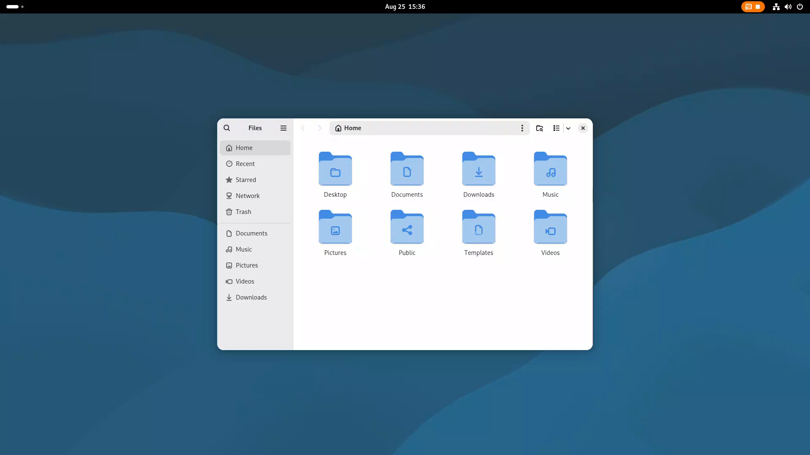
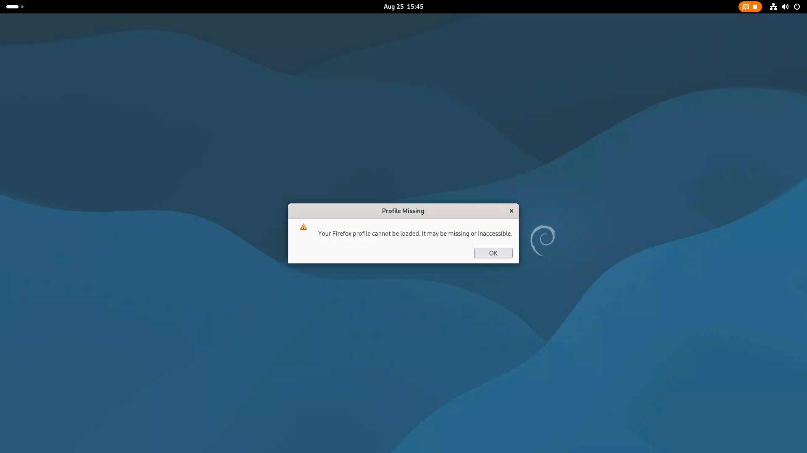
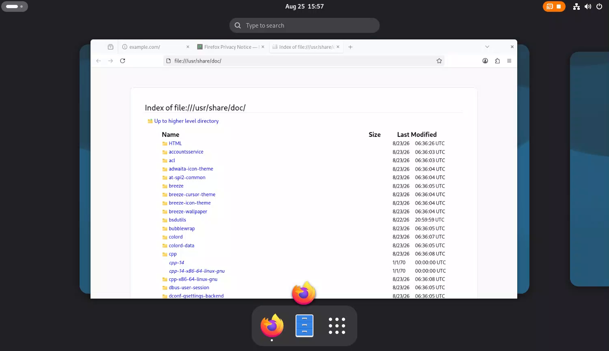
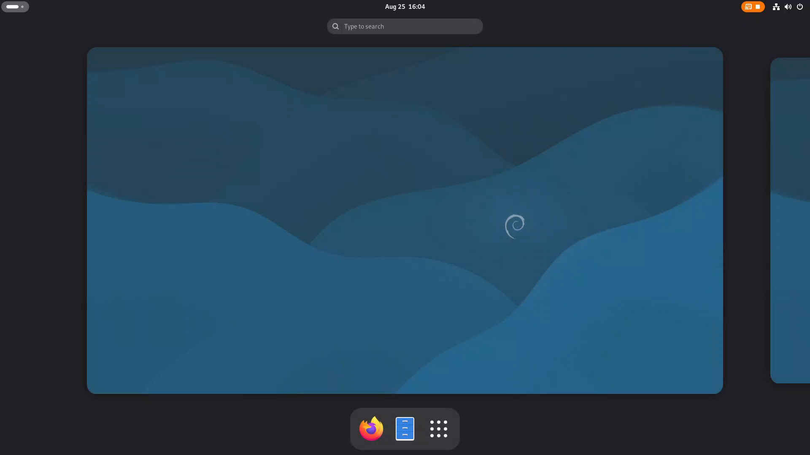
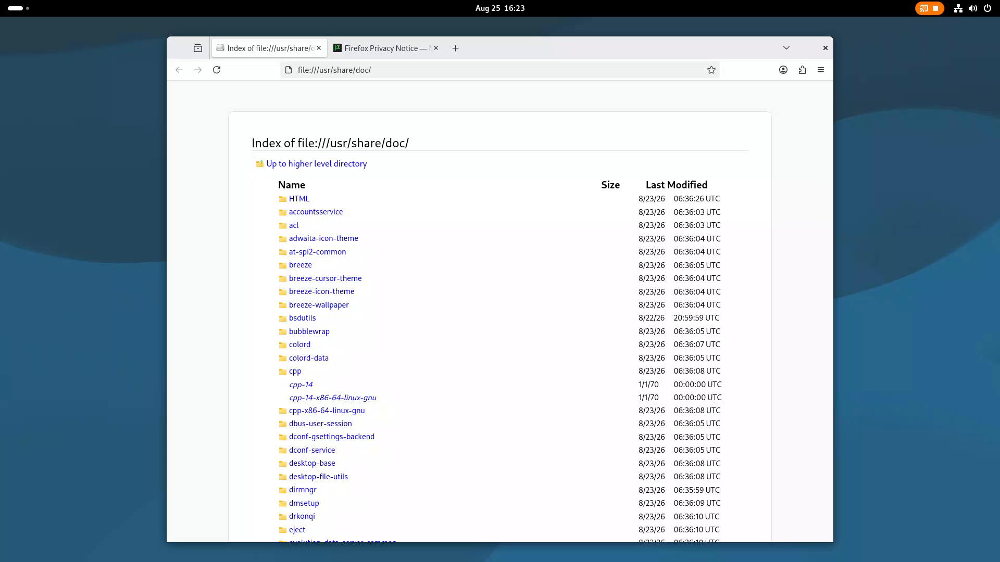

# Phase 10 — Multi-tenant and the budget

*⚠ Historical measurements, on the machine of the time. With phase 18 (without ffmpeg) the ones the change invalidated were removed — encoding without the card and colour conversion with swscale; those of encoding on the card and of audio remain, because the new stream is identical (comparison of 30 Sep 2026). The user's decision. The measurements redone after the change (1 Oct 2026) are in `fasi/18-senza-ffmpeg.md` §5.*

Opened on **24 Aug 2026**, right after phase 9 was closed.
## ✅⭐⭐⭐⭐⭐ **CLOSED on 25 Aug 2026**, on the user's judgement

> *«Sono soddisfatto. Riprodotto audio e video su una connessione del 1990. **Non credo che si
> possa chiedere di più**.»*

> *«Allora la sessione ha raggiunto il suo scopo: il multitenant. **10 utenti contemporaneamente
> presenti su una GPU integrata è un risultato di assoluta eccellenza**.»*

⭐ The two judgements in full, with the numbers of the scenes they were given on, are in **§10**.
⚠ And **two decisions were left untaken**, declared in **§10-bis**: the defaults apply.

> ⛔ **This document is filled in along the way** (`PIANO.md` §0.1). The measurements have the time
> next to them because they were written when they were taken, and the **predictions of §2 were written
> BEFORE measuring** — it is the only way a measurement can refute anything.

---

## What it must produce

**Several users together, the encoder budget, the refusal with a reason** (`PIANO.md` phase 10).

**What the user sees and judges at the end**: two real sessions at the same time; and when the
machine is full, a message that **says why**.

| # | what | where it stood on the morning of 24 Aug 2026 |
|---|---|---|
| 1 | **the real number of the encoder** — pixels/s on `renderD128` | ⛔ never measured: `vainfo` says *which* profiles, not *how many pixels per second* |
| 2 | **the budget** in place of the count | ⛔ two `#define`s at **16**: `src/rcp.c:886 MAX_ATTACCATE`, `src/figlio.c:91 MAX_FIGLI` — where `SPECIFICHE.md` §5.5 promises **ten, configurable** |
| 3 | **`BUDGET_PIENO 0x06`** with the reason in the body | ⛔ declared in `src/rcp.h` · `RCP_BUDGET_PIENO` and in `RCP.md` §8.2, **and no line of the server ever sends it** |
| 4 | **whoever is already working does not get worse** when the eleventh arrives | ⛔ never tested — it is `DECISIONI.md` §4.6-bis and invariant **I1** |
| 5 | **the NETWORK budget** next to the GPU one | ⛔ never named: `DECISIONI.md` §3.1-bis point 2 leaves it open with *«dieci sessioni × 30 Mbit/s sono 300 Mbit/s sul filo del server»* |

> ### ⭐ The order was set by the director, on 24 Aug 2026
>
> *«Prima si misura, e poi simuli 10 utenti veri.»*
>
> ⛔ It is the method constraint of the whole phase, and it is not a preference: **the encoder's number
> cannot be guessed**. `DECISIONI.md` §4.6 says so itself — *«nessun numero cablato nel programma»* —
> and the table of `SPECIFICHE.md` §5.5 (*«una cinquantina al minimo, 8-10 a 1080p30, una sola a
> 4K60»*) is still `[?]`: derived from the chip generation, not read from a bench.
>
> ⇒ **First the measurement, then the ten real ones, and only at the end the product code.**

> ### ⛔ Why this phase sits HERE and not elsewhere — the three precedences, all already decided
>
> | | |
> |---|---|
> | **after phase 8** | zero copy changes **how much a session costs** in GPU memory and bandwidth, and a budget measured before zero copy is a budget to redo (`DECISIONI.md` §4.6-quater) |
> | **before the three new desktops** | ⛔ the budget is a GPU budget, and **the GPU is ONE** — `renderD128`, the same iGPU that composites **every** desktop. It is a property **of the machine**, not of the desktop: measured after three new desktops, one no longer knows which number belongs to what (§4.6-sexies, decided by the user on 16 Aug) |
> | **the border with phase 5 is intact** | *«un utente per volta»* stays with phase 5; *«la macchina piena»* belongs to this one (§4.6-quater) |

---

# ⭐⭐⭐ THE SUMMARY — *the first round of measurements, 24 Aug 2026*

> ⛔ **This is the head of the document: it answers quickly the questions that will be asked tomorrow.**
> The detail is below: §1 the bench, §2 the predictions and their verdict, §3 the design, §4 the adversarial
> lens, §6 the measurements.

## S.1 · ⭐⭐⭐⭐ THE FACT THAT OVERTURNS THE PHASE: **the bottleneck is not the encoder**

`DECISIONI.md` §4.6 builds the whole budget on one sentence: *«il limite vero lo pone il
**codificatore**, e si misura in pixel al secondo»*. ⛔ **`[M]` On this hardware it is not true.**

| | where the bottleneck is | measured |
|---|---|---|
| **the bare encoder** (synthetic scene, no compositor) | the two VDBOXes | **1.86 Gpixel/s** in H.264 (§6.2) · ⭐ **2.33 in HEVC**, which is what the product negotiates **first** (§6.10) |
| ⭐⭐⭐ **the COMPOSITING** | ⛔ **`rcs0`, the render engine** | ⭐ **0.97 Gpixel/s** (§6.11) — **half** of the encoder. A 1080p desktop at 60 Hz is worth **124.4 Mpixel/s** ⇒ `rcs0` passes **99 % at the seventh** |
| with **real GNOME desktops** behind | the same thing, seen from the other end | it gives way at **six** sessions, and the **video** engine never passes **27 %** (§6.5) |

⭐⭐⭐ **And two different benches, on two different quantities, give the same answer**: §6.5 counts the
**sessions** and finds **six**; §6.11 counts the **composited pixels** and finds that the **seventh** saturates
`rcs0`. ⇒ **The number is not an accident of the bench: it belongs to the hardware.**

⭐⭐ **And our colour conversion is ACQUITTED** (§6.11): `[M]` **zero** on `rcs0`, all on the
**VEBOX**, which is never the bottleneck. ⚠ §6.6 had found it on the EUs — but that was `ffmpeg` with
`hwupload` of 8 MB per frame, whereas **the product imports a dmabuf at zero copy**
(`LEZIONI.md` §1.28: two different scenes, both true).
⇒ ⛔ **What saturates `rcs0` is the COMPOSITOR, and it alone is enough** — that is, something that **is not ours**, and that
the budget can only **count**, not reduce.

⭐⭐ **And the cost has TWO terms, not one** (§6.11): `[M]` `rcs0 % ≈ 7.1 % fixed + 0.053 % per
Mpixel/s` ⇒ **half the cost is a toll for merely being a live desktop at 60 Hz**, and 6.5 times
the change costs **1.68** times. It is the fixed term that decides how many quiet sessions fit.

## S.2 · ⭐⭐⭐⭐ **SIX on the worst scene, ELEVEN on the real one — and eleven is not the limit**

> *«Tenendo conto che siamo su una scheda Intel integrata non particolarmente performante, 6 RDP
> attivi contemporaneamente non mi sembra un cattivo risultato»* — the user, **24 Aug 2026**,
> `DECISIONI.md` **§4.6-septies**. ⇒ ⭐ **The judgement comes out strengthened, not refuted.**

| scene | how many fit | what happens to the first |
|---|---|---|
| **saturated** — the whole screen changes at every frame | **6** | ⛔ from the seventh it gives way: −28 %, then **1.5 fps** at the eighth |
| ⭐⭐ **real desktop** — windows, drags, tears | ⭐ **at least 11**, and ⛔ **the ceiling was not found: the users ran out, not the machine** | ⭐ **−7.7 %**, under the tolerance, and the **latency does not move** (8.4 → 8.0 ms) |
| **still** | ⭐ **11 cost ZERO GPU** — RC6 100 %, GT 0 MHz | there the constraint is **memory**, not the card |

⭐⭐⭐ **The «six» was the number of a scene no user produces.** `[M]` On the real desktop: **zero
violations of invariant I1** at eleven sessions, against **37** on the saturated one; and eleven sessions
sit at **22-24 %** of the GPU (§6.12).

⛔ **And the cliff exists only on the saturated scene**: between the sixth and the eighth one goes from 38 to 1.5 fps
— **it is not degradation, it is a precipice**, and the phase 9 ladder does not soften it.
⇒ ⭐ **The product must stop BEFORE the cliff, not inside it** — and this, not «ten», is the work
of the phase.

⛔ **And today it does not stop at all**: the eleventh of the saturated scene **gets in with `negati 0`**, and the
first session goes from 39.60 to 0.96 fps (**−97.6 %**). **The product has no budget: it accepts
everyone and starves everyone together.**

## S.3 · ⭐⭐⭐⭐ THE CLIFF HAS A MECHANISM, and it is **a threshold the product can compute**

⭐⭐ **The proof is in one line**: same population — eight sessions, eight desktops, eight children — and
**one single scene is switched off**. `[M]` **The rate comes back from 1.6 to 33.4 fps.** Putting it back, the cliff
reproduces. **Reversible and repeatable** (§6.15).

⇒ ⛔ **The cliff does not fall on the number of sessions: it falls on how much is being COMPOSITED.** `[M]` The border
lies between **421 and 460 draws/s** at 1080p, that is **0.87-0.95 Gpixel/s** — ⭐⭐⭐ **and it falls exactly on the
compositing ceiling measured by another bench, 0.97** (§6.11).

⭐ **And the column that betrays it is the one nobody was looking at**: when the compositors take
100 % of the drawing engine, `video-enhance` **collapses from 48.7 % to 0.4 %** ⇒ ⛔ **the encoder has
nothing left to do. It does not slow down: it stops.** The stage deliveries go from **39 to 2 fps**.
⇒ **The bottleneck is not in the parent and not in the encoder: it is upstream, in the compositing** — that is, in
something that **is not ours**.

⛔ **Five leads out of six were false**, and they were refuted one by one: the software fallback,
a wait that becomes everyone's latency, the queue threshold, the rate regulator, the parent's
loop. ⭐⭐ **Including the buffer arithmetic, which looked the best and was refuted by the one who had
proposed it**: `[M]` the producer gives **eight**, not six ⇒ we are **never** left without buffers.

⚠ **And the degradation does not go through the column phase 9 had taught us to watch**: `[M]` **zero
keyframes out of 8 741**, even inside the collapse — what moves is the **latency**.
⇒ ⭐ The rule of `LEZIONI.md` §1.31 holds, **the column does not**: which mechanism it is **changes with the
phenomenon**, and must be looked for every time (§1.34).

## S.4 · ⛔ The product defects found, and **none of them was the target**

> ### ⛔⛔⛔ AND THE TWO MOST SERIOUS ARRIVED LAST — *25 Aug 2026, evening*
>
> | | |
> |---|---|
> | ⛔⛔⛔ **THE SESSION THAT IS BORN BLIND** (§7.4) | `[M]` On a **newborn** session Mutter announces no `wl_output` ⇒ **no application can open a window**. Firefox stays alive and never paints; the compositor sits at **0.0 %**; zero frames. ⚠ **Intermittent**: `provanic3` got the monitor **2 times and then 6 times not**; `provanic4/5/6` **never**, over 98 · 55 · 50 attempts. ⭐ Four hypotheses refuted one by one |
> | ⭐ *(refuted on 29 Sep 2026 by measurement T2 of phase 17: stopping the server does NOT take the desktops away — `fasi/17-l-installatore.md` §5.2)* ⛔⛔ **STOPPING THE SERVER TAKES AWAY ALL THE SESSIONS** (§7.5) | `[M]` Updating 7730 at **18:14:29**, the user's session died with the unit — windows included. ⇒ **Today updating the server means throwing everyone out**, and it is the damage `DECISIONI.md` §4.7 forbids anyone to cause |
>
> ⭐⭐ **And it was the DIRECTOR who brought them out**, by asking for a test that forced us to **start from zero** —
> ⛔ something that in the whole phase **had never been done**. The lesson is `LEZIONI.md` **§1.39**, and it is
> the reason for **phase 11**.
>
> ⚠ **What they do NOT touch**: the capacity numbers of §6 and §10, taken on sessions that **really
> drew**. ⛔ **What they touch**: the delivery.

| | |
|---|---|
| ⛔⛔ **the eleventh is ADMITTED and does not see a pixel** | the two `16`s are freed on **different events**: the children table can be full while the slots table is empty ⇒ black page **with nothing on the wire**, and no time after which it gets better (§4.1) |
| ⛔⛔⛔ **the child dies of SIGSEGV on an arbitrary width** | ⭐ **and it has nothing to do with multi-tenant: it concerns everyone.** `[M]` View **1268** — the one Firefox opens on its own — ⇒ DMA-BUF stride **5072, not a multiple of 64** ⇒ the child declares *«rimonto il palco sulla MEMORIA»* and **2 ms later it is dead**: **3 out of 3**, against **0 out of 3** at 1280. The user loses the desktop **before the first frame** (§6.8) |
| ⛔⛔⛔ **two phase 9 cures form a CLOSED LOOP that evicts whoever is working** | `[M]` At **five** sessions, **five clients evicted in 1.3 s**: `arretrato` stays glued to the regulator's cap, which blocks **every** frame ⇒ `usciti_byte=0` ⇒ the client **has nothing left to acknowledge**, goes silent ⇒ **the dead line evicts it with `persi=0`**. ⛔ Here the queue **bites**, that is, these are users who were working (§6.15) |
| ⚠ **two phase 9 cures fight each other — but only for the test client** | `linea-morta causa=silenzio … persi=0`, desktop still and loss **zero**, session closed at **10 s** with `aioquic` (§6.3). ⭐ **On real Firefox it survives** at 120 s and at 300 s (§6.8) — ⛔ **but because it is OUR `PING`s that keep it alive**, not the browser: the margin is **twice**, and no more |
| ⛔ **the desktop is switched on for someone who will never be admitted** | `[M]` a user **never admitted** at the end of the round had **42 processes and a `gnome-shell`** (§6.4) |
| ~~the second closing route of §3.1 does not start~~ ⇒ ✅ **WITHDRAWN** | `[M]` §6.8: with **real Firefox** the capsule arrives **10 out of 10**, code `0x0E`, never `0`. *«0 capsule»* was true **for `aioquic`**, which leaves **498 ms before** the capsule starts. ⛔ **The lesson is one of method**: it had been read **where the capsule leaves** instead of **where it arrives** |

## S.5 · ⭐ The three estimates of the documents that were wrong, and all **in the comfortable direction**

| where | it said | `[M]` |
|---|---|---|
| `SPECIFICHE.md` §5.5 · `DECISIONI.md` §4.6 | 1080p30: «8-10, giusto al limite» | the encoder fits at **33 %** — ⛔ but the machine stops at **six**, for another reason |
| `DECISIONI.md` §4.6 | «dieci sessioni GNOME ferme sono ~12 GB dei 31» | **1.8-1.9 GB** — wrong by **six times** |
| `DECISIONI.md` §3.1-bis point 2 | «dieci × 30 Mbit/s = 300 Mbit/s sul filo» | **22 Mbit/s**, **0.2 %** of a 10 Gbit/s card |

## S.6 · ⭐⭐⭐ HOW THE BUDGET IS WRITTEN — **and then it was written**

⛔ *Written after the two rounds of measurements only, when `src/` was still untouched: the director's order
was «prima si misura».*

> ### ⭐⭐ AND THEN: *«prima applica le patch, poi scrivi il prodotto e dopo rifai i test»*
>
> ⇒ The budget **is in the product** (`src/budget.c`, `src/budget.h`), with its three knobs; the
> `#define`s at 16 have become **one**; `BUDGET_PIENO 0x06` **really leaves**. What was
> built is in **§5**, the cures in **§5.1-5.13**.

⭐⭐ **And the shape of the budget is now measured, not hypothesised:**

| | |
|---|---|
| **the quantity** | ⛔ **not ENCODING pixels: COMPOSITING pixels.** `[M]` ceiling **0.97 Gpixel/s**, and what saturates it is **the compositor**, not us |
| **the currency** | ⭐ **the pixel**: at the give-ways the Mpixel/s match within **0.6 %** as the canvas varies, the frames/s differ by **74.9 %** |
| **how it adds up** | ⭐⭐ `[M]` **linearly, even across different roles**: three saturated + three real desktops give **75.3 % predicted against 75.6 % measured** |
| **the cost per role** | saturated **14.4 %** · real desktop **10.7 %** · ⭐ **still 0.01 %** |
| **the guard needed before the pixels** | ⛔ **the LATENCY**: the count on pixels, after the cliff, says *«c'è posto»* while everyone sits at 1.5 fps. `[M]` healthy ≤ **13.1 ms**, broken ≥ **39.9**, **no overlap** |
| **what the budget CANNOT foresee** | ⛔⛔ **the wake-up**: eight still ones admitted at 0.01 % each switch on in **19 ms** and ask for **130 %**. ⭐ The 50 % reserve limits the overshoot to **2×** |
| ⛔ **and what does not self-calibrate** | the capacity: **before the machine has given way once, it is a lower bound, not a ceiling** |

---

## §0 · THE STATE AT OPENING — *24 Aug 2026, 15:58 UTC*

### 0.1 ⭐ The machine was cleared **before** measuring, and verified

⛔ It is the rule paid for twice in one day (`LEZIONI.md` §1.26) and written in `PIANO.md`: *«quattro
server di prova degli agenti sono rimasti accesi… non danno fastidio a riposo, ma **falserebbero la
prossima misura**»*.

`[M]` At the closing of phase 9 the machine carried **eight** live `remotix-*` units from the benches of
that phase — ports 7900, 7910, 7920, 7940, 7950, 7960, 7971, 7973 — and **three children** still
attached (`provanr4`, `provanr8`, `provanr10`), the oldest for **1 day and 7 hours**.

All switched off. `[M]` **Verified, not declared from memory**:

```
--- porte 7xxx rimaste ---        NESSUNA
--- processi remotix rimasti ---  NESSUNO
--- netem su lo ---               qdisc noqueue 0: root refcnt 2      (nessun guasto residuo)
--- netem su enp7s0 ---           qdisc mq 0: root                    (nessun guasto residuo)
```

`[M]` Memory after the clearing: **12 GB used out of 31**, 18 available. Load average **0.10**.

### 0.2 ⛔ The hardware, and the card on which we do NOT measure

| | PCI address | node | what it is |
|---|---|---|---|
| ✅ **measured here** | `0000:00:02.0` | `renderD128` | **Intel UHD 730** (`i915`), the integrated one |
| ❌ excluded | `0000:03:00.0` | `renderD129` | Radeon **RX 6800** (`amdgpu`), group `remotix-nogpu` |

`[M]` The udev rule of `DECISIONI.md` §4.6-ter is **still applied**: `renderD129` belongs to the
group `remotix-nogpu`, which has no members. ⭐ It is the constraint set by the user on 15 Aug —
*«i test vanno fatti sulla GPU integrata, altrimenti "trucchiamo" il gioco»*.

### 0.3 ⛔ The missing tool, and the route that remains

`[M]` **`intel_gpu_top` is not installed**, neither on the machine nor inside the container. `vainfo`,
`ffmpeg` and `gnome-shell` are there.

⇒ The occupancy of the GPU engines must be read from `/proc/<pid>/fdinfo/<fd>` (`drm-engine-*` on
`i915`), which gives cumulative nanoseconds per client. ⛔ **And it must be calibrated before believing it**
(`LEZIONI.md` §1.33): it is a number, not yet a measurement.

---

## §1 · THE BENCH — *written BEFORE developing*

`PIANO.md` §0.1. Ten benches, ten separate isolations, and ⛔ **a new lock** that is the
condition of the whole phase.

### 1.1 ⛔⛔ The GPU lock — the condition that governs the ten benches

**The GPU is one, and ten benches want it.** Two GPU loads together do not share the work:
they distort each other **silently**, and it is the exact wound of `LEZIONI.md` §1.26 — *a bench that measures while
another saturates does not give red, it gives a plausible number*.

⭐ We reuse the mechanism phase 9 had built for `netem`, `banchi/09-lucchetto.py`,
pointed at a place of its own:

```
LUCCHETTO=/media/REMOTIX/tmp/.lucchetto-gpu.d
```

⛔ **And the rule of use is stricter than «take it»**: *every round from which a number comes out that will be
reported takes the lock; for development and tuning one works without it, **but those numbers
do not count and are not reported***. A hold without expiry would block everyone until tomorrow;
the expiry is inside, and whoever finds it past **breaks in, declaring it**.

### 1.2 The catalogue of the phase's benches

| bench | what it measures | isolation |
|---|---|---|
| `10-b0-terreno` | ⛔ the check that looks **underneath** the other nine: idle machine, lock, right GPU, no leftover `netem`, binary newer than the sources, `ngtcp2` from the right place, free slot, ban not triggered | no port |
| `10-b87` | ⛔ **the GPU meter**, and its **calibration** with a known load (0, 1, 2, 4 streams; and one at half rate) | no port |
| `10-b88` | **the saturator**: ramp of N streams with the **product's** encoder, in **H.264**, at 480p25 · 1080p30 · 4K60, until it gives way — and ⛔ **why** it gives way | no port |
| `10-b89` | **how much ONE session costs** after zero copy: memory (PSS), GPU, CPU, wire, and what the user sees | port 8010 · `provadec1` |
| `10-b90` | **the network budget**: bits/s per session on three scenes, the **calibrated** meter, and the machine's real ceiling | port 8020 · `provadec2` |
| `10-b91`/`10-b92` | ⭐ **the ten real ones**: ten users, ten GNOME desktops, the climb from 1 to 10 with **every** session measured at **every** step | port 8100 · `provamt1…10` |
| `10-b93` | **the full table**: what reason the newcomer receives, what sentence the page shows, and ⛔ whether whoever was inside gets worse | port 8030 · `provadec4/5/6` |
| `10-b94` | **the study of the hardware**: `vainfo` in full, the VDBOXes, the concurrent VA-API contexts, and what changes under load | no port |

And two read-only assignments, without a bench: **where the budget lives** in the code (the design, not the
code) and ⛔ **the adversarial lens** — *prove that multi-tenant is NOT ready*.

### 1.3 ⛔ The six rules the ten benches carry

They come from the five lessons paid for in phase 9 (`LEZIONI.md` §1.29-§1.33), and they are not advice:

1. ⛔ **A bench is not finished until it has been seen giving RED.** Nine bench defects out of nine,
   in phase 9, had the shape *«silence instead of red»*: none made a bench **fail**,
   all made it **go quiet**;
2. ⛔ **`None` is not zero.** «I could not measure» ≠ «nothing happened»;
3. ⛔ **The meter is calibrated FIRST**, by injecting a known value;
4. ⛔ **One counts how much stress ARRIVED** before declaring a result;
5. ⭐ **The mechanism goes next to the symptom**: in phase 9 there was a factor of **five** between the two;
6. ⚠ **Short rounds underestimate**: the user's sessions last hours, the benches twenty-five seconds.

### 1.4 ⭐ THE GROUND CHECK — `10-b0`, and **30 faults out of 30 make it bite**

`banchi/10-b0-terreno.sh` (+ `10-b0-certifica.sh`, `10-b0-innesta.sh`). It is called like this:

```
CHI=10-a4 PORTA=8020 UTENTE=provadec2 ALBERO=/media/REMOTIX/src/10a4-src \
  bash banchi/10-b0-terreno.sh || exit 1
```

⛔ **Three exits, and the third is the one that counts**: `0` holds · `1` does not hold · **`2` I could not
verify**. **21 predicates** in eight groups: idle machine (load, memory, other people's `remotix`
**with name and user**, ports) · **GPU lock** (whose it is, how long is left, and `LUCCHETTO_MIO=1`
if a number comes out of the round) · right GPU (PCI addresses, `remotix-nogpu` fence, group without
members, **who holds the discrete one open**) · `netem`/wondershaper on `lo` **and** on `enp7s0` · **code
= what I read** (R12.3, local↔remote md5, newer binary, single binary) · `ldd` from `b2` ·
free slot (stage, clients) · ban of §4.4-bis.

`[M]` **30 faults out of 30 made the check bite**, in 50 rounds, **three times in a row**: among
them the fake lock of *«10-zz-intruso»* (red with the name) · the **expired** lock (green, but
it **declares** it and does not break in) · the binary older than a `.c` · the two copies of `rcp.c`
diverging · a process holding the **Radeon** open · the ban at 12 hours · ⭐ and the three cases that
unmask badly written checks — **ssh not answering**, **ssh with exit 0 and zero lines**,
**ssh dropped halfway**: all three give **exit 2**, never green.

> #### ⛔ The four things the certification taught — and the first is a defect found **in the check itself**
>
> 1. ⛔ **The defect was in the check**: the two DRM nodes were looked for with a two-branch `case`, and with
>    two equal PCI addresses the first branch won ⇒ the most important predicate of that section
>    became **UNKNOWN instead of looking at the card it had been named**. It is the shape **E8**.
>    Cured: they are looked for independently. ⭐ **It is exactly the reason a bench is certified.**
> 2. ⭐⭐ **The binary has NO rpath.** `[M]` Bare `ldd` on a built `remotix` resolves
>    `libngtcp2.so.16` from `/lib/x86_64-linux-gnu`, that is **from the system**: what brings it to `b2` is the
>    `LD_LIBRARY_PATH` the launchers export. ⇒ Reading **bare** `ldd` would give red on every
>    healthy tree; reading it **only with the environment** would hide that the choice depends **on who
>    starts it**. The check reads both and declares it. ⛔ The hole remains: **it does not see the command
>    line** with which the server will be started.
> 3. ⛔ **`bash -c "…; sleep N # segno"` loses the mark**: bash replaces itself with the last command, the
>    line becomes `sleep N`, `pgrep` does not find it and `pkill` does not kill it. ⇒ The fault **stayed
>    injected for 40 s and whoever had put it in believed they had not**. Now the mark sits in
>    `argv[0]` with `exec -a`.
> 4. ⚠ **A ground check must not load the machine it declares idle**: counting the fds
>    on the discrete card with one `readlink` per file would have been **~14 000 forks**. It is done with
>    `find -lname`, a single process, and the denominator is declared (`[M]` 1133 processes sifted).
>
> ⚠ **And two notes on the scene, which are not ours**: `pgrep -a -f 'remotix-figlio'` **catches its
> own command line**, and the test machine's profile prints `tput: No value for $TERM`
> on stderr at **every** `ssh` — with `2>&1` it ends up **inside the data**, and it already had.

**The holes the check declares** `[?]`: **the real GPU occupancy** it does not see ⇒ an agent
that measures on the GPU **without taking the lock is invisible to this check** · of the ban it sees
**only the file**, not the memory of the running server · ⛔ **it is a photograph**: that nothing changes between the check and
the measurement nobody guarantees — the lock is the only part that lasts.

---

## §2 · THE PREDICTIONS — *written on 24 Aug 2026, BEFORE any measurement*

> ⛔ **They are here because a prediction written afterwards is not a prediction.** Each one is falsifiable,
> and ⭐ **those that will be refuted are the most useful result of the phase**: in phase 9 the
> refuted predictions taught more than the ones that hit.

| # | prediction | how it is refuted |
|---|---|---|
| **Q1** | The ceiling measured in **H.264** will be **lower** than the table of `SPECIFICHE.md` §5.5, because that one is derived from the chip generation and takes no account of `EncSliceLP` nor of the **35 W** i5-13500T | `10-b88` gives 8-10 sessions at 1080p30 or more |
| **Q2** | ⛔ What gives way first **will not be the GPU**: it will be **memory** (ten GNOME sessions) or the **CPU** (ten times capture + QUIC), and the video engine will stay under 100 % | `10-b88` and `10-b89` show the video engine saturated before the other three quantities |
| **Q3** | **Ten sessions fit**, because `MAX_ATTACCATE` is already 16 and the architecture is *one process per session* — ⚠ but **not at 1080p30 all moving together** | `10-b92` stops below the tenth step |
| **Q4** | ⛔⛔ **Whoever was inside GETS WORSE when someone joins**, and in a way the frames/s do not show right away: the **keyframe share** will rise before the visible drop, as happened in phase 9 (factor of five between mechanism and symptom) | `10-b92` shows the first session steady on all columns up to the tenth step |
| **Q5** | ⛔ The **phase 9 cures turn against multi-tenant**: ten sessions contending for the same wire see each other **as a bad network**, each lowers its rate, and the **dead line** may end up **detaching** someone because the neighbour is working — where *«mai staccare»* is the only obligation that holds everywhere | `10-b90`/`10-b92` show no descent attributable to the neighbour |
| **Q6** | ⛔ The **ban by address** of §4.4-bis is a real multi-tenant defect: ten tenants behind the same NAT are **one single address**, and one who gets the password wrong three times throws the other nine out **for twelve hours** | reading the code shows it is keyed on the user too, or that the case does not arise |
| **Q7** | `MAX_FIGLI` **does not really follow** `MAX_ATTACCATE`: they are two separate `#define`s and the link lives only in the comment of `figlio.c` | `10-b93` shows that changing one changes the other |
| **Q8** | ⛔ The refusal at a full table arrives **after** something has already been switched on — *refusing after switching on a desktop is not refusing* | `10-b93` shows the no arrives before the child is born |
| **Q9** | The **network budget** bites **before** the GPU one: if the hard case in H.264 asks for **44.6 Mbit/s** (phase 9 §14.2), ten do not make 300 Mbit/s but **almost half a gigabit**, and the real ceiling is not the copper — it is the **CPU that encrypts** | `10-b90` measures a cost per session well under 30 Mbit/s on the real scenes |
| **Q10** | ⚠ The **log lines** do not say whose they are, and with ten sessions the log — which is the tool everything is diagnosed with in this project — becomes unreadable | sampling shows that the majority of lines carry the user or the session identifier |

### 2.1 ⭐⭐ THE VERDICT ON THE TEN — **four refuted**, and they are the part that taught

| # | outcome | in one line |
|---|---|---|
| **Q1** | ⛔ **REFUTED** | the ceiling is **HIGHER**, and on all three rows: 1080p30 sits at **33 %**, not «giusto al limite» (§6.2) |
| **Q2** | ⛔ **HALF REFUTED, and the right half is the uncomfortable one** | what gives way **IS** the GPU (the CPU sits at 1.2 cores out of 20) — ⛔ **but not the encoder: the render engine** (§6.5, §6.6) |
| **Q3** | ⛔ **REFUTED** | **SIX** fit, not ten (§6.5) |
| **Q4** | ⭐ **CONFIRMED**, and in the worst way | −97.6 % at the first session. ⚠ **But not by the predicted route**: the keyframes **never switch on**, the degradation goes through the **latency** (§6.5) |
| **Q5** | ⭐ **CONFIRMED in substance, corrected in the mechanism** | what detaches is not the regulator but the **dead line**, and by the route of **silence** (§6.3) |
| **Q6** | ⭐ **CONFIRMED** by reading | *«IL NOME UTENTE NON CONTA»*, `rcp.c` · `posto_prendi()` (§4.2) |
| **Q7** | ⭐ **CONFIRMED** | 2 against 16, measured on the binary (§6.4) |
| **Q8** | ⭐ **CONFIRMED, and worse** | not «refusing after switching on a desktop»: **the desktop is switched on even for someone who will never be admitted** (§6.4) |
| **Q9** | ⛔ **REFUTED** | ten saturated sessions make **22 Mbit/s** on a 10 Gbit/s card: **0.2 % of the wire** (§6.3, §6.5) |
| **Q10** | ⭐ **CONFIRMED, and measured** | `[M]` **4.2 %** of the **diagnostic** lines is attributable, and the blind test says **0 names out of 4** (§6.7) |

---

## §3 · ⭐⭐ THE DESIGN — where the budget lives, read in the code *(24 Aug 2026)*

> ⛔ **Reading, not code**: the product is touched after the numbers. But when the numbers arrive,
> this says **exactly** where to put them. Every line carries `file:line` **and** the name of the
> function, because a line number ages silently.

### 3.1 ⛔⛔ The admission border — and today the no arrives **after the login**

The chain, with what already exists after each step:

| step | where | afterwards, exists |
|---|---|---|
| `CIAO` | `rcp.c:1972 tratta_ciao()` | nothing: the user does not have a name yet |
| `ECCOMI` | `rcp.c:1833 manda_eccomi()` | ⭐ codec, depth and level negotiated: **the client decoder's ceiling is already known here** |
| `CREDENZIALI` | `rcp.c:2284 tratta_credenziali()` | the user name (`s->utente`, line 2333); PAM **asked**, not answered |
| PAM verdict | `main.c:332 consegna_verdetto()` | ⛔⛔ **`figli_assicura()` at `main.c` · `guarda_il_servizio_pam()` — the child IS BORN HERE**, before `AMMESSO` goes out on the wire |
| `AMMESSO` | `rcp.c` · `rcp_verdetto()` | the child has already `fork`+`exec`ed, has already dropped to the uid, has already opened the logind session and has already taken the stage (`figlio.c` · `figlio_vive()` → `figlio.c`) |
| `ATTACCA` | `rcp.c:2702 tratta_attacca()` | **here** the slot is taken: `posto_prendi()`, `rcp.c` · `tratta_attacca()` |
| `SESSIONE` | `rcp.c` · `tratta_attacca()` | canvas decided, video channel on |
| the encoder | `webtransport.c:4117 video_regola()` → `main.c:466 figli_video()` → `MSG_VIDEO` → `figlio.c:4306 codificatore_di()` | ⭐ **the VA-API context opens only here**, on `renderD128` (`figlio.c`) |

⛔ **Hence the fact that decides the design.** `POSTO_NIENTE_PIU_POSTI` triggers at `rcp.c` · `tratta_attacca()`, that is
when the user is **already authenticated**, the child is **already born**, `pam_open_session` has **already** passed
and mutter and PipeWire are **already** capturing. ⇒ **Refusing there is not refusing: it is logging in and then
kicking out.** ⭐ **Prediction Q8 is confirmed, and by reading.**

⭐ The right place for the capacity no is **before `figli_assicura()`** (`main.c` · `guarda_il_servizio_pam()`); the second
best is inside `tratta_attacca()` **before** `posto_prendi()`, and it costs a desktop mounted for
nothing. ⭐ And between `AMMESSO` and `SESSIONE` there is a window in which **the desktop is on but the GPU is not**.

### 3.2 ⛔⛔⛔ The most serious fact of the reading: **the phase 9 regulator does not lower the GPU cost**

The regulator lives in the **parent** (`webtransport.c:4190+`, `WT_RITMO_POSTI` at `:3404`) and decides that a
frame **does not leave**. ⛔ But that frame **has already been encoded by the child**.

⇒ **A session on a terrible network costs the GPU exactly as much as a session on fibre.** And the
counts of the frames sent already exist (`wt_video_conti()`, `webtransport.c`), so
hooking the budget onto them is the natural thing to do — ⛔ **and it would say there is room precisely when there
is none**. The number to count is **on the other side of the process border**: `us_codifica` in
`tratti_conta()`, `figlio.c` · `tratti_mediana()`, and today it ends up **only in the log**.

⛔ **And the ghost keeps encoding.** Capture stops only when the last WebTransport session
of that user dies (`webtransport.c` · `apri_http3()`, guard `wt_video_qualcuno_guarda()` at `:5747`,
which looks at `video_acceso` and **not** at the RCP state). A client silent for 30 s has **left the
slot** (`rcp.c:7529 posto_lascia()`) and **is still encoding**. ⇒ **slots occupied ≠ GPU load**, and
a count kept on `attaccate[]` **underestimates** — precisely in the scene in which the machine is struggling.

### 3.3 ⛔ The two `#define`s at 16 are **four**, plus an **8** that bites at **nine**

| # | where | quantity | bites at |
|---|---|---|---|
| 1 | `rcp.c:886 MAX_ATTACCATE 16` — `attaccate[]` at `:902` | RCP slots | 17 |
| 2 | `figlio.c:91 MAX_FIGLI 16` — `v[MAX_FIGLI]` at `:519` | processes/stages | 17 |
| 3 | `aiutante.c:33 MAX_IN_VOLO 16` | ⚠ **authentications in flight**, not sessions | 17 **simultaneous**, with 0 active sessions |
| 4 | `main.c:706 QUANTI_PRESENTI 16` — `presenti[]` at `:709` | abandonment clock | 17, ⛔ **silently** (`main.c` · `deposita_fotogramma()`: `return` without a line) |
| ⛔ | `webtransport.c:5225 WT_PALCHI 8` — `palchi[]` | stage canvas for re-attach | ⛔⛔ **9 — that is, before the promised ten** |

⭐⭐ **Prediction Q7 is confirmed, and worse than it was written.** The comment of `figlio.c` —
*«quando quello diventerà un budget di pixel, questo lo seguirà dallo stesso posto»* — describes a
link **that does not exist in the code**: `MAX_ATTACCATE` is `static` in `rcp.c` and does not appear in
`rcp.h`; `MAX_FIGLI` is an independent literal. The same holds for `aiutante.c:29-32` (*«è lo
stesso `MAX_ATTACCATE` di `rcp.c`»* — it is not) and for `QUANTI_PRESENTI`.
⇒ **Four hand copies of the same number, three of which declare in writing a link that
the compiler does not know.**

⭐ And dismantling them costs little: the five functions that walk `attaccate[]` (`posto_occupato` 904,
`posto_chi` 913, `posto_prendi` 947, `posti_occupati` 965, `posto_lascia` 974) do **only linear
scans with `strcmp`** — no index arithmetic, no invariant on the 16. A `calloc` and a
module counter. ⛔ **The real constraint is another one**: `figli_descrittori()` (`figlio.c`)
fills the array of the parent's `poll`, and that is `MAX_POLL 64` (`main.c` · `TELA_A`) — see §3.6 item 10.

### 3.4 `BUDGET_PIENO 0x06` — and ⛔ **today the page says the sentence of a count**

`[M]` `grep RCP_BUDGET_PIENO src/*.c` → **no result**: declared at `rcp.h` · `RCP_VERSIONE` and in `RCP.md`
§8.2, **zero callers**. The model for sending it exists: `congeda()` (`rcp.c` · `utf8_valido()`) writes reason +
detail (lines 1658-1659), and `POSTO_NIENTE_PIU_POSTI` already uses it at `rcp.c:2856-2867`.

⛔ **And `src/pagina.html` · `MOTIVO()` says `0x06: "il server e' pieno"`** — it is not false, it is the sentence of a
**count**, where §4.6-bis decided *«questa macchina non ha più capacità di codifica»*.
⛔⛔ Worse: `0x0E` at `pagina.html` · `MOTIVO()` is *«quella sessione non si può servire»*, and it is **that one** the
user reads today at a full table — a sentence that speaks of **their** session while the fact
concerns the **server**.
⭐ The rest of the page holds: six places consult the `MOTIVO` table, there is always a fallback
*«congedato, motivo 0x…»*, and since 16 Aug every farewell brings back to the login form
(`pagina.html:5290-5300`) ⇒ **a `0x06` produces no hammering**.

⛔ **And `0x0E` does not become `0x06`**: they are two different facts, and it is finding **R9.3** (`rcp.c:920-938`).
*«La tabella dei posti è finita»* ≠ *«la macchina non ha più capacità di codifica»*.

### 3.5 The configurable cap — **two options, and it does not violate «one route only»**

| option | quantity | default |
|---|---|---|
| `--budget-mpixel-s N` | the **real limit**: encoding Mpixel/s this machine declares | ⛔ `[?]` **the number from the measurement** — not written until it exists. `0` = off, declared in the startup line |
| `--tetto-sessioni N` | the **administrative cap** of §4.6, and from it `attaccate[]`, `v[]`, `palchi[]`, `presenti[]` are sized | **10** (`SPECIFICHE.md` §5.5) |

⚠ Two and not one because they are **two quantities**, and `DECISIONI.md` §4.6 spells it out: *«dieci non
è il limite: è il tetto amministrativo. Il limite vero lo pone il codificatore»*. ⛔ What
would violate `CODER.md` §2-bis is **leaving the four `#define`s standing**: those really are the second
route, and they are already four numbers that can diverge.

⛔⭐ **And there is a third cap that does not exist today: the network one.** `--tetto-banda-mbit`
(`main.c` · `input_al_figlio()`) is a **floor per child**: `figli_fase9()` (`figlio.c` · `figli_accendi()`) copies it identically
into the `argv` of **every** child, and `codificatore.c:357 tetto_pavimento_mbit` is a **process**
static. ⇒ Ten children × 20 Mbit/s = **200 Mbit/s on the server's wire, and nobody knows it.** Point
5 of the phase has today **no line of code**.

### 3.6 ⛔ What breaks, ordered by **when** it bites

| # | what | where | bites at |
|---|---|---|---|
| 1 | ⛔⛔ **`WT_PALCHI 8`**: from the ninth user the stage canvas is not recorded, and at re-attach `SESSIONE` grants what the client asks for instead of what the stage has ⇒ §6.2 makes it **throw away every frame** until `ADATTA_TELA` arrives — *«riattacco e non vedo niente per un secondo»* | `webtransport.c` · `rete_ciclo()`, `palco_misura_segna()` `:5238` | ⛔ **9** |
| 2 | the **ghost that encodes** (§3.2): the budget counted on the slots underestimates the real load | `webtransport.c`, `:7208` | **at once** |
| 3 | the **regulator does not touch the GPU** (§3.2) | `webtransport.c:4190+` vs `figlio.c` · `tratti_mediana()` | **at once** |
| 4 | `--tetto-banda-mbit` **replicated per child** (§3.5) | `figlio.c` · `figli_accendi()` → `:5998` → `codificatore.c` · `BANDA_FINESTRA_US` | **at once**, visible at 3-4 |
| 5 | the **refusal after the login** (§3.1) | `main.c` · `guarda_il_servizio_pam()` vs `rcp.c` · `tratta_attacca()` | at every refusal |
| 6 | ⛔ the **findings folder is shared** and the file names are **fixed** (`cattura.bgrx`, `flusso-h264.264`, `scatto-*.bgrx`): two children with `--rilievo` on **overwrite each other**, and `SIGUSR1` is forwarded to **all** ⇒ the finding attributes to one user the pixels of another | `figlio.c` · `dichiara_priorita_audio()`, `:5595-5637`, `:1918-1929` | **2 users** (only with `--rilievo`) |
| 7 | ⛔ the **log lines do not say whose they are**: the header is `HH:MM:SS.mmm %-7s`, that is **only the area**, and parent and children **append to the same file**. Ten lines *«TRATTO cattura → byte fuori: mediana 3,2 ms»* per second, **indistinguishable** ⚠ and atomicity is guaranteed only under `PIPE_BUF` (4096), which this product's long lines come close to | `registro.c` · `riga()`, box `:37-58` | ⛔ **2**, unreadable at 10 — ⭐ **Q10 confirmed** |
| 8 | `presenti[]` **overflows silently**: the 17th user has no abandonment clock and **no line says so** | `main.c` · `deposita_fotogramma()`, `presenza_segna()` `:713`, mute `return` at `:730` | 17 |
| 9 | `MAX_IN_VOLO` is **another quantity** under the same number | `aiutante.c` · `rcp_autentica()` | 17 simultaneous, 0 sessions |
| 10 | ⛔ **`MAX_POLL 64` and the MUTE truncation of the children**: `figli_descrittori()` stops at `max` **without writing anything**. Worst count today 36 out of 64, the 16 children fit — ⛔ but beyond ~28 children, or with a crowded page, **a child stays out of the `poll` and its user no longer sees a pixel, without a line** | `main.c` · `TELA_A`, `figlio.c` | >28, and **silently** |
| 11 | ⛔ **nobody sees the software fallback**: if opening VA-API fails, the child falls back to `libx265` (much slower than the card — the measurement no longer holds after phase 18; today OpenH264, measured in `fasi/18-senza-ffmpeg.md` §5.4-§5.5; `figlio.c:4185-4188`) ⇒ the eleventh session can degrade **without the budget noticing**, and **I1 is broken for the newcomer** | `figlio.c` · `potenza_nome()`, `:4470` | `[?]`, depends on the driver |
| 12 | ⭐ the **ban file and the command socket do NOT break** (one single writer, one single socket) ⚠ but the ban is **per address**: ten users behind the same NAT share the three attempts | `main.c` · `presenza_segna()`, `comando.c` · `comando_descrittori()` | 1 NAT |

### 3.7 The `[?]` the reading does not close

| `[?]` | which measurement closes it |
|---|---|
| **how many pixels/s `renderD128` really sustains** — no line of the code knows it | the saturator `10-b88` |
| **the right quantity: pixels/s or engine occupancy** | two rounds at **equal pixels/s** with different codecs, and one in hardware against one fallen back: if the number of admissible sessions changes, the right quantity is the **occupancy** |
| **when the Intel driver stops giving VA-API contexts** | open N of them in N processes until `codificatore_nuovo()` fails, and read the fallback line of `figlio.c` · `codificatore_di()` — it is the assignment of `10-b94` |
| **whether `cattura_avvia()` costs GPU while nobody watches** | a live child without sessions, and `drm-engine-*` on `gnome-shell` |
| ⚠ **the aged comment of `figlio.c` · `potenza_nome()`** says *«non ci si arriva nella pratica»* and **it is reached**: `prendi_il_palco(primo=true)` calls `codifica_e_manda()` three times before every `MSG_VIDEO` | a log line at the birth of a child |

---

## §4 · ⛔⛔ THE ADVERSARIAL LENS — *«prova che il multi-tenant NON è pronto»* (24 Aug 2026)

> ⭐ Adversarial, read-only mandate: the thesis to refute was the one of `DECISIONI.md`
> §4.6-sexies — *«l'architettura c'è già in buona parte: un processo per sessione. Non si sta
> scansando una riscrittura strutturale»*.

### 4.0 The verdict in one line

⭐ **The thesis is half true.** *One process per session* really is there, and the three things that
looked shared — **clipboard, canvas, input** — are all routed **by user name** and do not
mix (§4.3, leads 5 and 8). ⛔ **But the count of users is kept in four places with four
different lives**, and the log — the project's only diagnostic tool — **stops saying whom it
is talking about as soon as there is more than one user**. It is not a structural rewrite: they are **five
seams**, and **two break the product at ten**.

### 4.1 ⛔⛔ R10-A1 · The eleventh is **ADMITTED** and does not see a pixel — and nothing goes out on the wire

**The fact**: the two `16`s **are freed on different events.** The slot in `attaccate[]` is freed at
detach (`posto_lascia()`, six routes); ⛔ **the child is not** — it is invariant **I4** (`figlio.h`):
it dies only by explicit logout or by abandonment at **60 minutes** without input (`main.c` · `consegna_verdetto()`).
⇒ **The children table can be full while the slots table is empty.**

**The scene**: morning, ten tenants come in, work, close the browser. The ten stages stay
alive for up to an hour. The eleventh passes PAM, receives `AMMESSO`, receives `SESSIONE`, the slot in
`attaccate[]` **is free** — and `figli_assicura()` (`main.c` · `guarda_il_servizio_pam()`) returns `false`. The code does not change
the verdict (it is declared, and it is defensible) and writes one single line: *«è AMMESSO ma non ha un figlio:
entra e non vede un pixel»*. ⛔⛔ **Nothing goes out on the wire**: neither `0x0E`, nor `0x06`. The user sees
a **black page without explanation**, and there is no time after which it gets better.

⛔ It is point 3 of the phase, and the trap concerns **how** it is closed: *if only the slot count
is replaced with the budget, the symptom will not be «budget full» — it will be a black screen without
a reason*, that is exactly the defect for which `posto_prendi()` had already been cured (R9.3).
⭐ **The model to resemble already exists**: `posto_prendi()` distinguishes «full» from «occupied» and sends
`0x0E` with the right reason. It is the seam done **well**.

### 4.2 The other findings, by severity

| # | what | where | bites |
|---|---|---|---|
| ⛔⛔ **R10-A2** | **The ban is per ADDRESS and ten tenants behind a NAT are one single address.** `rcp.c` · `posto_prendi()` declares it: *«IL NOME UTENTE NON CONTA. Tre nomi diversi contano tre»*. Three **different** tenants who get it wrong once each within five minutes **ban the address**: the other seven stay out for **12 hours** without having got anything wrong, and the only way out is the command socket, which is `0600` of **root** | `rcp.c:1052-1055`, `rcp_chiave_indirizzo()` `:1159`, check `:2364` | ⛔ **10 users in an office**. ⭐ **Q6 confirmed** |
| ⛔ **R10-A2-bis** | **A successful login removes the ban from memory but NOT from the file: the restart resurrects it.** `azzera_falliti()` does a `memset` of the whole entry, `bannato_fino` included, and ⛔ **does not call `salva_ban()`** — where its twin `rcp_sblocca()` does call it | `rcp.c` · `salva_ban()` vs `rcp.c` · `segna_fallito()` | ⚠ it does not break at once, **it lies later**: two truths about the same fact (**I7**) |
| ⛔⛔ **R10-A3** | **Ten tenants multiply the logind wait, and the DEAD LINE detaches them all.** `wt_sorveglia_locali()` loops over **all** sessions and for each one makes a **synchronous** D-Bus call, **inside the same `poll` that delivers the frames**; `ATTESA_MS` is 300. With one tenant the worst is 300 ms every 2 s; ⛔ **with ten it is 3 s every 2 s**. While the loop is stopped, `lm_usciti` does not rise for **any** session and `lm_offerti` keeps rising ⇒ past 5 s **`linea_morta_scatta()` throws out all ten**, each with the sentence *«la linea è MORTA»* — which **blames the user's network for a defect of the machine** | `webtransport.c` · `video_a_una()`, `main.c` · `ABBANDONO_PREDEFINITO_MS`, `sentinella.c` · `ATTESA_MS`, `webtransport.c` · `WT_RETE_PERDE` | ⛔ **10 users**, ⚠ **conditional** on a slow logind — but what triggers the condition is **the number of tenants** |
| ⛔ **R10-A4** | **The log does not say whose it is.** `gancio_registra()` receives the session context and **throws it away** (`(void)ctx;`); the format is `time + area` and that is all — no pid, no user; the children **do not redirect `stderr`** and all ten append to the same file, with the **same area**. `[M]` static census: **79 %** of the lines of `rcp.c`, **63 %** of `webtransport.c`, **64 %** of `figlio.c` and ⛔ **100 %** of `codificatore.c` **without an identifier** | `webtransport.c` · `gancio_manda()`, `registro.c` · `riga()`, `figlio.c` · `diventa_ed_esegui()`, `figlio.h` · `REG_FIGLIO` | ⛔ **2 users**, unreadable at 10. ⭐ **Q10 confirmed, and with a number** |
| ⛔ **R10-A5** | **The bandwidth cap is PER TENANT, and nobody adds up**: `--tetto-banda-mbit 30` with ten tenants is not a cap of 30, it is a cap of **300**. In the whole of `src/` **there is no aggregate counter of the bytes sent out** | `main.c` · `consegna_verdetto()` → `:1544` → `figlio.c:1215-1217` | ⚠ today it does not break; it is **point 5 of the phase**, confirmed by the code |
| ⚠ **R10-A6** | **`WT_PALCHI` is EIGHT and the phase aims at ten**: the ninth and the tenth do not enter the table and at re-attach they receive the canvas **as the client asks for it** instead of as the stage has it. ⛔ And the fallback is declared **only once** (`palchi_pieni_detto`): the ninth and the tenth lose it **silently** | `webtransport.c` · `rete_ciclo()`, `palco_misura_segna()` `:5238` | ⚠ **9** — ugly, does not detach |
| ⚠ **R10-A7** | **`MAX_IN_VOLO` is 16 by copy, not by construction**, and the comment declares a link that does not exist. The day the cap goes up, the seventeenth who authenticates **at the same moment** receives `CREDENZIALI_ERRATE` — **indistinguishable from a wrong password** | `aiutante.c` · `rcp_autentica()` | ⚠ not today, ⛔ **on the day of the budget** |
| ⚠ **R10-A8** | **The findings folder is a single one and the file names are FIXED**, and the benches' grounds create it `1777` (one even `777` **without sticky**). ⇒ (a) tenant B can **read A's `cattura.bgrx`** — a raw frame of their desktop; (b) the second child fails the write and ⛔ **whoever diagnoses looks at the wrong desktop believing it is theirs** | `figlio.c` · `dichiara_priorita_audio()`, `:5595`, `:5051`; `banchi/07-b64-terreno.sh` | ⚠ **defect of the BENCHES**, not of the product — ⛔ but phase 10 runs ten users right there |
| ⚠ **R10-A9** | **A hostile tenant prevents another from opening the session with a `touch`**: the session log is `/tmp/remotix-sessione-<uid>.log`, `/tmp` is writable by everyone and the uid can be read from `/etc/passwd`. If the file exists and belongs to someone else, the redirection fails and the shell **exits before running the compositor** — ⛔ and the failure is **mute**, because `setsid --fork` exits `0` anyway | `sessione.c` · `avvia()` | ⚠ requires hostility, ⛔ cost of the attack: **one command**, effect **permanent and without symptom** |
| ⚠ **R10-A10** | **No cap on the number of QUIC connections**: `t->quante++` exists **only for the log line**. Thousands of connections that never send `CREDENZIALI` live 60 s each, **the ban never triggers** (no authentication fails), and the cost of the eleven scans of the list is paid by **everyone else's frames** | `trasporto.c` · `accetta()`, `webtransport.c` | ⚠ robustness |

### 4.3 ⭐ The ten leads **verified and discarded** — they are worth as much as the findings

⛔ In this project a lead closed with its reason written down tells whoever comes next that it has already
been looked at there. Line in hand:

1. ⛔⛔ **«Il secondo fisso mette dieci utenti in fila, l'ultimo aspetta dieci secondi» — IT IS FALSE**, and
   it is the most important lead to close. `RITARDO_FISSO` (`rcp.c` · `RITARDO_FISSO`) still exists and still applies
   to the admitted too, ⭐ **but it is not a wait**: it is a **per-session floor** checked in
   `rcp_tempo()` (`rcp.c` · `rcp_verdetto()`) with a clock comparison that **returns at once**. The wire never
   stops. ⇒ Ten users who come in together wait **one second each, in parallel**.
   ⚠ **The phase 1 sentence describes a product that no longer exists: it must be deleted, not
   re-verified.**
2. **The ban key with the port** — ✅ cured **by construction**: `rcp_chiave_indirizzo()` is
   the only one that builds the key, all three callers use it, and it is idempotent.
3. **The PAM helper as a bottleneck at ten** — ⛔ **false**: it is a dispatcher that **never
   calls PAM**, forks a grandchild per request, `SEQPACKET` socket. At 10 it holds with six slots
   to spare.
4. ⭐⭐ **Invariant I2 and the guardian's question** — ⛔ **the code asks the RIGHT question**:
   `sentinella.c` · `sentinella_locali()` discards the sessions **of other users** before looking at anything. The
   fear of `DECISIONI.md` §4.6-quater — *«c'è una sessione grafica locale?»* instead of *«…di questo
   utente?»* — **did not come true**. ⚠ The guardian's problem is not the question: it is the **multiplied
   cost** (R10-A3).
5. **The clipboard between tenants** — ⛔ **does not leak**: comparison on the user name session by
   session. Same for canvas, cursor, audio, input. No process-wide store: there was one, and it was removed.
6. **`MAX_POLL 64` leaving the children out** — count: 1 + 1 + 32 (page) + 1 (command) + 1
   (helper) + 16 (children, **only one per child**) = **52**, twelve of margin in the worst case, and
   the order is already the right one (the children at the end). ⚠ **Two readings that do not agree, and both
   are declared**: the design reading (§3.6 item 10) counted 36 and pointed out that the truncation of
   `figli_descrittori()` is **mute**. ⇒ They agree on the fact that **today it does not bite**; the finding that
   remains standing is not the number, it is that **if one day it bit, no line would say so**.
7. **Nested or quadratic loops on the number of sessions** — ⛔ **there are none**: all the scans
   are linear over tables of 8-256 entries with a body of one `strcmp`. The only cost that grows with N and
   is paid **per `poll` round** is not a loop: it is the D-Bus round trips of R10-A3.
8. ⭐ **The zero copy of phase 8 with ten tenants** — ⛔ **nothing shared in our
   code**: no `shm_open`, no `memfd_create`, no fixed name; the DMA-BUFs arrive from
   PipeWire **per user session**, and no `setrlimit` in the whole of `src/`. ⚠ What remains
   shared **is not ours**: the **encoding engine of the UHD 730 is one**, and ten VA-API contexts
   together are `[?]` — it is point 1 of the phase.
9. **The parent's resources fillable or readable by a tenant** — ✅ closed: command socket with
   `umask` **before** the `bind` and `0600` re-read via `stat`; certificates `0700` with the key `0600`;
   the child closes everything above 3; the ban file written with atomic `rename()`.
   ⛔ **The only two open are the findings (R10-A8) and the file in `/tmp` (R10-A9).**
10. **`presenti[16]` and `attaccate[16]` undersized** — ⛔ **not at 10**, and they degrade in a
    **declared** way.

### 4.4 The `[?]` of the lens

| `[?]` | why it stays open |
|---|---|
| **the real log at ten sessions** | the census is **static** (calls in the source), not a sample run with ten users. The structural conclusion does not depend on the sample; ⚠ the **exact fraction** does |
| **the cost of ten abandoned sessions** | `[M]` one costs **477 MB (PSS)** and ~0.017 % of a core (`main.c` · `consegna_verdetto()`). Ten would be ~4.8 GB **if it were linear** — ⛔ and it must not be assumed linear: ten `gnome-shell`s share pages. It is a number the phase must take |
| **the shared encoding engine** | no line of code governs it: there is nothing to refute by reading |
| **the real threshold of R10-A3** | how slow logind must be is arithmetic (`N × 300 ms` against 5000); ⚠ the real worst case of `ListSessions` with ten sessions open **is not measured** |

⛔ **And this lens left no bench**: it was read-only, it injected no faults, and
**boasts no healthy→fault→healed**. For the four findings that close with a measurement, the
measurement is named line by line.

---

## §5 · What was developed

> ⭐ **The third round, and the first in which `src/` is touched** — *25 Aug 2026*, on the director's order:
> *«prima applica le patch, poi scrivi il prodotto e dopo rifai i test»*.
> ⛔ **Every cure is tested with RED BEFORE and GREEN AFTER**, same scene and same bench, plus the
> **negative control** that puts the defect back and verifies that the bench **goes red again**.

### 5.1 ⭐⭐⭐ THE CHILD THAT DIED ON THE STRIDE — **and it was not the stride**

**The defect** (§6.8): with a window width that gives a DMA-BUF stride not a multiple of 64,
the child declares *«rimonto il palco sulla MEMORIA»* and **2 ms later dies of SIGSEGV**.

#### ⭐⭐ The line that fell — **read from the core, not deduced**

```
#0  ei_disconnect ()          da libei.so.1
#2  input_chiudi (…)          at input.c:1613
#3  smonta_il_palco (…)       at figlio.c:5897
#4  figlio_vive (…)           at figlio.c:7777
```

`[M]` And from the same core: `puntatore = NULL`, `tastiera_dev = NULL`, `regione_nota = 0` — the EIS
channel had been opened **33 ms earlier** and the `libei` handshake **had not arrived yet**.
⇒ ⛔⛔ **It is not the stride that kills: it is CLOSING A NEWBORN EIS CHANNEL.**

⭐ **And the proof the other way round**: `[M]` the same crooked canvas asked of a **mature** stage (20 s) ⇒ the
guard bites, the fallback mounts, **the child survives**.

#### The cure — **only the stream is remounted, not the whole stage**

Only `src/figlio.c` (+115 lines, −4): `rimonta_solo_la_cattura()` stops and reopens the `Cattura` **on the
same PipeWire node**, and redoes only the seam that lives there. `smonta_il_palco()` **remains as a fallback**
for the case in which the stream does not reopen.

⭐⭐ **It is the cure of the defect, not of the symptom**: the pixel route is a property **of the stream**, not
of the graphical session — the input channel, the clipboard and the `RemoteDesktop` session were being
thrown away **to change something that does not concern them**.
⛔ **The canvas was NOT aligned**: what the user sees **does not change** (no **I6**).

`[M]` **And it costs 500 times less**: the route change takes **2 ms** (4 measurements out of 4) against
**1 031 ms** for the full teardown — and the parent no longer receives *«il palco se n'è andato»*
⇒ **no `0x10` farewell**.

#### ⭐ Red before, green after

| | **pristine** binary | **cured** binary |
|---|---|---|
| view **1268** (stride 5072 ⛔) | ⛔ **dead 3 out of 3** | ⭐ **0 out of 3**, and *«vivo, desktop acceso»* 3 out of 3 |
| view 1280 (stride 5120 ✅) | 0 out of 3 | 0 out of 3 |

**And the delivery, counted** (new bench `10-c2-ripiego.py`, `--certifica` **27/27**):

| canvas | stride | outcome | fr. | bytes/fr | route |
|---|---|---|---|---|---|
| 1268×714 | 5072 ⛔ | ⭐ **deliver 3/3** | 10 | 2 743 | MEMORY |
| 1280×714 | 5120 ✅ | 3/3 | 11 | 2 780 | CARD |
| ⭐⭐ **854×480** — *the minimum of `SPECIFICHE.md` §5.5* | 3416 ⛔ | ⭐ **deliver 3/3** | 9 | 1 895 | MEMORY |

⭐ **The zero-copy guard bit 3 times out of 3**: the memory route **was really
travelled**, not bypassed.

**The negative control**: pristine file put back ⇒ ⛔ **1268: 0/2 deliver, 2 dead · 854×480:
0/2, 2 dead**. Cured one put back ⇒ green. ⭐ **Healthy → fault → healed, run.**
⭐⭐ **And the red added a fact that was in no document: 854×480 died too, the
declared minimum — nobody had ever taken it all the way to death.**

⇒ ⭐⭐ **The defect was ONE ONLY**: with the fallback cured, the zero-copy guard **stops being a
dead end and becomes a performance choice**, and `SPECIFICHE.md` §5.5 **stops promising a
canvas the product could not do**.

#### ⛔ And what the cure does NOT cure — declared, and outside the mandate

⛔⛔ **The real `libei` defect stays latent**: `input_chiudi()` calls `ei_disconnect()` **even on
a context that never completed the handshake**, and there `libei` falls. ⇒ The
**other two** `smonta_il_palco()` remain exposed — *«il palco se n'è andato»* and the exit one: **if the compositor
dies in the first tens of milliseconds of a stage's life, the same SIGSEGV comes back.**
`[?]` Not tested (it cannot be timed by hand). ⭐ The cure would be **a few lines in
`input.c`**: do not disconnect as long as no device has ever appeared.

⚠ Two more: the remount **presumes that the PipeWire node survives** the disconnection of the
consumer — `[M]` on Mutter **13 times out of 13**, even in ping-pong among three canvases, ⛔ but on another
compositor it might not hold (that is why the full fallback stayed) · and on the route change
**no keyframe is forced**: correct, measured, ⚠ **but it is a new behaviour** compared with before.

⚠ **And a declaration of honesty about the ground**: `[M]` the servers of three other assignments were alive
during the campaign. ⭐ The quantities reported are **counts** (deaths, frames, bytes) and a latency
of 2 ms, not GPU rates; and the red ↔ green flipped **with the binary, not with the load** — the
negative control ran with **more** neighbours than the green, not fewer.

### 5.2 ⭐⭐⭐ THE LOG NOW SAYS WHOSE IT IS — **from 4.4 % to 100 %**

**The defect** (§4.2 R10-A4, §6.7): with more than one tenant the log — *the tool with which every
defect of phase 9 and phase 10 was found* — **stops saying whom it is talking about**.

#### ⭐⭐ Red before, green after, and the negative control — **three binaries, same scene**

`[M]` Four real GNOME sessions of four different users, different scenes, 1080p, under the lock.
Bench `10-b96-registro.py` **reused, not rewritten**.

| | **RED** | ⭐ **GREEN** | **NEGATIVE** (defect put back) |
|---|---|---|---|
| attributable **overall** | 25.3 % | ⭐ **75.8 %** | 25.4 % |
| ⛔ attributable **DIAGNOSTIC** | **4.4 %** | ⭐⭐ **100.0 %** (20 277 out of 20 277) | **4.4 %** |
| ⛔⛔ **blind test** — I switch off a scene, I ask who stopped | seen 2/4 · **names 0 out of 4** | ⭐⭐ seen 4/4 · **names 4 out of 4, all RIGHT** | seen 3/4 · **names 0 out of 4** |
| ambiguous lines | 0 | 0 | 0 |

⭐ **The red reproduces §6.7 almost digit for digit** (there: 25.3 % · 4.2 % · 0 names out of 4).

The three families §6.7 measured at **0.0 %** — `fotogramma-spedito` (18 179 lines, **the most
voluminous of the product**), `ciclo-cattura`, `audio-blocchi` — all go to **100.0 %**.

```
07:29:41.112 rcp     fotogramma 214 SPEDITO: delta 1920x1080, codec 3, …
07:30:12.167 rcp     [provadec4] fotogramma 214 SPEDITO: delta 1920x1080, codec 3, …
07:30:12.398 figlio  [provadec6] ciclo: 1108 fotogrammi consegnati (0 chiavi), 12 attese a vuoto
```

**The cost, measured instead of predicted** (§6.7 predicted +7.8 %): `[M]` **+5.4 %** bytes per line,
⭐ **lines per second unchanged**. ⛔ **And atomicity holds**, which was the risk: `[M]` **0 orphaned and 0
interleaved** over 234 123 lines; the longest one carrying the identity is **822 bytes, 20 % of `PIPE_BUF`**.
⭐ And the detector **is not blind**: injecting some, it finds 4 out of 4.

#### What changed — **four files, and three of them for very few lines**

`registro.h` (+56) and `registro.c` (+79) carry the identity; ⚠ **`webtransport.c` only at lines
2116-2139** (the hook that threw away `ctx`), ⚠ **`figlio.c` only at 5953-5971** (the child that sets its
own name). ⛔ **`rcp.c` was NOT touched** — the identity arrives from the hook, and the twin copies
of R12.3 stay intact.

⭐⭐ **And a deviation from the assignment, declared and better**: instead of the **pid** the
**user name** was set. It costs the same, cures the same 359 lines **plus the 70 of `codificatore.c`**, and
⭐ **does not need the bridge** — which was the strongest argument of the finding (*rotated log ⇒ line
mute forever*). ⇒ The three caveats of §6.7 **close by themselves**: that `REG_CODIFICA` is the same
string as `REG_VIDEO` no longer matters, that the `figlio` area is written **by the parent too** no longer matters,
and the bridge is no longer needed.

⭐ And three detail choices that count: the bracket is composed **in one place only**, at the head of the
**body** and not between time and area (⇒ **an old reader keeps reading**); the identity is
**cleaned** (`]` and newline → `_`), because **a split line is plausible and false**; and ⛔ **whoever does not
know STAYS SILENT** — no bracket, no bytes.

#### ⚠ What the cure does NOT cure

⛔ **The 100 lines of `webtransport.c`** — `[M]` the family `wt stream uni … per un fotogramma`,
**18 211 lines**, stays at **0.0 %**. ⭐ The mechanism to cure it **already exists**: 76 in functions that already have
the context, 24 in the hooks. ⚠ It was left because that file belonged **to another assignment of the
same round** · the ten direct `fprintf(stderr,…)` stay mute (**none is diagnostic**) · the
**third-party** lines nobody touches · ⚠ **the format changes**: whoever reads by splitting into «ora · area ·
corpo» keeps working, whoever anchors on the body must tolerate `[nome] ` at the head.

#### ⭐ The five things nobody expected

1. ⛔⛔ **With the defect on, the log is WORSE than §6.7 said**: the blind test sees the
   fault **only 2 times out of 4** — it is not only mute, ⛔ **sometimes it does not even SHOW that someone
   stopped**. With the green: **4 out of 4**.
2. ⭐ The classifier that **guesses** goes from **96.5 %** wrong to **3.3 %** — not because
   it guesses better, ⭐ **but because it has almost no mute lines left to guess on**.
3. ⛔⛔ **The first round fell on the ground check, and the check was right**: it saw that the tree
   shipped **was not the one the bench was reading**. ⚠ **Without that predicate one would have
   measured the right binary while reading the wrong source.**
4. ⛔ The very first attempt started **in the second in which the previous bench was letting go of the lock and
   was still clearing** ⇒ *«il terreno non regge»* and *«non regge ANCORA»* **have the same
   face**. Cured with a breath and a retry.
5. ⭐ One family was **already** 100 % attributable even in the red, because **it names itself in the
   body** ⇒ ⚠ **the log was not mute: it was mute exactly where it was needed.**

⭐ **And the bench was improved where it was born crooked**: the predicate that *measured* the defect without
**judging it** now can give red on the cure; the final cleanup no longer uses **two global patterns**
(⛔ it was the fifth trap of §7.3, **written in the code**: it killed anyone else's clients); and
`--certifica` goes from 26 to **31 cases**, with the five new ones covering *wrong name ⇒ RED* and
*right name but diagnostics still at 4.2 % ⇒ RED all the same*.

---

### 5.3 ⭐⭐⭐ THE GUARDIAN CURED AT THE ROOT — and ⛔ **two evictions out of three did not reproduce**

`[M]` 25 Aug 2026, under the lock, ground **21 out of 21**. ⭐ **Two binaries built from the SAME
sources minus the cure**, swapped **without recompiling**, each with its declared `md5`.

#### ⭐⭐ P4 · The logind guardian — **from N calls to ONE**

The cell §6.13 had isolated: **N=7, D=286 ms**, that is *exactly the balance the code allows
itself*.

| arm | **calls per pass** | fps per session | p95 |
|---|---|---|---|
| red, D=0 | 7.5 | 30.20 | 66-84 ms |
| ⛔ **red, D=286** | **7.2** | ⛔ **1.45** | ⛔ **2 010-2 040 ms** |
| green, D=0 | ⭐ **1.07** | 26.99 | 74-104 ms |
| ⭐ **green, D=286** | ⭐ **1.07** | ⭐ **25.48** (−5.6 %) | 74-136 ms |
| ⛔ **negative control** | **7.24** | ⛔ **0.85** (−97 %) | **2 011-2 043 ms** |

⭐ §6.13 gave 1.3 fps with a p95 of two seconds: **found again** (1.45 and 0.85), and the cure brings it back to
**25.5 fps with 7 sessions out of 7 attached**.
⭐⭐ **And the column that proves the cure AT THE ROOT is the first**: one `ListSessions` answers for **all**
the tenants ⇒ **from N to 1**. It was the cure the numbers suggested (§6.13), and the numbers were right.

⚠ **And a predicate was REMOVED because it gave red on correct code**: the finding *«col guardiano lento
un inquilino nuovo non riesce a collegarsi»* **does not arise at D=286** — `[M]` the newcomer gets in within
**9 s** without the cure and **2 s** with it. §6.13 had seen it **at D=5 000**, which is another cell.

#### ⭐⭐ P2/P5 · *«il nostro silenzio contato come silenzio della rete»*

⭐⭐⭐ **And the line was already printing the proof that the network had nothing to do with it**: `persi=0` **and `cwnd_left=13200`** —
**the congestion window was wide**. ⇒ **There was room to send; we did not send because we were not
looping.**

| arm | outcome |
|---|---|
| ⛔ **before** | `linea-morta causa=stallo stallo_ms=12001 usciti_byte=0 persi=0 cwnd_left=13200` — on a session that **in the same cell was doing 40.36 fps**, ⛔ and **no line said why** |
| ⭐ **after** | ⭐ **zero evictions**; the guard arms **6 times**, worst gap **10 902 ms** |
| ⭐ **and it does not bite whom it should not** | 90 s of healthy machine ⇒ **zero** lines |
| ⛔ **negative control** | the eviction **comes back**, identical signature |
| ⭐⭐ **and the dead line STILL works** | `kill -9` on the client ⇒ **evicted all the same** in both binaries |

**The cure**: `wt_giro_del_padre()` + a declared budget — if more than that passes between two passes of the loop,
**the dead line does not judge that round and the counts restart**, with a line that says so.
⛔⭐ **And the piece of design that counts**: *a gap counts as **progress**, not as time to
subtract* — subtracting it would keep the clock behind forever, and **a client really dead would never
be recognised**.

⭐⭐ **And the eviction line now carries SEVEN new witnesses** (`fermo_ms=`, `giri_fermi=`,
`saltati=`, `ritmo_giu=`, `ritmo_arretrato=`, `ritmo_posti=`, `ritmo_scesi=`): §6.15 had to
**pair two lines by eye** to say *«il regolatore tratteneva»* — ⭐ **now the eviction line
says it.**

⭐ And `sentinella_conti()` **finally has a caller**: `[M]` with two sessions, `chiamate=29 → 59 →
89`, that is **30 per minute = one per pass**, `peggiore_ms=6`. And `LENTA_MS` drops from 20 to **10**,
because `[M]` at 20 **it would never have spoken**.

#### ⛔⛔ And the honest part: **two defects out of three did not reproduce**

| | |
|---|---|
| ⛔ **the loop of §6.15 did NOT reproduce** | `[M]` five saturated sessions, 150 s, **both binaries** → 37.6-38.1 fps each, latency 10-12 ms, **zero evictions**. ⇒ The bench says *«non giudico»*: ⭐ **«non si è presentato» non è «è curato»**. **P2 stays open**, and what the cure leaves is the **attribution**, so that the next reproduction says it in **one single line** |
| ⛔ **P5 in the form it was written does not reproduce** | `[M]` one session, **30 s of gap between two scenes** on a healthy loop ⇒ **no eviction**, `PING` every 5 s and answer within 1 s. ⇒ ⭐ **The «due volte» margin of §6.8 holds as long as the loop runs**: what breaks it is **the stopped loop, not the gap** |

⭐⭐ **And the unfair eviction can be COMMANDED**: `[M]` blocking the parent's loop reproduces it **3 times out of
3**, with identical signature — **without needing the saturated scene**. ⇒ That is the right scene to
measure it, and now it exists.

#### ⚠ The price, declared

⛔ **The P4 cure removes `N`, not `D`**: at N=7/D=286 a toll of **5.6 %** remains. Removing it means
moving the question **out** of the loop, onto a helper as was already done for PAM — **it is
another decision** · ⚠ **the guard costs a recognition delay**: a client that dies
*during* a gap is recognised up to one threshold later, and it is visible in `giri_fermi=` and
`saltati=` (`[M]` **zero** on a healthy machine).

`[?]` **The positive direction of invariant I2** (a real local session that wins over the remote one) was not
tested: on the machine **there is no session with a seat**, and creating one would mean
touching the user's desktop. ⭐ Mitigation: the two forms share **one single body**.

#### The injected faults — **44 out of 44**, and ⭐ **14 cases out of 44 end in «non giudico»**

lever not taken · zero calls · eviction with `persi=0` / without evictions / **with real loss** ·
log not read · guard that arms **under** threshold · guard that bites **a healthy machine** ·
calls per pass **in both directions** · rate that drops and that does not drop.

⚠ **Five bench defects found by running them**: the delay file with two different names
(⭐ **the «LA LEVA NON HA PRESO» guard saved two cells**) · the frame meter not calibrated ·
`ETXTBSY` copying over a running binary · `0x0F` instead of the handshake (slot not
yet freed) · ⛔ and **`scatti=None` becoming `[]`** — *«non ho letto»* turned into
*«zero»*, ⭐ **exactly the confusion all the predicates exist to avoid**, found by
`--certifica`.

⚠⚠ **And two declarations of honesty**: ⛔ `10-b97-guardiano.py` **still** carries a `pkill` with a
**global** pattern — the fifth trap of §7.3, **written in the code**, the one that already matched 24
live clients of another bench · and ⛔ **an isolation breach of our own, declared**: 1-2 tuning
sessions opened while the lock belonged to another assignment. ⭐ The scenes were off almost
always, **none of those numbers is reported**, and from then on we measured **only with the lock in
hand**.

---

### 5.4 ⭐⭐⭐ THE ELEVENTH NOW KNOWS — and the four `16`s have become **one**

`[M]` 25 Aug 2026, tree compiled with the cap at **2**, under the lock. ⭐ **And the bench verifies the
scene before judging**: *«palchi 2 su 2 (PIENI) e posti 1 su 2 (ce n'è uno LIBERO)»* — that is
exactly the defect: **the children table full while the slots table has room**.

| | ⛔ **RED** (yesterday's product) | ⭐ **GREEN** |
|---|---|---|
| on the wire, **read in the client** | ⛔⛔ **nothing**: `AMMESSO` · `SESSIONE` · *«ancora attaccato dopo 60,0 s: niente è caduto»* | ⭐ `CONGEDO invece di AMMESSO: motivo 0x0E` |
| pixels | ⛔ **no frame in 60 s** | the `AMMESSO` never arrives: **there is no black page to have** |
| how long it takes | ⛔ **61.6 s, and it never gets better** | ⭐ **0.6 s** |
| the body | — | *«i palchi di questo server sono tutti impegnati (2 su 2): sono sessioni grafiche vive, che si liberano al logout o dopo l'abbandono»* |
| ⛔ **the sentence the user READS** (real Firefox) | ⛔⛔ **«Ammesso, sessione nuova, tela 1188×714, desktop sconosciuto»** | *«quella sessione non si può servire»*, ⭐ byte-identical to the `0x0E` entry of the served file |
| desktop switched on for the rejected one | 0 `gnome-shell`, 4 processes | 0 `gnome-shell`, 4 processes |
| **verdict** | ⛔ **3 reds out of 8, 1 «non ho misurato»** | ⭐ **8 predicates, 0 reds, 0 «non ho misurato»** |

> #### ⛔⛔ And the worst thing was said by **the real browser**, and nobody had foreseen it
>
> The defect **is not** *«una pagina nera senza spiegazione»*. It is that the page writes **«Ammesso,
> sessione nuova, tela 1188×714»** — that is, ⛔ **it reassures the user**, and then never sends them a pixel,
> forever.
> ⭐ **A mute black makes them doubt; a «you are in» makes them wait.**

#### The four `16`s — and ⛔ **the fifth that stays separate, with the reason written**

⭐ One single number, `RCP_TETTO_SESSIONI` in `rcp.h`, with the box that lists the four places where it was
written by hand **and the three comments that declared a non-existent link**. Now following it are
`MAX_ATTACCATE` (`rcp.c`), `MAX_FIGLI` (`figlio.c` — ⭐ *the comment that said «lo seguirà dallo stesso
posto» is now true*), `QUANTI_PRESENTI` (`main.c`), and ⭐⭐ **`WT_PALCHI`, which rises from 8 with them**:
it bit at **nine**, that is **before the promised ten**.
⛔ **And `MAX_IN_VOLO` stays 16 and stays SEPARATE**, with the box that explains why: it is **another
quantity** — the authentications *in flight*, which are counted even **with zero sessions**.

⭐ And the **mute** `return` of `presenza_segna()` becomes a **declared fallback**, one single line and not
one per gesture (`CODER.md` §4.2).

⭐⭐ **And the proof of the `#define`s is read AFTER THE PREPROCESSOR**, not in the sources: *looking at how they are
written is the wrong question*, and it is the error that comment had been making for months.

#### ⭐ Why `0x0E` and not `0x06` — the reason, next to the line

`0x06 BUDGET_PIENO` says *«questa macchina non ha più capacità di codifica»*: a **physical** limit.
Here the limit is **a table full of stages nobody is watching** — **administrative**, which is
what `0x0E` already says. ⇒ **D5**: the two reasons **add up**, and `0x06` belongs to the budget round.

⚠ **And the page's sentence would deserve different words, but not these**: `0x0E` now covers **five**
cases, and making it precise for one would make it **false** for the other four. ⭐ The new case however is
**the only one of the five that has a gesture and a time** — the user can ask a colleague to log out, and
in any case it gets better at abandonment. ⛔ **It is a decision for the director.**

#### The negative control — **four faults injected and run, plus 38 off-field**

`congedo-muto` ⇒ ⛔ **3 reds out of 8** (it is the red of the table) · `figli-slegati` ⇒ ⛔ `v[16]` against
`attaccate[2]`, **the red of §6.4 reproduced** · `palchi-otto` ⇒ `palchi[8]` · `presenti-slegati` ⇒
`presenti[16]` · **healed** ⇒ ⭐ all at 2, and `volo[16]`.
And off-field `--certifica`: **38 out of 38**, of which **5 meter calibrations that run in the real
round too**, and ⛔ *«il fiato vuoto non è uno zero»* · ⚠ *«RESPINTO ⇒ non ho misurato, mai respinto
correttamente»*.

#### ⛔⛔ And three consequences that concern everyone

1. ⛔⛔ **The cure BREAKS the ground of `10-b93`**, and **in the worst way**: that script runs `sed` on a
   `#define` that **no longer exists**, the `sed` exits **0 without substituting**, the ground **declares
   success**, the cap stays 16, and the bench ends in *«non ho misurato»*. ⭐ **The cure is one line**,
   and it must be done before redoing the tests.
2. ⛔ **`POSTO_NIENTE_PIU_POSTI` is no longer reachable by a new user**: slots full ⇒ children
   full, and the no arrives **earlier**. ⇒ The cure of **R9.3**, seen triggering for the first time in §6.4,
   **becomes practically unobservable** — the branch stays as a net. ⭐ **And it is D6 coming true**:
   `[M]` the rejected one has **0 `gnome-shell` and 4 processes**, against the **42 processes and 1 `gnome-shell`**
   of §6.4.
3. ⛔⛔ **Shared users steal each other's password, and EVERYONE's ban pays for it**: `[M]` the
   first round died with a user **rejected for credentials** on a password set half an hour earlier
   — `07-b64-terreno.sh utente` **rewrites it at every call**, and the last one to call wins.
   ⛔⛔ **And every rejected one consumes one of the three attempts of the ban by ADDRESS, which lasts twelve hours and
   puts every other agent out of action.** ⇒ ⭐ **The real cure belongs to coordination**, not to the bench: that
   script must not redo the password of a user that already exists.

⚠ **What the cure does NOT cure**: ⛔ **it is not the budget** — the cap stays a `#define`, and this round makes it
**possible** (one single number instead of four copies) · ⛔ **the declared price**: whoever passes
PAM and has no stage receives `0x0E`, whoever gets the password wrong `0x07` ⇒ **the reason says that the password was
right**. It is the same price the code already pays today, ⭐ **and it is the cost of not leaving the user
in front of a black screen**.
`[?]` `WT_PALCHI` from 8 to 16 **was not tested with nine users**: here it is correct **by construction**,
not measured.

---

### 5.5 ⛔⛔ THE LENS ON THE STITCHING — **the product holds, the BENCHES do not**

*25 Aug 2026, adversarial read-only mandate. The thesis to refute was mine:* ⛔ *«le quattro
cure sono state cucite senza conflitti e l'albero compila ⇒ vanno bene insieme»*.

⭐ **The first half holds**: in the **product** there is no crossing that kills — **thirteen leads
verified and discarded**, line by line (the doubled `WT_PALCHI` against the loops that walk it ·
the log hook called with the session already freed · the pointers held across the
farewells in the batch · the new `#include` that pulls in a symbol · the identity that survives the
remount · invariant **I4** · `presenti[]` overflowing · and the types of the seven new fields).

⛔⛔ **The second half is FALSE, and in the worst direction: the cures broke each other IN THE BENCHES.**
⇒ *«It compiles» was not «it works together», nor even «it can still be measured».*

| # | the finding | how much |
|---|---|---|
| **R1** | ⛔⛔⛔ **The log cure breaks the frame meter of FIVE benches**, and ⛔ **the zero that comes out of it ACCUSES the product**: `resa()` with zero matches **does not return `None`, it returns 0** — and its own comment says that zero on a live scene *«è un GUASTO»*. ⇒ The bench reports that the server **did not send a pixel** while it was sending them all. It is the rule *«`None` non è zero»* **broken from the inside**, and it touches **point 1 of the phase** | ⛔⛔⛔ |
| **R2** | ⛔ `10-b2-terreno.sh` has **the same dead `sed`** already cured in `10-b93` — ⛔ and its guard is **blind in the permissive direction**: it looks for the old string, does not find it, **and therefore does NOT give red**, going on to measure *«tabella piena»* on a table of sixteen | ⛔⛔ |
| **R3** | `i_due_numeri()` of `10-b93` is **mute forever** — *«una tabella da None»* — ⛔ **and `--certifica` stays GREEN**, because it injects the dictionaries by hand. **Green instrument, measurement off** | ⛔ |
| **R4** | ⛔ **None of the new lines of the loop cure carries the name**: 93 mute calls against **one single** that names. ⇒ **The «4.4 % → 100 %» was measured on a tree that did not contain the other cure**, and ⛔ **the eviction line — the most important of phase 9 — is among the mute ones** | ⛔ |
| **R5** | ⛔ `fermo_ms=` in the eviction line is the **GLOBAL** counter while the comment next to it says *«da quando questa sessione è nata»*. ⇒ On a server running for a day, an eviction after ten seconds would say `fermo_ms=40000`: whoever reads it **acquits the network when the network was involved** — ⭐ **the INVERSE error of the one the cure exists to remove** | ⛔ |
| **R6** | A **second** branch become unreachable besides the one already declared: *«N figli già vivi»* will never come out again | ⚠ observability |
| **R7** | Two new comments that **lie**: one says a line is written by `main.c` (⛔ nobody writes it: if one day the wrong hook is connected, **the pass switches off without a line**), the other promises in the line the **number of tenants**, which ⛔ **is not there** — and it is precisely the denominator needed to **reject** the cure | ⚠ |
| **R8** | ⛔ **`WT_RIPASSO_INSIEME 32` is the FIFTH hand copy**, born **in the round that unified four of them**, and its comment ties itself to *«i sedici posti»* — **a literal, not the `#define`** | ⚠ today, ⛔ **on the day of the budget** |
| **R9** | The cure of the loop gap **also** resets the **stall** clock ⇒ on a machine on which the loop exceeds the budget more often than once every five seconds, ⛔ **neither stall nor silence ever triggers**: the dead line **stops existing**. ⭐ It is not silent (`saltati=` grows), ⛔ but **no predicate looks at that number**, and the price was measured at 1, 2, 5 and 7 sessions — **never at ten** | ⚠ |

#### ⭐ What was cured at once, and by whom

**R1** — the five patterns now read **both line forms** (the identity group is
**optional**), and ⭐⭐ **the meter was given the guard that would have caught it by itself**: the
**raw** occurrences of the word in the text are counted, and if there are some but the pattern takes
**none**, the bench **refuses to report zero** and says it is the meter that is broken.
⇒ *A real zero and a dead-pattern zero have the same face: the only way to tell them apart is to
look at the text with coarser eyes.*

**R2** and **R3** — cured in two places (by the coordination and by whoever was measuring), with the `sed` that
now **counts whether it bit** and the reader that reads **the single number** keeping the reading of the two
names **as a check**.

**R4**, **R5**, **R7**, **R8** stay **open and assigned**: they are product cures, and this round
**tests, it does not cure**.

#### ⛔ And two defects of the shared grounds, found while measuring

1. ⛔⛔ **`accendi` exited ZERO on a DEAD server**: `[M]` with an option the binary does not know,
   the server prints its own help and exits, and the ground said *«OK server 1265806 sulla porta
   8260»* **exiting 0**, with the unit already `inactive` and **no listener**. ⇒ A bench that
   trusted it would say «on», then «the table does not fill», and ⛔ **would end up accusing the
   product of a defect that was a non-existent option**. ⭐ Cured: *«acceso»* now means
   **that someone is listening**, and if nobody listens the lines that say why are printed.
2. ⚠ **`RIFAI_PAROLA` did not cross the `ssh`**: the morning's cure — *do not redo the password of a
   user that already exists* — had been put in the half that runs **on the server**, but the variable was not
   in the list passed to it. ⇒ **It did nothing, silently.** Cured.

#### ⭐ And a question closed **by reading**, which is worth writing down

⛔ **`POSTO_NIENTE_PIU_POSTI` is no longer reachable by any route.** The new user is stopped
**before** the `ATTACCA`; and the route of the dying child does not get there, because the death goes through
`wt_congeda_utente` → `congeda` → `posto_lascia`, which **frees the slot in step**.
⇒ ⭐ **The cure of R9.3, seen triggering for the FIRST time in §6.4, goes back to being unobservable** —
⚠ **but this time because the no arrives earlier and better**: the two branches stay as a **net**.

---

### 5.6 ⭐⭐⭐⭐ THE ELEVEN REAL DESKTOPS ON THE STITCHED TREE — **the four cures cost nothing**

`[M]` 25 Aug 2026, tree with the **four cures stitched**, eleven real users, steps of 45 s at
steady state, ⭐ **ground 21 out of 21 before EVERY scene**.

#### ⭐⭐ The anchor finds the SIX again — so the numbers can be compared

`[M]` `capienza = 6`, cliff **at the eighth** (29.63 → 1.85 fps), and the bench declares it by itself.

| | **still** (11) | ⭐ **real** (11) | **saturated** (6) | **saturated** (11) |
|---|---|---|---|---|
| fps each | 0.02 · *(0.02)* | **9.67** · *(9.79)* | 38.62 · *(38.54)* | 0.98 · *(0.97)* |
| median latency | 15.1 ms | ⭐ **8.0 ms** · *(8.0)* | 11.3 · *(11.2)* | 1 121.7 · *(1 134.7)* |
| GPU **render** | ⭐ **0.0 %** · *(0.0)* | 22.2 % · *(22.3)* | 88.2 % · *(88.8)* | 99.5 % · *(99.6)* |
| GPU **VEBOX** | 0.0 % | ⚠ **23.9 %** · *(24.1)* | 51.6 % · *(52.6)* | 0.9 % |
| total PSS | 2 031.8 MiB · *(2 028)* | 3 374.9 · *(3 382)* | 1 262.4 · *(1 257)* | 2 208.5 · *(2 209)* |
| violations of **I1** | 0 | ⭐ **0** · *(0)* | 0 | ⛔ **38** · *(37)* |

*(in brackets the numbers of §6.12, **before** the cures)* ⇒ ⭐⭐ **every column matches within 1-3 %.**

#### The four questions, with the answer

1. ⭐ **Does the real desktop hold eleven without a scratch: yes.** `[M]` the first session goes from 10.43 to
   **9.55** fps from the first to the eleventh — **−8.4 %**, under the tolerance (§6.12: −7.7 %) — with
   **zero violations of I1, zero not judged**, **flat** latency (8.6 → 8.5 ms) and zero keyframes.
2. ⭐⭐ **Eleven STILL desktops still cost zero GPU**: `[M]` 0.0 % on all four engines at
   every step, **RC6 100 %, GT 0 MHz**. ⇒ ⭐ **The budget design does not need redoing.**
3. ⭐ **The log costs what it declares, and less than was feared**: `[M]` **445.6 lines/s ·
   58.7 kB/s · 131.7 bytes/line**, and ⭐⭐ **the cost per line does NOT grow with the number of tenants**
   (115.8 → 119.6 bytes/line from 1 to 7 sessions; the lines/s grow **linearly**). ⇒ Rate and latency
   **are not affected**.
   ⭐⭐ **And the attribution HOLDS at eleven**: `[M]` diagnostic lines **100.0 %**, **11 distinct names out of
   11**, **0 ambiguous lines**, and ⛔ **atomicity holds: 0 orphaned, 0 interleaved, 0 truncated over 524 552
   lines**, the longest **823 bytes** — identical to the 822 measured at four sessions.
4. ⚠ **The cliff has not moved**: `[M]` **870.65 Mpixel/s redrawn hold, 991.44 collapse**, and the
   line gives the ceiling at **846.3** against the ~842 of §6.12 — ⭐ **0.5 % deviation**, and inside the
   873-953 of §6.15.

#### ⭐ The cures seen working, one by one

- **the guardian** — `[M]` **30-31 calls per minute, that is ONE per pass, identical from 1 to 11
  sessions** and **even inside the collapse**. `giri_fermi=0`, `giro_peggiore_ms=0`. ⭐ Before the cure
  it would have been `N × D`.
- **the loop** — ⭐ `[M]` **zero unfair evictions in 27 minutes**, including **five minutes of collapse at
  1 fps with 1.1 s of latency**. The 22 `linea-morta` lines of the round fall **all** in the two instants
  in which the bench kills the clients. ⇒ ⭐ **The dead line is not unconditional and can still bite.**
- **the cap** — at eleven: `posti occupati 11 · negati 0`, correct. ⛔ **The cure was not
  stressed**: seventeen users would be needed.
- **the stride fallback** — ⛔ **not stressed**: the canvases are 1920×1080, stride a multiple of 64.
  `[M]` **zero SIGSEGV**, and the 44 child deaths of the round are **all signal 15**, that is the clearing.

#### ⛔ The four things nobody expected

1. ⛔⛔ **The CPU column of §6.12 is almost never ours.** `[M]` at saturated with eleven the machine reads
   **15.1 %**, but the bench's server costs **0.01 cores** and its clients **0.01**. At the first «vero»
   step the machine is at **1.7 %**, at the first «satura» at **9.3 %**, **with the same own load**.
   ⇒ ⛔ **The lower CPUs of this round are not a merit of the cures: they are the other tenants of the
   test machine.** ⚠ *Whoever compares that column between two rounds is comparing the traffic of the
   other benches.*
2. ⛔ **The hole of `webtransport.c` declared in §5.2 is a QUARTER of the whole log**: `[M]`
   **73 091 lines out of 299 709**, at **0.0 %** attribution. ⇒ **It is not a tail: it is the second
   family by volume**, and at eleven sessions it **stays mute**.
3. ⭐ **The VEBOX overtakes the render engine on the stitched tree too** (23.9 % against 22.2 %) — ⛔ **and the
   VEBOXes are ONE**, the VDBOXes two. It confirms §6.12 for the **second** time.
4. ⚠⚠ **The lock was taken by breaking into the previous one by ONE SECOND**: `[M]` the other's expiry
   fell at 11:14:53, the racer won at **11:14:54** after 6 689 rounds. ⭐ Before measuring
   it was verified that **no `remotix` was alive and no port listening**. ⛔ **But it is the sixth
   trap of §7.3 seen from the other side, and it was a hair**: a turn underestimated by two seconds
   would have made us measure **on top of** whoever was there.

#### The `[?]`

⛔ **The blind test at eleven sessions** was not done: the bench carries a **fixed list of
four** sessions, and extending it would mean **touching a certified bench in a round whose rule
is «non si cura niente»**. ⭐ What can be said with the number is **the mechanism on which the blind test
rests**: attribution **100.0 %** and **11 names out of 11**, against the 4.2 % and **0 names out of 4** of §6.7 ·
⛔ **the ceiling of the real desktop**: at eleven the GPU sits at 22-24 % — **the users ran out, not the
machine** · ⛔ **the real network**: the clients run on the same machine · ⚠ the **+5.4 %** bytes per
line **was not re-measured**: a second tree without the cure would be needed.

⚠ **And a declared isolation breach, which is still in the code**: `10-b92-dieci.py` carries in its
`finally` a `pkill` with a **global pattern** — ⛔ **the fifth trap of §7.3, written in the code**.
It matched nobody **only because we always ran with the lock in hand**.

---

### 5.7 ⭐⭐⭐⭐⭐ THE BUDGET — **the product stops accepting everyone and starving everyone together**

`[M]` 25 Aug 2026, **saturated** scene 1920×1080 H.264, steps of 30 s, eleven real users, under the
lock, ⭐ **ground 21 out of 21 at every arm**.

| step | ⛔ **RED** — budget off | ⭐ **GREEN** — `--budget-mpixel-s 480 --riserva 0.5` |
|---|---|---|
| 6 | 472.5 Mpx/s · 37.98 fps · I1 reds **0** | 478.7 Mpx/s · **38.47 fps** · I1 reds **0** |
| 7 | 396.0 Mpx/s · **27.28** fps · ⛔ **I1 reds 6** | ⛔⭐ **`CONGEDO 0x06 BUDGET_PIENO`** |
| 8 | 35.3 Mpx/s · ⛔ **2.12 fps** | ⭐ **does not exist** |
| `0x06` emitted | **0** | **1** |
| bench verdict | 8 steps · ⛔ **28 reds** | 7 steps · ⭐ **1 red** (the budget's no) |

⭐ **And the line that said it carries the numbers**:

> *««provamt7» ha superato PAM ma NON entra: le **6 sessioni già aperte ne chiedono 496 dei 480
> Mpixel/s dichiarati**, e la tua ne chiederebbe altri 82 (1920×1080 a 39,5 fot/s)»*

⇒ ⭐⭐ **The child is not born** (**D6**), and the no goes out **on the wire**.

#### The four checks, all run

| | |
|---|---|
| ⛔ **the negative control** | budget switched off again, same scene ⇒ **8 steps · 26 reds**, `2,14 fot/s` at the eighth, `0x06 = 0`. ⭐ **The red comes back** |
| ⭐⭐ **the test that counts double** | **ten STILL sessions with the budget on ⇒ ZERO refused**. *A budget that refused ten tenants who cost nothing would be as wrong as one that admits the eighth* |
| ⭐ **the positive control, and it costs 30 s** | budget at **40** Mpx/s, **below the cost of one single** 1080p ⇒ **the FIRST is refused**, `0x06` on the wire, **zero processes switched on** |
| ⭐ **the meter calibrated FIRST** | the real module mounted and compared with the certified predictor: ⭐ **8 scenes out of 8 match**, and it finds the numbers of §6.9 again **by construction** — the sixth saturated gets in and the seventh does not · the tenth still one gets in and the eleventh does not · at eight throttled the count on pixels would say *«c'è posto»* (328 ≤ 484.8) and ⛔ **the latency gate refuses** at 654 ms. Two negative controls bite: the knob in both directions, and **off never denies** |

#### ⭐⭐ The thing nobody expected, and it is the reason it works

`[M]` At the **sixth** step the budget counts **496** Mpixel/s while the machine delivers **478.7**.
⛔ **It is not an error**: it is **the reserve at work**. The counted demand is an **upper bound** of the
delivered, ⇒ ⭐⭐ **and it is precisely that margin that makes the no fall on the SEVENTH instead of
on the eighth — that is, BEFORE the cliff instead of inside it.**

#### What changed

`src/budget.h` + `src/budget.c` (**new**) · in `main.c` the capacity question **in front of**
`figli_assicura()` and the accumulation **inside** `deposita_fotogramma()` — ⭐ **without guards, so it sees
the ghosts too** · the three options and the startup lines · `rcp.h`/`rcp.c` the accessors and
`attaccate[]` **allocated**, with the default going down **from 16 to 10** · `figlio.c`, `webtransport.c` and
`main.c` with the other three tables **allocated** · `registro.h` the new area · the R12.3 twins
aligned.
⇒ ⭐ **The four `#define`s unified by the previous cure become a CONFIGURABLE cap**, which was
the debt with the written deadline.

**The bench contract written beforehand is respected in all five points**: the option names
· the startup line in the log **on and off** · `0x06` with the body **and the figures** · `0x06 ≠ 0x0E` ·
the `negati` at every verdict **even with the budget off**.

#### ⛔ The defect the budget unmasked in the sentence, and its cure

**«Rimpicciolisci la finestra» was FALSE at the gate.** The `0x06` is decided **before the
stage is born**, and there the only canvas number in hand is `video.misura_massima`, which is the ceiling of the
client's **DECODER** — not of the window (`pagina.html` · `VIA_MSE()` spells it out, and `:1608`
measures it with `VideoDecoder.isConfigSupported`). ⇒ ⛔ **Whoever shrank and retried received the
very same no.**
⭐ The currency stays the **pixel** — never the heads, which are the other branch — ⛔ **but the lever is the
DEVICE, not the window**.
✅ **Cured**: the sentence now says the only true thing, that is **when the capacity comes back**.

#### The `[?]` and the bench defects

`[?]` **`--tetto-sessioni` is verified only in the startup line** (asked 7 → in force 7): the four
tables follow it **by construction**, it was not taken to the ceiling with seven users ·
`[?]` **the latency threshold has never bitten on its own**: the count on pixels always decided ·
`[?]` **the buffer lead does not cross the process border** — that number lives in the child, and
here there is only the measurement.

⛔ **Four bench defects, three not its own**: ⛔ an `exec` on a **non-executable** script killed
the first campaign **after** it had already taken and released the lock (**an hour lost**; `[M]` 146
bench scripts were without `+x`, all cured) · a division by zero in the summary of a **still**
scene · three grounds that run `sed` on a `#define` that is now 10 — ⭐ **and the cure is not
fixing the `sed`, it is REMOVING it**: `--tetto-sessioni N` does **at runtime** what they did by
recompiling · ⛔ **and one is its own, declared**: the summary prints «uscita 1» for all five
arms, and the five `1`s **mean different things** — useless as a judgement, and the real numbers
must be read from the tables.

---

## §6 · Le misure

### 6.1 ⭐⭐ IL METRO DELLA GPU — tarato, e con una scoperta che cambia il budget

`banchi/10-b87-metro-gpu.py`, `[M]` 24 agosto 2026, i5-13500T / UHD 730 / `renderD128`, col lucchetto
preso.

**La strada che funziona**: `/proc/<pid>/fdinfo/<fd>` su `i915`. `[M]` Le chiavi che quel kernel
espone **davvero** — guardate nel file, non nella documentazione: `drm-driver`, `drm-client-id`,
`drm-pdev`, `drm-total-*`, `drm-engine-render`, `drm-engine-copy`, **`drm-engine-video`** (ns
cumulativi), `drm-engine-video-enhance`, **`drm-engine-capacity-video: 2`**.
⛔ `/sys/class/drm/card*/clients` su questo kernel **non esiste**.

⚠ **I VDBOX sono DUE**: il massimo di `drm-engine-video` è **200 %**, non 100. ⛔ Chi confonde
*«motori-equivalenti»* con *«frazione della capacità»* sbaglia il budget di **un fattore due**.

#### La taratura — la lettura segue l'esposizione

`[M]` `h264_vaapi` `EncSliceLP`, nv12 grezza in circolo, 12 s di misura dopo 4 s di riscaldo, **due
giri indipendenti**:

| carico noto | Mpx/s **arrivati** | video % letto | atteso | scarto |
|---|---|---|---|---|
| zero (due volte) | 0 | **0,00 / 0,00** | 0 | — |
| 1 × 1080p30 | 62,21 (100 % del chiesto) | **12,68 / 12,69** | rif. | — |
| 1 × 1080p**15** (metà ritmo) | 31,10 | **6,63 / 6,67** | 6,34 | +4,6 % / +5,1 % |
| 2 × 1080p30 | 124,42 | **24,59 / 24,51** | 25,36 | −3,1 % / −3,4 % |
| 4 × 1080p30 | 248,83 | **49,96 / 49,59** | 50,74 | −1,5 % / −2,2 % |
| 1 × 720p30 | 27,65 | **6,43 / 6,82** | 5,64 | +14 % / +21 % |

⭐ Raddoppiando e quadruplicando il carico il numero raddoppia e quadruplica; a metà ritmo dà ~metà.
Retta: `video_pct = 0,1968 · Mpx/s + 0,68`, errore quadratico medio **0,47 punti**. Ripetibilità
±0,6 %.

#### ⛔⛔⛔ E la scoperta, che è la più importante della fase

**`drm-engine-video` misura TEMPO OCCUPATO, non LAVORO FATTO** — e il tempo dipende dalla frequenza
della GT, che il governatore muove **col carico**.

`[M]` Stessa identica codifica, 1080p30, **30,00 fotogrammi/s consegnati in tutt'e due i casi**:

| GT bloccata a | video % |
|---|---|
| **300 MHz** | **26,41** |
| **1550 MHz** | **7,01** |

⇒ **lavoro uguale entro lo 0,0 %, occupazione diversa di un fattore 3,77.**

⛔⛔ **Conseguenza: la retta `k` NON si estrapola.** Il `k = 0,204 % per Mpx/s` misurato a carico
leggero darebbe *«un motore saturo a 490 Mpx/s, la capacità video a 981»* — ed è un **limite
inferiore sbagliato fino a un fattore ~4**, perché a carico leggero la GT sta bassa e ogni fotogramma
occupa più tempo. A 1550 MHz bloccati lo stesso conto darebbe ~890 per motore, ~1780 in tutto.

⭐⭐ **Da cui la regola per tutta la fase: il numero vero del codificatore si misura a SATURAZIONE,
non si tira su una retta.** Chi usa questo metro per stimare la capienza deve **o saturare, o
bloccare la GT e dichiararlo**.

⇒ Ogni lettura porta ora accanto il **contesto GT** (frequenza chiesta/min/max, con «⚠ BLOCCATA» se
min = max) e la **residenza RC6** — ⭐ una **seconda misura indipendente** dai `fdinfo`
(100 − RC6 = tetto superiore all'occupazione della scheda), che conferma il fenomeno: `[M]` **28,9 %
sveglia a 300 MHz contro 9,9 % a 1550 MHz**, stesso carico.

#### I guasti innestati

`--certifica`: **43 su 43** verdi, sul portatile e sulla macchina di prova da root. `fdinfo` negato
(innesto **vivo**, su 35 clienti veri) · chiave assente · pid morto fra le due letture · contatore
all'indietro · `drm-client-id` cambiato · salto impossibile (3000 %) · pid riciclato · `dt = 0`,
`dt < 0`, `dt = 50 ms` · il kernel che scrive *«abc ns»* · una delle due letture mancante · RC6
all'indietro. ⛔ **In ogni caso `None`, mai zero, mai un numero enorme, mai negativo.**

⭐ **E il rosso è stato visto davvero**, con due controlli negativi: guastando il metro (tolta la
guardia su `dt`, «non misurato» → 0) la certificazione scende a **25/36** con `ZeroDivisionError` e
un `video_pct = −100 %`; togliendo la guardia «trovati ma nessuno leggibile» scende a **34/36**.

⚠ **Per vedere tutta la macchina serve root**: da utente normale `gnome-shell` non si legge e il
totale esce marcato `[?] parziale — limite inferiore`, **non 0**.

#### Le `[?]` del metro

**il punto di saturazione** — 4 × 1080p30 sono solo il **25 %** della capacità video: il ginocchio
non è stato cercato, ed è del saturatore · **se `drm-engine-video` separi codifica da decodifica** —
è il VDBOX, fa tutt'e due · **il costo di render della cattura vera** — qui `drm-engine-render` è
restato a 0,00-0,05 % perché la sorgente passava dalla CPU.

⭐ **E una nota di isolamento che il metro dichiara invece di dedurre**: mentre A1 misurava erano
vivi i server di altri tre banchi. `[M]` Nelle due scene «zero» il totale macchina è **0,00 %**, e in
tutte le altre coincide **esattamente** con la somma dei suoi `ffmpeg`. ⇒ Nessun altro cliente DRM ha
occupato il motore video: il lucchetto ha tenuto.

*(da riempire strada facendo)*

### 6.2 ⭐⭐⭐ IL NUMERO DEL CODIFICATORE — **`renderD128` regge 1,86 Gpixel/s in H.264**

`banchi/10-b88-saturatore.py` (+ `10-b88-flusso.c`, `10-b88-costruisci.sh`, `10-b88-sonda.py`,
`10-b88-esiti.jsonl`), `[M]` 24 agosto 2026, **59 giri**.

**La scena di ogni riga**: i5-13500T (20 filiere) · Intel UHD 730 `renderD128` (`i915`, iHD 25.2.3),
la Radeon chiusa da udev · `h264_vaapi` · ⭐ **`EncSliceLP` verificato sul driver**, non solo chiesto ·
QP 26 · bframes 0 · copia zero (DMA-BUF da GBM) · terreno `10-b0` **21 su 21 verde** · ⚠ scena
`testsrc2`, ⛔ **non un desktop vero: il ritmo vale, i Mbit/s no**.
⚠⚠ **E la premessa del codec è stata corretta da §6.10**: questa rampa è in **H.264**, che il primo
giro credeva *«quel che il prodotto negozia davvero»* — ⛔ **il prodotto negozia HEVC per primo**
(`rcp.c` · `prima_comune()`, `pagina.html` · `inquadra()`), e in HEVC il soffitto è **2,33 Gpixel/s**, il **+25 %**.
⭐ E l'isolamento **misurato, non supposto**: mentre girava, sulla macchina erano vivi i server di
altri quattro banchi — `[M]` **gli estranei sul motore video sono stati `0,0 %` in tutti i 59 giri**.

#### Il mattone, misurato **due volte in modo indipendente**

| dove cede | Mpixel/s | motori video | GT | ritardo mediano |
|---|---|---|---|---|
| 1080p30, N=32 | **1855,9** | **99,5 %** (199,1 su 200) | 1350 MHz, RC6 0 % | 561 ms |
| 4K60, N=4 | **1865,8** | **99,7 %** (199,4 su 200) | 1350 MHz, RC6 0 % | 486 ms |

⭐⭐ **Il soffitto non dipende dalla tela: è il motore.** E i due VDBOX **si riempiono tutt'e due**
(199 su 200) — non c'è il difetto *«un motore pieno e l'altro fermo»*, che il banco sapeva
riconoscere.

#### ⛔ La tabella di `SPECIFICHE.md` §5.5 passa da `[?]` a `[M]` — **e tutt'e tre le righe erano sbagliate, per DIFETTO**

| 10 sessioni a… | il documento diceva | ⭐ **misurato** |
|---|---|---|
| **480p · 25** | ~100 Mpixel/s · «una cinquantina» | **103,9 Mpixel/s** al **5,5 %** dei motori. ⛔ «una cinquantina» è **sbagliato per difetto**: 32 flussi tengono (332,6 Mpixel/s, 17,8 %) e la scala si è fermata al **tetto del banco**, non a quello del ferro. Per pixel il soffitto sta a **~180 sessioni** |
| **1080p · 30** | ~620 Mpixel/s · «giusto al limite» | **623,1 Mpixel/s** ✅ il numero è giusto, ⛔ **ma non è il limite: è il 33,2 %.** Ne tengono **24** (1494,7 Mpixel/s, 79,7 %) |
| **4K · 60** | ~5 Gpixel/s · «una sola» | ⛔ **5 Gpixel/s non esistono**: il soffitto è **1,86**. Ne tengono **DUE** (995,5 Mpixel/s, 52,1 %), non una |

**Costo per fotogramma** (mediana, N=1): 480p **0,86 ms** · 1080p **3,00 ms** · 4K **9,18 ms** — cioè
2,10 / 1,45 / 1,11 ms per Mpixel: ⭐ **il fotogramma grande costa meno per pixel**.

#### ⛔⛔ Perché cede: **la GPU**, con la prova accanto

In tutti e tre i cedimenti la causa attribuita è la **GPU**, col numero: motori video ≥ 99,5 % della
capacità, GT a 1350 MHz, **RC6 0 %** (mai addormentata). ⛔ **La CPU non è mai stata il collo**:
**1,2 nuclei su 20** al punto di rottura sulla strada della scheda. Nessun ripiego in software,
nessuna ricodifica, nessun fotogramma trattenuto, memoria mai vicina al limite.

> #### ⇒ ⛔⛔ **Q1 e Q2 sono SMENTITE tutt'e due**
>
> **Q1** diceva che il soffitto misurato sarebbe stato **più basso** della tabella: è **più alto**, e
> su tutt'e tre le righe. Dieci sessioni a 1080p30 non sono *«giusto al limite»*: sono **un terzo**
> del ferro.
>
> **Q2** diceva che a cedere per prima **non** sarebbe stata la GPU, ma memoria o CPU: ⛔ **è la GPU**,
> in tutti e tre i casi, con la CPU a 1,2 nuclei su 20.
>
> ⭐ È il risultato che sposta la fase: **il vincolo di questa macchina è il motore di codifica, e a
> dieci sessioni non è nemmeno vicino.** ⚠ E resta da vedere che cosa succede quando dietro ogni
> flusso c'è **un desktop GNOME vero** invece di `testsrc2` — è il banco dei dieci.

#### ⭐ Le cinque cose che non ci si aspettava

1. ⛔⛔ **La tela minima di `SPECIFICHE.md` §5.5 NON può usare la copia zero.** `[M]` 854×480 → il
   buffer GBM esce con passo **3416**, che **non è multiplo di 64**: la guardia di `codificatore.h`
   rifiuta l'importazione. ⇒ **Il minimo del prodotto passa per forza dalla strada della memoria.**
   (I 480p sono stati misurati a **864**×480, passo 3456, dichiarandolo.)
2. **La strada della memoria** (`sws_scale` + `av_hwframe_transfer_data`): se ne era concluso che
   cedesse alla GPU come la copia zero, con un costo di CPU reale da mettere nel budget. ⚠ La misura
   non vale più dopo la fase 18 (la conversione ora è nostra).
3. ⭐⭐ **Il giro lungo non cambia il ritmo, cambia il RITARDO.** 15 s e 60 s danno lo stesso
   Mpixel/s al decimo (1855,9 → 1856,0), ⛔ ma il ritardo mediano passa da **561 a 2317 ms**
   (peggiore 1061 → 4505): **oltre il soffitto l'arretrato cresce con l'esposizione.** È
   `LEZIONI.md` §1.32 applicato alla grandezza giusta.
4. **La conversione di colore è un SECONDO consumatore di GPU** che il budget deve contare: a
   saturazione `drm-engine-video-enhance` sta al **70 %** mentre il video è al 99,5 %.
5. ⚠ **Il nostro cammino paga ~20 % di ritmo per la latenza**: `[M]` `ffmpeg` libero, un flusso
   1080p = **406,2/s (842 Mpixel/s)**; il prodotto, che aspetta il pacchetto subito dopo il `send`,
   ne farebbe ~333. ⭐ **È una scelta, non un difetto — ma adesso ha un numero.**

#### I guasti innestati — **7 su 7 come attesi**

sano (2 flussi 1080p60) VERDE · **G1** flusso che non parte (`renderD127`) ⇒ ROSSO *«NON È PARTITO»*,
e ⛔ **non contato come 0 fps** · **G2** ripiego in software (`libx264`) ⇒ ROSSO *«RIPIEGO IN
SOFTWARE»* · **G3** conteggio letto **dal giro precedente** (nonce) ⇒ ROSSO *«è il conteggio di UN
ALTRO GIRO»* · **G4** ritmo non mantenuto ⇒ ROSSO *«chiesti 60/s, arrivati **41,4**/s»*, **col numero,
non arrotondato** · **G5** metro della GPU cieco ⇒ occupazione `[?] non letta`, **mai 0 %**, e la
causa GPU *«non si può né affermare né escludere»* · risanato VERDE, e ⭐ **sano ≠ risanato**
(14,9878 contro 14,9879 s: due giri veri, non lo stesso letto due volte).

#### Le `[?]` del saturatore

⛔ **HEVC non è stato girato**: misurato **solo H.264**, come da incarico — il banco lo fa
(`--codec hevc`), e le due colonne resterebbero **separate, non mediate** · ⛔ **il valore assoluto**:
la GT a saturazione sta a **1350 MHz su 1550 dichiarati**, quindi un po' di margine c'è e **non è
quantificato** (è il §CLOCK di §6.1) · ⚠ il metro dichiara ogni lettura **parziale** — 1 processo non
ispezionabile su ~1400 ⇒ le occupazioni sono un **limite inferiore** · ⛔ **scena sintetica** · il
tetto dei 480p non è stato raggiunto: la scala si è fermata a N=32 **per scelta**.

### 6.3 ⭐⭐ IL BUDGET DI RETE — e ⚠ **due cure della fase 9 che si combattono, ma solo per il cliente di prova**

`banchi/10-b90-filo.py` (+ `10-b90-getto.c`, `10-b90-sessione.sh`), `[M]` 24 agosto 2026, 2560×1080,
**H.264**, cure di fase 9 **accese**, sotto lucchetto GPU.

#### Il metro è esatto, non «vicino»

`[M]` Getto a **5 · 20 · 60 Mbit/s** (12× di escursione) → scarto sui byte **+0,0000 %** su tutti e
tre, pendenza **1,000000**, costante **0**. I conti si chiudono a saldo zero:
`interfaccia = mio + tara + ICMP + vicini`. ⚠ Conta la **lunghezza IP** (verificato: 1000 B di carico
= 1028 B) ⇒ comprende intestazioni QUIC, ACK, ritrasmissioni e audio; **non** la cornice ethernet —
i datagrammi sono da 1467-1472 B, quindi **sul rame +2,6 %**.

#### I numeri

| scena, 30 s | media sul filo | picco | **×10** | fotogrammi | byte/fot |
|---|---|---|---|---|---|
| **ferma** | **0,0029** Mbit/s | 0,010 | **0,03** | 1 | 316 |
| **desktop vero** | **0,531** | 0,756 | **5,3** | 673 | 2 099 |
| **duro** | **4,478** | 21,9 | **44,8** | 907 | 16 884 |

⭐ Il carico utile del desktop vero è 0,374 Mbit/s ⇒ **il filo costa il +42 % del video**: *il budget
si fa sul filo, non sul video*.

⛔ **E il tetto NON è il vincolo**: `enp7s0` negozia **10 000 Mbit/s** (letto da `/sys`; `ethtool` non
c'è), e UDP nudo su `lo` fa **11,9 Gbit/s con un filo solo**, 72,6 con otto. `[?]` Quanto QUIC
**cifrato** regga non è misurato.

> #### ⇒ ⛔ **La previsione Q9 è SMENTITA**
>
> Diceva che il budget di rete avrebbe morso **prima** di quello di GPU. `[M]` Dieci sessioni sul caso
> duro fanno **44,8 Mbit/s** su una scheda da 10 Gbit/s: **lo 0,45 % del filo**. ⭐ Il filo non è il
> vincolo di questa macchina.
>
> ✅ **LA DISCORDANZA È SCIOLTA IN §6.14, e in due tempi**: `[M]` il **44,6 di fase 9 era VERO** —
> rimisurato oggi dà 46,9, cioè il **6 %** di scarto — e le due «scene dure» **non erano la stessa
> cosa**: quella di fase 9 era **rumore puro**, che si comprime **cinque volte peggio**.
> ⚠ **E un fattore 2,2 è di questa misura**: `[M]` la stessa scena rimisurata dà **9,647 Mbit/s e
> 37 420 byte/fotogramma** contro i 4,478 e 16 884 di qui. ⇒ **Il numero da guardare con sospetto è
> quello di questa sezione**; ⭐ la conclusione — *«il filo non è il vincolo»* — **non cambia**.

#### ⭐⭐⭐ E la scena ferma costa **992 volte meno** — la cura dell'audio della fase 9

`[M]` Fase 9 §14.2 dava **2,427** Mbit/s a schermo fermo; qui fa **0,0024**. Spenta la cura
(`--niente-audio-silenzio`): **2,4275 Mbit/s**, cioè i 2,427 di fase 9 **ritrovati alla terza cifra**.
⇒ Dieci sessioni ferme: **0,024 Mbit/s oggi contro 24,3 prima**.

#### ⛔⛔⛔ E la riga che il prodotto scrive da sé: **le due cure si combattono**

```
linea-morta causa=silenzio silenzio_ms=10004 prove=16 persi=0 permille=0
```

`[M]` Su desktop **fermo**, su `lo`, con perdita **zero**, la sessione viene **chiusa dopo 10 s**.
Con la sola cura dell'audio spenta, la stessa sessione ferma **sopravvive i 30 s interi** (6060
pacchetti).

⇒ ⛔ **La cura dell'audio ha tolto il traffico che teneva il cliente a rispondere, e la linea morta —
tarata quando quel traffico c'era — sfratta chi non ha più niente da dire.** *«Mai staccare»* è
l'unico obbligo che vale ovunque, e qui a farlo scattare non è una rete cattiva: è **un'altra cura
dello stesso prodotto**.

> #### ✅⭐⭐ CHIUSA DAL BROWSER VERO — e il rilievo si RIDIMENSIONA, senza sparire
>
> `[M]` §6.8: su **Firefox 140 ESR vero**, desktop fermo, cure ai predefiniti, la sessione
> **sopravvive** a 120 s e a 300 s, e `causa=silenzio` **non scatta mai**. ⇒ ⛔ **Il difetto è del
> cliente di prova, non dell'utente.**
>
> ⚠ **Ma non è un'assoluzione, ed è la parte da non perdere**: a tenere viva la linea **non è il
> browser** — `[M]` **29 pacchetti su 29 del cliente sono RISPOSTE, zero spontanei** — sono **i
> `PING` del nostro trasporto**, mandati a **metà** della soglia del silenzio. ⇒ ⭐ **La cura regge
> perché il server chiede**, e il margine è **due volte**: se quell'intervallo salisse sopra la
> soglia, il difetto tornerebbe **anche sui browser**.

#### La contesa — chi paga, quando il filo è stretto

`[M]` 60 Mbit/s sulla sola porta 8020, scena dura, cure accese:

| sessioni che spedivano | totale | per sessione | soglia | abbandoni | chiavi | ritmo giù/su |
|---|---|---|---|---|---|---|
| 1 | 9,19 | 9,10 | 0 | 0 | 0 | 2/2 |
| 1 (2 chieste) | 24,09 | 23,88 | 0 | 0 | 0 | 5/5 |
| **2** (3 chieste) | **48,61** | **27,30 · 20,89** | **8** | **8** | **8** | **38/38** |

⭐ Con **una** sessione **nessuna cura scatta**. Con **due**, il totale arriva all'**81 % del filo** e
scattano **tutte** — ⛔ e **nessuna riga dice che il problema è il vicino**. E la spartizione non è
equa: **+31 % a chi è arrivato prima**.

⇒ ⭐ **Q5 è confermata nella sostanza e corretta nel meccanismo**: le sessioni *si vedono a vicenda
come una rete cattiva* — ma a staccare non è il regolatore (che si auto-frena, e va bene), è la
**linea morta**, e per la strada del **silenzio**, non dello stallo.

`[?]` Non è stato possibile tenere vive **tre** sessioni video insieme: la linea morta le sfratta
prima che il riproduttore dipinga.

#### I guasti innestati

sano → guasto → risanato: **7 → 12 → 6**, tutti **girati**. Contatore letto prima del flusso ·
`nft` azzerato · interfaccia che va indietro · due letture allo stesso istante · 2 fotogrammi in 10 s
con registro non letto · una sessione persa dall'insieme · regola `nft` persa · `mbit()` con `None`,
0 s, secondi negativi. ⭐ **E due rossi veri sul campo**: un braccio a zero byte rifiutato, e la
guardia che ha dichiarato *«2 su 3»* invece di chiamarlo n=3.

⚠ **I difetti di banco pagati e curati per strada** (tutti della forma *«silenzio invece di rosso»*,
`LEZIONI.md` §1.29): `wc -l < file` in coda a `sudo -S` → `None` silenzioso · `$1` di `awk` espanso
da `bash -c` → campo vuoto · graffe di `nft` prese da bash per un gruppo di comandi · `ss -uanp` che
**non vede** le porte di `aioquic` (socket non connesso) · l'ICMP *«porta irraggiungibile»* a 576 B
per datagramma, che senza contatore proprio finiva sotto **«vicini»**.

⛔ E una cura di isolamento che vale per tutta la fase: `banchi/10-b90-sessione.sh` chiude **solo le
proprie** sessioni — `09-b71` chiudeva con `pkill -f 01-b3-cliente.py`, che in fase 10
**ammazzerebbe i clienti dei vicini**.

### 6.4 ⭐⭐ LA TABELLA PIENA — la cura di **R9.3 vista scattare per la prima volta**

`banchi/10-b93-pieno.py` (+ `10-b93-terreno.sh`, `10-b93-lancia.sh`), `[M]` 24 agosto 2026,
1920×1080, H.264, linea pulita, sotto lucchetto.

⚠ **Il trucco è dichiarato**: albero compilato con **`MAX_ATTACCATE=2`** (il `sed` su **tutt'e due**
le copie gemelle, o il Makefile rifiuta — R12.3), ⛔ `src/` del repository **non toccato**, e il
numero **letto dal binario a runtime**: *«il registro delle sessioni di questo server e' PIENO (2 su
2)»*. ⇒ Si misura **il comportamento al riempimento**, non il numero.

| # | domanda | misura |
|---|---|---|
| 1 | **il motivo sul filo** | ⭐ **`CONGEDO 0x0E` in 10 su 10**, mai `0x0F`. **La cura di R9.3 è stata vista scattare per la prima volta** |
| 2 | **il dettaglio nel corpo** | presente 10 su 10: *«il registro delle sessioni di questo server e' pieno»* |
| 3 | **la frase della PAGINA** | Firefox 140 ESR **vero**: *«quella sessione non si può servire»*, byte-identica alla voce `0x0E` della pagina servita ⇒ costruita da quel motivo. Torna al modulo d'accesso. ⚠ **Generica, non falsa** |
| 4 | ⭐ **chi era dentro peggiora?** | **NO.** `provadec4` 37,82 → **39,23** → 37,38 fot/s; peggior secondo 33 → 35 → 32; p95 35 → 36 → 35 ms; ⛔ **chiavi 0/0/0**; buchi 0. `provadec5` 38,36 → **39,88** → 37,34. Ancore dei due orologi d'accordo entro **68 ms** e **54 ms** |
| 5 | **strascichi, su 10 rifiuti** | posti presi dal respinto **0** · figli **3 fissi** · gnome del respinto **1 fisso** · fd **14 fissi** · RSS **+6 kB per rifiuto** · processi del respinto 15 → 42 → **41 fissi** (il gradino è la prima sessione che finisce di accendersi, non una perdita) |
| 6 | ⛔⛔ **dove cade il confine** | **autenticato SÌ · figlio NATO SÌ · sessione grafica ACCESA SÌ** · palco che consegna un fotogramma no. ⛔ A fine giro `provadec6`, **mai ammesso**, aveva **42 processi e 1 `gnome-shell`** — come i due entrati |
| 7 | **il posto torna?** | chiusura **pulita: 1,48 s** · ⛔ morte **improvvisa** (`-9`): **10,111 s** perché il posto torni libero, **11,69 s** perché il respinto sia dentro |

> ⇒ ⭐ **Q8 è confermata, e peggio di com'era scritta**: non è *«rifiutare dopo aver acceso un
> desktop»* — è che **il desktop viene acceso anche a chi non sarà mai ammesso**.
> ⇒ ⭐ **Q7 confermata**: `MAX_FIGLI` **non segue** `MAX_ATTACCATE` — 2 contro 16, e con i due
> divergenti la tabella dei posti si riempie a 2 mentre quella dei figli ne accetta ancora **14**,
> che nascono **per utenti che verranno respinti**.
> ⇒ ⛔ **Q4 è smentita in questa scena**: chi era dentro **non peggiora**, e non peggiora nemmeno
> sulla colonna del meccanismo (chiavi 0/0/0). ⚠ **Ma la scena è due sessioni con la tabella
> riempita per finta**: la GPU non è sotto sforzo. La previsione resta aperta per la salita a dieci.

⚠ **E il punto 7 corregge la fase 9**: a liberare il posto **non sono i 30 s di `SILENZIO` §5.3** — è
la **linea morta** (`silenzio_ms=10111 soglia_silenzio_ms=10000`), accesa per predefinito dal 24
agosto. E lo sfratto §4.4 non c'entra: vale solo fra client dello **stesso** utente, e chi aspetta è
un altro.

#### ⛔⛔ Il rosso che nessuno cercava: **la seconda strada di §3.1 non parte**

`[M]` Su 10 rifiuti: **10 chiusure ARMATE, 0 capsule messe in coda.** Il client non ha **mai** visto
un codice di chiusura di sessione, e la connessione QUIC termina con **0** — che `RCP.md` §3.1 dice
*«NON DEVE essere usato»*.

⭐ **Il meccanismo ha un nome**: `chiudi_sessione()` **rimanda la capsula di 500 ms**
(`WT_ATTESA_CHIUSURA_NS`, ed è la cura di **B11**, messa perché un browser non buttasse via il
`CONGEDO`), e un client che si stacca appena letto il `CONGEDO` se ne va **~2 ms dopo**.
⇒ **Resta una strada sola**, ed è proprio quella che v1 aveva già perso per tre fasi.

> #### ✅⛔ RITIRATO DAL BROWSER VERO — *«0 capsule»* era vero **per `aioquic`**
>
> `[M]` §6.8: con **Firefox vero** come respinto, la capsula **arriva 10 volte su 10**, col codice
> **`0x0E`** e **mai `0`**, a **0,593 s** dal congedo — e il registro del server dice **armate 10,
> spedite 10**.
> ⇒ ⭐ **La seconda strada di §3.1 non è rotta: è invisibile ai client che si staccano subito.** Il
> cliente di prova se ne va ~2 ms dopo il `CONGEDO`, cioè **498 ms prima** che la capsula parta.
> ⛔ **E la lezione è del metodo, non del prodotto**: quel rilievo era stato preso leggendo **dove la
> capsula parte** invece che **dove arriva**.

#### ⭐ Il disegno che ne esce: `0x06` **si aggiunge** a `0x0E`, non lo sostituisce

| motivo | che limite è | il gesto che l'utente può fare |
|---|---|---|
| **`0x0E`** | **amministrativo** — la tabella è piena. ⭐ Ed è giusto oggi, perché il numero è un `#define`, non una capacità misurata | *«il server ha già tutte le sessioni che può tenere: riprova, o chiedi di alzare il tetto»* |
| **`0x06`** | **fisico** — il codificatore non ce la fa | *«questa macchina non ha più capacità di codifica: riprova, o entra chiedendo meno qualità»* — ⭐ e il secondo è **un gesto, non una consolazione** |

⚠ La frase di `0x0E` **resta generica**, e per una ragione: `0x0E` copre già **tre** casi in `rcp.c`;
precisarla per uno la renderebbe **falsa** per gli altri due.
⛔ **E il pezzo che il disegno deve portarsi dietro**: il budget va chiesto **prima di far nascere il
figlio**, cioè in `consegna_verdetto()`. Deciderlo all'`ATTACCA` significa **rifiutare quando il
budget è già stato speso**.

#### I guasti innestati — **45 prove, 45 hanno fatto quel che dovevano**

Taratura del metro, che gira **anche nel giro vero**: il lettore del canale ritrova un `CONGEDO`
noto · lo spezzettatore ritrova ritmi noti (40/12/40) · l'àncora rifiuta un «prima» inquinato ·
l'offset fra i due orologi si ritrova, si **rifiuta** se le due àncore divergono di 1 s, e si
**dichiara non verificato** se l'àncora è una sola.
Guasti: `0x0F` sul filo · corpo vuoto · ⛔ **parola sbagliata / bannato / server spento ⇒ «non ho
misurato», mai «respinto correttamente»** · ritmo che crolla · **buco di 2 s col ritmo medio
intatto** (lo prende il peggior secondo) · ⭐ **chiavi che salgono col ritmo intatto** (§1.31) ·
offset non misurato · figlio in più a ogni rifiuto · posto mai liberato · rifiuto dopo il desktop ·
posto che non torna o torna tardi · i due numeri che divergono · pagina che mente, muta, non
guardata · codice 0 · le due strade che si contraddicono · **armate 10 spedite 0**. Ogni rosso
risanato subito dopo.

⚠ **I difetti di banco pagati per strada**: `registro_da()` col `tail` in coda **perdeva il `posto
PRESO`** sotto migliaia di righe · la scena spenta **prima** dei clienti spostava la seconda àncora
di **42 s** · `pgrep -f` contava **7** figli dove ce n'erano 3 (l'ssh, il sudo e due bash **che
stavano chiedendo**) e poi **0**, perché il figlio si rinomina con `prctl` e `comm` resta «remotix» ·
⛔ **`pkill -f` che uccide la shell che lo sta eseguendo**, perché il modello è nel suo `argv`: la
pulizia non avveniva e **la prova dopo partiva contro dei fantasmi**.

### 6.4-bis ⭐⭐ QUANTO COSTA **UNA** SESSIONE — e la stima della memoria era sbagliata di **sei volte**

`banchi/10-b89-costo-sessione.py` (+ `10-b89-agente.py`, `10-b89-scena.sh`, `10-b89-terreno.sh`),
`[M]` 24 agosto 2026, porta 8010, `provadec1`, 1920×1080, **una** sessione RCP vera su GNOME headless
vero, 40 s per scena dopo 12 s di assestamento (⭐ **si misura il regime**), sotto lucchetto.

⭐ **Metro tarato prima**: due codifiche VA-API 1080p a **15 e 30 fot/s** — rapporto noto **2,00**,
il metro dice **2,00** (scarto **0 %**).

| | **ferma** | **desktop vero** | **movimento continuo** |
|---|---|---|---|
| fotogrammi consegnati | **1** in 40,8 s | **774** (18,92/s) | **1 711** (41,77/s) |
| **byte per fotogramma** | 266 | **5 130** (max 8 978) | 1 805 (max 4 354) |
| Mpixel/s | 0,05 | 39,2 | **86,6** |
| risveglio pixel → byte fuori | n/a | **mediana 10,0 ms · p95 10,5** (25 strappi su 25) | n/a |
| memoria **figlio** PSS | 29,4 MB | 29,8 | 29,8 |
| memoria **grafica** PSS (RSS) | 169 (664) | **301 (1 019)** | 201 (796) |
| CPU (macchina) | 0,13 % | 0,44 % | 1,23 % |
| GPU **rendering** | **0,00 %** | 3,24 % | **10,01 %** |
| GPU **codifica** (VDBOX, ×2) | 0,01 % | 3,26 % | 8,83 % |
| GPU **ritocco** (VEBOX, ×1) | 0,00 % | 3,70 % | **10,55 %** |
| GT media / accesa | **0 MHz / 0 %** | 265 MHz / 11,3 % | 208 MHz / 30,3 % |

#### ⭐ E il ×10 — **previsione, non risultato**

| | ferma | desktop vero | continuo |
|---|---|---|---|
| **memoria** | **1,82-1,95 GB** dei 31 | **2,96-3,25 GB** | 2,06-2,26 |
| Mpixel/s | 0,5 | 392 | **866** |
| Mbit/s | 0,02 | 8,3 | 8,4 |
| CPU | 1,3 % | 4,4 % | 12,3 % |
| GPU rendering / VEBOX / VDBOX | 0/0/0 % | 32/37/16 % | **100 / 106 / 44 %** |

⛔ **L'ordine di chi finisce per primo**: **ritocco (VEBOX) 106 % > rendering 100 % > codifica 44 %
> CPU 12 % > memoria 7 % > filo 3 %.**
⭐⭐ **Previsione presa da SOLO, e confermata dalla salita a dieci di §6.5, che l'ha misurata**:
il collo è la GPU, e **non è il codificatore**. ⚠ La colonna GPU è un **tetto superiore** (§CLOCK di
§6.1: la GT stava a 208-265 MHz su 1550) — il valore vero sta fra quel numero e quel numero diviso
~4.

#### ⭐ Le cinque cose che non ci si aspettava

1. ⭐⭐ **La stima di `DECISIONI.md` §4.6 è sbagliata di SEI volte, e nel verso comodo**: diceva
   *«dieci sessioni GNOME ferme sono ~12 GB dei 31»*; `[M]` sono **1,8-1,9 GB** — e anche dieci RSS
   **interi** farebbero 6,6 GB. ⇒ **La memoria non è il collo, e non ci va nemmeno vicino.**
2. ⭐⭐ **Il collo non è il codificatore**, che è l'ipotesi su cui §4.6 costruisce tutto il budget: è
   il **rendering** del compositore e soprattutto il **VEBOX**, che costa **più** del motore di
   codifica (10,55 % contro 8,83 %) ⛔ **ed è UNO SOLO**, mentre i VDBOX sono **due**.
3. ⭐ **Una sessione ferma costa GPU ZERO, letteralmente**: RC6 al 100 %, GT a **0 MHz**, un
   fotogramma in 40 s, 2 kbit/s sul filo.
4. ⭐ **Il «desktop vero» costa più del «caso peggiore»** in due grandezze su quattro: 301 MB di PSS
   grafica contro 201, e **5 130 byte per fotogramma contro 1 805**. ⇒ **Due finestre vere pesano più
   di una scena sintetica a pieno ritmo** — ed è la lezione §1.30 dall'altro capo.
5. ⛔⭐ **`REVIEWER.md` E15 riprodotto dal vivo**: la prima soglia era sui **byte per fotogramma**, e
   `[M]` la scena **sana** ne fa 1 651-1 805 contro i **1 982** della stessa scena **congelata**
   ⇒ quella grandezza **ordina i due estremi al contrario**, e nessuna soglia poteva separarli. La
   grandezza che li separa è il **ritmo** (44,6/s contro **0,55/s**). ⚠ È la ferita di `LEZIONI.md`
   §1.33, ritrovata su un'altra grandezza.

#### I guasti innestati — **16 su 16**

la sessione non si apre ⇒ *«IL SERVER NON È ATTIVO: non misuro»*, **non** «0 fotogrammi, regolare» ·
palco orfano trovato **prima** di misurare · lettore della memoria senza permessi ⇒ **`None`, non
zero**, ⭐ **e la moltiplicazione per dieci si rifiuta** · «continuo» che non si muove, smascherato
dal **ritmo** · lettore della GPU senza permessi ⇒ niente colonna GPU.
⚠ **E G1 si innesta spegnendo il server, non con una parola sbagliata**: quella farebbe scattare il
ban per indirizzo, che dura 12 ore e **parte dallo stesso indirizzo di ogni altro agente**.

#### Le `[?]`

⛔ **Il caso peggiore in BYTE non è risposto qui**: nessuna di queste scene ha entropia vera (le
bande di colore si comprimono benissimo) ⇒ 8,4 Mbit/s per dieci contro i 44,6 di fase 9. È il
mestiere di §6.3 · il **ritardo** su «ferma» e «continuo»: il metro del risveglio vive sugli strappi,
e sulle altre due si riporta la **cadenza**, che è un'altra grandezza · l'assoluto della GPU (§CLOCK).

### 6.5 ⭐⭐⭐⭐ I DIECI VERI — **ne stanno SEI**, e il collo **non è il codificatore**

`banchi/10-b91-terreno-dieci.sh` + `banchi/10-b92-dieci.py`, `[M]` 24 agosto 2026. Scena **`pieno`**
(satura il codificatore, com'è scritto in `PIANO.md`), 1080p, H.264, gradini da **45 s a regime**,
undici utenti veri con desktop GNOME veri, un solo server sulla 8100, sotto lucchetto.

⭐ `[M]` **Uno per volta arrivano tutti**: 11 su 11 a `SESSIONE`, 1894-2075 ms.

| sessioni | fot/s a testa | ritardo mediano | GPU **render** | GPU video | CPU | PSS | filo |
|---|---|---|---|---|---|---|---|
| 1 | 39,6 | 9,9 ms | `[?]` | `[?]` | 5,5 % | 287 MiB | 2,2 Mbit/s |
| 2-5 | 37,7-38,5 | 9,2-10,3 ms | 28,9 → 73,3 % | 8 → 21 % | 8,5 → 14 % | 483 → 1062 MiB | 4,2 → 10,3 |
| ⭐ **6** | **38,0-39,4** | **10,6-14,8 ms** | **88,8 %** | 27 % | 18,9 % | 1252 MiB | **13,1** |
| ⚠ **7** | **23,5-29,1** | **39-47 ms** | **99,1 %** | 22,9 % | 17,6 % | 1443 MiB | 10,7 |
| ⛔ **8** | **1,45-1,72** | **408-761 ms** | **99,5 %** | 1,6 % | 14,7 % | 1633 MiB | 0,69 |
| ⛔ 9 / 10 / 11 | ~1,2 / ~1,07 / **0,95** | 875 / 1025 / **1143 ms** | 99,5 % | 1,2 % | ~15 % | 1824/2014/2203 MiB | ~0,6 |

- ⭐ **Sei sessioni sature stanno insieme**: tutte a ~38 fot/s, ~10 ms, 5,6 kB per fotogramma (⭐ **la
  scena morde**, §1.30), zero buchi, zero chiavi.
- ⚠ **La settima rompe tutti**: −28 % di ritmo su chi c'era già, ritardo **×4**.
- ⛔ **L'ottava è il dirupo**: **1,5 fot/s per tutti**, mezzo secondo di ritardo. Da lì non si recupera.

> #### ⛔⛔⛔ E LA PREMESSA DELLA FASE È SMENTITA: **il collo è il motore `render`, non il codificatore**
>
> `DECISIONI.md` §4.6 dice: *«il limite vero lo pone il codificatore, e si misura in pixel al
> secondo»*. `[M]` **Su questo ferro non è vero**: il motore **video** (i due VDBOX) **non passa mai
> il 27 %** della capacità; il motore **`render`** va a **99,5 %** e ci resta.
> ⇒ **Il collo è la composizione e la conversione di colore, non la codifica.**
>
> ⭐ **E i due banchi non si contraddicono: misurano due grandezze diverse** (`LEZIONI.md` §1.28).
> Il saturatore (§6.2) dava in pasto `testsrc2` — **nessun compositore dietro** — e ha trovato il
> soffitto del **codificatore**: 1,86 Gpixel/s. Qui dietro ogni flusso c'è **un desktop GNOME vero
> che compone**, e la macchina si ferma a sei sessioni ≈ **370 Mpixel/s**, cioè il **20 %** di quel
> soffitto. ⛔ **Hanno ragione tutt'e due, e il numero che governa il prodotto è il secondo.**

**Le altre tre grandezze non sono il collo**: CPU max **18,9 % su 20 nuclei** · memoria **lineare,
~190 MiB PSS a sessione** · filo **13,1 Mbit/s in tutto**.
⭐ `[M]` **PSS 2203 MiB contro 7452 MiB di RSS sommati** a undici sessioni — **fattore 3,4**:
sommare gli RSS avrebbe detto *«sette giga e mezzo»*.
`[M]` **L'apertura dell'ennesima sessione non peggiora col numero**: 1926-3264 ms, e l'undicesima si
apre in **2021 ms mentre la macchina è in ginocchio**.
`[M]` **Budget di rete**: **2,19 Mbit/s a sessione satura** ⇒ dieci sono ~22 Mbit/s, il **7 %** dei
300 dichiarati. ⭐ **Conferma §6.3 per un'altra strada: il filo non è il problema.**
`[M]` **Due durate** (§1.32): 45 s e 90 s allo stesso gradino danno **0,96 e 0,95** fot/s ⇒ il crollo
è **uno stato stabile**, non una deriva che si accumula.

#### Le tre domande della fase, con la risposta

1. **Dieci ci stanno?** ⛔ **No: SEI.** Si degrada alla settima, crolla all'ottava, e la risorsa che
   finisce è **la GPU, motore `render`**. ⇒ ⛔ **Q3 smentita.**
2. **Chi era già dentro peggiora?** ⛔⛔ **Sì, e catastroficamente**: `s1` passa da **39,60 a 0,96
   fot/s — meno 97,6 %** — quando arriva l'undicesima. `DECISIONI.md` §4.6-bis e l'invariante **I1**
   sono **violati per ogni sessione a ogni gradino dal settimo in su**: `[M]` **104 rossi appaiati**.
   ⭐ **Il prodotto non ha un budget: accetta tutti e affama tutti insieme.** ⇒ ⭐ **Q4 confermata**,
   e nel modo peggiore.
3. **L'undicesimo?** ⛔ Entra **senza problemi**: `posti occupati 11`, **`negati 0`**, e riceve **0,94
   fot/s con 1170 ms di ritardo**, lasciando gli altri dieci allo stesso livello.

#### ⭐ Le quattro cose che non ci si aspettava

1. ⭐⭐ **Il collo è il `render`.** Tutta la fase era impostata su *«budget di pixel del
   codificatore»*: **il codificatore sta al 27 %**.
2. ⭐⭐ **La spirale di chiavi non si accende MAI** — `[M]` **0 chiavi su 8741 fotogrammi**, anche nel
   crollo. ⚠ `LEZIONI.md` §1.31 dice di portare il meccanismo accanto al sintomo: **qui il meccanismo
   tace**, e il degrado passa da **un'altra strada** — il **ritardo**, che va da 10 ms a 1,2 s.
   ⇒ La colonna che avvisa **non è sempre la stessa**: in fase 9 erano le chiavi, qui è il ritardo.
3. ⛔ **Non c'è nessun ginocchio morbido**: fra la sesta e l'ottava si passa da 38 a 1,5 fot/s.
   **Non è degradazione, è un dirupo** — e la scala di degradazione della fase 9 non lo addolcisce.
4. ⛔ **Nove difetti erano nel banco, non nel prodotto — e otto su nove TACEVANO** invece di dare
   rosso (`REVIEWER.md` **E14**, `LEZIONI.md` §1.29): `pgrep -f` che trova sé stesso (⇒ ogni sessione
   sarebbe risultata «viva» per sempre) · percorso di fuori invece che di dentro il contenitore · il
   contatore di `lo` **che non era il suo** (22× più grande del vero) · la scena `barra` che **non
   mordeva** · `drm-engine-capacity-video: 2` letto **come nanosecondi**, con tetto 100 invece di 200
   · il delta GPU su una **platea di contesti che cambia** (occupazione **−76 %**) · `misura()` che
   sovrastimava gli fot/s di 1/(N−1) · i sette processi di `enable-linger` scambiati per palco orfano.

⭐ **E due di quei nove li ha evitati il metro tarato di §6.1**: la capacità **2** e la lezione del
§CLOCK. Senza quel file il budget della GPU sarebbe stato riferito **sbagliato di un fattore due**.

#### I guasti innestati — **42 casi, 0 rossi**, ciascuno sano → guasto → risanato

Sessione che non si apre (⛔ **la salita si ferma**, non conta nove) · àncora che non avanza · cliente
morto ⇒ `None` non zero, **e la media dei vivi non si abbassa** · palco orfano smascherato **prima**
di misurare · stessi `numero` in due gradini ⇒ rosso · dieci schermi fermi **smascherati dai byte** ·
spirale di chiavi che il ritmo non vede · **I1 nei tre esiti** (sano / violato / non attribuibile a
CPU satura) · metro GPU: doppio conteggio, scheda discreta, capacità 2, contesto morto, occupazione
negativa, zero mentre passano fotogrammi · clienti come collo · ritardo tarato con **5 / 40 / 137 ms
iniettati** · *«non ho letto»* ≠ zero.

#### Le `[?]` dei dieci

⛔ **La rete vera**: i clienti girano sulla stessa macchina, su `lo` (MTU 65536) ⇒ il budget di rete
è **contato, non provato** · ⛔ **l'immagine**: il banco non dice *«si vede peggio»*, e quello lo dice
l'utente · la GPU al primo gradino, annullata dal sesto difetto di banco · **le «attese a vuoto» per
sessione**: `figlio.c` · `figlio_vive()` non dice **di quale figlio** è la riga, e con dieci figli si leggono solo
in somma (⭐ è il rilievo R10-A4 di §4.2, ritrovato dall'altro capo) · **il desktop medio**: la scena
satura di proposito; il caso leggero vale `[M]` 2 448 B/fotogramma e 0,77 Mbit/s.

### 6.6 ⭐⭐⭐ LO STUDIO DEL FERRO — e ⭐ **la conversione di colore gira sulle EU**

`banchi/10-b94-ferro-vaapi.py` (parla a `libva.so.2` con `ctypes`, ⚠ **non c'è compilatore sulla
macchina di prova**) + `10-b94-ferro-carico.py` (metro dei motori via **PMU di `i915`**,
`perf_event_open` in `ctypes`) + `10-b94-lancia.sh`. `[M]` 24 agosto 2026, sotto lucchetto.

#### Che cosa il driver dichiara, e come si verifica che abbia obbedito

`[M]` iHD 25.2.3, libva 1.22: l'unico ingresso di codifica è **`EncSliceLP`, per tutti i codec**
(§4.6 confermata). H.264 High: CBR · VBR · CQP · MB · QVBR · TCBRC, ⛔ **niente ICQ, VCM, AVBR**;
misura massima **4096×4096**; `l1=0` ⇒ **niente B**. HEVC Main10: le stesse più **VCM**, misura fino
a **16384×12288**, `l1=3`.

⭐ **Il driver NON surroga**: `[M]` `vaCreateConfig` **rifiuta 13 modi su 13** non offerti, con
`VA_STATUS_ERROR_INVALID_VALUE`. È quel che `LEZIONI.md` §1.8 chiede.

⛔⛔ **Ma la ricetta «chiedi per nome e verifica che abbia obbedito» NON si chiude dentro VA-API su
questo driver**: `[M]` `vaQueryConfigAttributes` sulla config creata rende **la maschera delle
capacità** — 5270 su H.264, 5278 su HEVC — **identica qualunque cosa si sia chiesta**. ⇒ *Quale*
modo sia in vigore **non si legge**. ⭐ Metà della ricetta funziona (il rifiuto); l'altra metà va
portata **a valle, sul flusso**: due richieste note devono dare due risposte diverse e prevedibili —
`[M]` CBR 5M → **5,01** · CBR 20M → **20,25** Mbit/s.

⛔ E `vaQueryProcessingRate` **risponde** (640 000 macroblocchi/s = 163,8 Mpixel/s) ⚠ **ma è identico
per H.264 e HEVC e per ogni livello** ⇒ è **una tabella fissa, non una misura di questo chip**, ed è
**undici volte** più bassa del misurato. **Chi ci dimensionasse un budget sbaglierebbe di un ordine
di grandezza.**

#### I motori, letti dal kernel

`[M]` `/sys/class/drm/card0/engine/`: `rcs0 · bcs0 · **vcs0 · vcs1** · vecs0`. **Due VDBOX**, tutti e
due `hevc sfc`. GuC **disabilitata**, 32 EU, ADL-S D0.
⚠ Il kernel **non dichiara** quale VDBOX codifichi ⇒ misurato: ⭐ **codificano tutt'e due**, il driver
li bilancia da sé, e **quale prenda un flusso solo cambia da giro a giro**. ⇒ **La GPU non
serializza: parallelizza su due, e su due si ferma.**

#### ⭐⭐ Il soffitto si raggiunge a **DUE** flussi e non si muove più fino a 32

| flussi | 1 | 2 | 4 | 8 | 10 | 16 | **32** |
|---|---|---|---|---|---|---|---|
| fot/s totali | 453 | **875** | 876 | 852-888 | 854 | 856 | **852** |
| per flusso | 453 | 437 | 219 | ~108 | 85 | 53 | 27 |
| VDBOX occupati | 1 | **2** | 2 | 2 | 2 | 2 | 2 |

⭐ Lo spartimento è **equo** (scarto fra i flussi < 5 %) e **il costo di aggiungere flussi è zero**.
`[M]` **Aprire** contesti: **2048** su un solo `VADisplay` senza un no del driver; con un `VADisplay`
per contesto ci si ferma a **1021**, ⛔ **e l'errore è `ulimit -n`, non il driver**.

#### Che cosa cambia sotto carico: **niente**

`[M]` 1 / 4 / 8 codifiche a parità di richiesta, 3000 fotogrammi ciascuna:
⭐⭐ **il flusso è identico BYTE PER BYTE** — `md5 d54653c7…` in CQP e `5e2acac6…` in CBR, **13 flussi
su 13** — e il bitrate CBR chiesto 10M dà **10,003 Mbit/s ovunque, scarto 0,0 %**.
⛔ **Nessun ripiego in software, mai.** ⇒ **Sotto carico non decide nessuno al posto nostro.**

#### ⭐ Il ferro **non è un 35 W**, ed è merito del BIOS

`[M]` RPn 300 · RP1 650 · RP0 1550 MHz; sotto carico si **inchioda a 1350** e ci resta.
**Giro lungo, 12 minuti veri × 8 codifiche** (78 768 fotogrammi per flusso): **868,1 fot/s**,
frequenza 1344,5 → **1350,0 MHz** (⭐ **sale**), **25,2 W**, 59 → 64 °C, motori al **199,8 %**.
⚠ Due durate (§1.32): 200 s → 871,9 · 730 s → 868,1 ⇒ **il giro corto non sottostima: qui non c'è
degrado da esporre.**
⭐ `[M]` `intel-rapl:0` porta **PL1 = PL2 = 60 W**, non 35 ⇒ la premessa *«un 35 W sotto otto
codifiche cala di frequenza»* **non regge su questo ferro** — e non per merito nostro.

#### ⭐⭐⭐ E la conversione di colore gira sulle **EU**, non sul motore che si credeva

`[M]` codificatore nudo, 1080p CQP26, senza conversione: **1 flusso 449 fot/s · 8 flussi 852** (1766
Mpixel/s) · **24,6 W** · 10 flussi 854 · 24,6 W.
Con la conversione **BGRA → NV12** nel percorso (`ffmpeg` con `hwupload` dalla memoria) il lavoro era
finito su **`rcs0`, il motore di rendering (le EU)**, non sul `vecs0` che si credeva dedicato, con un
calo di ritmo e più potenza. *(I numeri della conversione dalla memoria — ritmo, watt, secondi di
`rcs0` — non valgono più dopo la fase 18: quella strada ora converte in CPU, non con la VPP; sono
stati tolti.)*

⭐⭐⭐ **Ed era il pezzo che spiegava §6.5**: là il collo era `rcs0` al 99,5 %. ⚠ **E spiegava anche la
discordanza con §6.4-bis**, che vedeva il VEBOX al 10,55 %: là dietro c'era **un compositore vero**,
qui solo `ffmpeg`. ⇒ **Due scene diverse, tutt'e due vere** (`LEZIONI.md` §1.28), e la conclusione
che sopravvive a tutt'e tre è la stessa: ⛔ **il collo sta PRIMA del codificatore.**

⭐ Altre due: il confronto HEVC contro H.264 di questo banco passava da `hwupload` dalla memoria
*(misura tolta dopo la fase 18; quella valida è §6.10)* · `async_depth` 1 / 2 / 4 **nessuna
differenza** ⇒ il valore 1 del prodotto **non costa niente**.

#### Il budget del codificatore nudo, e la tabella di §5.5 rifatta

`[M]` **≈ 1,8 Gpixel/s** in H.264 (900 per VDBOX, ⭐ **notevolmente costante al variare della
risoluzione**: 900 a 480p, 940 a 1080p, 917 a 4K). *(Il valore «con la conversione» dalla memoria è tolto dopo la
fase 18.)*

| §5.5 dice | chiede, per dieci | è | ⇒ |
|---|---|---|---|
| 480p·25 «una cinquantina» | 102 Mpixel/s | **6 %** | ⭐ si alza |
| 1080p·30 «8-10, giusto al limite» | 622 Mpixel/s | **35 %** nudo | ⭐⭐ **~29** |
| 4K·60 «una sola» | 4 977 Mpixel/s | 274 % | ⭐ **3,6** |

⛔ **E la forma del limite non è quella che §5.5 immaginava**: non è *«dieci sessioni sono il bordo»*
— è **due VDBOX da 900 Mpixel/s l'uno, spartiti equamente, e il numero di sessioni non conta**
(trentadue costano quanto due). ⭐ **Il budget da tenere è pixel al secondo, come §4.6 aveva deciso**;
il valore da metterci è 1,8 Gpixel/s **meno quel che si spende in conversione**.

#### I guasti innestati — **6 su 6** e **7 su 7**

Driver permissivo (⇒ *«13 modi NON offerti accettati in silenzio»*) · rilettura impossibile ⇒
**`None`, non `False`** · tetto innestato sui contesti · risoluzione 32768² ⇒ 0 contesti **con
l'errore esatto** · taratura con controllo **positivo e negativo** · motori a zero (ripiego software
simulato) · motori non misurati ⇒ `None` · flusso alterato sotto carico · bitrate a metà · frequenza
dimezzata + freno termico · taratura del metro (6000/3000 ⇒ rapporto **2,00**) · sollecitazione
arrivata (3000 su 3000).

⭐⭐ **E un guasto che NON si è potuto innestare è stato dichiarato invece di essere contato verde**:
al primo giro G5 era `None → None → None` perché il giro sano durava 0,4 s e il campionatore non
faceva in tempo a prendere quattro campioni. ⛔ **Un guasto non innestato non conta**, e il banco
l'ha detto invece di dare un verde.

#### Le `[?]` del ferro

⛔ **QVBR**, che è il modo che il prodotto usa davvero: misurati CQP e CBR, cioè i due estremi in cui
il predicato è verificabile senza ambiguità · **2560×1080**, la tela del prodotto: tenute le tre
righe di §5.5 per poterle confrontare · cattura, rete, muxing, dmabuf importato: ⭐ **il numero è del
codificatore NUDO** · il **contenuto**: solo scena sintetica — `[?]` se lo scarto di **costo di
codifica** fra scena vera e grana sia grande quanto quello di **banda** · ⚠ il costo della
conversione **senza `hwupload`**: la misura con il caricamento BGRA da 8 MB/fotogramma è tolta dopo la
fase 18, e **il prodotto importa un dmabuf a copia zero** · 4K60 **sostenuto**.

### 6.7 ⭐⭐⭐ IL REGISTRO A PIÙ SESSIONI — **il 4,2 %**, e la prova cieca che vale più della percentuale

`banchi/10-b96-registro.py` (+ `10-b96-terreno.sh`), `[M]` 24 agosto 2026 — **secondo giro**.
Scena: **quattro sessioni GNOME vere di quattro utenti diversi**, scene **diverse** fra loro, 1080p
H.264, `--parlantina` acceso, cure della fase 9 tutte accese, sotto lucchetto.

#### La frazione — e le due che contano non sono la stessa

`[M]` finestra di **90,3 s a regime**, **57 121 righe**:

| | |
|---|---|
| righe attribuibili **in tutto** | **25,3 %** (14 466 / 57 121) |
| ⛔⛔ righe **di diagnosi** | **4,2 %** (647 / 15 328) |

Per famiglia: `fotogramma-spedito` 13 807 righe → **0,0 %** · `ciclo-cattura` 359 → **0,0 %** ·
`audio-blocchi` 359 → **0,0 %** · `silenzio-audio`, `cattura-danno`, `banda-video` → **0,0 %**.
⭐ Attribuibili solo `ritmo` e `rete-quic`, al 100 %.
Riconfermato su **111 900 righe**: 25,4 % / **5,0 %**, e ⭐ **zero righe ambigue** — nessuna riga
porta identificatori discordi.
⚠ Senza `--parlantina` la quota totale salirebbe a ~49 %, ⛔ **ma quella di diagnosi resta 4,2 %**:
*le righe che servono non sono di dettaglio.*
`[M]` **A undici sessioni** (registro di §6.5, non suo): 29,7 % in tutto, **31,4 %** di diagnosi,
`fotogramma-spedito` **0,0 %**.

⇒ ⭐ **Q10 è confermata con un numero**, e il numero da citare è **4,2 %**, non il 63-100 % del
censimento statico: sono due grandezze diverse — quello contava **le chiamate nel sorgente**, questo
conta **le righe che escono davvero**, pesate per quanto ciascuna si ripete.

#### ⛔⛔ La prova cieca — e vale più di ogni percentuale

Quattro prove, una per sessione: si **spegne una scena** e si chiede al registro **chi si è fermato**.

| | |
|---|---|
| si *vede* che una serie si è fermata | `[M]` **2 volte su 4** |
| ⛔ **il registro dice un NOME** | `[M]` **0 volte su 4** |
| chi indovina il nome lo azzecca | `[M]` **0 volte su 4** |
| ⛔ e in **2 prove su 4** la separazione per continuità dei contatori ha **inventato una quinta serie** | con quattro sessioni vive |

⭐ **E i due errori del metro sono misurati separati, come §1.33 impone.** Sulle righe che *hanno*
un identificatore, nascosto glielo si nasconde e si guarda se il vicino lo ritrova: `[M]` **3,6 %
giuste, 96,4 % SBAGLIATE, 0 astenute**. Il classificatore **prudente**, sulle stesse righe, si
astiene: **0 % sbagliate**. ⇒ ⛔ **Chi indovina sbaglia 96 volte su 100, e manda a guardare il
desktop di un altro.**

#### ⭐ Le righe intrecciate: **la cura del 21 agosto regge**, e questo è il dato che la prova

`[M]` Il registro nuovo: **201 898 righe, 0 orfane, 0 innestate, 0 troncate**.
⛔ **E la premessa era falsa**: la riga più lunga è **1 448 byte**, cioè il **35 %** di `PIPE_BUF` —
*«le righe lunghe ci arrivano vicino»* **non regge misurata**, e il ramo di troncatura di
`registro.c` **non ha mai sparato**.

⭐ Ma «zero» vale solo se il rivelatore vede. **Otto registri setacciati per intero:**

| registro | quando | righe | orfane | innestate |
|---|---|---|---|---|
| `04-vero` | 20 ago — ⛔ **prima** della cura | 744 333 | **80** | **60** |
| `03-b17` / `04-b30` | 13-14 ago | 557 873 | 5 | 4 |
| cinque registri | 22-24 ago — ⭐ **dopo** | 1 513 463 | **0** | **0** |

Una vera, da prima della cura: `08:46:24.905 figlio 08:46:24.905 input ⭐ PRIMO fotogramma…
CHIAVEdispositivo «remotix virtual pointer» pronto` — ⛔ **plausibile e falsa**.
⇒ ⭐ **La cura del 21 agosto (una sola `write` per riga) REGGE**, ed è la prima volta che qualcuno lo
dimostra invece di dichiararlo.

#### ⭐ Che cosa basterebbe — **verificato, non ripetuto**

`gancio_registra` riceve `ctx` (= il `wt*`) e fa `(void)ctx` (`webtransport.c:2116-2118`); il `wt`
porta `provenienza[80]` e `struct rcp_sessione *rcp`; `rcp_utente()` **esiste già**.
⭐⭐ **163 righe su 163 di `rcp.c` passano da `reg(rcp_sessione *s, …)`**: l'identità **c'è sempre** e
si butta in **un punto solo**.

⇒ Il **pid** nel formato di `registro.c` cura **le 359 righe dei figli in una riga di codice**;
`gancio_registra` cura **le 163 di `rcp.c` in una riga**; restano le 100 di `webtransport.c`, di cui
**76** in funzioni che hanno già `wt *` e **24** nei ganci dove `ctx` **è** il `wt*`.

`[M]` **Il costo**: 632,8 righe/s con quattro sessioni, 111,5 byte/riga, 70,6 kB/s ⇒ pid **+6,3 %**,
`[utente]` **+10,5 %**, tutt'e due **+16,8 %**. ⭐ **E la prova che chiude**: sullo stesso registro col
rimedio addosso **la diagnosi cieca torna il nome giusto**, a **+7,8 %** di byte.

#### ⭐ Le sei cose che non ci si aspettava

1. ⛔⛔ **Un `SIGSTOP` di 5 s ai figli uccide tutte e quattro le sessioni**: `linea-morta causa=stallo
   stallo_ms=5000 usciti_byte=0 coda_video=8862 persi=0`. ⇒ **Un figlio fermo lascia byte fermi nella
   coda del PADRE**, ed è quello lo stallo che la cura conta. ⭐ È la **terza** strada per cui la linea
   morta stacca qualcuno senza che la rete c'entri (le altre due in §6.3 e §4.2).
2. ⭐ **`REG_CODIFICA` è la stringa `"video"`, identica a `REG_VIDEO`**: le 70 righe di
   `codificatore.c` non si distinguono **nemmeno per area** da quelle di `webtransport.c`.
3. ⛔ **Con tutti i figli fermi l'area `figlio` compare lo stesso**: la scrive anche il padre ⇒
   **nemmeno l'area separa padre e figli**.
4. ⭐ **Il registro non è solo nostro**: righe senza marca di **terzi** — `libopus`, SVT-AV1, il
   caricatore dinamico — senza ora, senza area, senza identità.
5. ⛔⛔ **Per attribuire una riga bisogna setacciare TUTTO il registro**: le righe di ponte sono
   **44 su 201 898**. ⇒ Se il registro è stato **ruotato**, la riga di regime resta muta **per
   sempre** — e il primo giro di questo banco l'ha pagato: leggendo il ponte solo nei primi 4 MB,
   `ritmo` risultava attribuibile al **28,6 %** invece che al 100 %.
6. ⭐ **La riga più voluminosa del prodotto** è `rcp fotogramma N SPEDITO` — ~38/s per sessione,
   **sempre**, anche senza parlantina — ed è **0 % attribuibile**, pur nascendo dove la sessione c'è.

#### I guasti innestati — **26 su 26 hanno morso**

Classificatore che indovina (⭐ **misurato, non nascosto**: 44,4 % e 11,8 % sbagliate) · sessione muta
contata come «tutte attribuite» (⛔ il conto ingenuo direbbe **100 % contro 75 %**) · registro letto
prima che si scrivesse ⇒ `None`, non «0 %» · ⭐ **righe intrecciate innestate apposta** (trovate: 2
orfane + 2 innestate + 1 troncata) **e rivelatore cieco** smascherato · campione preso all'avvio
(⛔ la quota sarebbe **falsa in meglio**: 50,8 % contro 48,2 %) · taratura senza campione ⇒ `None` ·
righe di nessuno battezzate «per vicinanza», 5 su 5 · **campione sporco**.

#### Le `[?]`

la regola corretta del campione di taratura non è stata rigirata dal vivo (il lucchetto è passato) ·
⛔ **l'intreccio fuori da ext4** (NFS, pipe, `tee`): lì la conclusione **cadrebbe** · il costo della
cura **sul prodotto**: `src/` non è stato toccato, il costo è aritmetica sulle righe vere.

### 6.8 ⭐⭐⭐⭐ IL BROWSER VERO — **due `[?]` chiuse, due rilievi RITIRATI, e un difetto nuovo che non c'entra col multi-tenant**

`banchi/10-b2-browser.py` (+ `10-b2-filo.py`, `10-b2-terreno.sh`, `10-b2-lancia.sh`), `[M]` 24 agosto
2026, sotto lucchetto. **Firefox 140.14.0 ESR vero**, headless, guidato da Marionette, che arriva per
**Wi-Fi**. ⚠ `[?]` **Un motore solo**: Chrome non è stato provato.

#### ⭐⭐⭐ 1 · Le due cure della fase 9 **NON si combattono su un browser vero**

| scena — desktop **fermo**, cure ai predefiniti | esito |
|---|---|
| **120 s** | ⭐ **SOPRAVVISSUTA** — schermo fermo verificato: **7 fotogrammi in 121 s** |
| **300 s** (la seconda durata di §1.32) | ⭐ **SOPRAVVISSUTA** — 10 in 302 s |
| braccio di controllo `--niente-audio-silenzio`, ⭐ **letto dall'`argv` del server**, non dichiarato a parole | ⭐ **SOPRAVVISSUTA** |

⇒ ⛔ **`linea-morta causa=silenzio` non è mai scattata, in nessuno dei tre bracci.** Il difetto di
§6.3 **resta vero col cliente di prova e non morde l'utente.**

⭐⭐ **E il meccanismo è misurato, e non è quello che si era ipotizzato.** Non è Firefox che si tiene
vivo: `[M]` sul filo, nella finestra ferma, **29 pacchetti su 29 del cliente sono RISPOSTE** entro
1 s — **zero spontanei** (66 su 66 nella finestra lunga), con salto mediano **5,003 s** e risposta in
**2,9-3,3 ms**.
⇒ A tenere viva la linea sono **i `PING` del trasporto NOSTRO** (`tienila_viva_ns()` = metà della
soglia del silenzio = 5 s). ⛔ **La cura regge perché il server chiede, non perché il browser parli**:
se un giorno l'intervallo dei `PING` salisse sopra la soglia del silenzio, **il difetto tornerebbe
anche sui browser**.

⚠ **E un numero del codice è sbagliato di quindici-diciannove volte**: `webtransport.c` dichiara `[?]`
*«un tetto di ~26 byte/s per sessione»* a traffico fermo; `[M]` sul filo sono **497** e **399
byte/s**. Il pacchetto del server non è corto: è un datagramma **pieno da 1472 B**, e la risposta del
browser 69 B.

#### ⭐⭐⭐ 2 · La capsula di `RCP.md` §3.1 **ARRIVA, 10 volte su 10**

Tabella piena (albero ricompilato con `MAX_ATTACCATE=1`, `src/` del repository **non toccato**),
respinto = Firefox vero come **utente diverso**.

| | |
|---|---|
| capsula arrivata al browser | ⭐ **10 su 10** — letta **dove ARRIVA** (`wt.closed` che si risolve), non nel registro del server |
| codice | **14 = `0x0E`** in tutti e dieci · ⛔ **mai `0`**, che §3.1 vieta |
| dopo quanto dal `CONGEDO` | mediano **0,593 s** — i 500 ms di `WT_ATTESA_CHIUSURA_NS` più il volo |
| che cosa vede l'utente | *«quella sessione non si può servire»*, identica dieci volte |
| il registro del server, per confronto | armate 10, ⭐ **spedite 10** |

⛔ **Metro tarato prima**: ucciso il server con `SIGKILL` (nessuna capsula possibile) ⇒ lo strumento ha
detto **«errore»**, non «capsula». Senza quella taratura, *«arrivata 10 su 10»* sarebbe stata una
promessa di piattaforma, non una misura.

#### ⛔⛔⛔ 3 · E il difetto nuovo, che **non c'entra col multi-tenant e li riguarda tutti**

`[M]` A/B col palco **sgombrato fra un giro e l'altro**, perché ognuno lo faccia **nascere**:

| larghezza della vista | passo del DMA-BUF | figlio morto di **SIGSEGV** |
|---|---|---|
| **1268** — ⭐ *quella che Firefox apre di suo* | 5072, ⛔ **non** multiplo di 64 | ⛔ **3 su 3** |
| **1280** | 5120, multiplo di 64 | ⭐ **0 su 3** |

L'ultima riga che il figlio scrive è la sua — *«⛔⛔ il passo del DMA-BUF è 5072 … NON è multiplo di
64 … ⇒ Rimonto il palco sulla MEMORIA per questa tela»* — e **2 ms dopo è morto**. Il server congeda
con `0x10` a **~4,6 s dal clic**, **prima del primo fotogramma**.

⇒ ⛔⛔ **Un utente vero, con una finestra di larghezza qualsiasi, perde il desktop.** Vale solo alla
**nascita** del palco (un ri-attacco non passa di lì) — ⭐ ed è per questo che i giri di messa a punto,
che si ri-attaccavano, sopravvivevano, e la campagna con lo sgombero **moriva sempre**.

⭐⭐ **Ed è lo stesso codice che §6.2 aveva già toccato dall'altro capo**: là la tela minima di
`SPECIFICHE.md` §5.5 (854×480 → passo 3416) veniva **rifiutata** dalla guardia della copia zero. Qui
si scopre che **il ripiego sulla memoria, che quella guardia invoca, ammazza il figlio.**
⚠ `[?]` Quale riga di `figlio.c` cada non è stato cercato: fuori mandato, consegnato misurato.

#### I guasti innestati — **59 su 59**, e due rossi veri sul campo

browser mai collegato ⇒ **«non-misurato»**, mai «sopravvissuta» (e anche: browser **appeso** con la
durata scaduta) · schermo non fermo (30 fot/s e 1 fot/s) ⇒ rosso · sessione finita per **ban / parola
sbagliata / server spento** contata come linea morta ⇒ **«non-misurato»**: ⭐ *si legge il motivo* ·
⛔ capsula **dichiarata arrivata leggendo il registro del SERVER** mentre il browser ha visto un
errore ⇒ i due verdetti si contraddicono, **ed è per questo che si legge nel browser** · codice `0` ⇒
il banco cita §3.1 · `None` non è zero in sei punti · **17 su 17** sul lettore dei pacchetti.
⭐ I due rossi veri: il server acceso col braccio **sbagliato** ⇒ *NON MISURO*; e il metro del filo
tarato con **25 datagrammi noti → 25 visti, 3200 byte su 3200** (scarto **0,0000 %**).

#### ⛔ I cinque difetti **di banco** pagati per strada

1. il testimone sul filo scriveva **a blocchi**: spento con un segnale, il file aveva solo la riga
   d'inizio ⇒ *«il filo non ha visto passare NIENTE»* su una linea che aveva portato la sessione per
   due minuti;
2. il `MutationObserver` **perdeva due righe**: due riscritture nello stesso giro di eventi arrivano
   come **una** mutazione. ⭐ La regola che ne esce: **la presenza si legge dal testo crudo, l'ora
   dall'osservatore**;
3. il modello `"BANNATO"` prendeva dentro il **`"NON-BANNATO"`** del saluto del server ⇒ tre sessioni
   sane dichiarate «non misurate». ⚠ **Un rosso falso, non un verde falso — e costa lo stesso la
   misura**;
4. ⛔⛔ **il segnale 15 era il banco stesso**: `sgombra_palco()` manda `SIGTERM`, e il banco lo
   contava come difetto del prodotto — *«figlio MORTO 5 su 5»* su **tutt'e due i bracci**, cioè un
   A/B in cui a uccidere era chi misurava;
5. la larghezza che conta è **`clientWidth`, non `innerWidth`**: fra le due ci sono i 12 px della
   barra di scorrimento, ⭐ **ed è proprio quella differenza che ha fatto scoprire il SIGSEGV.**

#### Le `[?]`

⛔ **Chrome non è stato provato**: `DECISIONI.md` §7.20 ne dichiara due, ne è girato **uno** · il
pacchetto del server da 1472 B ogni 5 s — `PING` imbottito o sonda di PMTU — **non è stato aperto** ·
**quale riga cada** nel SIGSEGV · il percorso è **Wi-Fi**: *«linea pulita»* qui vuol dire *«nessun
`netem` messo da me»*.

### 6.9 ⭐⭐⭐⭐ IL PREDITTORE — **sì, il budget si può calcolare prima**, e la moneta è il pixel

`banchi/10-b99-predittore.py` (+ `10-b99-lancia.sh`, `10-b99-misure.jsonl` con **41 punti**,
`10-b99-sigilli.jsonl`), `[M]` 24 agosto 2026.

⭐ **La risposta è la prima delle tre, con una condizione**: si può prevedere — ⛔ **a patto che la
capacità della macchina sia stata misurata una volta A SATURAZIONE**. E non è un'opinione: tarato sui
primi *k* gradini, **prima che la macchina abbia ceduto almeno una volta**, il predittore risponde
**«non so»** a ogni domanda sopra quel che ha visto, mai un numero. `[M]` Zero errori a ogni *k*, di
tutt'e due i tipi.

#### ⭐⭐ 1 · La moneta è il **pixel**, e si dimostra

`[M]` Sui punti di cedimento del codificatore nudo:

| | 1920×1080 | 3840×2160 | scarto |
|---|---|---|---|
| **Mpixel/s** al cedimento | 1856,0 | 1866,9 | ⭐ **0,6 %** |
| fot/s allo stesso punto | 895,1 | 225,1 | ⛔ **74,9 %** |

⇒ **La grandezza costante al variare della tela è il pixel al secondo**, e il termine fisso per
fotogramma vale **0,0162 Mpixel** — un quadrato di 127×127, trascurabile.

⛔⛔ **E una trappola nuova, della famiglia del §CLOCK**: `us_codifica` per fotogramma è un
**RITARDO, non un COSTO**. La sua curva ha un termine fisso di **0,400 Mpixel**, **venticinque volte**
quello vero ⇒ chi tarasse il budget su quello **sopravvaluterebbe una tela 480p di 2,0 volte**.
⚠ **Ed è il numero che §3.2 proponeva come «il costo vero»**: sbagliato **due volte** — motore
sbagliato *e* grandezza sbagliata.

#### 2 · La funzione, e ⛔ **prima dei pixel si guarda il RITARDO**

```
regge(dentro, nuovo)  ⟺  domanda(dentro) + tela(nuovo) × ritmo_max  ≤  C
```

`[M]` **C = 479,8 Mpixel/s** (i5-13500T · UHD 730 · desktop GNOME veri · 1080p · H.264 · cure accese)
— il **massimo lavoro consegnato**, al sesto gradino. Oltre quel punto il totale non sale: **scende**.

⛔⛔ **E il conto sui pixel mente proprio quando serve**: `[M]` a otto sessioni il totale consegnato è
**26,6 Mpixel/s contro 480** ⇒ direbbe *«c'è posto per altre cinque»* **mentre tutti stanno a 1,5
fot/s**. ⭐ La colonna che salva è il **ritardo**, e la soglia **si misura, non si sceglie**: `[M]`
sano ≤ **13,1 ms**, rotto ≥ **39,9 ms**, ⭐ **nessuna sovrapposizione** ⇒ **22,9 ms**.

| regola | falsi NO | falsi SÌ | tetto **sature** | tetto **ferme** |
|---|---|---|---|---|
| consegnato | 0 | 0 | 6 | ⛔ illimitato |
| ⭐ **riserva 50 %** | **0** | **0** | **6** | ⭐ **10** |
| peggiore | 1 | 0 | 5 | 6 |

⭐⭐ **La regola proposta è «riserva 50 %», e il tetto che ne esce per sessioni ferme è DIECI** — cioè
esattamente il numero che `SPECIFICHE.md` §5.5 prometteva, ritrovato **per misura invece che per
promessa**. E la manopola resta in mano al regista: `F=0` è «consegnato», `F=1` è «peggiore».

**Il margine, dai due lati** (`LEZIONI.md` §1.33): `[M]` **+1,65 %** sopra la domanda più alta che ha
retto, **−13,7 %** sotto la più bassa che ha ceduto ⇒ ⭐ **il margine dal lato che affama tutti è
otto volte quello dal lato che costa un utente**, che è il verso giusto.

#### ⛔⛔ 3 · Il RISVEGLIO è la falla vera, e la fase 9 non la può curare

`[M]` Una sessione **ferma** consegna **0,05** Mpixel/s, una **satura** **82,0**: un fattore
**1 640**. ⇒ Un budget contato sul consegnato può essere **sforato di 1 640 volte da un risveglio**,
⛔ e **il regolatore della fase 9 non può rimediarlo**: vive nel padre e ferma fotogrammi **già
codificati** (§3.2). ⭐ La riserva al 50 % limita lo sforamento a **2×**.

#### ⭐⭐ 4 · Il meccanismo del dirupo — la pista dei buffer è **verificata e CORRETTA**

Verificato sul codice: `cattura.c` · `parametri_di_consumo()` chiede `RANGE(6, 4, 8)` · `cattura.c` · `parametri_di_consumo()` *«al massimo DUE»* ·
`cattura.h` · `REMOTIX_CATTURA_H` `buffer_distinti` **si conta già** · `codificatore.c` · `converti_sulla_gpu()` `vaSyncSurface`, che il
commento accanto chiama *«il rilascio»*.

⛔ **E la previsione dedotta dai tempi è SMENTITA**: si era dedotto `buffer_distinti ∈ {3,4}`; `[M]`
letto nel registro della salita a undici: **6 in 524 righe, 8 in 65**. ⚠ *(Confronto non cieco: quel
registro è più vecchio del sigillo — vale come **controllo**, non come verifica in avanti.)*

⭐ **Col valore vero il conto migliora**: pista = (6 − 2) × 16,67 = **66,7 ms** · `[M]` ultimo gradino
**sotto** la pista è il **7** (39,9 ms) · primo **sopra** è l'**8** (654,3 ms) ⇒ ⭐⭐ **la pista si
attraversa esattamente al dirupo.**

⛔⛔ **Ma NON spiega il primo peggioramento** (gradino 7, che sta **sotto** la pista): quello è
**contesa**, e lo spiega il conto sui pixel. ⇒ ⭐⭐ **Sono DUE meccanismi su DUE gradini diversi**, e
confonderli farebbe accusare l'uno del danno dell'altro.
⚠ E il vincolo è **largo**: i dati ammettono qualunque pista fra 4,4 e 41,3 buffer ⇒ **compatibile
con l'aritmetica, non la conferma**.
⛔⛔ **E `buffer_distinti` non è lo stesso per tutti**: 6 per l'89 %, 8 per l'11 % ⇒ **due sessioni
dello stesso giro hanno piste diverse del 50 %, e il prodotto non lo sa.**

> ##### ⛔ E il rilascio del buffer è **DOPO TUTTA la codifica**, non dopo la conversione — *correzione*
>
> Il primo racconto diceva, sulla fede del commento di `codificatore.c` · `converti_sulla_gpu()`, che il buffer di Mutter
> torna appena la conversione ha finito. ⛔ **Il codice dice un'altra cosa**: il rilascio è a
> **`figlio.c`**, **dopo `codifica_e_manda()` per intero** — e il commento accanto lo vuole lì
> apposta: *«si chiama DOPO la codifica… spostarla di due righe più in su rimetterebbe in piedi le due
> schermate che si alternano»*.
>
> ⇒ ⭐ **La finestra in cui il buffer del compositore è NOSTRO non è la sola conversione: è
> conversione + codifica + SPEDIZIONE** — e la spedizione è un `send()` **bloccante**
> (`figlio.c` · `figli_spegni()`). ⇒ La soglia è **più facile da sfondare** di come era stata raccontata, e — cosa
> che conta di più — è fatta delle **tre voci del TRATTO che il banco già legge**: ⭐ **i due lati
> della disuguaglianza si misurano nello stesso giro.**
>
> ⭐⭐ **E i due «due» sono letti dalla struttura, non dai commenti**: `cattura->posto` è **una casella
> sola** e chi arriva rende subito quel che trova (`cattura.c:1160-1165`); `cattura_prendi()` porta
> via il fotogramma (`:2054`) e chi consuma lo rende in `cattura_fermo_libera()` (`:2197`) ⇒ **uno
> nella casella, uno in mano a chi legge**. E i 6 di `cattura.c` · `parametri_di_consumo()` sono un **minimo chiesto**, non
> un ordine: quanti ne dia il produttore lo dice `buffer_distinti`, che si **conta**.
>
> ⇒ ⭐⭐⭐ **soglia = (buffer − 2) × periodo**, e la taratura mostra la cosa che vale: `[M]` con 6
> buffer **66,67 ms**, ⭐ **con 4 buffer soli 33,33 ms** — cioè **il dirupo si sposta col numero dei
> BUFFER, non col numero delle sessioni**. È precisamente la grandezza che il prodotto sa calcolare:
> buffer negoziati, buffer trattenuti, cadenza chiesta.

#### 5 · Il pezzo pratico — ⭐ **non serve nessun canale nuovo, tranne uno**

Otto predicati verificati sul `src/` vero, **non ripetuti da §3.2**:

- ⭐ `main.c:394 deposita_fotogramma()` riceve **ogni** fotogramma con larghezza, altezza, istante e
  byte; `figlio.c` lo chiama **senza guardie** su «qualcuno guarda» ⇒ **il padre vede anche i
  fantasmi** di §3.2;
- ⭐ il tetto del nuovo c'è già **al `CIAO`** (`video.misura_massima` → `rcp.c` · `MAX_ACCUMULO`), ⛔ **ma non è
  esposto da `rcp.h`**;
- `main.c` · `aiuto()` il verdetto ha in mano trasporto e figli, e da lì si risale alla sessione RCP del
  nuovo ⇒ ⭐ **il no si può dire dove va detto**;
- ⛔ nessun contatore di pixel/s esiste in `src/`; `us_codifica` non esce dal figlio — ⭐ **e non
  serve**.

⇒ ⭐ **Il minimo**: un **accumulatore** in `deposita_fotogramma()` e un **accessore** in `rcp.h`.
⛔⛔ **L'unico numero nuovo è `buffer_distinti`**, che vive in `cattura.c`, cioè **nel figlio**: senza
di lui la pista non si calcola.

#### ⛔ 6 · E il fatto che ridimensiona tutto: **la composizione non è osservabile dal prodotto**

`[M]` I compositori disegnano **60,0 fot/s** con una sessione e **41,96** con undici: perdono il
**30 %** mentre la nostra catena perde il **98 %**. ⇒ Al gradino 11 si compongono ancora **~958
Mpixel/s** e se ne consegnano **21,6**.
⭐⭐ **La «capacità» di 480 Mpixel/s è quel che AVANZA dopo i compositori — e la loro fetta cresce col
numero.** ⇒ Il budget del prodotto governa **la propria metà**, non la macchina.

#### I guasti innestati — **86 casi, 0 rossi**

Metro dimezzato · dati di un'**altra catena**, di un **altro ferro**, del codificatore **nudo** ⇒
**«non so»** · sessione senza tela ⇒ «non so», mai zero · quaranta ferme più una ⇒ le tre regole
danno tre risposte diverse · pista con 6/4/3/8 buffer, `buffer_distinti` non letto ⇒ `None`, tutti
trattenuti ⇒ **zero e non «non so»** · ⭐ **misura più vecchia dell'àncora, àncora tolta, previsioni
ritoccate dopo il sigillo, sigillo inesistente** ⇒ **non confronto** · macchina finta col tetto a 11
⇒ 6 falsi NO, col tetto a 3 ⇒ falsi SÌ · ⛔ **capacità del codificatore nudo travasata sui desktop
veri** ⇒ ammetterebbe **~22** sessioni dove ne stanno 6 · salita che non fa mai cedere ⇒ soffitto
**non visto** · porta del ritardo tolta ⇒ falso SÌ su otto strozzate · ⭐ una macchina che spende
**fotogrammi** ⇒ la prova della moneta risponde «fotogramma» (**il controllo negativo**) · e sui
sorgenti: contatore già presente ⇒ rosso, `us_codifica` fuori dal figlio ⇒ rosso.

⭐⭐ **E tre difetti li ha trovati la certificazione nel predittore stesso**: (a) il conto sui pixel
dava **falsi SÌ dopo il dirupo** — curato con la porta del ritardo; (b) la soglia rifiutava per
**arrotondamento** uno stato che aveva retto; (c) ⛔ **il controllo della pista era una TAUTOLOGIA**
(confrontava il gradino della pista con «l'ultimo sotto più uno») — riscritto contro il dirupo, che è
un fatto indipendente, **e adesso sa dire no**.

#### Le `[?]`

⛔ **La verifica in avanti alla cieca non è ancora avvenuta**: `[M]` in tre ore il lucchetto è passato
per sette turni e **il suo pilota non ha mai vinto la corsa**. Le quattro previsioni restano
**sigillate** con l'impronta, e chiunque vinca un turno può farle giudicare in cieco ·
⛔ **la capacità è verificata su UNA sola tela** (1920×1080): fuori di lì il predittore **dichiara di
estrapolare** · ⚠ la soglia dei 22,9 ms è **di questa scena**, e il ritardo del padre è un
**maggiorante** del tempo di ritenuta ⇒ prudente nel verso giusto, ma non è la grandezza del
meccanismo.

⇒ ⭐⭐⭐ **La forma del prodotto che ne esce**: `--budget-mpixel-s N` **con una funzione dietro**
(regola «riserva», con la manopola `--riserva`), il no detto in `consegna_verdetto()` **prima** di
`figli_assicura()`, e `--tetto-sessioni` che resta **solo tetto amministrativo, non limite**.
⛔ E una cosa che il prodotto **non** può fare: `--budget-mpixel-s` **non si auto-tara** — prima che
la macchina abbia ceduto una volta, la capacità è **un limite inferiore, non un soffitto**.

### 6.10 ⭐⭐⭐⭐ HEVC E QVBR — e ⛔ **il prodotto preferisce HEVC, non H.264**

`banchi/10-b88-saturatore.py` (esteso) + `10-b94-ferro-carico.py` (esteso), `[M]` 24 agosto 2026,
scena sintetica, copia zero da DMA-BUF, `EncSliceLP` **verificato sul driver**, sotto lucchetto,
⭐ **estranei sul motore video `0,0 %` in ogni riga**.

#### ⛔⛔ Il fatto che riordina le colonne: **il prodotto negozia HEVC per primo**

`rcp.c:1829 NOSTRO_CODEC "hevc,h264"` · `RCP.md` §4.3 sceglie **nell'ordine del client** ·
`pagina.html:831 PREFERENZA = ["hevc","h264"]`.
⇒ ⭐ **Su ogni browser che decodifica HEVC il prodotto manda HEVC**; **H.264 è il ripiego**.
⚠ L'intestazione del saturatore diceva *«il codec è H.264, quello che il prodotto negozia davvero»*:
è **vera a metà**, ed è stata corretta.
⭐ **E la profondità negoziata è 8, cioè HEVC Main — non Main10**: `[M]` i due costano uguale (83,0
contro 83,1 %), quindi il budget non cambia, ⛔ **ma cambia che cosa va scritto nei documenti**.

#### ⭐⭐ Il soffitto in HEVC: **2,33 Gpixel/s contro 1,86** — il **+25 %**

| cella (15 s) | H.264 High | HEVC Main10 | HEVC Main |
|---|---|---|---|
| 4K60 N=2 | 995,5 Mpx/s · **52,1 %** | 995,6 · **41,5 %** | 995,5 · **41,4 %** |
| 4K60 N=4 | 1865,8 · 99,7 % ⛔ **cede** | 1990,4 · **83,1 %** ✅ | 1990,3 · **83,0 %** ✅ |
| 4K60 N=6 | — | **2322,0** · 98,7 % ⛔ cede | **2344,8** · 98,7 % ⛔ cede |
| 1080p30 N=24 | 1494,7 · **79,7 %** | 1494,9 · **63,0 %** | — |
| 1080p30 N=32 | 1855,9 · 99,5 % ⛔ **cede** | 1992,9 · **84,2 %** ✅ | — |

`[M]` **A ogni cella comune HEVC costa ~21 % meno tempo di motore** a parità di pixel — e i due conti
tornano fra loro: −21 % di tempo ⟺ +25 % di soffitto. ⭐ **E il doppio dei flussi 4K sostenuti**:
quattro contro due.
⛔ **Ancora un dirupo, non un ginocchio**: a 4K60 il ritardo mediano passa da **5,4 ms** (N=4) a
**1 716 ms** (N=6).

⛔ **E le due colonne restano SEPARATE**: stessa scena, stesso QP, 1080p30 N=1 → H.264 **8,976**
contro HEVC **9,804 Mbit/s** (**1,09×**). ⭐ **HEVC costa meno GPU e più bit**, e il rapporto **non è
una costante** — è la ferita che la fase 9 aveva già pagato.
⚠ **Discordanza dichiarata e non forzata** (`LEZIONI.md` §1.28): §6.6 aveva un confronto più piccolo
su `ffmpeg` con `hwupload` **dalla memoria** e in fot/s *(misura tolta dopo la fase 18)*; qui è **21 %**,
sul codificatore del prodotto **con copia zero** e in tempo di motore **a saturazione**. **Due grandezze
diverse, stessa direzione.**

#### ⛔⛔ QVBR: c'è, funziona — **e nessuno lo accende**

`[M]` Letto in `src/codificatore.c` · `modo_bitrate_voluto()`: due modi, chiesti **per nome**, mai `auto`. ⛔ **Il
predefinito è CQP**: `main.c:657 tetto_banda_mbit = 0` (invariante **I6**), e il tetto **non è fra le
cinque cure accese** di `CODER.md` §2-bis.
⇒ ⛔ **Oggi il prodotto QVBR non lo usa.** ⭐ La cura di banda della fase 9 **esiste, funziona, e non
è accesa da nessuno.**

`[M]` **QVBR obbedisce**, 1080p30, metro tarato:

| scena | CQP 26 | QVBR pav. 10 | pav. 20 | pav. 40 |
|---|---|---|---|---|
| **dura** (grana) | ⛔ **162,643** Mbit/s | **5,717** | **11,423** | **21,989** |
| **facile** (tinta) | 0,017 | 0,020 | 0,020 | 0,020 |

⭐ **Punta al PUNTO DI LAVORO, non al filo**: 95 · 95 · 92 % del punto, e due richieste note danno
×2,00 e ×1,92 contro un ×2,00 chiesto. ⛔ **Non è un CBR travestito**: a scena facile spende **×1,18
del CQP**, non i 12 Mbit/s che un CBR avrebbe speso.
⭐ **E il QP sotto QVBR conta**: da 20 a 44 il flusso va da **15,010 a 1,713 Mbit/s** — **8,8×**.
⇒ **La scala di degradazione della fase 9 non è un no-op.**

**Sotto carico**: ⭐⭐ **13 flussi su 13 identici** — impronta, byte e fotogrammi — **anche in QVBR**;
e su `ffmpeg` 12 su 12. ⇒ **Nemmeno in QVBR decide qualcuno al posto nostro.**
⭐ E un numero nuovo: a ×8, CQP **876,8** fot/s, QVBR **816,0**, CBR **812,8** ⇒ **un modo regolato
costa ~7 % di ritmo**.

#### I guasti innestati — **11/11 + 11/11 + 30/30 predicati**

giro HEVC contato come H.264 ⇒ ROSSO *«è il flusso a dire il codec»*, e il contrario · modo chiesto e
non ottenuto ⇒ ROSSO *«CHIESTO QVBR (5), il contesto rilegge CQP (1)»* · bersaglio mancato ⇒ ROSSO
**col numero** · filo QVBR sforato · `avcodec_open2` che fallisce.
⛔ **E l'àncora**: codec, profondità e modo si leggono **dal flusso prodotto** (composti sull'SPS) e
dal contesto **riletto**, ⭐ **mai dal comando dato**.

#### ⛔ I tre difetti di banco pagati, e il primo è quello che conta

1. ⭐ **Il primo rosso era del banco, non del prodotto**: su tinta piatta i tre QP davano tutti
   `0,0200` perché il flusso era **sul fondo**. ⇒ Il banco stava per **dichiarare un difetto del
   prodotto che era una scelta di scena**; ora ha il **terzo esito** (`None`, con scritto **quale**
   rifacimento serve) e rifatto su scena di mezzo dà **8,8×**;
2. `rampa` chiamava il controllo del terreno con `LUCCHETTO_MIO=1` **prima** di prendere il lucchetto
   ⇒ **rosso garantito su una cosa vera ma sbagliata**;
3. ⚠ **Sul lucchetto, cinque secondi perdono contro uno**: `prendi()` ritenta ogni **5 s** mentre
   altri pilota ritentano ogni secondo ⇒ una finestra da 45 minuti persa. È la **corsa** di §7.3, con
   un'asimmetria in più.

#### Le `[?]`

⛔ **Il soffitto a 1080p30 in HEVC non è stato raggiunto**: N=32 tiene all'84,2 % — si è fermata la
**scala del banco**, non il ferro · **QVBR su HEVC**: il driver lo dichiara, la prova sul flusso non
è stata fatta · ⛔⛔ **QVBR con un desktop VERO dietro**: la «scena facile» è una tinta piatta, **non
un desktop** — ⚠ *ed è proprio la scena su cui la fase 10 di v1 fu azzerata* · il metro del bitrate è
tarato su `ffmpeg` in CBR, perché **il prodotto non sa fare CBR** e non può darsi un bersaglio noto ·
scena sintetica ⇒ i Mbit/s **non sono quelli del prodotto** · nessuna durata lunga su questa colonna.

⚠⚠ **E una dichiarazione di onestà sul terreno**: la rampa **HEVC Main10 è girata col terreno ROSSO**
(server di altri banchi accesi, più il difetto d'ordine sul lucchetto) — ⭐ gli estranei sul motore
video erano `0,0 %` in ogni riga, **ma la macchina non era scarica**. ⭐ **Lo studio QVBR e la rampa
HEVC Main sono girati col terreno 21 su 21 VERDE.**

### 6.11 ⭐⭐⭐⭐⭐ IL SOFFITTO DELLA COMPOSIZIONE — **0,97 Gpixel/s**, e il numero che la fase cercava

`banchi/10-b95-composizione.py`, `[M]` 25 agosto 2026, i5-13500T · **Intel UHD 730 integrata**,
terreno `10-b0` **21 su 21**, lucchetto in mano, scena che **danneggia tutta la superficie a ogni
fotogramma**.

| N | `rcs0` | composto Mpixel/s | GT | RC6 |
|---|---|---|---|---|
| 1 | 14,59 % | 124,4 | 1267 | 66,5 % |
| 6 | 89,53 % | 746,3 | 1374 | 3,1 % |
| ⚠ 7 | **99,21 %** | 870,9 | 1454 | 0,0 % |
| ⭐ 8 | 99,71 % | **992,1** | **1542** | 0,0 % |
| 11 | 99,53 % | 957,7 | 1542 | 0,0 % |

⭐⭐ **E il §CLOCK qui non ha ambiguità**: a saturazione la GT si **inchioda a 1542-1550 MHz (RP0)** e
RC6 va a **0,0 %** ⇒ il soffitto è letto **al massimo dell'orologio**.

⛔⛔ **Il collo è questo, non il codificatore**: **0,97 contro 1,86 Gpixel/s** — la composizione cede
per prima, con un fattore **1,9**.
⭐⭐⭐ **E il conto torna con quel che ha visto l'utente**: un desktop 1080p a 60 Hz vale **124,4
Mpixel/s** ⇒ **7,8 ci stanno**, e `rcs0` passa il 99 % **al settimo**. ⇒ **Sei stanno comodi** — ⭐ **la
stessa risposta di §6.5, per una grandezza completamente diversa e con un banco diverso.**

**La legge** (rampa N=1..6): `rcs0 % = 0,12068 · cambio[Mpx/s] − 0,842`, rms **0,304 punti**,
**R² 0,99986**, intercetta **zero entro l'errore**.
⭐ **E la retta non si estrapola, con la conferma dentro**: 100/0,12068 darebbe 835,6 Mpixel/s, il
ferro ne fa **992** ⇒ 992/835,6 = **1,187** contro 1542/1342 = **1,149**, che **tornano entro il
3,3 %**. ⇒ È la prova indipendente che `drm-engine-*` misura **tempo × frequenza**.

#### ⭐⭐⭐ La scomposizione — e **la conversione di colore del prodotto NON sta sulle EU**

| padrone | motore | `[M]` |
|---|---|---|
| compositore + cattura | `rcs0` | **14,54 %** (GT 1337) |
| compositore solo, nessuno collegato | `rcs0` | 28,37 % (⚠ GT 612) |
| ⭐ **conversione di colore** | `rcs0` | ⭐ **0,00 %** |
| ⭐ **conversione di colore** | `vecs0` | **14,53 %** (55,9 % a cinque) |
| codifica | `vcs` | 8,47 % su **200** |

> ##### ✅⛔ E QUESTO CORREGGE §6.6 — *due scene diverse, e quella del prodotto è l'altra*
>
> §6.6 aveva trovato la conversione **su `rcs0`**, non su `vecs0`, con un calo di ritmo e più watt
> *(numeri tolti dopo la fase 18)*. ⚠ **Ma quello era `ffmpeg` con `hwupload`, 8 MB per
> fotogramma.** ⭐ **Il prodotto importa un dmabuf a copia zero**: `[M]` **zero sul motore di
> rendering, tutto sul VEBOX** — che **non è mai il collo**.
> ⇒ ⭐ Il `[?]` che l'incarico segnava con la stella è **chiuso**, e nel verso buono: **la nostra
> conversione non ruba niente al compositore.** ⛔ **A saturare `rcs0` è il COMPOSITORE, e basta lui.**

#### ⭐⭐⭐ E il costo **non è proporzionale: c'è un gradino**

`[M]` A ~1350 MHz, un desktop solo: **19,0 Mpixel/s → `rcs0` 8,13 %** · **124,4 Mpixel/s → 13,69 %**.
⇒ **6,5 volte il cambiamento costa 1,68 volte.**

```
rcs0 %  ≈  7,1 %  (fisso, per desktop che compone)  +  0,053 % per Mpixel/s
```

⇒ ⭐⭐ **Metà del costo è un pedaggio fisso per il solo essere un desktop vivo a 60 Hz.**
⇒ ⛔ **Il budget si può calcolare in anticipo, ma con DUE termini, non uno** — e il termine fisso è
quello che decide quante sessioni «tranquille» ci stanno.
⚠ `[?]` **Due punti soli, presi in due fasi diverse**: il modo che lo chiuderebbe (`ritmi`) esiste ed
è corretto, ⛔ ma il suo giro **non ha mai vinto la corsa al lucchetto**.

#### ⛔⛔ E il difetto della linea morta, visto una **seconda volta** — e **più largo** di com'era

`[M]` `causa=silenzio silenzio_ms=10044 persi=0`, su una sessione **sana** che un attimo prima
consegnava **60 commit/s e 5 524 byte per fotogramma**.
⇒ ⛔⛔ **Non è il «desktop fermo» di §6.3: bastano DIECI SECONDI di buco fra due scene.**
⭐ E il banco **non spegne la cura per passare**: toglie il buco.

⚠ E un secondo rilievo di contorno: **il figlio non se ne va quando il cliente sparisce** — dopo 90 s
è ancora lì. ⭐ Ma sulla GPU è a **zero** (`rcs0` 0,00, `vcs` 0,00): **tiene la casella, non lavora**
— che è la metà buona del fantasma di §3.2.

#### I guasti innestati — **52 su 52**, e ⭐ **otto controlli negativi**

I cinque chiesti, ciascuno girato: schermo fermo dichiarato come scena che cambia (⭐ **dal ritmo E
dai byte**) · metro che attribuisce a `gnome-shell` un altro cliente DRM · platea che cambia ⇒ `None`
· GT che si muove fra i gradini ⇒ **confronto nullo** · gradino letto dal precedente.
⭐⭐ **E il rosso è stato visto davvero**: togliendo **una guardia per volta** la certificazione scende
a 48/49/51/51/51/51/51/51 su 52 — **otto guardie, otto cali**.

⚠ **Tre difetti erano del banco, trovati misurando**: (a) la media della GT contava i campioni a
**0 MHz** ⇒ rispondeva a *«quanto è stata sveglia»*, non a *«a che frequenza ha lavorato»*; (b) il
rifiuto su **qualunque** ricambio di clienti DRM — `[M]` 8 spariti in 3 s, nessuno suo: rifiutarsi lì
vorrebbe dire **non misurare mai**; (c) rosso su ogni `gnome-shell` non suo ⇒ **rosso su codice
giusto**.
⭐ **E uno è stato evitato pensandoci prima**: alla rampa i commit crollano per saturazione, e il
predicato dello «schermo fermo» avrebbe dato **rosso al risultato che la rampa cerca**.

#### Le `[?]`

⛔ **La cattura non si isola**: Mutter consegna i fotogrammi **dentro `gnome-shell`** ⇒ sulla GPU è lo
**stesso cliente DRM**, e la differenza fra i due gradini aveva la GT a **612 contro 1337 MHz** —
⭐ **il banco si è rifiutato di sottrarre** · ⛔ **i gradini «senza codifica» non esistono in questo
prodotto**: nessuna opzione accende la sessione senza il codificatore, e il figlio costruisce cattura,
conversione e codifica **in un tratto solo** — dichiarato, non stimato · ⛔ **il gradino del costo sta
su due punti** · ⚠ il caso è quello **duro** ⇒ il numero è **un pavimento**, non una previsione per
dieci utenti che leggono la posta.

⭐ E una conferma della trappola di §7.3, dall'ennesimo capo: `pgrep -c -f "remotix.*--porta 8110"` ha
risposto **3** su una macchina dove non c'era nessun suo processo — combaciava con **la riga di
comando della shell che lo eseguiva**. Col modello `--porta 811[0]`: **nessuno**.

### 6.12 ⭐⭐⭐⭐⭐ LA SALITA SUL **DESKTOP VERO** — **ne stanno UNDICI, e non c'è nessun dirupo**

`banchi/10-b92-dieci.py` esteso (3 011 → 4 608 righe) + `10-b92-scene.py`, `[M]` 24-25 agosto 2026,
undici utenti veri con GNOME headless vero, gradini da **45 s a regime**, sotto lucchetto, cure
accese.

#### ⭐⭐⭐ Prima l'àncora: **la scena satura ritrova il SEI**

`[M]` Rifatta riga per riga: **6**, identico a §6.5, col dirupo **all'ottavo** (27,63 → 1,62 fot/s).
⇒ ⭐ **Il confronto fra le tre scene ha un metro**, e quel che segue vale.

#### E poi il fatto che riordina la fase

| | **ferma** (11) | ⭐ **vero** (11) | **satura** (6) | **satura** (11) |
|---|---|---|---|---|
| fot/s a testa | 0,02 | **9,79** | 38,54 | ⛔ 0,97 |
| byte/fotogramma | 203-389 | **4 824** | 5 591 | 4 909 |
| **ritardo mediano** | 9-12 ms | ⭐ **8,0 ms** | 11,2 ms | ⛔ **1 134,7 ms** |
| GPU **render** | **0,0 %** | **22,3 %** | 88,8 % | 99,6 % |
| GPU **VEBOX** | 0,0 % | ⚠ **24,1 %** | 52,6 % | 0,9 % |
| GPU video | 0,0 % | 11,4 % | 26,9 % | 1,3 % |
| CPU (20 nuclei) | 4,8 % | 10,8 % | 19,1 % | 18,2 % |
| PSS totale | **2 028 MiB** | 3 382 MiB | 1 257 MiB | 2 209 MiB |

- ⭐⭐ `[M]` **La prima sessione va da 10,61 a 9,79 fot/s dall'una all'undicesima: −7,7 %**, sotto la
  tolleranza. ⇒ ⛔ **ZERO violazioni di I1 sul desktop vero**, contro le **37** della scena satura.
- ⭐ **Il ritardo non si muove**: 8,4 → 8,0 ms. Sulla satura va da 9,9 a **1 134,7**.
- `[M]` **Zero chiavi** su tutti e tre i bracci, anche dentro il crollo — ⭐ conferma `LEZIONI.md`
  §1.34: **la colonna che avvisa, qui, è il ritardo**.
- ⭐ `[M]` **Undici desktop FERMI costano GPU ZERO**: 0,0 % su tutti e quattro i motori, RC6 **100 %**,
  GT **0 MHz**, 0,11 Mbit/s in tutto. ⇒ **Lì il vincolo è la memoria** (2 028 MiB), non la scheda.
- ⭐ E la scena «vero» è **la stessa definizione di §6.4-bis**: `[M]` **4 824-5 375 B/fotogramma**
  contro i **5 130** misurati là. **Le due misure combaciano**, e sono di due banchi diversi.

> ### ⇒ ⭐⭐⭐⭐ **IL «SEI» ERA IL NUMERO DI UNA SCENA CHE NESSUN UTENTE PRODUCE**
>
> ⛔ E il soffitto del desktop vero **non è stato trovato**: `[M]` sono finiti **gli utenti, non la
> macchina** — undici sessioni stanno al **22-24 %** della GPU. ⚠ L'estrapolazione direbbe `[?]`
> ~46 sessioni, **ed è quattro volte fuori dal misurato: non si riferisce come numero.**
>
> ⭐ Il giudizio del regista (`fasi/10-multi-tenant-e-il-budget.md` §S.2) — *«sei su un'integrata modesta non è un cattivo
> risultato»* — ne esce **rafforzato**, non smentito: sulla scena in cui vive l'utente ne stanno
> **almeno undici, senza che il primo se ne accorga**.

#### ⭐⭐⭐ La legge del costo — **proporzionale, senza gradini**

Misurata **due volte per due strade indipendenti**, con l'ingresso preso dal contatore dei **disegni
della scena**, non dai fotogrammi consegnati:

| strada | legge | R² | errore max |
|---|---|---|---|
| salita **satura**, 6 punti | render % = **−0,675 + 0,1196 ×** Mpx ridisegnati/s | **0,9999** | 0,7 % |
| **manopola a una sessione**, 4 punti | render % = **+0,024 + 0,1172 ×** | **1,0000** | 0,4 % |
| salita **vero**, 11 punti | render % = **+0,264 + 0,1494 ×** | **0,9999** | 1,1 % |

⇒ ⭐ **Il budget si può calcolare**: nessun gradino, intercetta ≈ 0, pendenze a **2 %** l'una
dall'altra. ⛔ E il costo cresce **fin dentro il dirupo**: al settimo gradino saturo la domanda (871
Mpx/s) supera il soffitto (≈ 842 dalla retta), e da lì **il prodotto smette di consegnare**.

⭐ **E il costo NON è proporzionale all'area cambiata**: le due pendenze differiscono del **25 %** fra
schermo intero e finestra. Risolvendo sui due bracci:

```
render %  =  0,145 × (disegni/s)  +  0,0494 × (Mpixel ridisegnati/s)
```

⇒ a 1080p **il 59 % del costo di un ridisegno è FISSO**, indipendente da quanti pixel sono cambiati.
⚠ **Soluzione a due punti, non una retta con errore**: ipotesi coerente con tutt'e due i bracci, **non
legge validata**. ⭐ **Ed è lo stesso capo che §6.11 ha preso dall'altro lato** — là `7,1 % fisso +
0,053 % per Mpixel/s`, qui `0,145 per disegno + 0,0494 per Mpixel`: **due banchi, due strade, la
stessa forma a due termini.**

#### ⛔⭐ E il metro del progetto era sbagliato per questa scena

`[M]` **Il pavimento di 25 fot/s** (`SPECIFICHE.md` §2.1) **ha dato ROSSO con UNA sola sessione e la
GPU al 2,2 %**: una scena a **strappi** non produce 25 fotogrammi al secondo, e non deve.
⇒ ⛔ **Tutti e 66 i rossi del braccio «vero» erano quello; ZERO erano del prodotto.**

⭐⭐ Il metro è stato sostituito con la **resa** — quanti dei disegni della scena **arrivano**: `[M]`
**0,64-0,73 a macchina scarica**, e sulla scena satura crolla a **0,42-0,46 esattamente al gradino
7**. ⇒ ⭐ **Il metro nuovo ritrova il sei da solo, per una strada diversa da I1.**

#### ⭐ Le altre quattro cose che non ci si aspettava

1. ⭐⭐ **Il motore che finisce per primo CAMBIA con la scena**: sulla satura è il `render`; sul
   desktop vero, a undici, **passa avanti il VEBOX** (24,1 % contro 22,3 %) — ⛔ **e i VEBOX sono
   UNO**, i VDBOX due. ⇒ Conferma la previsione di §6.4-bis, che era stata presa **da sola**.
2. ⭐ **La memoria di un desktop vero costa il 60 % in più**: **307 MiB** PSS a sessione contro 190
   della satura e 184 del fermo — sono le applicazioni aperte.
3. ⛔ **`--certifica` andava a bussare alla macchina di prova** mentre dichiarava di non farlo — ⭐
   trovato **guardando l'orologio** (0,23 s contro molti secondi), non il codice.
4. ⛔ Il caso che dimostra perché **l'ordine delle colonne conta**: la scena congelata faceva **1 368
   byte/fotogramma**, cioè **sopra** il pavimento di 600 ⇒ **i soli byte le avrebbero dato verde**.
   È **E15** riprodotto, e lo prende il contatore dei **disegni**.

#### I guasti innestati — **75 casi, 0 rossi** (erano 42)

I 42 vecchi rifatti girare **intatti**, più 33 nuovi: «desktop vero» congelato ⇒ rosso **sui disegni**
· scena che disegna 14/s e ne arrivano 1,5 ⇒ rosso · disegni non letti ⇒ `None` · «ferma» che consegna
25 fot/s ⇒ rosso che **nomina** salvaschermo, orologio, notifica · ⛔ **l'àncora che ne ritrova 5 e
che ne ritrova 8** ⇒ il banco **rifiuta il confronto** · ⭐ la capienza che scende da 8 a 4 per un I1
rosso **che il ritmo non vedeva** · costo a gradino ⇒ l'errore lo denuncia · retta su due punti ⇒
`None` · lettore dello shm **tarato con valori noti iniettati**.

#### Le `[?]`

⛔ **Dove sia il soffitto del desktop vero** — sono finiti gli utenti · ⛔ **il dirupo sulla scena
vera**: dentro undici **non esiste**, a che numero ci sia non si sa · ⛔ **la rete vera**: i clienti
girano sulla stessa macchina ⇒ il filo è **contato, non provato** · ⛔ **l'immagine**: il banco non
dice *«si vede peggio»* — ⭐ **quello lo dice il regista**.

### 6.13 ⭐⭐⭐ IL GUARDIANO DI LOGIND — **il difetto è vero, il moltiplicatore no**, e morde molto prima di staccare

`banchi/10-b97-guardiano.py` (+ `10-b97-terreno.sh`, `10-b97-innesta.py`), `[M]` 25 agosto 2026, con
il **guardiano finto** innestato solo sull'adattatore che `main.c` · `ABBANDONO_PREDEFINITO_MS` dichiara di aver messo apposta
per questo. ⛔ `src/` del repository **non toccato**, i due `md5` dichiarati.

#### ⭐ Il difetto **si riproduce**, con la firma dedotta leggendo

`[M]` `causa=stallo stallo_ms=6004 offerti=52 usciti_byte=0 persi=0 permille=0` — il palco produceva,
**non usciva niente**, la linea era **pulita**, e il prodotto ha detto all'utente *«la linea è
MORTA»*.

#### ⛔ Ma **il moltiplicatore non è quello che il rilievo nominava**

`[M]` **`ListSessions` NON cresce col numero di sessioni logind**: da 63 a 72 sessioni le mediane
vanno **2,58 → 2,27 ms**, pendenza **−34,6 µs a sessione** — piatta, dentro il rumore. La chiamata
peggiore vista ovunque è **13,14 ms**, contro una soglia di stallo di **5 000**: ⇒ ne servirebbero
**380 in un ripasso solo**.

⇒ ⭐ **Il moltiplicatore di R10-A3 è reale, ma è il numero degli INQUILINI ATTACCATI, non delle
sessioni di logind.** Il ciclo fa una chiamata **per sessione servita**, e quello è il conto che
cresce.
`[?]` **Il basso non è misurabile su questa macchina**: c'è un **pavimento di 63 sessioni** in
`linger` che appartengono agli altri banchi.

#### ⭐⭐ E la metà che conta: **il ritardo arriva molto prima dello sfratto**

`[M]` Con **un solo** inquilino:

| guardiano lento di | fot/s | ritardo mediano | p95 | **scatti** |
|---|---|---|---|---|
| — (0) | **39,78** | 9,9 ms | 11,5 ms | 0 |
| **1 000 ms** | ⛔ **20,85** | 11,3 ms | **77,3 ms** | ⭐ **0** |
| **2 000 ms** | ⛔ **1,90** | 31,9 ms | ⛔ **2 028 ms** | ⭐ **0** |

⇒ ⛔⛔ **Un inquilino solo con un guardiano da un secondo perde METÀ dei fotogrammi, e non viene
staccato nessuno.** A due secondi il desktop è inservibile — **sempre zero sfratti**.
⭐ **È il difetto che morde come RITARDO molto prima di mordere come sfratto**, ed è la forma che
`CODER.md` §1-bis dice pesare più dei fotogrammi.

#### ⭐⭐⭐ La superficie a più inquilini — **e il danno arriva DENTRO la tolleranza che il codice si concede**

`[M]` 30 s per cella, sotto lucchetto:

| N | D | **P = N×D** | chiamate per ripasso | fot/s a sessione | p95 | **scatti** |
|---|---|---|---|---|---|---|
| 1 | 0 | 0 | 1 | 39,50 | 11,5 ms | 0 |
| 1 | 1000 | 1000 | 1 | 21,42 | 78,0 ms | 0 |
| 1 | 2000 | 2000 | 1 | 1,84 | 2 036 ms | 0 |
| **3** | 0 | 0 | ⭐ **3** | 37,4 / 37,6 | ~11,7 ms | 0 |
| **3** | **333** | 999 | ⭐ **3** | ⛔ **20,8 / 20,6** | ~34 ms | ⭐ **0** |
| **3** | 667 | 2001 | ⭐ **3** | ⛔ **1,77 / 1,87** | ~2 014 ms | ⭐ **0** |

Tre cose adesso stabilite **per misura invece che per deduzione**:

1. ⭐ **Il ripasso costa esattamente N chiamate**: `[M]` **48 chiamate in 30 s a N=3** contro **16** a
   N=1. Il tempo bloccato è **N × D**, lineare negli inquilini — **come il rilievo diceva**;
2. ⭐⭐ **A governare il danno è `P = N×D`, non D**: N=3 con D=333 e N=1 con D=1000 danno **lo stesso
   ~21 fot/s**; N=3 con D=667 e N=1 con D=2000 danno **lo stesso ~1,8**;
3. ⛔⛔ **E il danno arriva DENTRO la tolleranza che il codice si concede**: a **D = 333 ms** — cioè
   **appena sopra i 300 ms che `sentinella.c` stesso mette in bilancio per logind** — **tre inquilini
   perdono già metà dei fotogrammi**, ⛔ **e il prodotto non dice niente, perché non stacca nessuno.**

#### ⭐⭐⭐ La frontiera si **restringe come 1/N**, e taglia quel che il codice già permette **a quattro inquilini**

| N | D che **dimezza** il ritmo | contro i **300 ms** che `sentinella.c` mette in bilancio |
|---|---|---|
| 1 | 1 000 ms | molto sopra |
| 3 | 333 ms | **sul filo** |
| **5** | ⛔ **200 ms** | ⛔ **SOTTO** |

⇒ ⛔⛔ **Intorno ai quattro inquilini, la tolleranza che il prodotto si concede da sé basta a
dimezzare il ritmo di tutti.** E `[M]` le chiamate per ripasso sono **1 · 3 · 5 · 7** a N = 1/3/5/7:
**lineare, misurato**.

⛔⛔⛔ **E il caso che chiude**: `[M]` a **N=7 con D=286 ms — cioè esattamente quel bilancio — OGNI
desktop crolla a ~1,3 fot/s con un p95 di due secondi, e non viene scritta una riga**, perché non
viene staccato nessuno. Già a **metà** del bilancio (143 ms) se ne va il **40 %** dei fotogrammi.

`[M]` **Venti celle, N da 1 a 7**, e il prodotto `P` governa il danno mentre la sua composizione è
irrilevante: a P = 1000 → 21,4 · 15,2 · 14,2 · **12,3** fot/s; a P = 2000 → 1,84 · 1,82 · 1,21 ·
**1,26**.

#### ⚠⭐ E il rilievo R10-A3 va **corretto dove esagerava**: lo sfratto **non è l'esito normale**

`[M]` **Zero scatti di linea morta in TUTTE E VENTI le celle**, N da 1 a 7, P fino a **5 001 ms**.
⇒ Lo sfratto è stato riprodotto **una volta**, con la firma dedotta esatta, ⛔ **ma solo come
TRANSITORIO**: un palco che **comincia** a produrre mentre il ciclo era **già** bloccato.

⭐ **Quel che R10-A3 azzecca è il meccanismo e la linearità; quel che sopravvaluta è lo sfratto come
conseguenza ordinaria.** ⛔ **La conseguenza ordinaria è il degrado SILENZIOSO** — e per `CODER.md`
§1-bis quello **pesa più dei fotogrammi**.

`[?]` **Un danno che sopravvive alla sua causa**: due sessioni restano a **7-9 fot/s con 200-270 ms**
di ritardo **mentre il guardiano è a zero e le loro scene disegnano**. Non spiegato, e riferito come
**osservazione** — ⭐ ed è la ragione per cui questi riferimenti vanno letti **per sessione**, non in
media.

#### ⭐ E un rilievo di prodotto trovato per sbaglio

⛔ **Col guardiano lento un inquilino nuovo non riesce a collegarsi affatto**: la stretta di mano
scade. ⇒ Non è che rallenta chi è già dentro: **chiude la porta a chi arriva**.

⚠ E un difetto di contorno, già nominato: **`sentinella_conti()` non ha nessun chiamante in `src/`**.
È il contatore che l'intestazione dichiara di aver messo perché la scelta di interrogare logind **in
modo sincrono** si potesse **rimisurare invece che credere** — ⛔ e oggi non lo emette nessuno.

### 6.14 ⭐⭐⭐ IL CASO DURO IN BYTE — **la discordanza è sciolta: il 44,6 era vero**

`banchi/10-b90-filo.py` esteso (+ `10-b90-firefox.sh`), `[M]` 25 agosto 2026, 2560×1080, H.264, 30 s,
sotto lucchetto.

#### Da dove veniva il 44,6 — letto, con la citazione

| | |
|---|---|
| **la scena** | il *«film con la GRANA»*: la scena dell'utente con `noise=alls=30` ⇒ `[M]` VP8, 2560×1080, 30,3 fot/s, **58,2 Mbit/s di sorgente**. **È rumore: ogni pixel cambia ogni fotogramma** |
| **il metro** | la colonna *«carico video»* erano **i byte del carico utile e basta** — niente QUIC, ACK, ritrasmissioni, audio. ⚠ La colonna confrontabile col metro di oggi è *«filo `lo`»*, **48,42** — ⛔ **il che PEGGIORA la discordanza**: contro 4,478 fa **undici** volte |
| **le cure** | ⛔ **SPENTE**: in fase 9 nascevano spente (**I6**), sono diventate predefinite **il 24 agosto** |
| ⭐ **il lettore** | **firefox-esr** con la pagina stirata sulla tela; la fase 10 usa `mpv --fullscreen` ⇒ **due immagini diverse dello stesso file** |

#### `[M]` La rimisura — **quattro bracci, una variabile per volta**

| braccio | scena | lettore | cure | media sul filo | carico utile | byte/fot |
|---|---|---|---|---|---|---|
| A1 | grana | firefox | spente | 2,427 | ⛔ 0,000 | ⛔ **0 fotogrammi** |
| ⭐ **A2** | grana | mpv | spente | **51,506** | **46,931** | 263 427 |
| A3 | grana | mpv | **accese** | 49,627 | 47,209 | 266 132 |
| A4 | duro | mpv | accese | 9,647 | 8,990 | 37 420 |

⭐⭐⭐ **Le due misure CONCORDANO**: A2 contro fase 9 §14.2 — carico utile **46,931 contro 44,574**
(1,05×), filo **51,506 contro 48,42** (1,06×), byte/fotogramma **1,10×**. ⇒ Altro giorno, altro banco,
altro metro: **il 6 %**.
⇒ ⛔ **Non c'è niente da correggere** in `CODER.md` §1-bis né in `DECISIONI.md`: **il 44,6 era vero.**

**Come si spartiscono le undici volte**: ⛔ **non le cure** (0,96×, tolgono il 4 %) · ⭐ **la scena,
5,1×** — il «duro» si comprime **cinque volte meglio** della grana pura · ⚠ **e 2,2× è di §6.3
stessa**.

> ##### ⚠ ⛔ E QUESTO CORREGGE §6.3 — il numero anomalo era il suo
>
> `[M]` A4 dà **9,647 Mbit/s e 37 420 byte/fotogramma** dove §6.3 dava **4,478 e 16 884**, sulla
> **stessa scena, stesse cure, stesso prodotto**. ⭐ E i 37 420 **ritrovano i 37 081** che uno
> strumento della fase 9 aveva già scritto. ⇒ **Il numero da guardare con sospetto è quello di §6.3.**
> ⚠ *La conclusione di §6.3 — «il filo non è il vincolo» — **non cambia**: cambia di un fattore due il
> costo della scena dura.*

#### ⭐ Il caso peggiore VERO — otto scene, **nessuna media**

| scena | entropia | media sul filo | picco | byte/fot |
|---|---|---|---|---|
| ⛔ **rumore** (casuale puro) | sì | ⛔ **225,0** | **315,3** | **1 555 098** |
| grana (fase 9) | sì | 49,6 | 65,0 | 265 957 |
| frattale | sì | 18,9 | 24,2 | 74 340 |
| Conway | sì | 12,5 | 29,7 | 49 068 |
| duro | sì | 9,9 | 47,5 | 38 609 |
| **desktop vero** | — | **0,53** | 0,86 | 1 873 |
| ⛔ bandiera | **SMASCHERATA** | 0,48 | 0,53 | 250 |
| ⛔ **testo che scorre** | **SMASCHERATA** | 0,37 | 0,38 | ⭐ **87** |

**La riga che chiude**: caso peggiore **225 Mbit/s per sessione** ⇒ **×10 = 2 250** (3 153 in picco)
contro il filo `[M]` misurato a 11 900 ⇒ ⭐ **il filo non è il vincolo nemmeno così** — ⚠ **ma il
margine è 5×, non 200×**.
⛔⛔ **E contro `--tetto-banda-mbit` è il 1 125 % da solo**, con la statica che vive **nel figlio** e
**nessun contatore aggregato in tutto `src/`**: dieci figli lo pagano dieci volte (§3.5).

#### ⭐ Le tre cose che non ci si aspettava

1. ⭐⭐ **Il testo fitto che scorre costa 87 byte per fotogramma — VENTIDUE VOLTE MENO di un desktop
   fermo** (1 873). I vettori di movimento si mangiano uno scorrimento uniforme. ⇒ *«Il caso che
   l'utente fa davvero»* è **la scena più facile del banco**, ed era stata scelta come dura.
2. ⚠ Il numero di §6.3 sulla scena dura, corretto qui sopra.
3. ⛔ **Un difetto del banco andato bene**: l'ago che cercava lo stato di una cura prendeva **l'ultima
   riga** che la nominava, e con le cure accese ce ne sono **due** ⇒ *IGNOTA* su una cura accesissima,
   e il banco **si è rifiutato di misurare due bracci su quattro**. ⭐ **Rosso su prodotto sano,
   rumoroso: è il verso giusto in cui sbagliare.**

#### Le `[?]`

⛔ **Il lettore di fase 9 non si rifà**: A1 rimette Firefox riga per riga e dà **0 fotogrammi in
30 s** — ⚠ **Firefox è rotto su quella macchina per tutti** (fase 9 §20.1-ter, e **non è nostro**)
⇒ il rapporto di A2 col 44,6 esce marcato `[?]` **condizionato**, mai `[M]`: l'argomento è che il
filmato è **grande quanto la tela**, quindi i due lettori mostrano gli stessi pixel senza scalare —
⭐ **argomento, non misura** · **il lettore paga sulla stessa GPU**: i 17,6 fot/s del rumore sono in
parte **contesa col decodificatore**, non separata · ⚠ **è il caso peggiore SINTETICO**: la fase 9
misurava la grana col browser vero a **21,5-23,1** Mbit/s, **metà** del banco ⇒ questi sono un
**limite superiore**.

⭐ E due scene che erano state scelte come dure sono state **smascherate dal banco stesso**
(§1.30): la bandiera e **il testo che scorre**.

### 6.15 ⭐⭐⭐⭐⭐ IL MECCANISMO DEL DIRUPO — **non cade sul numero di sessioni: cade sul carico di composizione**

`banchi/10-b9d-dirupo.py` (+ `10-b9d-chi-tiene-la-gpu.py`, `10-b9d-conti.py`,
`10-b9d-dove-sono-fermi.py`), `[M]` 25 agosto 2026, scena satura 1080p, gradini da 40 s, sotto
lucchetto.

#### ⭐⭐⭐ La prova: **stessa popolazione, cambia solo quante scene disegnano**

Otto sessioni, otto desktop, otto figli — **sempre gli stessi**:

| gradino | scene che **disegnano** | disegni/s | GPU render | GPU **video-enhance** | fot/s a testa |
|---|---|---|---|---|---|
| 7S | 7 | 420 | 99,3 % | 48,7 % | **33,6** |
| ⛔ **8S** | **8** | **459,8** | 99,6 % | ⛔ **0,4 %** | ⛔ **1,6** |
| ⭐⭐ **7S+1F** | **7** | 421 | 99,4 % | **46,7 %** | ⭐ **33,4** |
| 6S+2F | 6 | 360 | 81,9 % | 18,5 % | 39,2 |
| **8S** (àncora, rifatto in coda) | 8 | — | — | — | ⛔ **1,6** |

⭐⭐⭐ **`7S+1F` è la prova**: si **spegne una scena** e il ritmo torna **da 1,6 a 33,4 fot/s**, senza
toccare **né sessioni, né desktop, né figli**. E rimettendo le scene sature il dirupo **si
riproduce**: ⭐ **reversibile e ripetibile.**

⇒ ⭐⭐ **Il confine cade fra 873 e 953 Mpixel/s composti** — e **combacia col soffitto della
composizione misurato per un'altra strada in §6.11: 0,97 Gpixel/s.**
⇒ ⭐⭐⭐ **La grandezza è CONTINUA, e il prodotto la sa calcolare.** Il dirupo non è un numero di
sessioni: è una **soglia su quanto si sta componendo**.

> ##### ⭐⭐⭐ E la grandezza giusta sono i **PIXEL**, non i fotogrammi — la refutazione interna
>
> `[M]` Il braccio **`6S+2W`** (due scene ridotte a 960×540) fa **480 disegni al secondo** — cioè
> **più** dei 460 del gradino che crolla — ⭐ **e non crolla**, perché quei disegni sono più piccoli:
> **808 Mpixel/s** contro 954.
> ⛔ **Né serve l'occupazione**: `render` è al **99,2 %** nel braccio **sano** e al **99,5 %** in
> quello **crollato**. ⇒ ⭐⭐ **L'occupazione satura e SMETTE DI INFORMARE; a discriminare è la
> DOMANDA.** È `LEZIONI.md` §1.34 un'altra volta: la colonna che avvisa non è quella dell'altra volta.
> ⚠ **Senza quel braccio sarebbe stato riferito il numero sbagliato** — una soglia in fotogrammi
> invece che in pixel.

#### ⭐⭐ Perché è un dirupo e non una discesa — **la colonna che lo dice è `video-enhance`**

`[M]` `remotix` sul motore **render**: **0,00 %**. Il render è **tutto di `gnome-shell`** — **99,52 %**
al gradino 8. ⭐ (Conferma §6.11: **la nostra conversione sta sul VEBOX**.)

⇒ Quando i compositori prendono il **100 %** di `rcs0`, **la cattura non riceve più fotogrammi**:
`video-enhance` crolla da **48,7 % a 0,4 %**, cioè ⛔ **il codificatore non ha più niente da fare. Non
rallenta: si ferma.**
`[M]` Le consegne del palco al padre passano da **39 a 2 fot/s** — ⭐ **letti dal padre**, non
ipotizzati.

⇒ ⛔⛔ **Il collo non è nel padre e non è nel codificatore: è A MONTE, nella composizione.**

#### ⛔ Cinque piste su sei sono **FALSE** — e dirlo vale quanto trovare la vera

| pista | verdetto al gradino del dirupo |
|---|---|
| **ripiego in software** | ⛔ **falsa** — `[M]` **zero** ripieghi, tutti su `renderD128` |
| **un'attesa che diventa il ritardo di tutti** | ⛔ **falsa** — zero chiamate lente, e la CPU del padre è **0,0 nuclei** |
| **la soglia della coda** (`--sgombra-soglia-ms`) | ⛔ **falsa** — `[M]` coda sopra **0**, sotto **0**, abbandoni **0** |
| **il regolatore del ritmo** | ⛔ **falsa al gradino 8** — `[M]` scende **0**, risale **0** |
| **il ciclo del padre / logind** | ⛔ **falsa** |
| ⭐⭐ **l'aritmetica dei buffer** — *la pista che sembrava la migliore* | ⛔⛔ **FALSA, e refutata da chi l'aveva proposta**: `[M]` il produttore ne dà **8**, non 6 ⇒ soglia **100 ms**, e ne teniamo **30,4** — **×0,30**. ⭐ **Non restiamo mai senza buffer** |

⭐⭐ **E i due bracci di controllo chiudono le due piste che restavano**: `[M]` con
`--sgombra-soglia-ms 0` il dirupo è **identico** (1,46-2,08 fot/s); con `--niente-ritmo-adattivo`
**identico** (1,48-2,76), e al gradino 8 `non_partiti = 0`, discese **0**, abbandoni **0**.
⇒ ⛔ **Nessuna delle due cure della fase 9 causa il dirupo.**

⭐ **E il testimone dice dove stanno fermi i figli**: al gradino del dirupo, `ioctl` su `/dev/dri` al
**100 %** dei campioni, ⛔ **`sendto` allo 0 %** ⇒ **nessuna contropressione del padre**. E cresce col
carico: `[M]` **0 % (5S) → 10 % (6S) → 28 % (7S) → 38 % (8S)**, e **22 % appena si spegne una scena**.

⇒ ⭐⭐ **La catena, per intero**: otto compositori saturano `rcs0` → il `vaSyncSurface` del VPP
(`codificatore.c` · `converti_sulla_gpu()`) non torna → il figlio resta dentro l'`ioctl` DRM → la cattura non consegna →
⛔ **il codificatore non riceve più niente**. ⭐ E *«`GPU video` che crolla»* era **il sintomo giusto,
letto al contrario**.

#### ⛔⛔⛔ E un difetto di prodotto trovato per strada, che **non era il bersaglio**

`[M]` A **cinque** sessioni, **cinque client sono stati sfrattati in 1,3 s**:

```
ritmo …: arretrato LETTO 40 volte, massimo 2, ultimo 2, posti 2
  — 40 fotogrammi NON PARTITI in questo secondo, 444 in tutto
linea-morta … causa=silenzio usciti_byte=0 coda_video=10443
  silenzio_ms=10997 persi=0
```

⇒ ⛔ **`arretrato` resta incollato al tetto dei posti del regolatore**, che blocca **OGNI** fotogramma;
`usciti_byte=0`; il client **non ha più niente da riscontrare**, tace; e **la linea morta lo sfratta
con `persi=0`**.

⭐⭐ **È un ANELLO CHIUSO fra due cure della fase 9** — la stessa famiglia di S.4, ⛔ **ma qui su una
coda mordente, cioè su utenti che stanno lavorando.**
⭐⭐⭐ **E i due bracci lo confermano da due strade indipendenti**: `[M]` spegnendo **l'una O l'altra**
cura, **8 sessioni su 8 sopravvivono** e i fotogrammi non partiti vanno a **zero**. ⇒ **Non è una
coincidenza: è un anello, e si apre togliendo un anello qualsiasi dei due.**

⚠ **E lo sfratto ha rotto metà del giro**: al gradino 8 ricevevano **3 client su 8**. ⭐ **Il che
rafforza la conclusione**: il dirupo è arrivato lo stesso, con **tre** client e **otto** compositori
— cioè **non dipende da quanti guardano, ma da quanti disegnano**.

#### I due difetti del banco, trovati e curati

1. ⛔ `aggregato()` tornava `None` appena una sessione mancava — *«un totale con un buco non è un
   totale»*, giusto in astratto — ⛔ ma con cinque sessioni sfrattate **ogni** gradino aveva un buco,
   il verdetto «DIRUPO» **non è mai uscito**, e **il pilota ha saltato i due bracci di controllo**
   dicendo *«non ho ritrovato il dirupo»* **mentre il dirupo era sotto gli occhi**. ⇒ Ora il confronto
   è **appaiato**: le stesse sessioni prima e dopo, col loro numero **dichiarato**.
2. Il conto delle serie pretendeva un figlio per sessione **dichiarata**, non per sessione **viva** ⇒
   ⭐ si è rifiutato di dichiarare (`None`, mai un numero plausibile).

`--certifica`: **71 casi su 71**.

### 6.16 ⭐⭐⭐⭐⭐ LA SCENA MISTA — **il tetto è una FUNZIONE, e i costi si sommano**

`banchi/10-b98-mista.py` (2 527 righe; importa `10-b92-dieci.py` e ⭐ **non ne modifica una riga —
diff vuoto**), `[M]` 25 agosto 2026, 1080p H.264, gradini da 30 s a regime, undici utenti veri, sotto
lucchetto, ⭐ **palchi orfani verificati PRIMA di sgomberare** (zero su tutti e undici).

#### ⭐⭐⭐ Il costo di una sessione sul motore che fa da collo — e **si sommano**

| ruolo | GPU `render` | byte/fotogramma |
|---|---|---|
| **satura** (schermo intero) | **14,4 %** | 5 600 |
| **desktop vero** (finestra + due finestre vere) | **10,7 %** | 4 650 |
| **ferma** | ⭐ **0,01 %** | 266 |

⭐⭐ **E i costi si SOMMANO, anche fra ruoli diversi**: `[M]` 1S **14,4** · 2S **28,8** · 3S **43,4** —
lineari, **non si ostacolano**. E tre sature più tre desktop veri: **75,3 % previsto contro 75,6 %
misurato — scarto 0,4 %.**

⇒ ⛔ **L'ammissione non deve contare sessioni: deve SOMMARE LAVORO.** E 100 / 14,4 = **6,9** sature —
⭐⭐ **mentre §6.5, misurata da un altro banco e per un'altra strada, dice «fino a sei nessun graffio,
la settima rompe»**. Due banchi indipendenti, stessa conclusione (`LEZIONI.md` §1.28).

#### `[M]` Dieci ferme accanto a una che lavora: **non se ne accorge**

| | 1 satura sola | + 10 ferme | doppia durata (60 s) |
|---|---|---|---|
| fot/s di chi lavora | 39,50 | ⭐ **39,59 (+0,2 %)** | 39,65 |
| ritardo mediano | 9,9 ms | ⭐ **9,7 ms** | 9,7 ms |
| chiavi | 0 | **0** | 0 |
| GPU `render` macchina | 14,5 % | ⭐ **14,5 %** | — |
| CPU (20 nuclei) | 6,1 % | 7,7 % | — |
| PSS totale | 295,7 MiB | ⛔ **2 044,8 MiB** | — |

⇒ ⭐ **Di GPU, zero.** ⛔ **La sola risorsa che un inquilino fermo consuma è la MEMORIA** — ed è quella
a porre il vero tetto sulle ferme (31 GB ⇒ `[?]` ~170), non la scheda.
⭐ E `LEZIONI.md` §1.32 regge: a durata doppia **39,65** contro 39,59 — **il giro corto non
sottostimava**.

#### ⭐ E la scena realistica ne fa stare **PIÙ** di quella uniforme

`[M]` **Tre sature + tre desktop veri + due ferme = otto sessioni, sei delle quali lavorano davvero**:
tutte a **36,4-38,1 fot/s**, ritardo **9,5-13,8 ms**, zero chiavi, `render` **75,6 %**. Le due ferme
aggiunte sopra: 75,6 → **75,8 %**.
⇒ Il desktop vero costa **il 26 % in meno** di una satura ⇒ **la scena vera regge dove quella uniforme
cedeva alla settima**.

#### ⛔⛔⛔ Il colpo di scena: **IL RISVEGLIO SIMULTANEO**, e un budget preso all'ingresso non lo vede

`[M]` Una satura + **otto ferme**, le otto scene accese **in 19 ms**:

| | prima | dopo |
|---|---|---|
| chi lavorava già | **39,36 fot/s** · ritardo **9,7 ms** | ⛔ **1,60 fot/s** · ritardo **756 ms** (p95 997) |
| `render` della macchina | 14,3 % | **88,2 %** |
| GT / RC6 | 0 MHz / 66,7 % | 1550 MHz / 8,9 % |

⇒ ⛔ **Chi lavorava perde il 95,9 % del ritmo, e il ritardo fa ×78.** Otto sessioni ammesse quando
costavano `[M]` **0,01 % l'una** si svegliano insieme e ne chiedono **8 × 14,4 = 115 %**, più il
titolare: ⛔⛔ **il 130 % di un motore che ne ha 100.**

⭐⭐ **E le due colonne raccontano cose diverse** (`LEZIONI.md` §1.34): il **RITMO** (sintomo) crolla
**dentro il primo intervallo del metro — cioè entro 2 s, sotto la sua risoluzione**; il **RITARDO**
(meccanismo) sale **gradualmente**: 154 → 420 → 606 → 805 → **1 004 ms**, e si assesta dopo **8-10 s**.

⭐ `[M]` **L'apertura di una sessione non peggiora mai col numero**: 2 054-2 223 ms, e l'undicesima si
apre come la prima.

⭐ **E lo sfratto di §6.3 NON è scattato**: `[M]` dieci ferme sono **sopravvissute a tutta la salita**.
⇒ Quell'eviction **non è incondizionata**, e il banco sa distinguere **un cliente morto da uno fermo**
— che sul filo danno lo stesso zero.

#### I guasti innestati — **50 casi, 0 rossi**, ciascuno girato

Ferma che si muove (orologio ⇒ smascherata dal **ritmo**; salvaschermo ⇒ dalla **seconda** colonna) ·
scena a nome di una ferma ⇒ rosso **anche col filo muto** · satura che non satura · ⭐ **satura
AFFAMATA a 1,5 fot/s che NON è «non satura»** · conto letto dal gradino prima · risveglio che non
avviene / parziale / con le ferme già sveglie / **col cliente morto** · ⭐ **risveglio affamato che è
comunque un risveglio** · metro del «quanto ci mette» **tarato su un crollo iniettato a 6,0 s** più
due controlli negativi · delta GPU su platea che cambia · comando del risveglio validato con `bash -n`
**prima**, dove non costa niente.
⛔ **E la suite di `10-b92` rifatta girare alla fine: uscita 0.**

⭐ **E i «non giudicati» sono quasi tutti il banco che si rifiuta dove una sessione ferma non può
produrre una mediana del ritardo — quel rifiuto *è* la misura della quiete.**

#### ⛔ I tre difetti del banco, e uno **è passato a un pelo**

1. ⛔⛔ **il `pkill` globale ereditato**: `[M]` a fine giro trovava **24 clienti vivi di un altro
   banco** — quello che aveva appena preso il lucchetto. **Non li ha uccisi solo perché aveva
   sgomberato prima che nascessero**, e ⛔ **la cura era già scritta in §6.3**;
2. ⛔ **una chiave di riduzione copriva il «misurato»** di un banco importato ⇒ `ha_misurato()`
   sempre falso e **quattro predicati muti INSIEME**, senza un rosso né un giallo. ⭐ Trovato
   **rileggendo**, non da un rosso;
3. ⛔⛔ **«svegliata» giudicata sul RITMO invece che sulla sollecitazione**: le otto si erano svegliate
   benissimo (fotogrammi da ~5 kB, **18 volte** i 266 B di una ferma) ma consegnavano 1,5 fot/s,
   **sotto la soglia delle ferme** ⇒ il banco si è rifiutato di misurare **proprio la scena che
   esiste per misurare**. ⭐ Ha detto *«non ho misurato»* e non *«nessun effetto»* — ⚠ **ma il ritmo
   basso non era il contrario del risveglio: era il suo RISULTATO.**

#### Le `[?]`

⛔⛔ **A quante ferme svegliate insieme comincia il crollo**: misurato **otto** (crolla); fra una e
otto **non si sa dov'è il ginocchio** — ⭐ **ed è il numero che servirebbe a tarare un budget contro
il risveglio** · ⛔ **due sature + N ferme**: solo N=0, la scala non è stata fatta — **i turni di
lucchetto sono finiti prima** · ⚠ *«a strappi»* qui è **una finestra, non un'intermittenza**, e il
motivo è dichiarato in testa al banco: un ciclo acceso/spento farebbe vedere la scena «ferma» mentre
lavora, **cioè proprio l'errore che il banco esiste per chiudere** · ⚠ le occupazioni sono **tempo
occupato**, e la GT si muove da 0 a 1550 MHz ⇒ **l'88,2 % del risveglio non è il 130 % della domanda**.

---

## §7 · ⛔ Che cosa NON ha funzionato

### 7.1 Il conto degli errori di banco — **ventidue**, e la forma è sempre la stessa

⛔ In un giro solo, i dieci banchi hanno prodotto **ventidue difetti di banco**, e ⛔⛔ **quasi tutti
tacevano invece di dare rosso** — la forma che `LEZIONI.md` §1.29 aveva chiamato per nome due giorni
prima, e che si ripresenta identica.

| banco | i difetti pagati |
|---|---|
| **i dieci** (§6.5) | ⛔ **nove, e otto su nove tacevano**: `pgrep -f` che trova sé stesso (ogni sessione sarebbe risultata «viva» per sempre) · percorso di fuori invece che di dentro il contenitore · il contatore di `lo` **che non era il suo** (22× più grande) · la scena che **non mordeva** · `drm-engine-capacity-video: 2` letto **come nanosecondi**, tetto 100 invece di 200 · il delta GPU su una platea di contesti **che cambia** (−76 %) · `misura()` che sovrastimava di 1/(N−1) · i processi di `enable-linger` scambiati per **palco orfano** |
| **il filo** (§6.3) | `wc -l < file` in coda a `sudo -S` ⇒ `None` silenzioso · `$1` di `awk` espanso da `bash -c` ⇒ campo vuoto · graffe di `nft` prese da bash · `ss -uanp` che **non vede** le porte del cliente di prova · l'ICMP che senza contatore proprio finiva sotto **«vicini»** |
| **la tabella piena** (§6.4) | il `tail` che **perdeva** la riga sotto migliaia di righe · la scena spenta **prima** dei clienti (àncora spostata di **42 s**) · `pgrep -f` che contava **7** figli dove ce n'erano 3, poi **0** · ⛔ **`pkill -f` che uccide la shell che lo sta eseguendo** ⇒ la prova dopo partiva **contro dei fantasmi** |
| **il terreno** (§1.4) | ⛔ il predicato più importante che diventava **IGNOTO** invece di guardare la scheda nominata (forma E8) · `bash -c "…; sleep N # segno"` che **perde il segno** ⇒ il guasto restava innestato e chi l'aveva messo **credeva di non averlo messo** |
| **il costo** (§6.4-bis) | ⛔ la soglia sui **byte per fotogramma**, che ordinava i due estremi **al contrario** (forma E15) |

⭐ **E due li ha evitati un banco d'altri**: la capacità **2** e il §CLOCK, che il metro tarato di §6.1
portava già scritti. ⇒ **Un metro tarato non serve solo a chi lo scrive.**

### 7.2 ⛔ Le prove che non si sono potute fare, e perché

| | |
|---|---|
| **HEVC nel saturatore** | misurato **solo H.264** (§6.2). Il banco lo fa; le due colonne resterebbero **separate, non mediate** |
| **la rete vera nella salita a dieci** | i clienti giravano sulla **stessa macchina**, su `lo` (MTU 65536) ⇒ il budget di rete della salita è **contato, non provato** (§6.5) |
| **tre sessioni video insieme** sul filo stretto | ⛔ **la linea morta le sfratta prima che il riproduttore dipinga** (§6.3) |
| **il modo QVBR**, che è quello che il prodotto usa | misurati CQP e CBR, i due estremi verificabili senza ambiguità (§6.6) |
| **l'immagine** | nessun banco dice *«si vede peggio»*: ⭐ **quello lo dice l'utente**, ed è §10 |

### 7.3 ⛔⛔⭐ IL DIFETTO ERA NELLO STRATO CHE CI COORDINA — *«silenzio invece di rosso», un piano più su*

*Secondo giro, 24 agosto 2026.* Il lucchetto della GPU di §1.1 ha retto il suo mestiere — ⭐ nessuna
misura è stata falsata da un vicino, e i banchi lo dichiarano invece di dedurlo. ⛔ **Ma il modo in
cui si aspetta il turno era rotto, e rotto nella forma che questa fase ha imparato a riconoscere.**

#### ⛔ `prendi()` non è una coda: è una **corsa**

`[M]` Il `mkdir` si ritenta ogni 5 s e vince **chi arriva per primo dopo un `molla`**: nessuna
prenotazione, nessuna anzianità. Con **cinque** incarichi sulla stessa scheda e turni da ~90 minuti,
un banco che aspettava da **due ore** ha **perso due passaggi di mano consecutivi** senza mai toccare
la GPU.

⛔⛔ **E il danno non è il ritardo: è che il giro veniva SALTATO sotto un codice d'uscita che
somigliava a un problema di terreno.** ⇒ La domanda **non veniva mai posta**, e chi leggeva l'esito
vedeva un guasto invece di un buco. È esattamente la forma di `LEZIONI.md` §1.29 — *silenzio invece
di rosso* — **un piano più su**: non nel banco, in quel che coordina i banchi.

#### ⭐⭐ La cura: **«il turno non è arrivato» è un esito suo**, e solo lui si rimette in coda

| uscita | vuol dire | si rifà? |
|---|---|---|
| 0 / 1 | ⭐ **un giudizio** — regge / non regge | ⛔ **mai** |
| 3 | *«non giudico»* — ha misurato, e qualche predicato non ha potuto parlare | ⛔ **mai** |
| 2 | il terreno non regge, o l'uso è sbagliato | ⛔ mai — **un terreno cattivo si GUARDA**, non si ritenta finché per caso passa |
| **4** | ⭐ **il turno non è mai arrivato** — la domanda non è stata posta | ✅ **sì, fino a quattro volte** |

⛔⛔ **E il `3` NON si rimette in coda, di proposito.** È il più tentante — *«qualche casella non ha
giudicato, riprova»* — ed è ⭐ **la strada esatta per misurare due volte finché esce il numero che
piace**. In un progetto che ha ritirato due conclusioni per questa ragione, la tentazione si chiude
con una regola, non con la buona volontà.

⭐ **E la logica è stata provata contro un banco finto** che esce coi codici scelti apposta — perché
*un pilota che sembra giusto e non è mai stato visto rimettere in coda ha lo stesso difetto che sta
curando*: `4,4,4,0` ⇒ quattro chiamate, esce 0 · `1` ⇒ una chiamata · `0` ⇒ una · `3` ⇒ una · `2` ⇒
una · sempre `4` ⇒ si ferma dopo quattro **e lo dice**.

#### ⛔ E tre trappole del mestiere, tutte pagate da più di un banco

1. ⛔⛔ **In bash i `trap` sono RIMANDATI finché un figlio in primo piano non finisce.** ⇒ Un SIGTERM
   al pilota sarebbe restato **in sospeso per tutta la durata del giro**: lucchetto occupato, campo
   sporco, **e nessuna riga rossa** — si vedeva solo un pilota che *«non risponde»*. ⚠ La forma nota
   era *«SIGTERM ammazza senza far girare il `finally`»*; **qui era peggio: non ammazzava,
   addormentava la cura**. Il figlio va messo in fondo e atteso con `wait`.
2. ⛔ **Una trappola che chiama una funzione definita più avanti «sembra armata»**: `molla: comando
   non trovato`, e la pulizia non avviene. ⇒ **Peggio di nessuna trappola.**
3. ⛔⛔ **`pgrep -f` / `pkill -f` acchiappano la riga di comando che li esegue.** `[M]` **Due**
   incarichi si sono **uccisi il proprio pilota** credendo di controllarlo, e uno se n'è accorto solo
   perché il PID restituito era quello della shell che lanciava. ⇒ Il PID dev'essere **quello che il
   pilota ha scritto di sé**, e i modelli si scrivono `campagn[a].sh`. ⚠ **La cura era già scritta in
   questo progetto** (`10-b92-dieci.py`, `cerca_giornale`) e non era stata applicata.

⭐ **E una cosa fatta bene, che vale la pena tenere**: un pilota ucciso a metà ha **scritto i numeri
prima di sgombrare**, chiuso i palchi dei suoi sette utenti, e poi — *«il lucchetto adesso è di
`10-b5`: non lo tocco»* — **si è rifiutato di rilasciare un lucchetto che nel frattempo era diventato
di un altro**.

#### ⛔⛔⛔ E il difetto peggiore del lucchetto: **si può aspettare SÉ STESSI**

`[M]` Un banco ha trovato il campo intestato al **proprio** nome con 4 801 s residui, mentre il suo
pilota ne chiedeva 2 120: ⇒ non era lui, era **un'istanza morta prima che la trappola di pulizia
esistesse**.

> ⛔⛔ **`prendi()` non ha nessun ramo per «il lucchetto è GIÀ MIO»**: se il nome dentro combacia col
> proprio, aspetta esattamente come se fosse di un altro.

⇒ **Un pilota morto male lascia il lucchetto col proprio nome, e il pilota successivo aspetta sé
stesso fino alla scadenza.** `[M]` **Ottanta minuti di GPU bloccati per tutti e cinque**, e ⛔ **nessuna
riga rossa da nessuna parte** — solo un pilota che *«sta aspettando il suo turno»*.
⚠ È la stessa famiglia della corsa, **e peggiore**: là si perde un passaggio, qui **si blocca la fila**.

⭐ La cura sta **nel pilota**, non in `09-lucchetto.py`, che è di tutti: se il nome è il proprio **e**
nessun processo proprio è vivo sulla macchina, **adotta** e rimette la scadenza — ⛔ **dichiarandolo**.
*Adottare in silenzio sarebbe peggio del blocco.*

#### ⛔ E la terza: **una scadenza sottostimata regala la GPU a metà misura**

Il lucchetto ha una scadenza apposta — chi la trova passata **scassina dichiarandolo**, ed è giusto:
altrimenti un pilota morto bloccherebbe tutti fino a domani. ⛔ **Ma il rovescio non era stato
pensato**: un giro che dura **più** di quanto ha dichiarato si vede togliere la GPU **a metà
misura**, e chi la prende misura **su sette palchi vivi credendo la macchina sgombra**.
⇒ ⛔⛔ **Nessuno dei due vede rosso, e tutt'e due leggono numeri plausibili.**

⭐ La cura è la regola dell'asimmetria di `LEZIONI.md` §1.33, applicata alla durata: il tempo di
possesso si **somma dalle parti vere** del giro e si moltiplica per un margine **dichiarato** — `[M]`
63 minuti stimati, **101 dichiarati**, con tutt'e due stampati — perché *sbagliare in alto costa al
prossimo qualche minuto, sbagliare in basso costa a tutti e due la misura*.

#### ⛔⛔ E la quarta, trovata **provando la cura**: **i corridori orfani**

Nel mettere a posto il modo di correre, un banco ha trovato `[M]` **due `python3` vivi da 2h05m e da
50m**: erano gli **aspettanti** di pilota che lui stesso aveva ucciso, ⛔ **e stavano ancora correndo
per il lucchetto vero a nome suo**.

⇒ Se uno avesse vinto, avrebbe tenuto la GPU per **3 640 s con nessuno a mollarla**; e per tutti gli
altri sarebbe stato **un lucchetto occupato da un nome VIVO**: ⛔ **nessun rosso, nessuno scassino,
solo attesa.**

⭐ **La causa**: la trappola di pulizia si armava **dopo** aver preso il lucchetto ⇒ chi veniva ucciso
**mentre aspettava** lasciava in piedi il proprio aspettante. Le tre cure — trappole armate **prima**
della corsa, il corridore che gira come figlio così la trappola lo raggiunge, e la pulizia che chiude
anche il corridore **remoto** — ⭐ **sono state provate sul caso che prima non era stato provato: il
segnale ricevuto IN ATTESA**, non durante la misura.

⭐ **E la corsa infittita paga**: `[M]` un ciclo `mkdir` a **0,5 s che gira sulla macchina di prova**
(dentro **una sola** connessione: ritentare da fuori costerebbe 100-200 ms di rete a tentativo e
lascerebbe **comunque** una finestra più larga del passo dichiarato) prende il lucchetto **47 ms**
dopo il rilascio, contro i fino-a-5 000 di prima.

#### ⛔⛔ E la quinta, che è **passata a un pelo**: una pulizia globale ereditata

Un banco aveva ereditato dal suo predecessore la riga di sgombero `pkill -f '…cliente… --cliente'`,
con un modello **globale**. ⛔ Ma quel nome di cliente è quello che usa **ogni** banco della fase, e in
questo giro **anche gli utenti sono condivisi**.
`[M]` **A fine giro quel modello combaciava con 24 clienti VIVI, tutti di un altro banco** — quello
che aveva appena preso il lucchetto e **stava misurando**.
⭐ Non li ha uccisi **solo perché aveva sgomberato prima che nascessero**.

⇒ ⛔ La cura era **già scritta in questa stessa fase** (§6.3: *«chiude SOLO le proprie sessioni»*) e
non era stata applicata. Adesso lo sgombero combacia solo con la **propria cartella di lavoro**.
⚠ **È la seconda volta in questo giro che una cura già scritta nel progetto non viene applicata da
chi ne aveva bisogno** — l'altra è la trappola di `pgrep -f`. ⭐ Il difetto non è la disattenzione: è
che **quelle cure vivono nei commenti dei banchi, e chi copia una riga non copia il riquadro**.

⚠ **E `setsid` non basta**: un pilota è stato ucciso a metà verdetto perché **la scadenza di una
chiamata si è portata via l'intero gruppo di processi**. La misura era già finita e il lucchetto già
mollato, ⭐ ma la forma che regge è **un'unità vera** (`systemd-run --user`), con il suo cgroup,
interrogabile — non un `nohup`.

#### ⛔⛔ E la sesta: **la cura dell'adozione può rubare il lucchetto a sé stessi**

⚠ Va letta insieme alla cura del riquadro precedente, perché **è il suo rovescio**. Un banco si è
trovato **due copie del proprio pilota vive** (il pilota di ritenta non faceva più `exec`, quindi il
file del pid teneva **la shell** e il figlio Python restava orfano). Tutt'e due si chiamavano allo
stesso modo, tutt'e due correvano per lo stesso lucchetto — ⛔⛔ **e la regola «rilascia se il nome
combacia» avrebbe fatto sì che la copia IN ATTESA, ricevendo un SIGTERM, rilasciasse il lucchetto
della copia CHE STAVA MISURANDO e le sgomberasse i palchi, a metà misura, senza che nessuna delle due
vedesse rosso.**

⭐ Tre cure, tutte provate: una guardia di **istanza unica** con `flock` (provata in tre stati); la
regola di rilascio che si fida **solo** di «l'ho preso io», non del nome; e il pilota che scrive il
pid **del Python** e gli inoltra i segnali — ⭐ verificato: TERM alla sola shell, **e il misuratore è
uscito con lei, senza orfani**.

⛔ **E un terzo difetto della stessa famiglia**: un giro interrotto **ha scritto il suo file senza i
numeri** — il `finally` salvava i risultati, ma la voce delle celle veniva assegnata **solo se la
funzione tornava** ⇒ cinque celle misurate hanno prodotto un file che diceva *«nessuna cella»*.
⭐ **Un file che esiste e non porta niente è peggio di un file che manca: sembra un risultato.**

#### ⚠ E due cose che il terreno ha insegnato in questo giro

1. ⛔ **Un `tail -40` sul verdetto del controllo del terreno taglia le righe che dicono PERCHÉ.** `[M]`
   Il terreno dava due guai e il pilota ne stampava solo la coda: **le due righe rosse stavano in
   cima**. ⇒ Su rosso si stampano **tutte** le righe rosse — un verdetto troncato è un verdetto muto.
2. ⭐ **E la guardia giusta per una misura di GPU non è «nessun `remotix` altrui»**, che con cinque
   banchi accesi non si avvera mai: è **nessun `remotix-figlio` altrui vivo**. `[M]` Un server **senza
   figli costa GPU zero** (§6.4-bis, RC6 al 100 %), quindi i vicini fermi non disturbano; ⛔ **un solo
   figlio altrui vivo sì**, e quello codificherebbe sulla stessa scheda, lucchetto o no.

---

### 5.8 ⭐⭐⭐⭐⭐ IL TESTIMONE CHE FA VEDERE — **e la prima immagine del desktop remoto**

*25 agosto 2026, dopo che il regista aveva smesso di provare.* ⛔ **È il pezzo che teneva chiusa la
fase**, e non era codice del prodotto: era **non saper guardare**.

`[M]` Quattro strade provate e **nessuna dava il quadro** — lo scatto interno del figlio
(`cattura.bgrx` **0 byte**), la fotografia dello schermo (⛔ GNOME non espone
`wlr-screencopy`), la tela della pagina via Marionette (⛔ **ogni riattacco buttava giù la sessione
RCP**), il conteggio dei fotogrammi (⛔ dice **quanti**, non **che cosa**).

⭐ **La quinta ha funzionato al primo colpo**: `banchi/10-f1-testimone.py` — il **cliente di prova**
prende i fotogrammi **dal filo** (`--video-scrivi`), `ffmpeg -update 1` decodifica **l'ultimo**, e
ne esce un PNG. ⚠ Si dichiara **dove guarda**: **dopo il filo, prima del decodificatore del
browser** — non sostituisce la tela, la **precede**.

#### ⛔ Tarato, perché un PNG nero e il desktop hanno la stessa faccia dal lato del codice

| controllo | `[M]` |
|---|---|
| ⭐ **positivo** | la marca di `04-b30-scena` ritrovata dal lettore certificato: giro **«f1-taratura»**, disegno **3783**, contrasto **0,997** ⇒ guarda **quel** desktop, in **quell'istante** |
| ⛔ **negativo, sul vero** | fondo a `#000000` ⇒ **quasi-nero**, accesi **0,00121**; e **sotto la barra di GNOME il fotogramma è nero byte per byte** (accesi 0,00000000, luma massima 1). ⭐ Il metro sente **un pixel su ottocento**, e il desktop vero sta **800 volte** più su |
| ⛔⛔ **il terzo esito** | sessione appena nata, palco che non ha ancora consegnato ⇒ ⭐ **«NON HO GUARDATO», uscita 3** — **non** «era nero» |
| ⭐ **non rompe chi guarda** | con uno spettatore già attaccato il testimone è stato **RESPINTO** (`congedo 0x0f`, *«lo sfratto NON è scattato»*), e ⭐ **lo spettatore è rimasto attaccato** |

⭐ **`--certifica`: 4 predicati, sano 4 → guasto 12 → risanato 4.** ⚠ E **due guasti hanno morso su
codice del banco stesso**: G8 dichiarava «tinta unita» uno schermo nero **con la marca sopra**
(contava i colori invece della frazione diversa dal fondo); G12 aveva la barra finta **troppo
grossa** e passava per il motivo sbagliato. ⇒ ⭐ *Il metro è stato corretto dalla sua stessa
taratura, prima di misurare qualsiasi cosa.*

### 5.9 ⭐⭐⭐⭐⭐ E QUEL CHE SI VEDE — **il desktop remoto è perfetto, e Firefox si ferma su un dialogo**

#### ⭐⭐ Il desktop: 

⭐ **GNOME completo, sfondo Debian, barra in alto, e Nautilus con una finestra vera, nitida** —
`[M]` media da **75,2 a 114,0** quando la finestra si apre. ⇒ ⛔ **compositore, GTK, `wl_output`,
mappatura, cattura, codifica, filo: tutta la catena regge.** Il prodotto fa quel che promette.

#### ⛔ E Firefox: 

> **Profile Missing** — *«Your Firefox profile cannot be loaded. It may be missing or
> inaccessible.»* **[OK]**

`[M]` Riprodotto **tre volte**, anche con `~/.mozilla` **spazzato via** e ripartendo da zero.
Premendo OK, Firefox **esce**. ⛔ **`profiles.ini` non viene mai creato**: in `~/.mozilla/firefox/`
restano solo `Crash Reports` e `Pending Pings`. E il primo crash è **datato e nominato**:
`MozCrashReason: "Compositor crashed ()"`, **`SIGSEGV / SEGV_MAPERR`**.

> ### ⛔⛔ E LA TRAPPOLA CHE TENEVA NASCOSTO TUTTO ERA DEL BANCO
>
> L'**ESC** che si manda per uscire dalla vista d'insieme di GNOME è ⛔ **lo stesso tasto che chiude
> un dialogo modale**. Con ESC prima dello scatto → **desktop vuoto**. Senza ESC → **il dialogo**.
>
> ⇒ ⭐⭐ *«Firefox è vivo e disegna ma non ha nessuna finestra»* — la diagnosi su cui il
> coordinamento aveva girato per ore — **era il dialogo, chiuso dal nostro stesso ESC.**

⚠ **E una seconda causa reale, trovata per strada, che riguarda i banchi**: l'ambiente composto da
`giu()` (`env -i` con otto variabili) ⛔ **manca `XDG_SESSION_TYPE`** — Nautilus rifiutava con
*«Unsupported or missing session type ''»*. Servono anche `XDG_CURRENT_DESKTOP=GNOME` e
`GTK_A11Y=none`.

⛔ **Che cosa resta `[?]`**: **perché** Firefox non riesce a creare il profilo. `HOME` è scrivibile,
ci sono **28 GB** liberi, il portale è attivo, e `gdb` mostra un ciclo `g_main_context_iteration`
**annidato** — cioè il dialogo. ⭐ La pista che pesa è il **compositore di Firefox che muore**: se il
processo GPU se ne va all'avvio, *«Profile Missing»* è **il sintomo, non la causa**.

### 5.10 ⭐⭐⭐⭐⭐ **«FIREFOX NON FUNZIONA» — ed era il profilo del browser che non nasceva**

*25 agosto 2026.* ⛔ **Il difetto è di REMOTIX** — ed è per questo che sta in questa fase e non
altrove.

> #### ⭐⭐⭐ CORREZIONE DELL'UTENTE — *25 agosto 2026, sera*
>
> ⚠ *Questa sezione si intitolava «**ed era `~/.cache` che punta a `/tmp`**» e diceva «**il difetto
> non era di REMOTIX**». ⛔ Tutt'e due sbagliate, e la seconda nel verso peggiore.*
>
> > *«`.cache` che punta a `/tmp` è una mia scelta voluta»* — l'utente. È una decisione su come deve
> > funzionare **il sistema operativo della sua macchina**, e **non c'entra niente con REMOTIX**.
>
> ⇒ ⛔ **Quel collegamento non è un difetto, e non c'è niente da riparare nel sistema.** Su una
> macchina a un utente solo non fa nessun danno.
> ⭐⭐ **Il difetto è nostro**: è **il nostro `useradd -m`** a creare dieci utenti che nascono tutti a
> scrivere nello stesso posto. ⇒ *Una scelta innocua diventa un blocco per nove **perché ci mettiamo
> noi i dieci inquilini**.*
> ⇒ `DECISIONI.md` **§4.6-undecies**, e il bersaglio della fase 11 cambia di conseguenza:
> **«il secondo utente apre il browser?»**, non «le cartelle sono al posto canonico?».

#### Il meccanismo, nudo — **senza browser, senza compositore, senza GPU**

```
$ mkdir -p ~/.cache/mozilla                    # da «provanic3»
mkdir: cannot create directory '/home/provanic3/.cache/mozilla': Permission denied

$ ls -ld /etc/skel/.cache
lrwxrwxrwx  root root   /etc/skel/.cache -> /tmp          ← immagine base, 30 luglio
$ ls -ld /tmp/mozilla
drwx------  prova2 prova2  /tmp/mozilla                   ← creata il 23 agosto 08:03
```

⇒ `/etc/skel/.cache` è un **collegamento a `/tmp`** — ⭐ **per scelta dell'utente**, vedi il riquadro
in testa alla sezione — e `src/provisiona.sh` · `useradd -m` crea gli utenti con `useradd -m`, che **copia lo
scheletro** ⇒ ⛔ **ogni utente che facciamo noi eredita `~/.cache -> /tmp`**. Firefox tiene il
profilo *locale* sotto `$HOME/.cache/mozilla`, cioè sotto **`/tmp/mozilla`**.

⛔⛔ **Il PRIMO utente che apre il browser crea `/tmp/mozilla` a nome suo e a modo `0700`.** Da quel
momento nessun altro ci può scrivere, `profiles.ini` **non nasce mai**, e il browser apre una
finestra che dice *«Your Firefox profile cannot be loaded»*.

> ### ⭐⭐⭐ E QUESTO È ESATTAMENTE IL TEMA DELLA FASE
>
> ⛔ **È un difetto che su una macchina a UN utente non si vede mai, e che su dieci ne blocca nove.**
> Il multi-tenant non lo ha creato: **lo ha reso certo**. ⇒ *Un prodotto che passa da un inquilino a
> dieci non eredita solo i suoi difetti: ne sveglia di dormienti.*

#### ⭐ E il colpevole ha un nome e una data — **ed è il caso del regista**

`[M]` `/tmp/mozilla` appartiene a **`prova2`**, creata il **23 agosto alle 08:03**. E **`prova`** —
⭐ **l'utente con cui il regista entra** — aveva `~/.cache -> /tmp`.
⇒ ⛔ **Ecco perché per lui non funzionava.** Non un caso, non una configurazione strana: **il turno**.

#### Il rosso, il verde e il controllo negativo

| | `[M]` |
|---|---|
| **ROSSO** — `~/.cache -> /tmp` | finestra vera che dice **«Profile Missing»**; `profiles.ini` **non nasce mai** |
| ⭐ **VERDE** — `~/.cache` cartella vera |  barra, **tre schede**, campo indirizzo, **pagina resa** |
| ⛔ **CONTROLLO NEGATIVO** — rimesso il collegamento | **torna rosso**: 30 s, nessun `profiles.ini` |
| ⭐ **e su un secondo utente** (`provanic3`, `.mozilla` spazzata, **sotto lucchetto**) | verde uguale ⇒ **regge nel multi-tenant** |

#### ⛔ La pista del compositore è REFUTATA, e con tre prove

⚠ Sembrava buona: `MozCrashReason: "Compositor crashed ()"`, `SIGSEGV / SEGV_MAPERR`. ⛔ **E non
era la causa:**

1. il guasto si riproduce **headless, senza compositore, senza sessione, senza REMOTIX**;
2. con la cura Firefox rende una pagina **coi predefiniti** — nessun `MOZ_DISABLE_GPU_PROCESS`,
   nessun `LIBGL_ALWAYS_SOFTWARE`;
3. nel profilo curato **zero dump di crash**.

⇒ ⭐ *Un crash che c'è davvero non è per questo la causa di quel che si sta guardando* — è
`LEZIONI.md` §1.35 dall'altro capo.

#### La cura, e **dove** sta

⭐ In **`src/provisiona.sh`** — cioè **nella macchina, non nel prodotto** (`SPECIFICHE.md` §5.9,
parte A): **agli utenti che creiamo noi** una `~/.cache` **vera** se è un collegamento o manca.
⚠ **Non si tocca `/tmp/mozilla` di chi ce l'ha già**: non è nostro e non si sa chi lo usa.
⭐⭐ **E non si tocca né `/etc/skel` né la home dell'utente**: la sua scelta resta in piedi, e la cura
vale **solo per i nostri inquilini**. ⇒ *È il modo giusto anche a correzione avvenuta.*

⛔ **E il predicato di verifica non guarda il collegamento: PROVA A SCRIVERE** — perché *«scritto non
è in vigore»* (**E1**). `[M]` collegamento ⇒ rosso · cartella non scrivibile ⇒ rosso · curato ⇒
verde, **4 su 4**.

⚠ **E va rilanciato dopo ogni riavvio**: il rootfs della macchina di prova sta **in RAM**.

### 5.11 ⚠ E UNA COSA CHE NESSUNO SI ASPETTAVA: **il desktop nasce dentro la PANORAMICA**



⭐ **Questo è quel che l'utente vede nell'istante in cui entra**, guardato col testimone su una
sessione appena nata: ⛔ **non un desktop, ma la panoramica delle Attività** — *«Type to search»*, il
molo con Firefox e File, e lo spazio di lavoro in anteprima.

⚠ È il comportamento **normale** di GNOME su una sessione senza finestre, e ⭐ **una strada usabile
c'è** — si preme `Esc`, oppure si clicca un'icona nel molo. ⛔ **Ma per chi guarda, *«una finestra che
non riesco a raggiungere»* e *«non funziona»* hanno la stessa faccia** — e in tutta la documentazione
del progetto la parola **panoramica** non compare mai.

⛔ **E qui la panoramica ha morso davvero due volte:**

1. il coordinamento premeva `Esc` per uscirne prima di scattare — ⛔ **e `Esc` è lo stesso tasto che
   chiude un dialogo modale.** ⇒ *«Firefox è vivo e disegna ma non ha nessuna finestra»* **era il
   dialogo, chiuso dal nostro stesso `Esc`**;
2. ⚠ e il regista, che di `Esc` non sapeva niente, ha visto **la panoramica** e un browser che non
   parte.

⇒ `[?]` **Se la sessione debba nascere sul desktop invece che nella panoramica è una decisione sua**,
perché cambia **quel che l'utente vede** (**I6**, **I8**). ⛔ E la cura, qualunque sia, non può essere
un trucco che vale **solo per GNOME**: le fasi 11 e 12 portano KDE, XFCE e LXQt
(`DECISIONI.md` §4.6-sexies).

### 5.12 ⭐⭐⭐ I SEI DIFETTI RIMASTI — **sei curati, zero rimandati**

*25 agosto 2026, la coda della fase.* ⭐ `banchi/10-f3-cure.py`, **`--certifica` 42 su 42**.

| # | il difetto | ⭐ il rosso e il verde |
|---|---|---|
| **1** | ⛔⛔ **le righe nuove erano MUTE**, ⛔ **la riga dello SFRATTO compresa** — quella che dice **chi** è stato buttato fuori | `wt_chi()` e **87 punti di stampa** passati a `registro_dice_di()`. `[M]` area `wt`: **0,0 % → 79,2 %** e **0,0 % → 77,3 %** su due scene; col classificatore certificato di `10-b96` (31/31) le righe di diagnosi vanno da **98,8 % a 100 %**. ⭐ **Non previsto**: ha alzato anche l'area `rcp` da **35,6 % a 89,8 %** — molte righe `REG_RCP` le scrive `webtransport.c`, non `rcp.c` |
| **2** | ⛔⛔ **`fermo_ms=` MENTIVA**: il commento diceva «per sessione», il codice leggeva un contatore **globale** | `[M]` `SIGSTOP` di **6,0 s** al ciclo del padre con **nessuna sessione viva**, poi si apre la sessione: **`fermo_ms=6143` → `0`**. ⭐ **E il controllo negativo**: sessione **viva durante** lo stallo, **5800 → 5647** ⇒ *il testimone è stato **corretto**, non spento* |
| **3** | ⚠ due **commenti bugiardi**, e la **quinta copia a mano** del tetto | curati. ⛔ **E `WT_RIPASSO_INSIEME 32` NON si unifica** — vedi il riquadro |
| **4** | ⚠ il **`pkill` globale** in due banchi | ristretto a quel che il banco ha acceso lui. ⛔ In `10-b97` erano sbagliati **tutt'e due nel verso peggiore**: uno aveva la cartella di **un altro banco scritta a mano** — uccideva i clienti del vicino e lasciava vivi i propri |
| **5** | ⚠ il **`sed` che ricompilava** il tetto in tre terreni | tolto. ⛔ **E il rosso è che oggi non morde più**: il modello combacia con **0 righe** ⇒ `10-b2`, `10-b93` e `10-c3` **non partivano affatto**. ⭐ La guardia **cambia posto**: si legge il tetto **dal server acceso**, non dal testo da cui nascerà |
| **6** | ⚠ l'**ambiente incompleto** dei banchi (`XDG_SESSION_TYPE` e altre due) | curato, e ⭐ **le copie erano quattro, non tre**: adesso in un posto solo, `banchi/10-ambiente-sessione.sh` |

> ### ⛔ PERCHÉ LA QUINTA COPIA **NON** SI UNIFICA — e la ragione è scritta accanto al codice
>
> ⭐ `WT_RIPASSO_INSIEME 32` **non è la stessa quantità** di `RCP_TETTO_SESSIONI`, per due motivi
> indipendenti:
>
> 1. è la misura di **un lotto**, non di una **capienza**: chi non ci sta **entra nel giro dopo**, e
>    la proprietà difesa è *«un numero **fisso** di chiamate invece di `N`»* — non *«una»*;
> 2. ⛔ dev'essere una **costante di compilazione**: dimensiona **quattro array sullo stack**
>    (`quali[32][160]` = 5 KiB) mentre il tetto ormai **si muove a caldo**. ⇒ Legarli darebbe un
>    **VLA scelto dalla riga di comando dentro il ciclo che consegna i fotogrammi**.
>
> ⚠ **Ma il commento mentiva davvero** — diceva *«32 sta sopra i **sedici** posti»*, un letterale e
> per giunta invecchiato. ⭐ Sostituito col legame vero, **una disuguaglianza in un verso solo**,
> messa dove **il compilatore la fa valere**: `_Static_assert(WT_RIPASSO_INSIEME >= RCP_TETTO_SESSIONI)`.
>
> ⇒ ⭐⭐ *Unificare per simmetria quel che non è la stessa quantità è un difetto nuovo, non una cura.*
> È la stessa ragione per cui `MAX_IN_VOLO` era già stato lasciato fuori.

> ### ⛔⭐ E LA SCOPERTA CHE VALE PIÙ DELLA CURA: **il metro che i banchi usavano è CIECO**
>
> `[M]` Il conto dei processi vivi — *«si **conta** chi è vivo»*, in `10-b89-scena.sh` e
> `10-b92-dieci.py` — ha detto **1 in tutt'e tre i casi**: ambiente rotto, ambiente curato, ambiente
> rotto di nuovo.
>
> ⇒ ⛔⛔ **Il processo SOPRAVVIVE al proprio fallimento.** Quel metro direbbe *«due finestre vive»* su
> un desktop **senza nessuna finestra** — ed è esattamente il buco in cui il coordinamento era
> caduto per ore (§5.9). ⭐ Il predicato nuovo giudica **la riga che il programma scrive**, non il
> processo, e tiene il conto accanto **come testimone di sé stesso**.

### 5.13 ⭐⭐⭐⭐⭐ **IL PRODOTTO CUCITO GIRA — e Firefox apre una finestra vera**



⭐ **Albero cucito, compilato pulito** (le gemelle R12.3 allineate, il controllo positivo del
costruttore verde), acceso sulla **8400** con `--budget-mpixel-s 480 --riserva 0.5
--tetto-sessioni 10`. `[M]` Le righe d'avvio dichiarano i tre valori in vigore, e ⭐ la riga del
guardiano porta il **denominatore** che prima non c'era: `inquilini=0`.

⇒ ⭐⭐⭐ **E questo è il desktop remoto del prodotto finale**, guardato col testimone: **Firefox con
due schede, la barra degli indirizzi, e una pagina resa**. ⛔ **Nessun dialogo, nessun profilo
mancante, nessun accorgimento**: l'ambiente giusto e una `~/.cache` che è sua.

### 7.4 ✅⭐⭐⭐ **LA SESSIONE CHE NASCE CIECA — CHIUSA il 27 agosto 2026: erano i GRUPPI dell'inquilino**

> ## ⭐⭐⭐ LA RISPOSTA, prima del racconto
>
> `[M]` **L'inquilino non era nei gruppi `video` e `render`.** Tutto qui.
>
> | | |
> |---|---|
> | inquilini **con** i due gruppi | `[M]` **17 sessioni su 17** vedono: 9 nuove e mai usate in **1,92–2,10 s**, 8 riattacchi in **1,03 s** |
> | inquilini **senza** (creati come li creava `terreno10.sh`) | `[M]` **0 su 4** — mai in 90 s, zero fotogrammi, e la sessione gira in tondo fra *«ZERO MONITOR»* e *«monitor virtuale montato»* per **82 s** |
> | ⭐ **la controprova** | dati i due gruppi **allo stesso inquilino** e fatto rinascere il gestore d'utente ⇒ **2,04 s**, 14 fotogrammi. ⭐⭐ **Una variabile sola, esito ribaltato** |
>
> ⭐⭐ **E la tabella qui sotto si spiega da sola**: `provanic4/5/6` — quelli che non videro **mai**, su
> **98 · 55 · 50** tentativi — oggi **non hanno** né `video` né `render`. `prova` e `provanic1`, che
> videro **sempre**, **li hanno**. ⇒ ⛔ Non era intermittente: erano **due popolazioni di inquilini**.
>
> ⚠ **E quel che ha reso il difetto così caro non è il difetto: è che non diceva niente.** Un
> inquilino senza quei gruppi non produce nessun errore — produce una sessione che *sembra* nata e
> non si vede. ⇒ La cura è in due pezzi:
> · `src/provisiona.sh` legge adesso il gruppo **dal nodo** (`stat -c %g` sui `cardN`/`renderDN`),
>   ⛔ non da un nome inchiodato — e la verifica confronta i **gid**, non la parola «render»;
> · ⭐⭐ `src/figlio.c` controlla alla nascita di **ogni** sessione e, se il gruppo manca, scrive nel
>   registro *«NON È NEL GRUPPO DELLA SCHEDA … QUESTA SESSIONE NASCERÀ E NON VEDRÀ NIENTE»* **con la
>   cura completa dentro la riga**. ⛔ Dichiara, non rifiuta.
>
> ⛔ **E c'è una coda che tocca le misure del passato**: i **banchi** creavano inquilini per conto
> loro — `banchi/attrezzi-utenti.sh` e nove terreni delle fasi 02, 04, 06, 07, 09 — ⛔ **senza quei
> gruppi**. ⇒ Ogni banco che ha misurato su un inquilino così ha misurato **una sessione che non
> vedeva, senza saperlo**.
>
> ⚠ **Due rilievi misurati che valgono per chiunque legga questo registro:**
> · ⛔ **`ZERO MONITOR` è TRANSITORIO su ogni sessione sana** — `[M]` compare **173 ms** prima che il
>   monitor esista. Chi lo legge come prova di cecità dà **falso rosso su tutte**;
> · ⚠ al **riattacco** `formato negoziato` **non si ripete** se il formato non cambia. Non è cecità.
>
> ⛔ **E il «terzo stato» di questa sezione — la riga `(0 prima, 2 dopo)` — non esiste**: era
> **memoria non inizializzata** (`src/figlio.c` · `codifica_e_manda()` spediva la struttura prima del `memset` di
> `:5311`). ⇒ `LEZIONI.md` §1.55. Curato.
>
> ⇒ Il racconto che segue resta **come fu scritto**, perché è la storia di una caccia e le quattro
> ipotesi refutate valgono ancora. ⛔ Ma il difetto **è chiuso**, e la fase 11 §7-bis.19 ha i numeri.

#### Il racconto originale, com'era scritto

*Trovato il **25 agosto 2026, sera**, dalla prova che ha proposto il regista: «dieci subagenti che
usano il desktop in modi diversi».* ⭐ **Il difetto è emerso PRIMA che la prova partisse**, perché la
prova costringeva ad aprire **sessioni nuove** — ⛔ e nessuno l'aveva mai fatto.

⛔⛔ **Su una sessione appena nata, Mutter non annuncia nessun `wl_output`.** ⇒ **Nessuna applicazione
Wayland può aprire una finestra:**

| | `[M]` |
|---|---|
| **Firefox** | resta vivo — **un processo solo**, mai quello di contenuto — e sputa **in continuo** `gdk_monitor_get_workarea: assertion 'GDK_IS_MONITOR (monitor)' failed` |
| **mpv** | esce: *«No outputs found or compositor doesn't support wl_output (ver. 2)»*, **4 uscite video su 4** |
| il compositore | ⭐ **0,0 %** del motore di disegno · il palco consegna **zero fotogrammi** |

#### ⭐ Il prodotto SE NE ACCORGE e lo dichiara — non consegna nero in silenzio

```
sessione [provanic9] ⛔ ZERO MONITOR, e la sessione e' viva: e' la sessione
                        «viva, completa e NERA» di STUDI.md §gnome §3.1
figlio   il palco di «provanic9»: monitor «» (0 prima, 0 dopo), 0x0 stride 0 a 0 bit
```

#### ⛔ Che cosa NON è — quattro ipotesi refutate, una per una

| ipotesi | ⛔ refutata da |
|---|---|
| *«è una corsa persa all'avvio»* | a **+73 s** mpv ancora non trova l'uscita (provato a +5, +11, +23, +43, +73) |
| *«il cliente non dichiara la vista»* | `--adatta 1920x1080@1.0` **non cambia niente**: `provanic7` (senza) e `provanic8` (con) **identici** |
| *«è il multi-tenant»* | con **tutte le sessioni chiuse**, una sessione **da sola** ha lo stesso `wl_output = 0` |
| *«è degli utenti nuovi»* | ⭐⭐ **`provanic3` ha avuto il monitor 2 volte e poi 6 volte NO** — lo stesso utente |

⇒ ⛔ **È intermittente**, e da un certo momento in poi non riesce più:

| utente | riuscito | fallito |
|---|---|---|
| `prova`, `provanic1` | 1 | 0 |
| ⭐ `provanic3` | **2** | ⛔ **6** |
| `provanic4` · `provanic5` · `provanic6` | 0 | ⛔ **98** · **55** · **50** |

⚠ E c'è un **terzo stato**: `monitor «» (0 prima, **2** dopo)` — una volta per utente ne nascono
**due**, senza nome.

#### ⭐ La pista che pesa, e sta nel nostro codice

`src/sessione.c` · la nota «`--virtual-monitor` non c'e' piu'», e il commento è del **14 agosto 2026**:

> ⛔⛔ *E `--virtual-monitor` NON C'È PIÙ.* Fino a stamattina questa riga lo chiedeva, e **la sessione
> nasceva con un monitor suo**. ⇒ Poi… *«il nostro `RecordVirtual` ne crea uno»*.

⇒ Da allora il monitor **non lo chiediamo più**: si conta che lo crei `RecordVirtual`. ⛔ **E adesso
non lo crea, o lo crea solo a volte.**

⚠ **E c'è una guardia che rifiuta di rimetterlo** (`sessione.c` · `scrivi_dropin()`). ⇒ ⛔ *Chi curerà deve leggere le
righe 740-840 per intero: è stato tolto per una ragione misurata, e rimetterlo alla cieca rifà il
difetto che quella riga aveva curato.*

#### ⛔⛔ E L'ERRORE DI METODO CHE L'HA NASCOSTO — **è il più grave della fase**

⛔ **Nessuno ha mai aperto una sessione NUOVA e l'ha guardata.** Tutte le prove — quelle della fase
comprese — hanno riusato sessioni **già aperte, che il monitor ce l'avevano**.

⇒ ⭐⭐ **È `LEZIONI.md` §1.37 un piano più giù**: là il difetto era *«non si sapeva guardare»*; qui è
*«si guardava sempre lo stesso pezzo di scena»*. ⚠ E il conto dei processi diceva **1** in tutt'e due
i casi — ⛔ **finestra o non finestra, lo stesso numero.**

⚠ **Che cosa NON tocca**: i numeri di capacità di §6 e §10 sono presi su sessioni che **disegnavano
davvero** — fotogrammi contati e GPU letta. ⇒ ⭐ **Il «da sei a undici» resta valido.**
⛔ **Che cosa tocca**: la consegna. *Oggi una sessione nuova su tre-quattro nasce cieca*, e chi la
prende non vede aprirsi nessuna finestra.

### 7.5 ⛔⛔ **FERMARE IL SERVER PORTA VIA TUTTE LE SESSIONI** — anche per aggiornarlo

*Trovato il **25 agosto 2026 alle 18:14**, aggiornando la 7730 su richiesta del regista.*

`[M]` **La sequenza, dal giornale di sistema:**

```
18:14:29  Stopping remotix-7730.service …   Deactivated successfully.   Started …
18:14:44  New session c686 of user prova    ← una sessione NUOVA E VUOTA
```

⇒ ⛔ **La sessione dell'utente è morta con l'unità**, con dentro il terminale e il browser che aveva
aperto. Il palco vive **nell'albero di processi del server**, e l'unità ha `KillMode=mixed`.

⭐ **`SPECIFICHE.md` §5.2 dice «la sessione sopravvive al CLIENT», ed è vero e misurato.**
⛔ *«Sopravvive al server»* **non era mai stato promesso, e non è vero.**

⇒ ⛔⛔ **Oggi aggiornare il server vuol dire buttare fuori tutti** — lo stesso danno che
`DECISIONI.md` §4.7 vieta a chiunque di provocare spegnendo la macchina, ⚠ **fatto però da chi
amministra, e senza che nessuno l'avesse dichiarato.**

⚠ **Il confine è ora scritto** in `SPECIFICHE.md` §5.2, e il posto dove si cura è la **fase 14, il
servizio**: aggiornare senza fermare nessuno.

⭐ **E per intanto la regola pratica**: prima di riavviare il server **si guarda chi c'è**, come §4.7
già impone a chi vorrebbe spegnere la macchina.

⚠ **E oggi non costa niente, e va detto**: *«nessuno sta lavorando sul server, REMOTIX è
ancora in sviluppo»* — l'utente, 25 agosto 2026. ⇒ ⭐ **Il rilievo non è un'emergenza: è un
confine scritto adesso perché il giorno in cui ci sarà qualcuno dentro, si sappia già.**

---

## §8 · Le decisioni prodotte

> ⛔ *Scritto dopo i due giri di misure, quando il prodotto non era ancora stato toccato: «nessuna di
> queste è presa… `src/` è intatto, nessun commit».*
>
> ### ⭐⭐ E POI IL REGISTA HA DATO L'ORDINE — *24 agosto 2026*
>
> > *«Prima applica le patch, poi scrivi il prodotto e dopo rifai i test.»*
>
> ⇒ ⭐ **Le decisioni di §8.1 sono state prese e SCRITTE nel prodotto**, e i difetti di §8.2 curati o
> rinviati con la ragione. **Quel che è stato fatto sta in §5**; qui sotto restano le decisioni
> **come sono maturate**, perché è da lì che vengono, ⭐ **con lo stato di ciascuna in fondo alla
> riga**.
>
> ⚠ **E due sono ancora del regista, e solo sue**: sono in fondo a §8.2.

### 8.1 ⭐ Le decisioni di disegno — che cosa diventa il budget

| # | la decisione | il numero che adesso c'è |
|---|---|---|
| **D1** | ⛔⛔ **Il budget non è di codifica: è di COMPOSIZIONE.** `DECISIONI.md` §4.6 va **corretta**, non integrata | `[M]` soffitto della composizione **0,97 Gpixel/s** contro **1,86** (H.264) e **2,33** (HEVC) del codificatore — §6.11, §6.2, §6.10. E `[M]` a saturare `rcs0` è **`gnome-shell` al 99,5 %**, mentre `remotix` sta a **0,00 %** (§6.15) |
| **D2** | ⭐⭐ **Il tetto è un conto di LAVORO, non di sessioni** | `[M]` dieci inquilini **fermi** accanto a uno che lavora costano **+0,2 %** (§6.16); l'**ottavo saturo** porta tutti a **1,5 fot/s** (§6.5). ⇒ ⛔ Un tetto che conta le teste **sbaglia in tutt'e due i versi** |
| **D3** | ⭐⭐⭐ **Il budget si può calcolare PRIMA**, e la moneta è il **pixel** | `[M]` ai cedimenti i Mpixel/s coincidono entro lo **0,6 %** fra 1080p e 4K, mentre i fot/s differiscono del **74,9 %** (§6.9). ⛔ **Ma prima dei pixel si guarda il RITARDO**, o il conto dice *«c'è posto»* mentre tutti stanno a 1,5 fot/s |
| **D4** | ⭐ **La regola proposta è «riserva 50 %»**, con la manopola in mano al regista | `[M]` 0 falsi sì, 0 falsi no, tetto **6 sature / 10 ferme** — ⭐ **il dieci di `SPECIFICHE.md` §5.5 ritrovato per misura invece che per promessa** (§6.9) |
| **D5** | ⭐ **`BUDGET_PIENO 0x06` si AGGIUNGE a `0x0E`**, non lo sostituisce: due limiti diversi, **due gesti diversi** per l'utente | §6.4 · e ⛔ `0x0E` **è stato visto scattare per la prima volta**, 10 su 10 |
| **D6** | ⛔ **Il no va detto PRIMA di far nascere il figlio**, in `consegna_verdetto()` | `[M]` un utente **mai ammesso** aveva **42 processi e un `gnome-shell`** (§6.4) |
| **D7** | **I quattro `#define` a 16 diventano uno**, più il tetto configurabile — ⛔ e `WT_PALCHI 8` va con loro, perché **morde a nove** | §3.3, §4.2 |
| **D8** | ⚠ **`--budget-mpixel-s` NON si auto-tara**: prima che la macchina abbia ceduto una volta, la capacità è **un limite inferiore, non un soffitto** | §6.9 |

### 8.2 ⛔ I difetti di prodotto che aspettano una decisione — **e cinque su sette non c'entrano col multi-tenant**

| # | il difetto | quanto è grosso |
|---|---|---|
| **P1** | ⛔⛔⛔ **Il figlio muore di SIGSEGV su una larghezza di finestra qualsiasi**: passo del DMA-BUF non multiplo di 64 ⇒ *«rimonto sulla memoria»* e **2 ms dopo è morto**. `[M]` **3 su 3** a 1268 (quella che Firefox apre di suo), **0 su 3** a 1280 | ⛔⛔ **rompe il prodotto per un utente solo.** ⭐ Ed è lo stesso codice che rifiuta la **tela minima** dichiarata in §5.5 (§6.8, §6.2) |
| **P2** | ⛔⛔⛔ **Regolatore + linea morta formano un ANELLO CHIUSO che sfratta chi lavora**: `[M]` cinque client sfrattati in **1,3 s** a cinque sessioni. ⭐ **Spegnendo l'una O l'altra, 8 su 8 sopravvivono** | ⛔⛔ viola *«mai staccare»*, ed è **provato da due strade** (§6.15) |
| **P3** | ⛔⛔ **L'undicesimo è AMMESSO e non vede un pixel**, e sul filo **non esce niente** | ⛔ i due `16` si liberano su **eventi diversi** (§4.1) |
| **P4** | ⛔⛔ **Il guardiano di logind è sincrono nel ciclo che consegna**: `[M]` la frontiera si restringe **come 1/N** e taglia **i 300 ms che il codice si concede** a ~4 inquilini. A N=7 con D=286 ms **ogni desktop crolla a 1,3 fot/s e non si scrive una riga** | ⛔ degrado **silenzioso**; ⚠ **lo sfratto NON è l'esito ordinario** — il rilievo va corretto lì (§6.13) |
| **P5** | ⛔ **La linea morta stacca su un buco di 10 s fra due scene**, non solo su un desktop fermo — `[M]` su una sessione che un attimo prima faceva 60 commit/s | ⛔ e `[M]` **un `SIGSTOP` di 5 s a un figlio uccide TUTTE le sessioni**: un figlio fermo lascia byte fermi **nella coda del padre** (§6.11, §6.7) |
| **P6** | ⚠ **Il registro non dice di chi è**: `[M]` solo il **4,2 %** delle righe di diagnosi è attribuibile, e la prova cieca dà **0 nomi su 4** | ⭐ **la cura è di tre righe** e costa **+7,8 %** di byte, e la diagnosi cieca torna il nome giusto (§6.7) |
| **P7** | ⛔ **QVBR — la cura di banda della fase 9 — esiste, funziona, e nessuno la accende**: il predefinito è a qualità fissa, e il tetto **non è fra le cinque cure** | ⭐ `[M]` obbedisce entro il 5 %, e la manopola copre **8,8×** di banda (§6.10) |

> ### ✅⏳ **IL BAN PER INDIRIZZO È DECISO: si RINVIA, con un nome** — *25 agosto 2026*
>
> *«Il discorso del ban rientrerà in un discorso più generale sulla sicurezza, che farà parte di un
> capitolo evolutivo»* — l'utente. ⇒ **`DECISIONI.md` §4.6-octies**.
>
> ⛔ **Il rilievo R10-A2 resta vero e non si chiude: si rinvia.** ⭐ Ed è la scelta giusta, perché la
> cura **tocca una difesa, non una comodità**: non si smonta dentro una fase che sta misurando la
> capacità.
> ⚠ **Il prezzo, dichiarato**: fino a quel capitolo, **un ufficio dietro un NAT è una configurazione
> in cui il prodotto può chiudersi da solo per dodici ore** — ⭐ e non è un difetto nascosto, è un
> difetto **misurato, nominato e datato**.

> ### ⛔⛔ E QUESTE DUE SONO DEL REGISTA, E SOLO SUE
>
> ⭐ *Nessuno le può prendere al posto suo, perché tutt'e due cambiano **quel che l'utente vede**, ed
> è l'invariante **I8**: il metro è quel che l'utente vede.*
>
> | | la domanda | quel che la misura ha già messo sul tavolo |
> |---|---|---|
> | **QVBR** — cioè **P7** | ⭐ **si accende il tetto di banda della fase 9, oppure no?** | `[M]` La cura **esiste, funziona e obbedisce entro il 5 %**, e la manopola copre **8,8×** di banda. ⛔ **Ma oggi è spenta**, e il predefinito è a **qualità fissa**. ⚠ E il caso in cui v1 si fece male — QVBR **con un desktop vero dietro** — è ancora `[?]` (§9): il banco c'è, manca il giro |
> | **i numeri di fabbrica** | ⭐ **tetto 10 e riserva 0,5 restano così?** | `[M]` Con riserva **0,5**: **0 falsi sì, 0 falsi no**, e il tetto ritrovato è **6 sature / 10 ferme** — ⭐ cioè **il dieci di `SPECIFICHE.md` §5.5 riconquistato per MISURA invece che per promessa**. ⚠ Ma sono i numeri di **questo ferro**: un'altra macchina vuole un altro `--budget-mpixel-s` |
>
> ⛔ **E il budget nasce SPENTO** (`--budget-mpixel-s 0`) per l'invariante **I6**: quel che cambia
> ciò che l'utente vede **non si accende da solo**. ⇒ ⭐ **Accenderlo è la prima delle due
> decisioni.**

---

## §9 · Che cosa resta `[?]`

| `[?]` | come si chiude |
|---|---|
| ⛔ **Il soffitto del DESKTOP VERO**: `[M]` a undici sessioni si sta al **22-24 %** della GPU, e **sono finiti gli utenti, non la macchina** | più utenti, o tele più grandi. ⚠ L'estrapolazione direbbe ~46 ed è **quattro volte fuori dal misurato**: non si riferisce |
| ⛔ **Il dirupo sulla scena vera**: dentro undici **non esiste**; a che numero ci sia, non si sa | la stessa salita, più in là |
| ⛔ **Perché la transizione è NETTA** invece che proporzionale dentro `i915`/mutter | c'è il correlato (pixel composti) e il punto d'attesa (`ioctl` DRM), **non la regola dello scheduler** |
| ⛔ **La verifica in avanti ALLA CIECA del predittore**: le quattro previsioni restano **sigillate** con l'impronta | `bash banchi/10-b99-lancia.sh avanti` + `confronta`, da chiunque vinca un turno |
| ⛔ **Chrome**: `DECISIONI.md` §7.20 dichiara due motori, ne è girato **uno** | rifare §6.8 sull'altro |
| ⛔ **QVBR con un desktop VERO dietro** — ⚠ *ed è proprio la scena su cui la fase 10 di v1 fu azzerata* | il banco c'è, manca il giro |
| ⛔ **La rete VERA**: i clienti girano sulla stessa macchina, su `lo` ⇒ il filo è **contato, non provato** | `wondershaper` sul percorso vero |
| ⚠ **Il numero di §6.3 sulla scena dura**, che §6.14 misura **due volte più grande** | rifare quella cella col metro di §6.14 |
| `[?]` **Un danno che sopravvive alla sua causa**: due sessioni restano a 7-9 fot/s **col guardiano a zero e le scene che disegnano** | meccanismo ignoto, riferito come **osservazione** |
| ⛔ **Perché Firefox non crea il profilo NEMMENO da solo**, cioè il crash `Compositor crashed ()` che resta nel registro anche col profilo curato | ⚠ È **un secondo difetto**, dichiarato e lasciato stare: la cura di §5.10 fa partire il browser, e questo non morde più |
| ⛔ **«Si può cliccare e scrivere dentro»** | ⚠ `[M]` provato come *«si apre, disegna, rende una pagina»* — **non** come *«ci clicco dentro»*: il cliente di prova manda **solo `PUNTATORE`**, non ha bottoni né tasti (§7.3). ⇒ Va esteso il cliente |
| ⚠ **La sessione nasce nella PANORAMICA** invece che sul desktop (§5.11) | ⛔ **è una decisione del regista**, non un `[?]` da misurare: cambia quel che l'utente vede |
| ⚠ **Undici `segfault` di `remotix` in `libei.so.1.3.901`** (`segfault at 50`, cioè NULL+0x50) — ⭐ **ma sono tutti PRIMA della cura** | ⭐ `[M]` **L'ultimo è delle 07:06 del 25 agosto**; la cura di `src/input.c` (§5, `stacca_il_contesto()`) è stata cucita **alle 14:47**, e da allora **nessuno** — attraverso un pomeriggio di tre incarichi, decine di sessioni aperte e chiuse. ⚠ **È un indizio forte, non una prova controllata**: il rosso non è stato riprodotto di proposito sull'albero curato |
| ⛔⛔ **L'IMMAGINE** | ⭐ **Il testimone adesso c'è** (§5.8) e il desktop remoto **si è visto**: è perfetto. ⚠ Ma *«si vede peggio»* nessun banco lo dice — quello lo dice il regista, ed è §10 |

---

## §10 · Il giudizio dell'utente

### ⭐⭐⭐⭐⭐ 25 agosto 2026, sera — **il prodotto vero, un video 4K, e un filo a 10 Mbit/s**

> *«Sono dentro. Sto riproducendo un video di YouTube a 4K. **Perfetto**.»*
>
> *E poi, dopo aver strozzato lui stesso la banda del tablet:*
>
> *«Il video mostra degli artefatti, ma è normale: **siamo sotto le specifiche**. Però **audio e
> video fluidi e in sync**.»*

⭐ **La prova se l'è disegnata lui.** Alla proposta di strozzare a 30 Mbit/s è stato messo davanti il
numero — `[M]` quel video viaggiava a **6,0 Mbit/s**, cioè trenta sono **cinque volte** quel che
serve — e ha risposto **scendendo a 10** e strozzando ⭐ **il tablet**, non il server: cioè
**il percorso vero**, dal lato del client, che è la scena che un utente vero produce.

#### `[M]` Le due misure, prese dal registro **senza toccare la sua sessione**

| | filo libero | ⭐ tablet a 10 Mbit/s |
|---|---|---|
| **fotogrammi consegnati** | 38,5/s | ⭐ **37,4/s** — *praticamente uguali* |
| **byte a fotogramma** | 19 377 | ⭐ **10 680** — **la metà** |
| **banda** | 6,0 Mbit/s | ⭐ **3,20 Mbit/s** — **la metà** |
| **la coda sul filo** | vuota | ⭐ **vuota** — `arretrato massimo 0, posti 2` |
| **il motore che COMPONE** (`rcs0`) | 41,3 % | **45,6 %** — *la scena si muove come prima* |

⇒ ⭐⭐⭐ **Non ha rallentato: ha compresso di più.** Ha **dimezzato la banda senza perdere un
fotogramma** e senza mettere niente in coda — ed è alla lettera il secondo principio di
`SPECIFICHE.md`: ⭐ *«degradare, non fallire»*.

⚠ E il margine che gli restava: **3,2 su 10 Mbit/s**, cioè il **32 %** del filo concesso.

> ### ⛔ E UN NUMERO CHE STAVA PER DIVENTARE UN DIFETTO CHE NON C'È
>
> Il primo colpo d'occhio, **mentre il video si stava rimettendo in moto**, diceva **14,0 fot/s e
> 0,17 Mbit/s**: sembrava un crollo, e con la coda vuota sembrava pure *«il prodotto si trattiene
> da solo»*.
>
> ⛔ **Non lo era: era il transitorio.** ⭐ **Il testimone che l'ha smascherato è il motore di
> disegno** — a **45,6 %**, cioè **la scena si stava muovendo eccome**. ⇒ Il calo non poteva essere
> «non c'è niente da mandare».
>
> ⭐⭐ **La regola**: prima di attribuire un calo al prodotto, si guarda **quanta sollecitazione sta
> arrivando** (`LEZIONI.md` §1.30). Qui la sollecitazione c'era, e la spiegazione era **un'altra
> ancora**: il video non aveva ancora ripreso a scorrere.

#### ⭐⭐ E questo giudizio chiude un `[?]` della FASE 9

`fasi/09-la-qualita-e-la-degradazione.md` lasciava aperta la metà **AV** del sincronismo — *«non è
rimisurata: vuole quel browser»* — ⛔ **e quel browser non partiva** (§20.1-ter, ora refutata).

⇒ ⭐ **Adesso è stata giudicata**, sulla scena più dura che ci sia — **un video 4K su un filo sotto
le specifiche** — e il verdetto è dell'utente: **«audio e video fluidi e in sync»**.

⚠ **E la parola che conta è la sua**: *«artefatti, ma è normale: siamo sotto le specifiche»*.
⇒ ⭐ **Non è indulgenza: è il metro giusto.** Il prodotto non ha promesso 4K a 10 Mbit/s; ha promesso
di **non mentire e non sbriciolarsi**, e sotto il pavimento dichiarato ha consegnato **artefatti
visibili con la fluidità e il sincronismo intatti** — cioè ha speso il poco che aveva **dove
l'utente se ne accorge di meno**.

### ✅⭐⭐⭐⭐⭐ **LO SCOPO È RAGGIUNTO — il multi-tenant**

> *«Allora la sessione ha raggiunto il suo scopo: il multitenant. **10 utenti contemporaneamente
> presenti su una GPU integrata è un risultato di assoluta eccellenza**.»*

⭐ **È il giudizio che chiude la fase**, e cade esattamente sul suo scopo dichiarato — *«più utenti
insieme, il budget, il rifiuto motivato»* (`PIANO.md`, fase 10).

`[M]` **I numeri su cui è stato dato**, e sono tutti misurati su sessioni che **disegnavano davvero**
— fotogrammi contati e GPU letta:

| | undici desktop veri insieme |
|---|---|
| quanto peggiora **chi già lavorava** | ⭐ **−7,7 %**, sotto la tolleranza |
| il **ritardo** | ⭐ **non si muove**: 8,4 → 8,0 ms |
| violazioni di **I1** (*«mai peggiorare chi c'è già»*) | ⭐ **zero su undici** — contro **37** sulla scena satura |
| quanto costano alla GPU | ⭐ **22-24 %**: poco meno di **un quarto** della macchina |

⇒ ⛔ **Il soffitto non è stato trovato: sono finiti gli utenti, non la macchina.**

⚠ **E l'aritmetica accanto, dichiarata come aritmetica e non come scena provata**: dieci che lavorano
≈ **23 %**; più **uno** che guarda un 4K a schermo intero ≈ **64 %** (ci sta); più **due** ≈ **105 %**
(il bordo). ⇒ ⭐ *Dieci normali più uno o due video reggono; tre video a schermo intero no.*

### ✅⭐⭐⭐⭐⭐ **E IL PRODOTTO È STATO GIUDICATO ANCHE SOTTO LE SPECIFICHE — 25 agosto 2026**

> *«Sono soddisfatto. Riprodotto audio e video su una connessione del 1990. **Non credo che si possa
> chiedere di più**.»*

⭐⭐ **«Una connessione del 1990» è una sua parola, e torna da lontano**: alla fase 9 aveva corretto il
bersaglio dicendo *«30 mbps sono una connessione da metà anni 90»* (`DECISIONI.md` §3.1-ter) — ⇒ e
oggi ha portato il prodotto **a un terzo di quella**, con un **video 4K** dentro, e l'ha giudicato
**sufficiente**.

⛔ **Ed è il metro giusto, non un abbuono.** *«Non credo che si possa chiedere di più»* non dice *«è
perfetto»*: dice ⭐ **«ha speso bene quel poco che aveva»** — che è esattamente quel che
`SPECIFICHE.md` §2 promette e quel che §4.6-decies ha appena messo per iscritto.

---

## §10-bis · Le due decisioni NON prese — **e restano aperte, con i predefiniti in vigore**

⛔ **La fase si è chiusa senza che venissero decise, e questo si scrive invece di arrotondarlo.**
⭐ Non sono state dimenticate: gli sono state messe davanti **tre volte**, e ha chiuso prima.
⇒ ⚠ **Quel che vale oggi è il predefinito**, e chi riaprirà la questione parte da qui.

| | che cos'è | ⚠ che cosa vale **oggi** |
|---|---|---|
| **QVBR** — il tetto di banda per sessione (§8.2, **P7**) | la cura della fase 9: `[M]` **esiste, funziona, obbedisce entro il 5 %**, e copre **8,8×** di banda | ⛔ **SPENTA.** Il predefinito è a qualità fissa |
| **i numeri di fabbrica** | `--tetto-sessioni` e `--riserva` | **10** e **0,5** — `[M]` a 0,5: **0 falsi sì, 0 falsi no** |

> ### ⭐ E la fase ha portato un argomento NUOVO su QVBR, che prima non c'era
>
> `[M]` **Il prodotto ha dimezzato la banda da solo** — 6,0 → **3,20 Mbit/s**, senza perdere un
> fotogramma. ⇒ ⭐ **QVBR non serve a un utente solo**: il regolatore fa già il suo mestiere.
>
> ⛔ **Serve quando gli utenti sono dieci** — un tetto **per sessione** è quel che impedisce che
> dieci si prendano il filo del server tutte insieme. ⇒ È la domanda che `DECISIONI.md` §3.1-bis
> punto 2 aveva lasciato aperta — *«dieci sessioni × 30 Mbit/s sono 300 Mbit/s sul filo del
> server»* — ⛔ **e che questa fase NON ha misurato**: i clienti giravano sulla stessa macchina, su
> `lo`. Il filo è **contato, non provato** (§9).

---

## §10-ter · *(il posto del giudizio, come era stato preparato)*

*(la fase si chiude qui, e non prima)*
